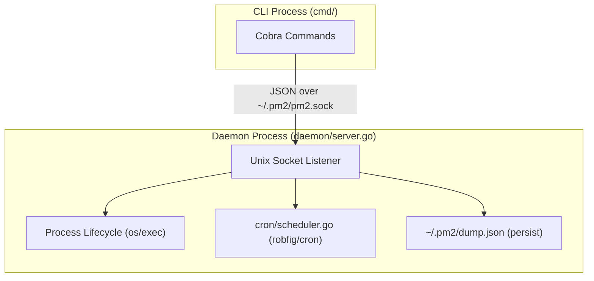

# pm2 — Project Context for Claude

## Module

`github.com/shuk/pm2` Go 1.24+

## Architecture

Daemon + CLI over a Unix socket. The CLI is a thin RPC client; all process state lives in the daemon.



## Package map

```tree
pm2/
├── main.go                   entry point — calls cmd.Execute()
├── cmd/                      cobra commands (CLI layer)
│   ├── root.go               pm2Home, socketPath(), Execute()
│   ├── start.go              pm2 start  — builds AppStartReq, sends to daemon
│   ├── stop.go               pm2 stop / restart / delete
│   ├── monitor.go            pm2 monit (live process dashboard) / save / resurrect
│   ├── logs.go               pm2 logs  — reads log files directly
│   └── daemon.go             pm2 daemon (hidden) / startup / autoStartDaemon()
├── config/
│   ├── ecosystem.go          Load() — parses .json and .js (goja) ecosystem files
│   │                         Normalize() fills defaults; resolves relative script paths
│   │                         relative to config file dir (not CWD)
│   └── ecosystem_test.go     Unit tests for script path resolution and configuration loading
├── daemon/
│   ├── protocol.go           Request / Response types; WriteJSON / ReadJSON / SendRequest
│   └── server.go             Server — Listen(), startApp(), watchProcess() goroutine,
│                             stopProcess() (sets stopping=true), cron.Scheduler integration
├── process/
│   └── types.go              ProcessInfo (runtime state), DumpEntry (persisted state)
├── cron/
│   └── scheduler.go          Scheduler wraps robfig/cron; Register(name, expr, fn) / Remove(name)
├── tui/
│   ├── model.go              Bubbletea Model — two-pane TUI: process list + detail/logs
│   │                         doRefresh(), readLogs(), doAction() as tea.Cmd
│   └── model_test.go         Unit tests for TUI layout and logic
```

## Key design decisions

### Process identity

Keyed by `name` in `Server.processes` map.
Override rule in `startApp()`: same name + same script → stop-and-replace.
Same name + different script → error (caller must `pm2 delete` first).

### Auto-restart suppression

`ManagedProcess.stopping` bool is set to `true` by `stopProcess()` before SIGTERM.
`watchProcess()` skips auto-restart when `stopping == true`.
This prevents deliberate `pm2 stop` from triggering the crash-restart loop.

### Cron restart lifecycle

1. `launchProcess()` calls `scheduler.Register(name, expr, fn)` after spawning.
2. Cron fires → `restartByName(name)` → `stopProcess()` (removes cron entry) → `launchProcess()` (re-registers).
3. `stopProcess()` / `deleteByName()` call `scheduler.Remove(name)` explicitly.
4. Net effect: cron entry is always tied to the currently running instance.

### Relative path resolution

`config.Load()` resolves relative `script` paths relative to the config file's directory
at parse time (in the CLI process). The daemon always receives absolute paths.

### RPC protocol

Newline-delimited JSON over a Unix socket (`~/.pm2/pm2.sock`).
`daemon.SendRequest()` dials, sends one `Request`, reads one `Response`, closes.
No persistent connection — each CLI invocation is a fresh dial.

### TUI refresh

Bubbletea tick every 2 s → `doRefresh()` → `daemon.SendRequest(CmdList)`.
Log tailing reads the log file directly (not via daemon) on process selection change.
`doAction()` (r/s/d) calls RPC then immediately calls `doRefresh()()` inline so the
list updates without waiting for the next tick.

## Dependencies

| Package                              | Purpose                               |
| ------------------------------------ | ------------------------------------- |
| `github.com/spf13/cobra`             | CLI commands                          |
| `github.com/robfig/cron/v3`          | Cron scheduler in daemon              |
| `github.com/dop251/goja`             | JS runtime for `.js` ecosystem config |
| `github.com/charmbracelet/bubbletea` | TUI event loop                        |
| `github.com/charmbracelet/lipgloss`  | TUI styling                           |
| `github.com/olekukonko/tablewriter`  | `pm2 list` table output               |

## State directory (`~/.pm2/`)

```tree
~/.pm2/
├── pm2.sock        Unix socket
├── dump.json       serialised []process.DumpEntry (pm2 save / resurrect)
└── logs/
    ├── <name>-out.log
    └── <name>-err.log
```

## Conventions

- All process state is owned by `daemon.Server` behind `sync.RWMutex`.
- `s.mu.Lock()` is acquired, `stopping` / status updated, then released before
  calling `stopProcess()` — never hold the lock across a blocking call.
- `watchProcess()` goroutine is the only place that transitions a process from
  `online` → `errored` or `stopped`. Never update status elsewhere.
- Log file paths are resolved once at launch time and stored in `ProcessInfo`.
  Do not re-derive them from name at read time.
- `config.AppConfig.Normalize()` is called on every loaded app. Do not skip it.
