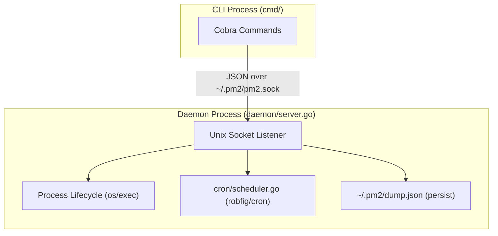

# pm2 — Project Context for Claude

## Module

`github.com/bizshuk/pm2` Go 1.24+

## Architecture

Daemon + CLI over a Unix socket. The CLI is a thin RPC client; all process state lives in the daemon.



## Package map

```tree
pm2/
├── main.go                   entry point — calls cmd.Execute()
├── cmd/                      cobra commands (CLI layer)
│   ├── root.go               pm2Home, socketPath(), Execute()
│   ├── start.go              pm2 start  — builds AppStartReq, sends to daemon
│   ├── stop.go               pm2 stop / restart / pause / resume / delete
│   ├── monitor.go            pm2 monit (live process dashboard) / save / resurrect
│   ├── logs.go               pm2 logs  — reads log files directly
│   ├── daemon.go             pm2 daemon (hidden) / startup / autoStartDaemon()
│   ├── eco.go                pm2 wizard (Cobra command setup)
│   ├── eco_wizard.go         interactive wizard logic to build ecosystem file
│   ├── eco_renderer.go       CLI ecosystem file output renderer
│   ├── eco_install.go        pm2 wizard install <script>
│   ├── eco_install_system.go helper to install system-planner profile
│   ├── eco_install_business.go helper to install business-planner profile
│   └── eco_test.go           wizard and install command tests
├── config/
│   ├── ecosystem.go          Load() — parses .json and .js (goja) ecosystem files
│   │                         Normalize() fills defaults; resolves relative script paths
│   │                         relative to config file dir (not CWD)
│   └── ecosystem_test.go     Unit tests for script path resolution and configuration loading
├── daemon/
│   ├── server.go             Server — Listen(), startApp(), watchProcess() goroutine,
│   │                         stopProcess() (sets stopping=true), cron.Scheduler integration
│   ├── process_registry.go   ProcessRegistry — sole owner of the process map
│   │                         and its RWMutex (Add/Get/Remove/UpdateInfo/...)
│   ├── persistence.go        save() and resurrect() implementations
│   ├── metrics.go            StartMetricsCollector() and getProcessMetrics()
│   ├── builder.go            buildCommand() to assemble *exec.Cmd
│   ├── manager.go            Server methods for stop/restart/delete/list processes
│   ├── helpers.go            killAll() and other daemon helpers
│   ├── watcher.go            watchFile() with fsnotify
│   ├── server_test.go        daemon server unit tests
│   └── process_registry_test.go  ProcessRegistry unit + concurrency tests
├── model/
│   ├── protocol.go           Request / Response types; WriteJSON / ReadJSON / SendRequest
│   └── protocol_test.go      Unit tests for protocol structures and serialization
├── process/
│   └── types.go              ProcessInfo (runtime state), DumpEntry (persisted state)
├── cron/
│   └── scheduler.go          Scheduler wraps robfig/cron; Register(name, expr, fn) / Remove(name)
└── tui/
    ├── model.go              Bubbletea Model — controller: Update event branches,
    │                         Cmd dispatch, View() delegates to tui/views
    ├── theme.go              Re-exports the palette from tui/theme as clXxx vars
    ├── theme/                tui/theme sub-package: single source of truth for
    │   └── palette.go        lipgloss.AdaptiveColor palette (Online/Stopped/...)
    ├── views/                Stateless renderers; pure functions of ViewContext
    │   ├── context.go        ViewContext struct (Width/Height/Procs/Logs/...)
    │   ├── header.go         RenderHeader — title bar (count, time, notice)
    │   ├── footer.go         RenderFooter (key hints) + RenderHostMetricsLines
    │   ├── detail.go         RenderDetail — right-panel param table
    │   ├── logs.go           RenderLogs — right-panel log tail
    │   ├── list.go           RenderWideTable + RenderLeftPane (two-pane list)
    │   ├── layout.go         RenderLayout — single entry point; orchestrates
    │   │                     header + body + footer, decides single vs two-pane
    │   └── format.go         Pure formatters: shortUptime, fullUptime, fmtTime,
    │                         cronExpr/Next/LastRunStyled, Crop/CropRight,
    │                         formatBytes, formatWatching, secHeader,
    │                         dotFor, statusLabel, getStatusColor
    ├── metrics.go            CPU and memory metrics background collector
    └── model_test.go         Unit tests for TUI layout and logic
```

## Key design decisions

### Process identity

Keyed by `name` in `Server.processes` map.
Override rule in `startApp()`: same name + same script → stop-and-replace.
Same name + different script → error (caller must `pm2 delete` first).

### Auto-restart suppression

`ManagedProcess.stopping` bool is set to `true` by `stopProcess()` before SIGTERM.
`watchProcess()` skips auto-restart when `stopping == true`.
This prevents deliberate `pm2 stop` from triggering the crash-restart loop.

### Cron restart lifecycle

1. `launchProcess()` calls `scheduler.Register(name, expr, fn)` after spawning.
2. Cron fires → `restartByName(name)` → `stopProcess()` (removes cron entry) → `launchProcess()` (re-registers).
3. `stopProcess()` / `deleteByName()` call `scheduler.Remove(name)` explicitly.
4. Net effect: cron entry is always tied to the currently running instance.

### Pause / resume (cron suspension)

`pm2 pause <target>` suspends a process: `pauseProcess()` reuses `stopProcess()`
(which removes the scheduler entry and stops any running instance) then sets
`ManagedProcess.paused = true` and `Status = StatusPaused`.

The `paused` status is what distinguishes a deliberately-suspended cron task
from one merely idle between fires — both a running-then-stopped process and an
idle cron task otherwise sit at `StatusStopped`. A paused task has NO scheduler
entry, so it will not fire until resumed.

`pm2 resume <target>` re-launches via `launchProcess()` with `CronTriggered =
false`, which re-registers the cron schedule and returns a cron task to idle
`StatusStopped` (or a regular process to `StatusOnline`). Resume on a
non-paused process is a no-op. The `paused` flag lives only in runtime state
(not persisted to dump.json).

### Relative path resolution

`config.Load()` resolves relative `script` paths relative to the config file's directory
at parse time (in the CLI process). The daemon always receives absolute paths.

### RPC protocol

Newline-delimited JSON over a Unix socket (`~/.pm2/pm2.sock`).
`model.SendRequest()` dials, sends one `Request`, reads one `Response`, closes.
No persistent connection — each CLI invocation is a fresh dial.

### TUI refresh

Bubbletea tick every 2 s → `doRefresh()` → `daemon.SendRequest(CmdList)`.
Log tailing reads the log file directly (not via daemon) on process selection change.
`doAction()` (r/p/d) calls RPC then immediately calls `doRefresh()()` inline so the
list updates without waiting for the next tick. The `p` key is a pause/resume
toggle (`pauseOrResume()` picks `CmdResume` when the selected row is `paused`,
else `CmdPause`), so the same key suspends and reactivates a cron task.

## Dependencies

| Package                              | Purpose                               |
| ------------------------------------ | ------------------------------------- |
| `github.com/spf13/cobra`             | CLI commands                          |
| `github.com/robfig/cron/v3`          | Cron scheduler in daemon              |
| `github.com/dop251/goja`             | JS runtime for `.js` ecosystem config |
| `github.com/charmbracelet/bubbletea` | TUI event loop                        |
| `github.com/charmbracelet/lipgloss`  | TUI styling                           |
| `github.com/olekukonko/tablewriter`  | `pm2 list` table output               |

## State directory (`~/.pm2/`)

```tree
~/.pm2/
├── pm2.sock        Unix socket
├── dump.json       serialised []process.DumpEntry (pm2 save / resurrect)
└── logs/
    ├── <name>-out.log
    └── <name>-err.log
```

## Conventions

- All process state is owned by `daemon.ProcessRegistry` (defined in
  `daemon/process_registry.go`). `daemon.Server` holds a `*ProcessRegistry` and delegates
  lock primitives via `s.Lock()`/`s.Unlock()`/`s.RLock()`/`s.RUnlock()` for
  the rare callers that need to hold the registry's lock across multiple
  method calls.
- Always prefer the high-level `ProcessRegistry` methods (`Get`/`Add`/
  `Remove`/`UpdateInfo`/`UpdateMetrics`/`UpdateCronStatus`/`Snapshot`/
  `SnapshotMap`/`SnapshotAppConfigs`/`FindByTarget`/`Len`) over the lock
  escape hatches. The escape hatches are reserved for code that genuinely
  needs cross-method atomicity (e.g. `launchProcess` doing lookup + ID
  increment + map write as one critical section).
- For atomic field mutations on a single `*ManagedProcess`, use
  `s.reg.UpdateInfo(key, func(mp *ManagedProcess) { ... })` — never mutate
  `mp.Info` fields directly from outside the registry. Direct mutation
  races with `watchProcess`'s own `UpdateInfo` calls and trips the race
  detector (this is what `TestSaveConcurrentWithMapMutation` was originally
  designed to catch).
- `watchProcess()` goroutine is the only place that transitions a process
  from `online` → `errored` or `stopped`. Never update status elsewhere.
- Log file paths are resolved once at launch time and stored in `ProcessInfo`.
  Do not re-derive them from name at read time.
- `config.AppConfig.Normalize()` is called on every loaded app. Do not skip it.
- All TUI view rendering lives in `tui/views/` as pure functions. Every
  exported renderer takes a `views.ViewContext` (or the specific primitive
  it needs) and returns a `string`. Views never mutate state, never reach
  into the controller, and never hold references to `tui.Model`. Add a new
  view by writing a new function in the relevant `views/*.go` file and
  wiring it into `RenderLayout`; do not reintroduce member methods on
  `Model`.
- Colour values come from `tui/theme/palette.go` only. The `clXxx`
  re-exports in `tui/theme.go` exist for backwards compatibility inside
  the tui package; new code outside the tui/views subtree should
  import `tui/theme` directly. Never declare new `lipgloss.AdaptiveColor`
  literals inside view code.
