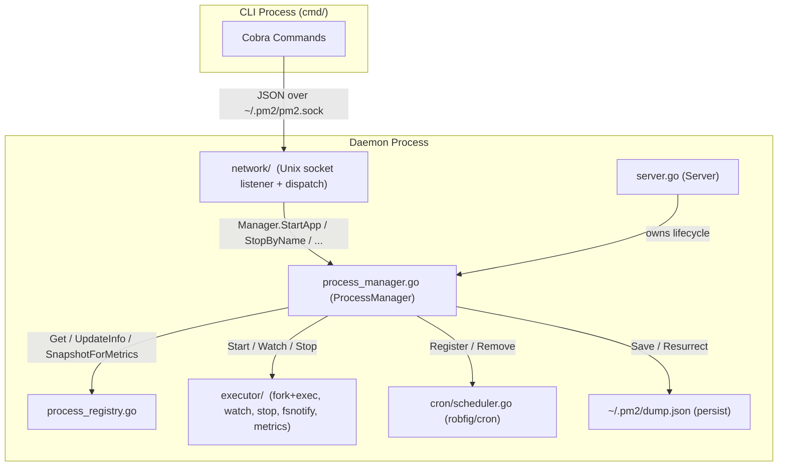

# pm2 — Project Context for Claude

## Module

`github.com/bizshuk/pm2` Go 1.24+

## Architecture

Daemon + CLI over a Unix socket. The CLI is a thin RPC client; all process state lives in the daemon.



Import direction (no cycles):

- `network` -> (Manager interface in `network/manager.go`) — never imports `daemon`
- `daemon` -> `executor`, `network`, `model`, `process`, `cron`
- `executor` -> `model` only

The lock and import invariants are spelled out in the Conventions section below.

## Package map

```tree
pm2/
├── main.go                   entry point — calls cmd.Execute()
├── cmd/                      cobra commands (CLI layer)
│   ├── root.go               pm2Home, socketPath(), Execute()
│   ├── start.go              pm2 start  — builds AppStartReq, sends to daemon
│   ├── stop.go               pm2 stop / restart / pause / resume / delete
│   ├── monitor.go            pm2 monit (live process dashboard) / save / resurrect
│   ├── logs.go               pm2 logs  — reads log files directly
│   ├── daemon.go             pm2 daemon (hidden) / startup / autoStartDaemon()
│   ├── eco.go                pm2 wizard (Cobra command setup)
│   ├── eco_wizard.go         interactive wizard logic to build ecosystem file
│   ├── eco_renderer.go       CLI ecosystem file output renderer
│   ├── eco_install.go        pm2 wizard install <script>
│   ├── eco_install_system.go helper to install system-planner profile
│   ├── eco_install_business.go helper to install business-planner profile
│   └── eco_test.go           wizard and install command tests
├── config/
│   ├── ecosystem.go          Load() — parses .json and .js (goja) ecosystem files
│   │                         Normalize() fills defaults; resolves relative script paths
│   │                         relative to config file dir (not CWD)
│   └── ecosystem_test.go     Unit tests for script path resolution and configuration loading
├── daemon/
│   ├── server.go             Server — thin daemon wrapper: owns Unix socket
│   │                         lifecycle + auto-save/auto-resurrect goroutines.
│   │                         Embeds *ProcessManager for all process logic.
│   ├── process_manager.go    ProcessManager — core process coordination:
│   │                         implements network.Manager; owns Registry +
│   │                         Executor + Scheduler; all lifecycle methods
│   │                         (StartApp, StopByName, RestartByName,
│   │                         PauseByName, ResumeByName, DeleteByName,
│   │                         ListAll, Save, Resurrect, KillAll, Ping,
│   │                         Status) plus internal helpers (launchProcess,
│   │                         onProcessExit, stopProcess, triggerCron).
│   │                         Also defines ManagedProcess.
│   ├── process_registry.go   ProcessRegistry — sole owner of the process map
│   │                         and its RWMutex (Add/Get/Remove/UpdateInfo/...)
│   ├── helpers.go            getAppVersion() — version probe from package.json
│   ├── server_test.go        daemon server unit tests
│   ├── process_registry_test.go  ProcessRegistry unit + concurrency tests
│   ├── executor/             daemon/executor sub-package — OS-level process ops
│   │   ├── executor.go       Executor struct + Start/Watch/Stop (lock-free)
│   │   ├── builder.go        BuildCommand — wraps script+args in `bash -c`,
│   │   │                     sets Setpgid, builds the env
│   │   ├── watcher.go        NewFileWatcher(path, onDetect) — fsnotify +
│   │   │                     500ms debounce
│   │   └── metrics.go        MetricsCollector (3-phase refresh) +
│   │                         MetricsBackend interface + GetProcessMetrics
│   └── network/              daemon/network sub-package — Unix socket listener
│       ├── listener.go       Listen(socketPath, m Manager) — bind + accept loop
│       ├── handler.go        Handle(conn, m Manager) — read Request, dispatch,
│       │                     write Response, post-CmdKill exit hook
│       └── manager.go        Manager interface — the only contract network
│                             needs from the daemon (StartApp, StopByName,
│                             RestartByName, PauseByName, ResumeByName,
│                             DeleteByName, ListAll, Save, Resurrect, KillAll,
│                             Ping). Import-cycle guard.
├── model/
│   ├── protocol.go           Request / Response types; WriteJSON / ReadJSON / SendRequest
│   └── protocol_test.go      Unit tests for protocol structures and serialization
├── process/
│   └── types.go              ProcessInfo (runtime state), AppConfig (persistent)
├── cron/
│   └── scheduler.go          Scheduler wraps robfig/cron; Register(name, expr, fn) / Remove(name)
└── tui/
    ├── model.go              Bubbletea Model — controller: Update event branches,
    │                         Cmd dispatch, View() delegates to tui/views
    ├── theme.go              Re-exports the palette from tui/theme as clXxx vars
    ├── theme/                tui/theme sub-package: single source of truth for
    │   └── palette.go        lipgloss.AdaptiveColor palette (Online/Stopped/...)
    ├── views/                Stateless renderers; pure functions of ViewContext
    │   ├── context.go        ViewContext struct (Width/Height/Procs/Logs/...)
    │   ├── header.go         RenderHeader — title bar (count, time, notice)
    │   ├── footer.go         RenderFooter (key hints) + RenderHostMetricsLines
    │   ├── detail.go         RenderDetail — right-panel param table
    │   ├── logs.go           RenderLogs — right-panel log tail
    │   ├── list.go           RenderWideTable + RenderLeftPane (two-pane list)
    │   ├── layout.go         RenderLayout — single entry point; orchestrates
    │   │                     header + body + footer, decides single vs two-pane
    │   └── format.go         Pure formatters: shortUptime, fullUptime, fmtTime,
    │                         cronExpr/Next/LastRunStyled, Crop/CropRight,
    │                         formatBytes, formatWatching, secHeader,
    │                         dotFor, statusLabel, getStatusColor
    ├── metrics.go            CPU and memory metrics background collector
    └── model_test.go         Unit tests for TUI layout and logic
```

## Key design decisions

### Process identity

Keyed by `namespace:name` in `ProcessManager.reg.processes` map.
Override rule in `StartApp()`: same name + same script → stop-and-replace.
Same name + different script → error (caller must `pm2 delete` first).

### Auto-restart suppression

`ManagedProcess.stopping` bool is set to `true` by `stopProcess()` (via
`executor.Stop`'s `onStopping` callback) before SIGTERM.
`onProcessExit` (the executor.Watch callback) skips auto-restart when
`stopping == true`.
This prevents deliberate `pm2 stop` from triggering the crash-restart loop.

### Cron restart lifecycle

1. `launchProcess()` calls `scheduler.Register(key, expr, fn)` after spawning.
2. Cron fires → `RestartByName(name)` → `stopProcess()` (removes cron entry) → `launchProcess()` (re-registers).
3. `stopProcess()` / `DeleteByName()` call `scheduler.Remove(key)` explicitly.
4. Net effect: cron entry is always tied to the currently running instance.

### Pause / resume (cron suspension)

`pm2 pause <target>` suspends a process: `PauseByName()` reuses `stopProcess()`
(which removes the scheduler entry and stops any running instance) then sets
`ManagedProcess.paused = true` and `Status = StatusPaused`.

The `paused` status is what distinguishes a deliberately-suspended cron task
from one merely idle between fires — both a running-then-stopped process and an
idle cron task otherwise sit at `StatusStopped`. A paused task has NO scheduler
entry, so it will not fire until resumed.

`pm2 resume <target>` re-launches via `launchProcess()` with `CronTriggered =
false`, which re-registers the cron schedule and returns a cron task to idle
`StatusStopped` (or a regular process to `StatusOnline`). Resume on a
non-paused process is a no-op. The `paused` flag round-trips through
`dump.json` via `process.AppConfig.Paused` — `SnapshotAppConfigs` copies it
from `ManagedProcess.paused` at save time, and `Resurrect` re-applies it via
`AppStartReq.Paused`. A paused cron task resurrects without its cron schedule
being re-registered, so a daemon restart does not silently undo `pm2 pause`
(regression test: `TestPausedCronTaskSurvivesResurrect`).

Pause vs. an in-flight fire (race guard): `executor.Start` (fork/exec) runs
*before* `launchProcess` takes the registry lock, so a cron fire already
in-flight when `PauseByName` runs could reach the map-write + `scheduler.Register`
and silently re-arm the schedule — the "paused cron still fires" bug.
`launchProcess` guards against this: under the registry write lock, if the
existing entry is `paused` and this launch is `CronTriggered` (a cron fire or
file-watch restart — never an explicit resume/start), it aborts before
replacing the entry or registering any schedule, and reaps the racing child in
the background. Because both the guard and `PauseByName`'s `paused=true` mutate
under the same lock, the decision is atomic (regression test:
`TestPauseDuringCronFireLeavesNoSchedule`).

### Relative path resolution

`config.Load()` resolves relative `script` paths relative to the config file's directory
at parse time (in the CLI process). The daemon always receives absolute paths.

### RPC protocol

Newline-delimited JSON over a Unix socket (`~/.pm2/pm2.sock`).
`model.SendRequest()` dials, sends one `Request`, reads one `Response`, closes.
No persistent connection — each CLI invocation is a fresh dial.

### TUI refresh

Bubbletea tick every 2 s → `doRefresh()` → `daemon.SendRequest(CmdList)`.
Log tailing reads the log file directly (not via daemon) on process selection change.
`doAction()` (r/p/d) calls RPC then immediately calls `doRefresh()()` inline so the
list updates without waiting for the next tick. The `p` key is a pause/resume
toggle (`pauseOrResume()` picks `CmdResume` when the selected row is `paused`,
else `CmdPause`), so the same key suspends and reactivates a cron task.

### Daemon lifecycle: `stop` vs `daemon kill`

Two verbs that look superficially similar but operate on different
layers of the system. Conflating them is a common source of bugs and
user confusion, so the distinction is encoded in the command tree,
the wire protocol, and the dispatcher.

| Aspect | `pm2 stop <name\|id\|all>` | `pm2 daemon kill` |
| ------ | -------------------------- | ----------------- |
| Operates on | a managed process | the daemon itself |
| Daemon afterwards | still running, accepting RPC | exited |
| Wire code | `model.CmdStop` (+ `Name`) | `model.CmdKill` (no payload) |
| Manager method | `StopByName(name)` (returns error) | `KillAll()` (no return value) |
| Signal path | `executor.Stop` → SIGTERM → 5 s → SIGKILL (same path) | same path applied to every mp, then `os.Exit(0)` |
| CLI verb location | top-level `stop` group | nested `daemon` group |

The `KillAll` RPC carries no payload and `KillAll()` has no return
value: it is an idempotent "please shut down" request, not a
query. The daemon's `Handle` function in
`daemon/network/handler.go:36-42` schedules a `go func() { sleep(150ms); os.Exit(0) }()`
after the response flushes. The 150 ms grace lets `WriteJSON`
complete on its own goroutine context so the CLI sees `ok=true` before
the socket vanishes. The actual process-stop work is identical to
`StopByName("all")` — `KillAll` loops `pm.findProcesses("all")` and
calls the same `stopProcess` per entry.

Because both verbs share `executor.Stop`, they share the SIGTERM →
SIGKILL escalation and the `stopping` flag that suppresses
auto-restart. The interface contract is **explicit** in
`daemon/network/manager.go` (`CmdKill — graceful stop of every
managed process (does NOT exit the daemon — handleConn's dispatcher
schedules os.Exit separately)`) so future contributors do not
move the `os.Exit` into `KillAll` itself.

**Removed alias:** the legacy top-level `pm2 kill` command has been
deleted; use `pm2 daemon kill`. Bare `pm2 daemon` errors out so the
caller always picks an explicit verb.

## Dependencies

| Package                              | Purpose                               |
| ------------------------------------ | ------------------------------------- |
| `github.com/spf13/cobra`             | CLI commands                          |
| `github.com/robfig/cron/v3`          | Cron scheduler in daemon              |
| `github.com/dop251/goja`             | JS runtime for `.js` ecosystem config |
| `github.com/charmbracelet/bubbletea` | TUI event loop                        |
| `github.com/charmbracelet/lipgloss`  | TUI styling                           |
| `github.com/olekukonko/tablewriter`  | `pm2 list` table output               |

## State directory (`~/.pm2/`)

```tree
~/.pm2/
├── pm2.sock        Unix socket
├── dump.json       serialised []process.DumpEntry (pm2 save / resurrect)
└── logs/
    ├── <name>-out.log
    └── <name>-err.log
```

## Conventions

- All process state is owned by `daemon.ProcessRegistry` (defined in
  `daemon/process_registry.go`). `daemon.ProcessManager` holds a `*ProcessRegistry` and delegates
  lock primitives via `pm.Lock()`/`pm.Unlock()`/`pm.RLock()`/`pm.RUnlock()` for
  the rare callers that need to hold the registry's lock across multiple
  method calls.
- Always prefer the high-level `ProcessRegistry` methods (`Get`/`Add`/
  `Remove`/`UpdateInfo`/`UpdateMetrics`/`UpdateCronStatus`/`Snapshot`/
  `SnapshotForMetrics`/`SnapshotMap`/`SnapshotAppConfigs`/`FindByTarget`/
  `Len`) over the lock escape hatches. The escape hatches are reserved
  for code that genuinely needs cross-method atomicity (e.g. `launchProcess`
  doing lookup + ID increment + map write as one critical section).
- For atomic field mutations on a single `*ManagedProcess`, use
  `pm.reg.UpdateInfo(key, func(mp *ManagedProcess) { ... })` — never mutate
  `mp.Info` fields directly from outside the registry. Direct mutation
  races with `onProcessExit`'s own `UpdateInfo` calls and trips the race
  detector (this is what `TestSaveConcurrentWithMapMutation` was originally
  designed to catch).
- `onProcessExit` (the `executor.Watch` callback) is the only place that
  transitions a process from `online` → `errored` or `stopped` *for processes
  that exit on their own*. Deliberate stops update status from inside
  `stopProcess`'s `onStopping`/`onStopped` callbacks instead.
- The Status race: when a process is deliberately stopped, both
  `onProcessExit` and `stopProcess.onStopped` race to acquire the
  registry lock after `close(done)`. The losing writer would otherwise
  clobber the winning writer's Status. Guard the `onProcessExit` Status
  write with `!mp.stopping` so `stopProcess` owns the "stopped" Status
  and `onProcessExit` only writes Status when the process exited on its
  own.
- Log file paths are resolved once at launch time and stored in `ProcessInfo`.
  Do not re-derive them from name at read time.
- `config.AppConfig.Normalize()` is called on every loaded app. Do not skip it.
- **Executor lock direction (Phase 4 invariant)**: `daemon.ProcessManager` may
  call `executor.Executor` while holding the registry lock, because the
  Executor holds NO lock during its execution. The Executor NEVER calls
  back into the registry — every state update flows through the
  `onStopping` / `onStopped` / `onExit` / `onFileChanged` callbacks the
  ProcessManager passes in. The callback implementations take the registry lock
  internally via `UpdateInfo` and never hold it across a blocking call.
- **Network import direction (Phase 5 invariant)**: `daemon/network`
  depends ONLY on the `network.Manager` interface — never on the concrete
  `*daemon.ProcessManager` or `*daemon.Server` type. `daemon.ProcessManager`
  implements `Manager` via its public methods (`StartApp`, `StopByName`, …).
  `daemon.Server` embeds `*ProcessManager` and delegates `network.Listen` to it.
  The Executor and Registry packages MUST NOT import `daemon/network`; the
  import graph is strictly `network → (Manager contract only)` with no cycle.
  `network/manager.go` is the canonical interface declaration.
- All TUI view rendering lives in `tui/views/` as pure functions. Every
  exported renderer takes a `views.ViewContext` (or the specific primitive
  it needs) and returns a `string`. Views never mutate state, never reach
  into the controller, and never hold references to `tui.Model`. Add a new
  view by writing a new function in the relevant `views/*.go` file and
  wiring it into `RenderLayout`; do not reintroduce member methods on
  `Model`.
- Colour values come from `tui/theme/palette.go` only. The `clXxx`
  re-exports in `tui/theme.go` exist for backwards compatibility inside
  the tui package; new code outside the tui/views subtree should
  import `tui/theme` directly. Never declare new `lipgloss.AdaptiveColor`
  literals inside view code.
