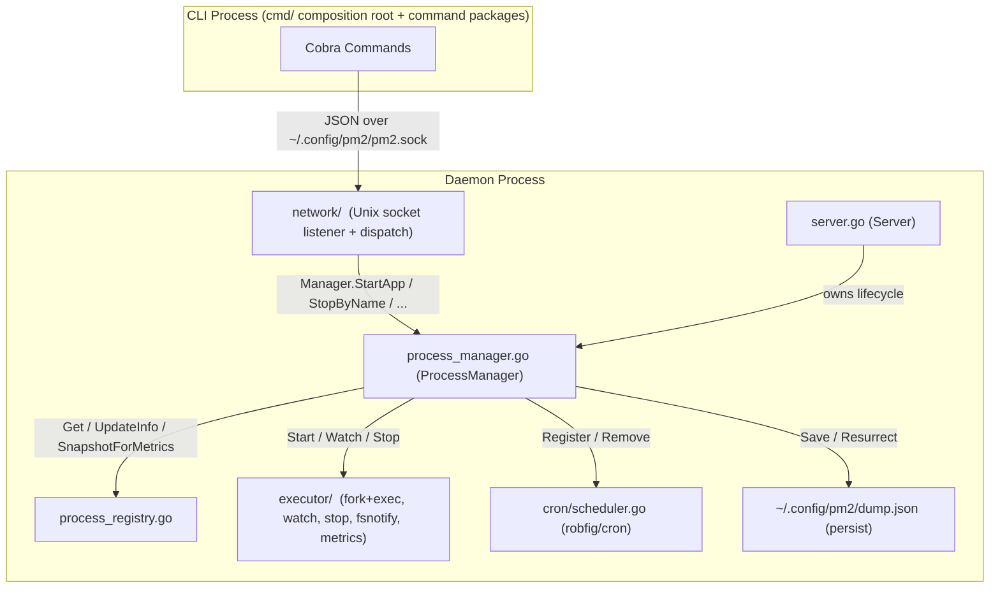

# pm2 — Project Context for Claude

## Module

`github.com/bizshuk/pm2` Go 1.26.3

## Architecture

Daemon + CLI over a Unix socket. The CLI is a thin RPC client; all process state lives in the daemon.


```mermaid
flowchart TD
    subgraph CLI ["CLI Process (cmd/ composition root + command packages)"]
        direction TB
        C["Cobra Commands"]
    end

    subgraph Daemon ["Daemon Process"]
        direction TB
        N["network/  (Unix socket listener + dispatch)"]
        S["server.go (Server)"]
        PM["process_manager.go (ProcessManager)"]
        R["process_registry.go"]
        E["executor/  (fork+exec, watch, stop, fsnotify, metrics)"]
        CR["cron/scheduler.go (robfig/cron)"]
        D["~/.config/pm2/dump.json (persist)"]

        N -->|"Manager.StartApp / StopByName / ..."| PM
        S -->|"owns lifecycle"| PM
        PM -->|"Get / UpdateInfo / SnapshotForMetrics"| R
        PM -->|"Start / Watch / Stop"| E
        PM -->|"Register / Remove"| CR
        PM -->|"Save / Resurrect"| D
    end

    C -- "JSON over ~/.config/pm2/pm2.sock" --> N
```

`sysmon` sits beside that flow rather than inside it: it reads the OS
directly (no daemon involved) and joins the daemon's process list with the
machine's own view of those PIDs. `pm2 dashboard` therefore still works with
the daemon down — only the task list goes empty.

Import direction (no cycles):

- `runhistory` -> stdlib only; a sibling of `logfile`, not a child of
  `daemon`, because the daemon writes it while `daemon/web` and
  `cmd/workflow` read it — under `daemon/` it would force `cmd` to
  import `daemon`
- `workflow` -> `process` + stdlib; leaf domain package, like `sysmon`
- `config` -> `workflow`; `model` -> `workflow` (both acyclic)
- `daemon/wfengine` -> `executor`, `logfile`, `workflow`, `runhistory`,
  `cron`, `process` — never `daemon`; it takes a `TaskLookup` interface
- `daemon/web` -> `process`, `runhistory` + stdlib — never `daemon`, and
  never `workflow` either: it declares its own `Backend` interface and
  view types so it compiles and is httptest-testable on its own
- `network` -> (Manager interface in `network/manager.go`) — never imports `daemon`
- `daemon` -> `executor`, `network`, `model`, `process`, `cron`, `logfile`
  (`logfile` only for the daemon's own rotating log — see `daemon/logging.go`)
- `executor` -> `logfile`, `model` only
- `main` -> `cmd` as the thin executable boundary
- `cmd` owns every first-layer Cobra command (`cmd/<command>.go`) and imports
  subcommand packages (`cmd/<command>/`) to attach children
- `cmd` -> `cmd/daemon`, `cmd/task`, `cmd/workflow`, `cmd/wizard`,
  `cmd/taskmanager`, and `cmd/logs` for subcommand nodes
- `cmd`, `cmd/task`, `cmd/daemon`, `cmd/taskmanager`, and `cmd/logs` ->
  `cmd/runtime` for shared CLI paths and the daemon auto-start client
- `cmd/runtime` -> `model` for daemon RPC transport
- `sysmon` -> `process` only; it is imported by `cmd/taskmanager`, `tui`, and
  `tui/dashboard`, and never imports `daemon`, `cmd`, or `tui`
- `cmd/daemon` -> `daemon` for the foreground server runtime
- `cmd/gpu` -> `sysmon` and `sysmon/gpuagent`; `sysmon/gpuagent` -> `sysmon`
  only. Nothing imports `gpuagent` back, so the elevated code path has
  exactly one entry point
- `cmd/wizard` -> `cmd/wizard/prompt` for Cobra-free planner prompt templates
- `cmd/wizard` -> `config/wizard` for prompt, render, merge, and install logic

The lock and import invariants are spelled out in the Conventions section below.

## Package map

```tree
pm2/
├── main.go                   thin executable boundary — forwards os.Args[1:]
│                             to cmd.Execute and maps errors to exit 1
├── cmd/                      cobra commands (CLI layer)
│   │                         Convention: first-layer command = cmd/<name>.go;
│   │                         its subcommands = cmd/<name>/<subcommand>.go
│   ├── root.go               Cmd, config initialization, command registration,
│   │                         traverse hooks, and metrics hook
│   ├── execute.go            Execute(args) + version argument dispatch
│   ├── root_test.go          root tree, alias, config, and version tests
│   ├── runtime/              shared CLI runtime infrastructure
│   │   ├── state.go          lazy home resolution + PM2Home/SocketPath/
│   │   │                     TaskLogsDir/DaemonLogsDir/DaemonStopMarkerPath
│   │   ├── client.go         CLIClient socket RPC wrapper
│   │   └── client_autostart.go
│   │                         silent daemon auto-spawn + readiness wait
│   ├── daemon.go             DaemonCmd parent (`pm2 daemon` / `pm2 d`)
│   ├── start.go              root alias for `pm2 daemon start`
│   ├── daemon/               daemon subcommands
│   │   ├── start.go          StartCmd + foreground/background runtime
│   │   ├── kill.go           KillCmd
│   │   ├── stop.go           StopCmd + durable stop marker management
│   │   └── status.go         StatusCmd
│   ├── task.go               TaskCmd parent (`pm2 task` / `pm2 t`)
│   ├── apply.go              root alias for `pm2 task start`
│   ├── task/                 task subcommands + start helpers
│   │   ├── start.go          StartCmd + AppStartReq RPC flow
│   │   ├── apply_delete.go   --delete sweep: one CmdDelete per declared app
│   │   ├── select.go         maps AppConfig.Optional to Paused;
│   │   │                     selects one app by index/name for --single
│   │   ├── single.go         renders and reads the interactive single-app choice
│   │   ├── restart.go        RestartCmd
│   │   ├── stop.go           StopCmd
│   │   ├── pause.go          PauseCmd
│   │   ├── resume.go         ResumeCmd
│   │   └── delete.go         DeleteCmd
│   ├── wizard.go             WizardCmd parent + interactive Cobra shell
│   ├── wizard_test.go        wizard CLI integration tests
│   ├── wizard/               wizard subcommands
│   │   ├── install.go        InstallCmd + AppConfig assembly
│   │   ├── install_flags.go  shared planner flag binding
│   │   ├── prompt/           planner prompt-template domain; no Cobra dependency
│   │   │   ├── template.go   Template model + user-prompt rendering
│   │   │   ├── system.go     system-planner template
│   │   │   └── business.go   business-planner template
│   │   └── wizard_test.go    install-helper unit tests
│   ├── taskmanager.go        TaskmanagerCmd parent (`pm2 taskmanager` / `pm2 tm`)
│   ├── taskmanager/          taskmanager subcommands
│   │   ├── emit.go           EmitCmd — periodic full-snapshot emitter +
│   │   │                     interval/count/out/format flags
│   │   └── emit_text.go      plain key=value snapshot encoder
│   ├── list.go               ListCmd — styled non-interactive process table;
│   │                         shares tui/views process-table renderer
│   ├── logs.go               LogsCmd — signal-aware streaming command shell
│   ├── logs_stream.go        daemon snapshot → logfile sources + stream routing
│   ├── logs/                 logs subcommands
│   │   └── monitor.go        MonitorCmd — interactive log-browser
│   ├── monitor.go            MonitorCmd — two-pane detail/log dashboard; no -d flag
│   ├── gpu.go                GpuCmd parent (`pm2 gpu`)
│   ├── gpu/                  gpu subcommands — the privilege boundary
│   │   ├── agent.go          AgentCmd — root powermetrics loop (foreground)
│   │   ├── status.go         StatusCmd + formatStatus — unprivileged reader
│   │   ├── install.go        InstallCmd — LaunchDaemon install side
│   │   └── install_template.go
│   │                         launchDaemonPlist — the supervision contract
│   ├── save.go               SaveCmd
│   ├── resurrect.go          ResurrectCmd
│   ├── startup.go            StartupCmd — install side: paths + launchctl/
│   │                         systemctl invocation
│   └── startup_template.go   launchdPlist / systemdUnit — the supervision
│                             contract (--foreground, restart-on-failure only,
│                             restart throttle)
├── config/
│   ├── ecosystem.go          Load() — parses .json and .js (goja) ecosystem files
│   │                         Normalize() fills defaults; resolves relative script paths
│   │                         relative to config file dir (not CWD)
│   ├── ecosystem_test.go     Unit tests for script path resolution and configuration loading
│   └── wizard/               config/wizard sub-package — interactive wizard core
│       ├── doc.go            package boundary and ownership
│       ├── context.go        WizardContext struct (I/O streams + YesAll)
│       ├── defaults.go       wizard-only output, name, script, and count defaults
│       ├── format.go         format validation and default output selection
│       ├── options.go        shared output/merge options for all wizard entry points
│       ├── prompt.go         reusable line, choice, numeric, duration, env,
│       │                     required-line, and cron prompts
│       ├── document.go       Ecosystem — the apps + workflows document the
│       │                     whole pipeline carries; TaskKeys / WorkflowKeys
│       │                     feed the stage pickers
│       ├── app_options.go    cron-restart, max-restart, and CWD prompt block
│       ├── app.go            AppConfig defaults and one-app prompt sequence
│       ├── workflow.go       one-workflow prompt sequence + stage prompts;
│       │                     promptRef picks a task or workflow from what the
│       │                     document already declares
│       ├── collection.go     app and workflow collection loops and summaries
│       ├── name.go           generated wizard name derivation
│       ├── interactive.go    RunInteractive entry point
│       ├── install.go        RunInstall entry point
│       ├── validate.go       pre-write workflow validation + dangling-ref
│       │                     warnings
│       ├── merge.go          existing-file loading, per-block merge, and
│       │                     format detection
│       ├── render_app.go     shared JS/JSON app projection
│       ├── render_workflow.go  shared JS/JSON workflow projection
│       ├── render_javascript.go  JavaScript renderer
│       ├── render_json.go    JSON renderer
│       ├── writer.go         preview, confirmation, and file persistence
│       ├── workflow_test.go  workflow prompts, render round trip, merge,
│       │                     and the refusal to write an invalid document
│       └── wizard_test.go    Unit tests for prompts, rendering, merge, and public API
├── daemon/
│   ├── autosave.go           autoSave hook — persists dump.json after every
│   │                         task operation (start/restart/stop/pause/
│   │                         resume/delete); internal cron + watch restarts
│   │                         deliberately excluded
│   ├── server.go             Server — thin daemon wrapper: owns Unix socket
│   │                         lifecycle + auto-save/auto-resurrect goroutines.
│   │                         Embeds *ProcessManager for all process logic.
│   ├── process_manager.go    ProcessManager — core process coordination:
│   │                         implements network.Manager; owns Registry +
│   │                         Executor + Scheduler; all lifecycle methods
│   │                         (StartApp, StopByName, RestartByName,
│   │                         PauseByName, ResumeByName, DeleteByName,
│   │                         ListAll, Save, Resurrect, KillAll, Ping,
│   │                         Status) plus internal helpers (launchProcess,
│   │                         onProcessExit, stopProcess, triggerCron).
│   │                         Also defines ManagedProcess.
│   ├── process_registry.go   ProcessRegistry — sole owner of the process map
│   │                         and its RWMutex (Add/Get/Remove/UpdateInfo/...)
│   ├── logging.go            installLog/installLogOrWarn — routes the daemon's
│   │                         own slog output to a rotating logfile.Writer on
│   │                         <home>/logs/daemon.log
│   ├── helpers.go            getAppVersion() — version probe from package.json
│   ├── server_test.go        daemon server unit tests
│   ├── process_registry_test.go  ProcessRegistry unit + concurrency tests
│   ├── executor/             daemon/executor sub-package — OS-level process ops
│   │   ├── executor.go       Executor struct + Start/Watch/Stop (lock-free)
│   │   ├── builder.go        BuildCommand — wraps script+args in `bash -c`,
│   │   │                     sets Setpgid, builds the env
│   │   ├── watcher.go        NewFileWatcher(path, onDetect) — fsnotify +
│   │   │                     500ms debounce
│   │   └── metrics.go        MetricsCollector (3-phase refresh) +
│   │                         MetricsBackend interface + GetProcessMetrics
│   ├── wfengine/             daemon/wfengine sub-package — the workflow runtime
│   │   ├── doc.go            why stages bypass the supervised path, and why
│   │   │                     single flight is the real cycle guard
│   │   ├── engine.go         Engine + TaskLookup + claim/release + persist
│   │   ├── execute.go        the stage loop, ancestry guard, panic containment
│   │   ├── stage.go          one-shot spawn + Wait + ExitInfo + timeout
│   │   └── cron.go           its own scheduler; skip records
│   ├── web/                  daemon/web sub-package — the HTTP plane
│   │   ├── doc.go            the unauthenticated-public decision, in full
│   │   ├── backend.go        web.Backend + HistoryReader — import-cycle guard
│   │   ├── server.go         Bind / Serve / Addr / URL + timeouts
│   │   ├── routes.go         the whole routing table; no mutating task route
│   │   ├── view.go           taskView — the secret-stripping boundary
│   │   ├── guard.go          per-workflow rate limit (an accident guard)
│   │   ├── webhook.go        the one mutating route
│   │   └── ui/index.html     the entire dashboard; embedded, no CDN
│   └── network/              daemon/network sub-package — Unix socket listener
│       ├── listener.go       Bind(socketPath) — singleton guard + bind;
│       │                     Serve(ln, m) — accept loop;
│       │                     ErrDaemonAlreadyRunning
│       ├── handler.go        Handle(conn, m Manager) — read Request, dispatch,
│       │                     write Response, post-CmdKill exit hook
│       └── manager.go        Manager interface — the only contract network
│                             needs from the daemon (StartApp, StopByName,
│                             RestartByName, PauseByName, ResumeByName,
│                             DeleteByName, ListAll, Save, Resurrect, KillAll,
│                             Ping). Import-cycle guard.
├── runhistory/               durable run journals; stdlib only
│   ├── doc.go                boundary + "the journal holds finished runs"
│   ├── record.go             TaskRecord / WorkflowRecord / StageRecord —
│   │                         the on-disk contract; ExitCode is a *int so
│   │                         "unknown" never reads as "exited 0"
│   ├── runid.go              NewRunID — the date prefix is a query index
│   ├── store.go              AppendTask / AppendWorkflow + day rollover
│   ├── query.go              RecentTasks / RecentWorkflows / WorkflowRun
│   ├── retention.go          Prune — runs on rollover, so no ticker
│   └── files.go              day-file discovery, newest first
├── workflow/                 linear-orchestration domain; leaf package
│   ├── config.go             Config / Stage / StageKind + Normalize/Validate
│   ├── graph.go              CheckAcyclic (sorted DFS) + Resolve + DanglingRefs
│   ├── run.go                runtime Run / StageRun / Status + Record()
│   └── paths.go              Dir / DumpPath
├── logfile/                  managed-log domain; no daemon/TUI dependency
│   ├── entry.go              public Source/Entry/Stream models + output format
│   ├── escape.go             managed-output byte escaping + trusted line framing
│   ├── follow.go             channel follower for append/recreate/truncate paths
│   ├── rotation.go           leading daily-block split + archive naming
│   ├── writer.go             per-line timestamp + midnight/reopen handling
│   └── files.go              TaskLogs + ListTasks — the flat
│                             ~/.config/pm2/tasks/logs directory, grouped by
│                             task-name stem, current vs dated-archive
├── model/
│   ├── protocol.go           Request / Response types; WriteJSON / ReadJSON / SendRequest
│   ├── list.go               ListProcesses — CmdList + decode; the one path
│   │                         both cmd/ and tui/ use, never auto-starts a daemon
│   ├── workflow_list.go      ListWorkflows — CmdWorkflowList + decode; the
│   │                         same contract, for the monitor's workflow tab
│   └── protocol_test.go      Unit tests for protocol structures and serialization
├── process/
│   ├── app_config.go         shared static AppConfig and normalization
│   ├── defaults.go           shared AppConfig defaults and derived log paths
│   ├── status.go             process lifecycle states
│   ├── process_info.go       runtime process state
│   ├── daemon_info.go        daemon status model
│   ├── path.go               process-name and executable-path resolution
│   └── format.go             process display formatters
├── sysmon/                   host + process observation domain; no daemon,
│   │                         cmd, or tui dependency and no rendering
│   ├── doc.go                package boundary and ownership
│   ├── snapshot.go           System/CPU/Memory/Load/Network/DiskIO/Disk/
│   │                         Proc/Port/Task/Host/Snapshot wire types
│   ├── collector.go          Collector + New + runtime.GOOS sampler dispatch
│   ├── inspect.go            Observe/Snapshot/BuildTasks join + Descendants +
│   │                         PortsFor
│   ├── proctable.go          `ps` invocation, parsing, and tree walk
│   ├── ports.go              lsof (-F) and ss listener discovery
│   ├── filesystem.go         `df -Pk` parsing + Apple system-volume filter
│   ├── network.go            interfaceCounters -> Network rate aggregation
│   ├── rate.go               rateTracker: cumulative counters -> per-second
│   ├── darwin.go             iostat / vm_stat / sysctl / netstat sampler
│   ├── linux.go              /proc/{stat,meminfo,loadavg,net/dev,diskstats}
│   ├── fallback.go           ErrUnsupportedPlatform sampler
│   ├── emit.go               Emitter + TaskSource + SnapshotEncoder
│   ├── gpu.go                GPU wire type + DefaultGPUExportPath + ReadGPU
│   │                         (staleness); the read half of the agent split
│   └── gpuagent/             sysmon/gpuagent sub-package — the privileged
│       │                     writer; imports sysmon, nothing imports it
│       ├── doc.go            package boundary and the elevation argument
│       ├── agent.go          Agent.Run — one long-lived powermetrics child
│       ├── powermetrics.go   sample-block parser (darwin + intel shapes)
│       └── publish.go        atomic, world-readable export write
├── cron/
│   └── scheduler.go          Scheduler wraps robfig/cron; Register(name, expr, fn) / Remove(name)
├── plans/
│   └── 2026-07-23-pm2-event-stream.md  Draft architecture for the read-only
│                                       CloudEvents event/log subscription plane
└── tui/
    ├── model.go              Bubbletea Model — controller: Update event branches,
    │                         Cmd dispatch, View() delegates to tui/views;
    │                         owns the tab strip and the workflow scope
    ├── metrics.go            host-metric message types + re-arm tick; sampling
    │                         itself belongs to sysmon
    ├── theme.go              Re-exports the palette from tui/theme as clXxx vars
    ├── theme/                tui/theme sub-package: single source of truth for
    │   └── palette.go        lipgloss.AdaptiveColor palette (Online/Stopped/...)
    ├── dashboard/            `pm2 dashboard` controller domain
    │   ├── model.go          Scope/SortField state, sort, selection, View ctx
    │   ├── commands.go       one-pass collect: daemon list + sysmon.Observe
    │   ├── kill.go           `d` target resolution, confirmation prompt,
    │   │                     daemon stop / SIGTERM commands
    │   └── keys.go           navigation, scope toggle, sort cycle, `d` confirm
    ├── logbrowser/           logs monitor controller domain
    │   ├── model.go          Tree/Viewer/delete-confirm async state
    │   ├── tree.go           application → log-file visible-row projection
    │   ├── commands.go       config-root scan + filesystem read/delete
    │   └── keys.go           Left/Right, paging, and delete confirmation
    ├── views/                Stateless renderers; pure functions of ViewContext
    │   ├── context.go        ViewContext struct (Width/Height/Procs/Logs/...)
    │   ├── header.go         RenderHeader — title bar (count, time, notice)
    │   ├── footer.go         RenderFooter (key hints) + RenderHostMetricsLines
    │   ├── detail.go         RenderDetail — right-panel param table
    │   ├── logs.go           RenderLogs — right-panel log tail
    │   ├── workflow.go       RenderWorkflowPane + RenderWorkflowDetail — the
    │   │                     workflow tab's rows and its stage sequence
    │   ├── log_browser.go    RenderLogBrowser — log manager screens
    │   ├── dashboard.go      DashboardContext + RenderDashboard layout, header,
    │   │                     footer, list rows, scroll window
    │   ├── dashboard_host.go RenderHostPanel + gauge (cpu/mem/net/disk block)
    │   ├── dashboard_detail.go
    │   │                     RenderDashboardDetail — fields, sub-processes,
    │   │                     listening ports, and the height split between them
    │   ├── list.go           RenderProcessTable + RenderWideTable + RenderLeftPane
    │   ├── layout.go         RenderLayout — single entry point; orchestrates
    │   │                     header + body + footer, decides single vs two-pane
    │   └── format.go         Pure formatters: shortUptime, fullUptime, fmtTime,
    │                         cronExpr/Next/LastRunStyled, Crop/CropRight,
    │                         formatBytes, formatWatching, secHeader,
    │                         dotFor, statusLabel, getStatusColor
    ├── metrics.go            CPU and memory metrics background collector
    └── model_test.go         Unit tests for TUI layout and logic
```

## Key design decisions

### Process identity

Keyed by `namespace:name` in `ProcessManager.reg.processes` map.
Override rule in `StartApp()`: same name + same script → stop-and-replace.
Same name + different script → error (caller must `pm2 task delete` first).

### Auto-restart suppression

`ManagedProcess.stopping` bool is set to `true` by `stopProcess()` (via
`executor.Stop`'s `onStopping` callback) before SIGTERM.
`onProcessExit` (the executor.Watch callback) skips auto-restart when
`stopping == true`.
This prevents deliberate `pm2 task stop` from triggering the crash-restart loop.

### Cron restart lifecycle

1. `launchProcess()` calls `scheduler.Register(key, expr, fn)` after spawning.
2. Cron fires → `RestartByName(name)` → `stopProcess()` (removes cron entry) → `launchProcess()` (re-registers).
3. `stopProcess()` / `DeleteByName()` call `scheduler.Remove(key)` explicitly.
4. Net effect: cron entry is always tied to the currently running instance.

### Cron overlap: a fire yields to the run in flight

`triggerCron` used to open with `stopProcess`, so a `cron` task whose run
outlived its own interval was SIGTERMed mid-work on every tick and restarted
from scratch — it could never finish once. The guard drops the fire instead:
if `cronRunActive` (live PID, or `StatusLaunching` for the auto-restart
window) says a run is still in flight, `triggerCron` records
`LastCronStatus = "skipped"` with the fire's timestamp and returns before
touching the process or the schedule.

Three boundaries:

- **Skipping is a recorded outcome, not silence.** A dropped fire still
  stamps `LastCronAt`, so `pm2 monitor` distinguishes "ran late" from "never
  fired"; the detail pane renders the badge in the warning colour beside
  `ok` / `failed`.
- **Idle is not active.** A cron task sits at PID 0 / `stopped` between
  fires, which is exactly when it must launch. Keying the guard on entry
  existence rather than on a live run would skip forever (regression tests:
  `TestCronFireSkippedWhileRunning`, `TestCronFireRunsWhenIdle`).
- **`cron_restart` is unaffected.** That schedule's whole purpose is to
  reboot a long-lived process, so "the previous run is still going" is its
  normal state, not a conflict.

### Pause / resume (cron suspension)

`pm2 task pause <target>` suspends a process: `PauseByName()` reuses `stopProcess()`
(which removes the scheduler entry and stops any running instance) then sets
`ManagedProcess.paused = true` and `Status = StatusPaused`.

The `paused` status is what distinguishes a deliberately-suspended cron task
from one merely idle between fires — both a running-then-stopped process and an
idle cron task otherwise sit at `StatusStopped`. A paused task has NO scheduler
entry, so it will not fire until resumed.

`pm2 task resume <target>` re-launches via `launchProcess()` with `CronTriggered =
false`, which re-registers the cron schedule and returns a cron task to idle
`StatusStopped` (or a regular process to `StatusOnline`). Resume on a
non-paused process is a no-op. The `paused` flag round-trips through
`dump.json` via `process.AppConfig.Paused` — `SnapshotAppConfigs` copies it
from `ManagedProcess.paused` at save time, and `Resurrect` re-applies it via
`AppStartReq.Paused`. A paused cron task resurrects without its cron schedule
being re-registered, so a daemon restart does not silently undo `pm2 task pause`
(regression test: `TestPausedCronTaskSurvivesResurrect`).

Pause vs. an in-flight fire (race guard): `executor.Start` (fork/exec) runs
_before_ `launchProcess` takes the registry lock, so a cron fire already
in-flight when `PauseByName` runs could reach the map-write + `scheduler.Register`
and silently re-arm the schedule — the "paused cron still fires" bug.
`launchProcess` guards against this: under the registry write lock, if the
existing entry is `paused` and this launch is `CronTriggered` (a cron fire or
file-watch restart — never an explicit resume/start), it aborts before
replacing the entry or registering any schedule, and reaps the racing child in
the background. Because both the guard and `PauseByName`'s `paused=true` mutate
under the same lock, the decision is atomic (regression test:
`TestPauseDuringCronFireLeavesNoSchedule`). The stop callbacks also preserve
`StatusPaused` whenever the live entry is paused, so an in-flight cron stop
cannot overwrite the completed pause with `StatusStopped`.

### Install policy: required vs optional apps

`process.AppConfig.Optional` marks an app as inactive by default. The zero
value (`false`) means required, so an ecosystem file that says nothing about
`optional` behaves exactly as before the field existed — every app starts.
An optional app is still registered; the CLI sets `Paused = true` on its
`AppStartReq`, so the daemon creates the registry entry without spawning a
child or registering a cron schedule.

`pm2 task start` applies the policy through `task.selectApps()`
(`cmd/task/select.go`), a pure function over the loaded app list:

| Input                             | Result                                                        |
| --------------------------------- | ------------------------------------------------------------- |
| `optional: false` (default)       | always started                                                |
| `optional: true`, no flag         | registered with `StatusPaused`, PID 0, no scheduler entry     |
| `optional: true`, `--all`         | registered and started                                        |
| `optional: true`, `--with <name>` | named app starts; other optional apps register paused         |
| `--with` naming no app at all     | error — a typo must not silently leave an app paused          |
| `--single`                        | only the interactively selected app is sent; it starts active |

Two boundaries worth keeping:

- Policy mapping lives in the CLI: every app produces one `AppStartReq`, and
  unselected optional apps carry `Paused = true`. The daemon only implements
  the existing pause lifecycle; it preserves `Optional` as metadata but does
  not interpret it after registration.
- The policy is applied uniformly to local and remote ecosystem files.
  `optional` is a property of the app, not of how the config was fetched;
  making it remote-only would be a surprising special case.

`Optional` and the derived paused state ride along in `dump.json` via
`AppConfig`. `resurrect` restores the optional entry as paused, so a daemon
restart cannot silently activate it.

### Command namespaces

Daemon startup and task execution use separate namespaces:

| Canonical root command | Short alias |
| ---------------------- | ----------- |
| `pm2 wizard`           | `pm2 w`     |
| `pm2 save`             | `pm2 s`     |
| `pm2 resurrect`        | `pm2 r`     |
| `pm2 task`             | `pm2 t`     |
| `pm2 daemon`           | `pm2 d`     |
| `pm2 monitor`          | `pm2 m`     |
| `pm2 list`             | `pm2 l`     |
| `pm2 taskmanager`      | `pm2 tm`    |

`pm2 gpu`, `pm2 workflow`, and `pm2 web` are canonical root commands with
no short alias: the alias table above is the product's, not a pattern to
extend by default.

The namespace aliases retain their child command trees, so `pm2 t restart`
resolves to `pm2 task restart` and `pm2 d status` resolves to
`pm2 daemon status`.

| Canonical command           | Explicit root alias  |
| --------------------------- | -------------------- |
| `pm2 daemon start`          | `pm2 start`          |
| `pm2 task start <config>`   | `pm2 apply <config>` |
| `pm2 task restart <target>` | none                 |
| `pm2 task stop <target>`    | none                 |
| `pm2 task pause <target>`   | none                 |
| `pm2 task resume <target>`  | none                 |
| `pm2 task delete <target>`  | none                 |

`pm2 workflow` owns the workflow verbs (`list`, `run`, `runs`, `show`)
and `pm2 web` opens the dashboard. Neither takes a short alias, and
neither promotes a verb to the root.

`pm2 apply` registers the file's `workflows:` **after** its apps, so a
`task:` stage resolves against a registry that already holds them and
the dangling-reference warnings are accurate. `--single` skips workflow
registration entirely — the user asked for one app, not for the file's
whole workflow graph. `--delete` sweeps the declared workflows too,
skipping any the daemon does not hold.

Root commands are registered only when the product requirements explicitly
name an alias. The `cmd/task` sub-package owns the namespaced task handlers;
the parent `TaskCmd` and the explicit root `ApplyCmd` alias live in package
`cmd` (`cmd/task.go`, `cmd/apply.go`). Other task lifecycle commands are not
duplicated at the root.

With no target, both task-start entry points load `./ecosystem.config.js`.
`--single` lists the loaded apps and sends only the chosen app to the daemon;
the explicit choice clears its derived paused state, including for an
`optional: true` app. It is mutually exclusive with `--all` and `--with`.

`--delete` reuses the same target resolution and config load (`loadEcosystem`),
then issues one `CmdDelete` per declared app instead of `CmdStart`. Three
boundaries hold it in place:

- It addresses each app by `appSelectionKey` (`namespace:name`), which is the
  registry's own key format, so tier-0 exact matching applies. Deleting by bare
  name would match a same-named app registered from a different ecosystem file.
- An app the daemon does not know is `skipped`, not fatal — an ecosystem file
  routinely describes more apps than are currently registered. The command
  fails only when no declared app matched, so a wrong or stale file is still
  an error rather than a silent success.
- It is mutually exclusive with `--all`, `--with`, and `--single`
  (`validateDeleteFlags`): those flags select what to *start*, so pairing them
  with a teardown verb has no coherent meaning.

Like `pm2 task delete`, the sweep uses `model.SendRequest` directly rather than
the auto-starting client — spawning a daemon in order to delete tasks it cannot
have is pointless.

### Auto-save on every task operation

`dump.json` used to catch up only on the 10-minute `startAutoSave` tick, so
the window between a change and the next tick was a window where a daemon
restart replayed a stale world: a task deleted by `pm2 apply --delete` came
back, a task the user had just paused resumed itself.
`ProcessManager.autoSave` (in `daemon/autosave.go`) closes it by saving
immediately after every task operation the CLI can issue:

| Manager method | autoSave operation |
| -------------- | ------------------ |
| `StartApp`     | `start`            |
| `RestartByName`| `restart`          |
| `StopByName`   | `stop`             |
| `PauseByName`  | `pause`            |
| `ResumeByName` | `resume`           |
| `DeleteByName` | `delete`           |

Only `pause` / `resume` / `start` / `delete` change what the dump stores
(membership and `AppConfig.Paused`); `stop` and `restart` are included so
the rule is "every task subcommand persists" rather than a list of
exceptions a future reader has to re-derive.

Four boundaries:

- RPC entry points only. A cron fire and a file-watch trigger restart
  through `restartTargets`, the unexported body `RestartByName` wraps; they
  are not user operations and change no persisted field, so a per-minute
  cron task does not rewrite dump.json with identical bytes on every tick
  (regression test: `TestInternalRestartDoesNotAutoSave`).
- Best-effort. A persistence failure is logged with the operation, home dir,
  and process count — never returned. The operation has already happened to
  the real process; failing the RPC would misreport what happened.
- `StartApp` saves from a `defer` guarded by `len(infos) > 0`, so the
  partial-failure path (instance 2 of 3 failed to launch) still persists the
  instances that did register.
- `Resurrect` suppresses the hook via the `suppressAutoSave` atomic flag for
  the duration of the replay. It is reading the dump; letting each replayed
  `StartApp` write it back would let one failed launch erase that app's
  saved config permanently. The dump is left exactly as found (regression
  test: `TestResurrectDoesNotRewriteDump`).

`daemon/server_test.go`'s `TestStartAppOutFileHomeExpansion` disables the
go-homedir package-level cache for its duration. Any test that resurrects a
normalized app expands a `~` log path first, which pins the developer's real
`HOME` in that cache and makes the test's own `t.Setenv("HOME", ...)` a
no-op — a test-ordering trap, not a product bug.

### Workflows: linear stages that run exactly once

A workflow (`workflows:` in the ecosystem file) runs stages in order and
stops at the first failure. Success is exit code 0 and nothing else. A
stage is one of `script` (inline command), `task` (run a registered
task's command once), or `workflow` (run another workflow inline).

**Stages bypass the supervised path.** `daemon/wfengine` spawns them with
`executor.BuildCommand` and waits directly, never through
`executor.Start`. Restart policy is part of it — a stage that legitimately
exits 1 would otherwise be resurrected up to `MaxRestarts` times after a
30 s delay — but the decisive reason is identity:

> A `task:` stage runs an `AppConfig` whose registry key is
> `namespace:name`, the key of a task that is *already registered*. Going
> through `StartApp` means `LookupExistingForLaunch` hits, `stopProcess`
> runs, and the workflow **kills and replaces the user's live service**,
> then leaves its registry entry pointing at a child that vanishes. A
> stage is an execution, not a registration.

The cost: a running stage is invisible to `pm2 list` and to
`pm2 logs <name>`. `pm2 workflow list` shows the run in flight,
`pm2 monitor`'s workflow tab shows it live, and `pm2 workflow show`
prints the stage log path, which `tail -f` reads.

A `task:` stage takes only `Script` / `Args` / `Env` / `CWD` / `BaseEnv`
and **ignores** `Instances`, `Cron`, `CronRestart`, `Watch`,
`MaxRestarts`, `Paused`, `Optional` — those describe how a task is
supervised, which has no meaning for one execution. Regression test:
`TestTaskStageIgnoresSupervisionFields`.

Neither `LookupTask` nor `workflow.Resolve` guesses: an ambiguous bare
name errors with the candidates rather than picking one.

### Workflow cycles: three guards, one of which does the work

1. **Static.** `workflow.CheckAcyclic` colours an iterative DFS over the
   declared `stage.workflow` edges and reports the loop itself
   (`ci:a -> ci:b -> ci:a`). Traversal is key-sorted so the message
   cannot drift with map iteration order. Two call sites with different
   authority: `config.postProcess` (one file, fast feedback) and
   `Engine.Register` over `existing ∪ incoming` — **that one binds**,
   because a stage may reference a workflow declared elsewhere.
2. **Ancestry + depth.** Each run carries its chain; a nested call to a
   key already on it fails that stage. `MaxNestingDepth = 8` bounds a
   pathological-but-legal chain.
3. **Single flight.** One run per workflow at a time.

**Only the third one holds.** A stage's shell script calling
`pm2 workflow run` or the webhook arrives as a brand-new request with an
empty chain, which the first two cannot see. On a public unauthenticated
webhook it is also the only thing bounding what a remote caller can
start. `daemon/wfengine/doc.go` says so, because it otherwise reads as a
mere overlap nicety and will be "simplified" away.

Single flight answers differently by trigger, deliberately: a **cron**
fire records `skipped` and returns (identical to `triggerCron`'s overlap
guard — a workflow that runs longer than its interval should run *late*,
not be truncated and restarted from stage 1), while a **manual, webhook,
or nested** trigger gets `ErrRunInProgress` with the live run ID, because
someone is waiting for the answer. No queue: an in-memory one would
silently lose work on restart, which is worse than an honest 409.

A run's context is created when it **claims** the slot, not when
`execute` starts. A run is reachable by `StopRun` the moment it holds the
slot; a cancel still a no-op at that point made `StopRun` silently do
nothing and then block until the stage ended on its own.

The engine holds **its own** `cron.Scheduler`. `stopProcess` removes
scheduler entries by a flat string key, so a task in a namespace
colliding with a workflow category would let `pm2 task stop` silently
disarm a workflow's schedule.

### The wizard authors the whole file, workflows included

`pm2 wizard` collects a `workflows:` block after the apps and writes
both into one document. The collect -> merge -> render -> write pipeline
carries a single `wizard.Ecosystem` value rather than a widening
parameter list, because the two blocks are not independent: a `task:`
stage names an app declared a few questions earlier.

Five boundaries:

- **Workflows are asked last, and that is the feature.** The stage
  pickers offer the apps and workflows the document already holds —
  `Ecosystem.TaskKeys()` returns the exact `namespace:name` strings
  `LookupTask` resolves against, so the common case never asks anyone to
  recall a key. Asking first would leave both pickers empty. A menu is
  offered only when there is something to offer; otherwise the prompt
  degrades to a required line, since a reference may legitimately name a
  task registered from another file.
- **The wizard refuses to write a document it knows `pm2 apply` will
  reject.** `validateDocument` runs `workflow.ValidateAll` *before* the
  preview, so a cycle or a nameless workflow fails with nothing written
  (regression test: `TestWriteEcosystemFileRejectsCycle`). A dangling
  task or workflow reference is only a warning, for the same reason the
  daemon's registration check is the binding one: the target may live in
  another file.
- **Structural answers are required where they are asked.** A stage with
  no script and no reference is not a stage, so `promptRequiredLine`
  refuses it in the loop; deferring to `Validate` would discard every
  other answer the user had already given. `promptDuration` rejects an
  unparseable timeout the same way.
- **Only script stages are asked for args, env, and CWD.** `Validate`
  rejects those keys on a task or workflow stage, so prompting for them
  would invite an answer the file cannot legally carry.
- **The renderers project, never marshal.** `renderedWorkflow` lists its
  fields one by one exactly as `renderedApp` does, so `ConfigFile` and
  `BaseEnv` — the CLI's snapshot of the operator's shell environment —
  cannot reach a file people commit (`TestRenderedWorkflowOmitsRuntimeFields`).
  The `workflows:` key is omitted entirely when none are declared, and a
  stage CWD equal to its workflow's is dropped rather than written back
  as a pin, because `Normalize` re-derives it.

Merging follows the daemon's identities: apps by name, workflows by
`category:name`. Two workflows sharing a name in different categories
both survive, exactly as they would in the registry. `--yes` synthesizes
no workflow — a default app is a runnable placeholder, but a workflow
with an invented stage would be a command nobody asked to run.

### Run history: the journal holds finished runs

`runhistory` keeps two append-only JSONL journals, one line per
**finished** run, plus a line for a fire that produced no run at all
(`cron_skip`, `launch_fail`). The invariant: *the journal records what
finished, the daemon reports what is running.* A JSONL line cannot be
updated, so recording at start would mean either a fold on every read or
a file that is not really append-only.

The stated cost: a run still *in flight* when the daemon dies is never
indexed — a run the shutdown itself ended is, see `WaitForExits` below.
Its stage logs still exist; only the index line is lost. That is also
how "stateless" is implemented — no resume, and no record left claiming
to be running.

- `ExitCode` is a `*int`. A launch failure has no exit code and a
  signalled process has none of its own; writing either as `0` would
  report every killed job as a success. Pinned by
  `TestExitCodeUnknownIsNotZero`.
- Journals are `0600`, not `dump.json`'s `0644`: no other process reads
  them, and the workflow journal stores caller-supplied webhook params.
- No `fsync`. A per-minute cron task would mean a disk flush every
  minute forever for an observability artifact. `O_APPEND` + one
  `write(2)` already survives a process crash, and a record is capped at
  4 KiB so a concurrent reader is safe against a torn tail.
- Appends follow the `autoSave` contract: best-effort, logged, never
  returned — with the log rate-limited so a full disk cannot turn
  `daemon.log` into a copy of the journal it could not write.
- The append is joinable. `executor.Watch` closes a process's `done`
  channel *before* it calls `onProcessExit`, so `stopProcess` returns
  while the record is still being written — and the registry already
  says `stopped` by then, because the status write precedes the append
  inside the same callback. `ProcessManager.exits` counts the watcher
  goroutines and `WaitForExits(timeout)` is the join. `KillAll` uses it
  so the runs a shutdown ends are journaled before the dispatcher's
  `os.Exit`, and the daemon tests use it (via `newTestPM`) so
  `t.TempDir`'s `RemoveAll` cannot race an append that recreates
  `tasks/runs` underneath it. The timeout is what keeps it safe: a
  wedged watcher delays shutdown, it never prevents it. Regression
  tests: `TestKillAllJournalsTheRunsItEnded`,
  `TestWaitForExitsDrainsTheRunJournal`.
- A run ID carries its own date (`20260828T030012-a1b2c3`) so
  `WorkflowRun` opens exactly one day file. Do not "clean it up" into a
  UUID.
- Retention is one file per day, pruned when an append rolls over —
  once a day, needing no ticker and no goroutine.

### `ok` means exited 0

`LastCronStatus` used to be set the moment the child spawned, so a cron
task that failed every night reported healthy forever. It now reads
`running` between the fire and the exit, and `onProcessExit` — the one
point every managed process passes through on its way out — replaces it
from the real exit code. Only a cron-triggered run may write that field;
an ordinary process exiting must not overwrite a status belonging to the
schedule. `UpdateCronOutcome` exists because `UpdateCronStatus` would
also overwrite `LastCronAt`, reporting when the job *finished* as if it
were when the schedule *fired*.

`cron_restart` is unaffected: it reboots a long-lived process, so there
is no later exit to wait for and `ok` already means what it says.

Trigger attribution is stamped on `ManagedProcess` at launch, under the
write lock that installs the entry. It is deliberately **not** a field on
`model.AppStartReq`: the trigger is daemon-internal knowledge, and a CLI
must not be able to claim its start was a cron fire.

Regression test: `TestCronOkMeansExitedZero`, which was impossible to
write before `executor.ExitInfo` existed.

### The web plane: an admin console on the LAN, unauthenticated

`daemon/web` binds `0.0.0.0:8502` by default and checks no credential.
It opens from any machine on the local network; there is deliberately
**no tunnel and no internet exposure** — the LAN is the boundary.

That combination deviates from the workspace port rule twice, and the
deviations are the decision rather than an oversight: the rule reads
"LAN reachable → public segment" and "internal → bind `127.0.0.1`".
This service is numbered internal (`85xx`) because it is an admin
console rather than a product surface, and bound LAN-wide because it is
meant to be opened from a phone or a second machine. It also overrides
`plans/2026-07-23-pm2-event-stream.md` §1.4's "no built-in public HTTP"
clause, and only that clause, and only as far as the LAN: there is still
no OAuth, no TLS, no credential store, and no webhook registry (a
workflow definition *is* its registration). The two planes stay
different in kind: the event socket is a push plane for programs, this
is a pull plane for a person with a browser.

What it means concretely: anyone on the network who can reach the port
can trigger a workflow, and a stage runs a shell command. Treat
reachability to 8502 as equivalent to shell access. The daemon logs a
`WARN` naming the address and the absence of authentication on every
start, the dashboard states it on the page, and `pm2 daemon status`
prints it.

Five boundaries hold it in place:

- **No handler serialises `process.ProcessInfo`.** It embeds
  `AppConfig`, which carries `Env` and — worse — `BaseEnv`, a snapshot of
  the user's interactive shell environment taken by the CLI at apply
  time. Marshalling one would publish every exported token in the
  operator's shell profile to the network. Handlers project into
  `view.go`'s explicitly-listed fields; `TestTaskViewOmitsEnv` pins it.
  A struct built by subtraction would go wrong the next time
  `ProcessInfo` grows a field.
- **The bind address is not the boundary, so `guard.go` is not
  decoration.** A page on another site, opened by anyone on this
  network, can POST here from their own browser — the attacker cannot
  read the reply, but the workflow runs. Every route (not just the
  webhook: the read routes expose the task table and its configuration)
  requires either no `Origin` at all, which is every non-browser client,
  or one matching the `Host` the request was addressed to. That works
  for a LAN name, a LAN IP, or localhost without enumerating any of
  them, and costs curl and CI nothing.
- **No task-mutating route.** The webhook carries the risk the product
  asked for; restart or delete would let any reachable host stop the
  user's services, which nobody asked for.
- **A bind failure degrades, never fails.** The socket is the daemon's
  identity and is already claimed; exiting because a UI port is busy
  would stop every managed process for a dashboard nobody may be
  watching, and under launchd's `KeepAlive = {SuccessfulExit: false}` a
  non-zero exit would retry forever against a port it can never own —
  the same failure mode the singleton guard's exit code documents. The
  refusal surfaces through `DaemonInfo.WebError` instead of silence.
- **Polling, not SSE.** SSE would hold a connection per open tab, add a
  fan-out registry, and be severed by `CmdKill`'s `os.Exit(0)` anyway —
  and it would pre-empt the event-stream plan's own push plane. The page
  polls on the TUI's 2 s cadence so both describe the same instants,
  pauses entirely on `document.hidden`, backs off to 30 s after three
  failures, and `/api/tasks` carries a weak ETag.

The dashboard is one embedded `ui/index.html`: no npm, no build step, no
CDN — a CDN `<script>` breaks the page on an offline host and tells a
third party whenever someone opens their own process dashboard. Its
colours are hard-coded from `tui/theme/palette.go` and pinned by
`TestUIPaletteMatchesTheme`, the same idea `tui/views/width_test.go`
applies to two width engines that must agree.

The bind host is configurable (`--web-host`, `APP_WEB_HOST`) so a machine
can close it off without a code change; `--web-port 0` disables the
server. The env prefix is `APP`, set by gosdk, and the keys must stay
**flat** — gosdk's `AutomaticEnv` silently ignores a nested key, so
`web.port` would read nothing at all. `cmd/daemon/start.go` is the only
place in the tree that reads them.

### Relative path resolution

`config.Load()` resolves relative `script` paths relative to the config file's
directory at parse time (in the CLI process). The same directory becomes the
default `CWD`, so `ProcessInfo.CWD` is both the effective running folder and
the value shown in `pm2 m`. The daemon always receives absolute paths.

### RPC protocol

Newline-delimited JSON over a Unix socket (`~/.config/pm2/pm2.sock`).
`model.SendRequest()` dials, sends one `Request`, reads one `Response`, closes.
No persistent connection — each CLI invocation is a fresh dial.

### TUI refresh

Bubbletea tick every 2 s → `doRefresh()` → `daemon.SendRequest(CmdList)`.
Log tailing reads the log file directly (not via daemon) on process selection change.
`pm2 monitor` (short alias `pm2 m`) always starts in the two-pane detail/log
layout. `views.RenderDetail` shows the selected task's `cwd` directly below
its script. The former wide-table presentation is exposed as the one-shot
`pm2 list` (short alias `pm2 l`) output through `views.RenderProcessTable`;
`monitor` has no `-d` flag.
`doAction()` (r/p/d) calls RPC then immediately calls `doRefresh()()` inline so the
list updates without waiting for the next tick. The `p` key is a pause/resume
toggle (`pauseOrResume()` picks `CmdResume` when the selected row is `paused`,
else `CmdPause`), so the same key suspends and reactivates a cron task.

#### The workflow tab

The chip strip is a tab strip: the namespaces, then one trailing
`Workflows` chip that `←`/`→` reaches like any other. A workflow **is**
a task — a composition of them — but one that runs only when triggered
or scheduled, so it gets a tab rather than rows in the process table,
where `pid`, `uptime`, `cpu`, and `mem` would read `—` on every row
forever. The pane trades uptime for the last outcome, which is the
number a reader actually wants from something that is idle by design
between fires.

- **Scope is the cursor's position, never the label.** The workflow tab
  is always last, so a task namespace that happens to be called
  `Workflows` stays an ordinary namespace.
- **The tab empties `Procs` instead of filtering it.** It is not a
  filter over processes; it replaces the list. That is also what makes
  `r` / `p` / `d` safe there — there is no selected process to address
  at all, rather than a stale one left over from the previous tab
  (`TestWorkflowScopeClearsProcessRows`).
- **Two cursors, deliberately.** `wfSelected` is separate from
  `selected`, and the process clamp is skipped while the workflow tab is
  open — clamping against an intentionally empty list would silently
  reset the row the user returns to.
- **The tab observes; it does not trigger.** A stage bypasses the
  process registry, so the monitor's write keys have nothing to address,
  and the footer advertises `pm2 workflow run` instead of keys that
  would do nothing. Triggering from the TUI is a write path that would
  need the dashboard's `d`-key treatment (a confirmation naming its
  subject) before it earns a binding.
- **A failed workflow RPC is an empty tab, not a failed refresh.**
  `doRefresh` fetches both lists; losing the process list because a
  second RPC failed would blank the whole screen. It also means an older
  daemon that does not answer `workflow_list` degrades to an empty tab.

`model.ListWorkflows` sits beside `model.ListProcesses` for the same
reason: both the CLI and the TUI need it, neither may import the other,
and neither may auto-start the daemon it is observing.

### System activity monitor (`pm2 taskmanager`)

`taskmanager` (short alias `pm2 tm`) replaced `dashboard` as its own command
because the two answer different questions and mixing them made both worse:

| | `pm2 monitor` | `pm2 taskmanager` |
| --- | --- | --- |
| Subject | managed applications | the machine |
| Needs the daemon | yes | no — only the task list does |
| Data source | `CmdList` RPC + log files | `sysmon` (OS) + `CmdList` RPC |
| Right pane | detail + log tail | sub-processes + listening ports |

`sysmon` is the single owner of host measurement. `tui/hostmetrics` was
deleted and `tui.Model` now reads `sysmon.Collector.Sample()`, so `monitor`'s
footer and `dashboard`'s panel can never disagree about the same machine.

Boundaries:

- `sysmon` never renders and never speaks RPC. It returns numbers; callers
  format them, and the managed-task list is passed *in* (`BuildTasks`,
  `Observe`) rather than fetched.
- Platform selection is `runtime.GOOS` at construction, not build tags — the
  same choice `hostmetrics` made — so every parser compiles and is unit
  tested on every platform against captured fixture output.
- Cumulative OS counters (network bytes, disk sectors) become rates through
  `rateTracker`. The first observation of a key returns 0; a counter that
  moves backwards resets its baseline instead of reporting a spike.

The one write path: `d` (`tui/dashboard/kill.go`). Everything else in
taskmanager observes; this key acts, so it is deliberately fenced:

- **The verb follows the scope.** In task scope `d` sends `CmdStop` for the
  selected task. Signalling a managed task's PID directly would hand it
  straight to the daemon's auto-restart loop — it would die and come back —
  so the owner is asked instead, exactly as `pm2 task stop` does. In system
  scope the process has no owner here, so it gets one `SIGTERM` through
  `os.Process.Signal`. Escalation to `SIGKILL` stays with `executor.Stop`,
  which owns the processes it can escalate against.
- **Always a confirmation.** `d` arms a prompt naming the verb and the
  subject; only `y` acts, `n`/`Esc` cancels, and every other key is
  swallowed while it is armed — a cursor that moved under the prompt would
  leave it describing a row the user has already left.
- **A refusal is a message, not silence.** A task at PID 0 (stopped, or a
  cron task idle between fires), PID 1, and the taskmanager's own PID all
  refuse with a reason on the footer.
- **The result never triggers a refresh.** `Update` re-arms exactly one
  collection chain, from `observationMsg`; collecting on `killResultMsg`
  too would leave two sampling loops running forever. The next ordinary
  tick (≤1 s) shows the outcome, and the message itself expires after
  `actionTTL` so it cannot be read as a description of the current frame.
- The RPC goes through `model.SendRequest`, not the `cmd/runtime` client,
  for the same reason the collection pass does: `tui/` never depends on
  `cmd/`, and a dashboard must not spawn the daemon it is observing.

Per-platform sources:

| Reading | darwin | linux |
| --- | --- | --- |
| CPU, load, disk I/O | `iostat -c 2 -w 1` (second sample) | `/proc/stat` delta, `/proc/loadavg`, `/proc/diskstats` delta |
| Memory | `vm_stat` + `sysctl hw.memsize vm.swapusage` | `/proc/meminfo` |
| Network | `netstat -ib` delta | `/proc/net/dev` delta |
| Filesystems | `df -Pk` | `df -Pk` |
| Process table | `ps -axo` | `ps -eo` |
| Listening ports | `lsof -F` | `ss -lntpH`, falling back to `lsof` |

`iostat` rather than `top` for CPU on darwin: `top -l 1` costs ~0.7 s of
*system* time walking the process table, which is an absurd price for
measuring CPU, and its first sample is skewed by everything since boot.
`iostat -c 2 -w 1` sleeps for its second, costs ~5 ms of CPU, reports a true
one-second delta, and returns load average and disk throughput in the same
output.

macOS "used" memory means everything that is not free or speculative, which
is why a healthy Mac reads ~99%. That matches Activity Monitor and `top`;
disagreeing with the platform's own tools would be worse. `Memory.
AvailableBytes` carries the honest headroom and renderers show both.

Whole-tree accounting is the point of the join. A managed shell script that
execs the real worker shows near-zero usage on its own row, so `Task.Tree*`
sums the task with every descendant, and `Ports` is collected across the
whole tree — the listening socket almost always belongs to a child.

The list is re-ranked on every pass, so two things keep it readable
rather than a slideshow:

- **The cursor is anchored to its subject, not to a row number.** A PID
  in system scope, a task name in task scope. Without it, a row that
  slid one place between samples took the detail pane with it and the
  user was reading a different process than the one they picked; a
  subject that exits falls back to the same row index rather than
  jumping the cursor to the top (regression tests:
  `TestSelectionFollowsProcessAcrossReRank`,
  `TestSelectionFallsBackWhenSubjectDisappears`).
- **The default cadence is 30 s** (`dashboard.DefaultInterval`), set by
  `--interval` and floored at `MinInterval` — a darwin collection blocks
  about a second inside `iostat`, so a shorter period only queues passes
  behind each other. It is a delay between passes, never a fixed period.

One collection pass feeds every pane (`Collector.Observe`): the host panel,
the task list and the detail pane must describe the same instant, and
separate tickers would put a task's CPU from one second beside the machine's
from another. The dashboard re-arms its tick *after* a collection completes
rather than on a fixed period, because a darwin sample already blocks for a
second.

`pm2 taskmanager emit` is the same detection written instead of drawn:
`sysmon.Emitter` loops a `TaskSource` + `SnapshotEncoder` on an interval.
JSON encoding lives in sysmon (serialisation); the `text` encoder lives in
`cmd/taskmanager` (presentation). Neither the TUI nor the emitter auto-starts
the daemon — both use `model.ListProcesses`, because an observer asking
"what is running" must not change the answer.

### GPU metrics: a privileged agent behind a file

macOS reports GPU residency and power through `powermetrics` alone, and
that tool refuses to run as anyone but root. The obvious fix — run the
pm2 daemon as root — is the wrong one, and expensively so:

- `executor.BuildCommand` sets only `Setpgid`, never a `Credential`, so
  every managed task would inherit root along with the daemon.
- `~/.config/pm2/pm2.sock`, `dump.json` and every task log would become
  root-owned, and an ordinary `pm2 list` could not open the socket.
- `pm2 startup` installs a LaunchAgent in the user domain, so the whole
  supervision contract would have to be rewritten too.

The split inverts it. One small root process writes; everybody else only
reads:

```
pm2 gpu agent (root, LaunchDaemon)      →  /var/run/pm2-gpu.json  →  Collector.Sample
  powermetrics --samplers gpu_power,tasks    0644, atomic rename      pm2 gpu status
                --show-process-gpu
```

`/var/run` is root-owned, world-readable, and cleared at boot — the
lifetime a live metric wants. `sysmon.DefaultGPUExportPath` names it and
is the whole interface between the two halves; neither package calls the
other.

Boundaries that hold it together:

- **Absence is normal.** `Collector.Sample` discards every error
  `ReadGPU` returns. A machine with no agent is not a machine with a
  broken collector, and an entry in `Snapshot.Errors` on every host
  would train operators to ignore the field. `System.GPU` is a pointer
  so "no data" and "an idle GPU" stay distinguishable.
- **Stale readings are rejected, not shown.** A reading carries its own
  `sampled_at` and `interval_seconds`; `ReadGPU` drops anything older
  than three intervals (floor 10 s) with `ErrGPUStale`. The agent also
  deletes its export on exit. Without both, a dead agent leaves a frozen
  number that renders exactly like a live one — which is why the
  dashboard row and `pm2 gpu status` print the reading's age beside it.
- **Publishing is atomic.** Temp file in the same directory, explicit
  0644, then rename. `os.CreateTemp` opens at 0600, and the entire point
  of the file is that an unprivileged reader can open it.
- **One long-lived powermetrics child**, not one per sample: the tool
  costs a noticeable fraction of a second to start and its first sample
  is skewed by everything since boot — the same reason the darwin
  sampler reads `iostat`'s second sample rather than `top`'s first. A
  block is only known to be complete when the next `*** Sampled system
  activity` header arrives, so a published reading trails by up to one
  interval; the staleness floor is set well above that.
- **Per-process attribution rides the same file.** One powermetrics
  invocation carries both samplers, so the machine's figure and each
  process's share describe the same instant; two invocations would each
  pay the sampling cost and disagree. Only processes with non-zero GPU
  time are published — the rest of a process table is zeros that would
  turn a few hundred bytes into a few hundred kilobytes per interval.
  `PerProcessSupported` exists because the man page limits
  `--show-process-gpu` to "certain hardware", and an empty list would
  otherwise read as an idle machine on one that simply cannot tell.
- **The task table is parsed from its own header**, never from fixed
  offsets: each `--show-process-*` flag adds a column, so the layout is
  a runtime fact. Values are matched to headings by character overlap
  because names are left-aligned and numbers right-aligned, and the
  layout outlives a sample block — powermetrics reprints the header only
  when the shape changes, so forgetting it at each boundary would
  attribute GPU time to the first sample and nothing after. A row counts
  only if the cell under `ID` is a positive PID, which is what makes it
  safe to offer every unrecognised line to the table and what excludes
  the `ALL_TASKS` aggregate.
- **The default interval is 30 s, not the dashboard's 2 s.** The `tasks`
  sampler walks the whole process table, making this the most expensive
  thing pm2 runs, and it runs as root forever. `pm2 gpu install` bakes
  `--interval` into the job only when the operator names one, so the
  period tracks the binary rather than a plist written months ago.
- **`KeepAlive` is unconditional** in the GPU LaunchDaemon, unlike the
  daemon's `SuccessfulExit = false`. The daemon has `pm2 daemon stop`,
  whose clean exit an unconditional restart would undo. The agent has no
  such verb — `launchctl bootout` removes the job rather than letting it
  exit — so any exit means powermetrics died.

`pm2 gpu` has three verbs sitting across the privilege boundary:
`agent` and `install` are root work, `status` is the same unprivileged
read the dashboard performs each refresh and is therefore the command
that answers "is the reading reaching pm2, and if not, whose fault is
it". It reports `no agent` / `stale` / `unreadable` as distinct states
because they have distinct fixes.

Consumers see it as `System.GPU` for the machine and `Proc.GPUPercent`
/ `Task.GPUPercent` / `Task.TreeGPUPercent` for processes. The join is
`mergeProcessGPU`, called once inside `Observe` on the process table the
pass already holds — the same single-collection-pass rule the rest of
the dashboard follows. Renderers omit the GPU row entirely at zero
rather than printing `0.0%`, so a machine with no agent does not give
every task a permanent, authoritative-looking zero.

Linux needs none of this: `nvidia-smi` answers to any user. No Linux
sampler is written yet — the file protocol is platform-neutral, so it
would be a second publisher, not a second design.

### Log streaming and interactive browsing

Root `pm2 logs [target]` is non-interactive. It loads one daemon process
snapshot, maps matched `ProcessInfo.LogFile` / `ErrorFile` paths to
`logfile.Source`, then consumes `logfile.Follow`. The command routes
`StreamStdout` entries to command stdout and `StreamStderr` entries to command
stderr; both render as `[YYYY-MM-DD HH:MM:SS] app_name | escaped_log`.

`logfile.Follow(ctx, sources)` is the public integration boundary for external
Go services. It returns receive-only `Entry` and error channels, begins existing
paths at EOF, buffers partial lines, and resets to byte zero when a path is new,
replaced, or truncated. Cancelling `ctx` closes both channels.

Interactive file management belongs to `pm2 logs monitor [task]`; its child
alias makes `pm2 logs m [task]` equivalent. Root `pm2 monitor`, `pm2 m`, and
`pm2 dashboard` remain the process dashboard.

**The browser's subject is the filesystem, not the daemon.** It reads
`~/.config/pm2/tasks/logs` through `logfile.ListTasks(dir)` and never
opens the socket. Root `pm2 logs` still streams from the daemon's snapshot,
because streaming needs a live process to stream from; browsing does not, and
the two answer different questions:

| | root `pm2 logs` | `pm2 logs monitor` |
| --- | --- | --- |
| Subject | what a running task is writing now | every log file on disk |
| Source | `CmdList` snapshot → `logfile.Follow` | `logfile.ListTasks(tasks/logs)` |
| Needs the daemon | yes | no |
| Covers a deleted task's logs | no | yes |

Four boundaries:

- **Logs outlive their task.** Keying the listing on the process list hid
  exactly the files worth managing — an application whose task was deleted,
  renamed, or registered against a different ecosystem file kept a log
  directory nobody could reach, and the browser existed to reclaim disk.
- **Grouping is by filename stem, not by directory.** Every task writes
  `<task>.log` / `<task>.err` plus their `<task>.<YYYY-MM-DD>` archives into
  one flat directory, so the stem is the task identity. Only a *trailing*
  `YYYY-MM-DD` is a rotation date, which is what keeps a task legitimately
  named `api.v2` from being split into a task `api` with an archive.
- **Only `tasks/logs` is scanned**, never `~/.config` at large. A `.log` file
  under some application's own config directory belongs to whatever wrote it
  (a LevelDB journal, an editor cache) and must not be offered for deletion.
  Scattering task logs across those directories is exactly what the flat
  directory replaced.
- **A missing or unreadable directory is an empty state, not an error.** A
  daemon that has never launched a task has no `tasks/logs` at all; that is
  an empty listing, not a failure.

The `tui/logbrowser` state machine projects applications and their files into
a persistent 40/60 left Tree/right Viewer layout. `screenTree` and
`screenViewer` represent keyboard focus, not mutually exclusive screens;
`viewerPath`, loaded lines, and the Viewer cursor persist when Left returns
focus to the Tree. Right expands/opens, Enter on a file loads and focuses the
Viewer, and PageUp/PageDown moves by its visible body height. Application rows
show the directory name, file count, and total size; a current file uses `🔶`
where an archive shows blank. Both name columns are cropped to a fixed width —
the application from the right, a file from the left, where its stream and
rotation date live — so the size column stays inside the tree pane.

`expanded` is keyed by application name, not row index: `d` deletes through
`os.Remove` and then rescans, and a row index would drift the moment a file
disappears. `d` is valid only on a Tree file row: it enters
`screenConfirmDelete`, and only `y` dispatches the removal; `n` / `Esc`
returns without mutation. Views remain pure and never read files.

### Daemon singleton and service registration

One daemon per socket path, enforced at bind time. `network.Bind` probes
an existing socket with `CmdPing` (own 2 s deadline — `model.SendRequest`'s
read is unbounded, and a wedged daemon would otherwise hang the probe
forever) and refuses to start with `ErrDaemonAlreadyRunning` when someone
answers. Only a socket nobody answers on is removed as stale, which is the
ordinary crash aftermath.

`Bind` is separate from `Serve` so a refused start touches nothing the
incumbent owns: no rotated log, no resurrect replay, no auto-save tick.
`Server.Listen` binds first, then installs the log, then starts the
background goroutines.

Two daemons against one `~/.config/pm2` is not a theoretical hazard. Both keep
their own cron schedules and auto-restart loops, both write the same
`dump.json`, and `pm2 list` shows only whichever one currently holds the
socket — so tasks held by the other appear `errored` while their
processes are very much alive, and the restart counter climbs forever
because the port is already taken.

`pm2 startup` generates both service definitions with `daemon start
--foreground`. Bare `daemon start` re-execs itself and detaches, so the
supervisor's direct child exits 0 at once: launchd records the job as
`state = not running` and systemd's `Type=simple` considers the unit
dead, while the real daemon reparents to PID 1 and runs unsupervised —
invisible to the supervisor and to the next start attempt. That is how
two daemons came to share one state directory.

`pm2 daemon start` (background mode) pings before spawning and reports
"already running" rather than printing a start message for a child that
the singleton guard immediately kills.

Both units keep the daemon alive only when it dies *unsuccessfully* —
launchd `KeepAlive = {SuccessfulExit: false}`, systemd
`Restart=on-failure` — with a 10 s throttle (`ThrottleInterval` /
`RestartSec`). Unconditional restart (`KeepAlive = true`,
`Restart=always`) is wrong here: `pm2 daemon stop` and `pm2 daemon kill`
both end in `os.Exit(0)`, so the supervisor would respawn the daemon
the user just stopped and silently defeat the stop marker.

That makes the singleton guard's exit code load-bearing. `daemon start
--foreground` exits **0** when it loses the race: the request was "make
sure a daemon is running" and one is, so a non-zero exit would put
KeepAlive into a permanent retry loop against a socket it can never
own. Only a genuine failure (bad permissions, unusable socket path)
exits non-zero and earns a restart.

`cmd/startup.go` owns where the definitions are installed;
`cmd/startup_template.go` owns the definitions themselves, and
`cmd/startup_test.go` pins the three properties above — the launchd
job and the systemd unit are one contract written twice, and they
have drifted apart once already.

### Daemon lifecycle: `stop` vs `daemon kill`

Two verbs that look superficially similar but operate on different
layers of the system. Conflating them is a common source of bugs and
user confusion, so the distinction is encoded in the command tree,
the wire protocol, and the dispatcher.

| Aspect            | `pm2 task stop <name\|id\|all>`                       | `pm2 daemon kill`                                |
| ----------------- | ----------------------------------------------------- | ------------------------------------------------ |
| Operates on       | a managed process                                     | the daemon itself                                |
| Daemon afterwards | still running, accepting RPC                          | exited                                           |
| Wire code         | `model.CmdStop` (+ `Name`)                            | `model.CmdKill` (no payload)                     |
| Manager method    | `StopByName(name)` (returns error)                    | `KillAll()` (no return value)                    |
| Signal path       | `executor.Stop` → SIGTERM → 5 s → SIGKILL (same path) | same path applied to every mp, then `os.Exit(0)` |
| CLI verb location | nested `task stop` command                            | nested `daemon kill` command                     |

The `KillAll` RPC carries no payload and `KillAll()` has no return
value: it is an idempotent "please shut down" request, not a
query. The daemon's `Handle` function in
`daemon/network/handler.go:36-42` schedules a `go func() { sleep(150ms); os.Exit(0) }()`
after the response flushes. The 150 ms grace lets `WriteJSON`
complete on its own goroutine context so the CLI sees `ok=true` before
the socket vanishes. The actual process-stop work is identical to
`StopByName("all")` — `KillAll` loops `pm.findProcesses("all")` and
calls the same `stopProcess` per entry.

Because both verbs share `executor.Stop`, they share the SIGTERM →
SIGKILL escalation and the `stopping` flag that suppresses
auto-restart. The interface contract is **explicit** in
`daemon/network/manager.go` (`CmdKill — graceful stop of every
managed process (does NOT exit the daemon — handleConn's dispatcher
schedules os.Exit separately)`) so future contributors do not
move the `os.Exit` into `KillAll` itself.

**Removed alias:** the legacy top-level `pm2 kill` command has been
deleted; use `pm2 daemon kill`. Bare `pm2 daemon` errors out so the
caller always picks an explicit verb.

## Dependencies

| Package                              | Purpose                                           |
| ------------------------------------ | ------------------------------------------------- |
| `github.com/bizshuk/gosdk`           | App config, built-in config command, metrics hook |
| `github.com/spf13/cobra`             | CLI commands                                      |
| `github.com/robfig/cron/v3`          | Cron scheduler in daemon                          |
| `github.com/dop251/goja`             | JS runtime for `.js` ecosystem config             |
| `github.com/charmbracelet/bubbletea` | TUI event loop                                    |
| `github.com/charmbracelet/lipgloss`  | TUI and `pm2 list` table styling                  |

## State directory (`~/.config/pm2/`)

```tree
~/.config/pm2/
├── pm2.sock        Unix socket
├── dump.json       serialised []process.AppConfig (pm2 save / resurrect)
├── daemon.stopped  marker that disables silent auto-spawn
├── logs/           the daemon's own log — pm2 writes these
│   ├── daemon.log       its slog output, owned by logfile.Writer
│   ├── daemon.<date>.log   its daily archives
│   └── daemon-err.log   raw stdout/stderr the supervisor redirects
│                        (panics, argv errors) — not rotated; nothing
│                        in-process owns it
├── tasks/
│   ├── logs/       the supervised programs' logs — they write these
│   │   ├── <task-name>.log
│   │   ├── <task-name>.err
│   │   ├── <task-name>.<YYYY-MM-DD>.log
│   │   └── <task-name>.<YYYY-MM-DD>.err
│   └── runs/       one JSONL line per finished task run
│       └── <YYYY-MM-DD>.jsonl
└── workflows/
    ├── dump.json   []workflow.Config — the registered definitions
    ├── runs/       one JSONL line per finished workflow run
    │   └── <YYYY-MM-DD>.jsonl
    └── logs/       one file per stage of one run
        └── <workflow>.<run-id>.<stage>.log
```

Workflow definitions live in their own dump, not in `dump.json`. Changing
that file's shape would fire its "format incompatible — run `pm2 delete
all`" message on every existing installation at upgrade; and a workflow
definition is not process state, so it needs *loading* at boot to arm
cron, never *replaying*.

Workflow stage logs sit outside `tasks/logs`, so `logfile.ListTasks` —
and therefore `pm2 logs monitor` — never offers them for deletion, and
its stem-grouping rule never tries to read a run ID as a rotation date.

Everything pm2 owns lives under one root. `~/.pm2` is gone: a state
directory beside `~/.config/pm2` meant two places to look, two places to
back up, and a `dump.json` whose location did not match the convention
every other application in the tree follows.

**Task log paths are derived, never configured.** `process.TaskLogPath` /
`TaskErrPath` join the state root with `NormalizeName(task)`, so no
user-supplied string — a `~`, a relative path, a name with spaces — can
steer a log file out of the directory pm2 owns. The `log_file`,
`out_file`, `error_file`, and `config_dir` ecosystem fields were removed
rather than re-pointed: `config_dir` existed only to derive the other
three, none of them were used by any real ecosystem file, and keeping
them would mean a saved dump could pin a task to a directory the current
binary no longer manages.

Scattering task logs under each application's own `~/.config/<app>/logs`
was the previous scheme. It made them impossible to list, size, or clean
without walking the whole config root, and a deleted task's logs were
stranded beside files pm2 never wrote.

`daemon.log` goes through `logfile.Writer` like every managed task log, so
the daemon is no longer the one process writing an unbounded file. What it
cannot rotate is `daemon-err.log`: that fd belongs to launchd or to the
spawning CLI, not to the daemon. Keeping it small is instead a matter of
not writing megabytes to it — hence `SilenceUsage` on the root command,
after a respawn loop against a rejected `--foreground` flag filled it with
300k copies of the same cobra usage block (135 MB).

The daemon's own log sits in `logs/`, not in `tasks/logs/`, because the two
have different authors: one is pm2's, the others belong to the programs it
supervises, and `pm2 logs monitor` offers only the latter for deletion.

## Conventions

- `cmd/root.go` is the only Cobra composition root; `main.go` is only the process
  entry/exit boundary. Commands under `cmd/`, `cmd/daemon/`, `cmd/task/`,
  `cmd/wizard/`, `cmd/taskmanager/`, and `cmd/logs/` are package-level exported
  `*cobra.Command` vars; flags and child commands bind in `init()`. Do not
  reintroduce `NewXxxCmd()` / `newXxxCmd()` constructors.
- **CLI layout**: first-layer commands live as files in `cmd/`
  (`cmd/<command>.go` in package `cmd`). Subcommands of that command live in
  `cmd/<command>/<subcommand>.go` (own package). Parent files wire children via
  `AddCommand`; subpackages never import package `cmd`.
- Shared CLI paths and daemon auto-start RPC infrastructure live in
  `cmd/runtime`; command sub-packages must depend on that package instead of
  importing their parent `cmd` package.
- All process state is owned by `daemon.ProcessRegistry` (defined in
  `daemon/process_registry.go`). `daemon.ProcessManager` holds a `*ProcessRegistry` and delegates
  lock primitives via `pm.Lock()`/`pm.Unlock()`/`pm.RLock()`/`pm.RUnlock()` for
  the rare callers that need to hold the registry's lock across multiple
  method calls.
- Always prefer the high-level `ProcessRegistry` methods (`Get`/`Add`/
  `Remove`/`UpdateInfo`/`UpdateMetrics`/`UpdateCronStatus`/`Snapshot`/
  `SnapshotOne`/`SnapshotForMetrics`/`SnapshotMap`/`SnapshotAppConfigs`/
  `FindByTarget`/`Len`) over the lock escape hatches. The escape hatches are reserved
  for code that genuinely needs cross-method atomicity (e.g. `launchProcess`
  doing lookup + ID increment + map write as one critical section).
- For atomic field mutations on a single `*ManagedProcess`, use
  `pm.reg.UpdateInfo(key, func(mp *ManagedProcess) { ... })` — never mutate
  `mp.Info` fields directly from outside the registry. Direct mutation
  races with `onProcessExit`'s own `UpdateInfo` calls and trips the race
  detector (this is what `TestSaveConcurrentWithMapMutation` was originally
  designed to catch).
- Reads follow the same rule as writes: never read `mp.Info.X` directly
  from outside the registry — a naked read races with `onProcessExit`'s
  `UpdateInfo` writes just as a naked write does (the race that
  `TestPauseResumeRunningProcess` exposed). Prefer
  `pm.reg.SnapshotOne(key)` to obtain a `process.ProcessInfo` value copy
  taken under the read lock, and read fields off the copy. Only the hot
  path that needs to _trigger_ stop / restart / `UpdateInfo` (and the rare
  case that needs the private `paused` flag alongside `Status`) uses
  `pm.reg.Get(key)` for a live `*ManagedProcess` or `UpdateInfo` to read
  atomically under the write lock.
- Every watcher goroutine is counted in `ProcessManager.exits` and
  released only after `onProcessExit` returns. Anything that must not
  race the run-journal append — a shutdown, a test's temp directory —
  joins through `WaitForExits`, never by observing a process's status:
  the status write happens inside the same callback, before the append.
- `onProcessExit` (the `executor.Watch` callback) is the only place that
  transitions a process from `online` → `errored` or `stopped` _for processes
  that exit on their own_. Deliberate stops update status from inside
  `stopProcess`'s `onStopping`/`onStopped` callbacks instead.
- The Status race: when a process is deliberately stopped, both
  `onProcessExit` and `stopProcess.onStopped` race to acquire the
  registry lock after `close(done)`. The losing writer would otherwise
  clobber the winning writer's Status. Guard the `onProcessExit` Status
  write with `!mp.stopping` so `stopProcess` owns the "stopped" Status
  and `onProcessExit` only writes Status when the process exited on its
  own.
- Log file paths are resolved once at launch time and stored in `ProcessInfo`.
  Do not re-derive them from name at read time.
- `logfile.Writer` is the sole owner of managed stdout/stderr formatting and
  daily rotation. Each logical line starts with `[YYYY-MM-DD HH:MM:SS] `.
  Raw newline and other ASCII control bytes, backslash, and double quote are
  stored as visible Go-style escapes; only the Writer emits the physical
  newline that delimits a record. Printable UTF-8 bytes remain unchanged.
  Before open and at the first line after a local-date change, consecutive
  leading previous-date blocks move to `<stem>.<YYYY-MM-DD><ext>`, while the
  current path keeps today/future bytes. If the current path is deleted or
  replaced while a process is running, the next logical line reopens it.
- `logfile.Follow` is the sole public channel API for continuous managed-log
  consumption. Keep `logfile.Source` independent of daemon/process types;
  consumers receive typed `Entry` values and a separate error channel.
- `tui/logbrowser` may delete only a path returned by `logfile.ListTasks`, which
  by construction lies inside `~/.config/pm2/tasks/logs`. Keep deletion behind
  the explicit `y/N` confirmation; views remain pure and never touch the
  filesystem.
- `logfile` owns log-file discovery; `tui/logbrowser` and `cmd/logs` never
  walk directories themselves. Widening what counts as a log file is a change
  to `ListTasks`, not to a caller.
- `config.AppConfig.Normalize()` is called on every loaded app. Do not skip it.
- **Executor lock direction (Phase 4 invariant)**: `daemon.ProcessManager` may
  call `executor.Executor` while holding the registry lock, because the
  Executor holds NO lock during its execution. The Executor NEVER calls
  back into the registry — every state update flows through the
  `onStopping` / `onStopped` / `onExit` / `onFileChanged` callbacks the
  ProcessManager passes in. The callback implementations take the registry lock
  internally via `UpdateInfo` and never hold it across a blocking call.
- **Network import direction (Phase 5 invariant)**: `daemon/network`
  depends ONLY on the `network.Manager` interface — never on the concrete
  `*daemon.ProcessManager` or `*daemon.Server` type. `daemon.ProcessManager`
  implements `Manager` via its public methods (`StartApp`, `StopByName`, …).
  `daemon.Server` embeds `*ProcessManager` and delegates `network.Listen` to it.
  The Executor and Registry packages MUST NOT import `daemon/network`; the
  import graph is strictly `network → (Manager contract only)` with no cycle.
  `network/manager.go` is the canonical interface declaration.
- All TUI view rendering lives in `tui/views/` as pure functions. Every
  exported renderer takes a `views.ViewContext` (or the specific primitive
  it needs) and returns a `string`. Views never mutate state, never reach
  into the controller, and never hold references to `tui.Model`. Add a new
  view by writing a new function in the relevant `views/*.go` file and
  wiring it into `RenderLayout`; do not reintroduce member methods on
  `Model`.
- Never hand a styled string to `views.Crop` / `views.CropRight`. They
  measure printable columns and count ANSI escape bytes as visible
  characters, so a coloured line loses its tail long before it reaches the
  edge. Crop the raw value first and style the result, or let lipgloss trim
  it with `MaxWidth`. Pair `MaxWidth` with `MaxHeight(1)` on fixed-height
  rows: a row one column too wide wraps instead of truncating, and a list
  pane that wraps silently shows half its entries.
- All width measurement in `tui/views` goes through the package's own
  `screen` Condition (`views/width.go`), never `runewidth.StringWidth` /
  `RuneWidth` directly. go-runewidth reads `LC_CTYPE` at startup and calls
  ambiguous-width glyphs (`● ○ │ ↑ → … █`) two columns wide under a CJK
  locale, while lipgloss — which does the actual padding — always calls
  them one. Mixing the two broke every list row by one column under
  `LC_CTYPE=zh_TW.UTF-8`. `views/width_test.go` pins the glyph set both
  engines must agree on; add new non-ASCII chrome to that list.
- Host measurement has exactly one owner: `sysmon`. Do not add a second
  CPU/memory reader inside `tui/` — that is what `tui/hostmetrics` was, and
  its macOS memory parser had drifted into reporting the wrong number by the
  time it was deleted.
- No package `init()` may resolve `$HOME` or exit the process.
  `cmd/runtime` resolves `~/.config/pm2` lazily through a `sync.OnceValue`
  because launchd gives a system-domain LaunchDaemon no HOME at all: an
  init that exited on a missing home dir killed `pm2 gpu agent` on every
  spawn, before main ran, and reported it as a home-directory error in a
  log nobody would connect to the GPU agent. A command that needs the
  directory still fails loudly, at the point of use (regression test:
  `TestPackageInitSurvivesMissingHome`).
- Elevated code has exactly one home: `sysmon/gpuagent` plus the two
  `cmd/gpu` verbs that drive it. Nothing else in pm2 requires root, and
  no other package may shell out to a privileged tool or add a
  `Credential` to a spawned command. If a new reading needs root, it
  publishes through a file the same way the GPU one does.
- The wizard never marshals a `process.AppConfig` or a
  `workflow.Config` into an ecosystem file. Both go through the
  `renderedApp` / `renderedWorkflow` projections in `config/wizard`,
  whose fields are listed one by one — the same subtraction-versus-
  enumeration argument `daemon/web`'s `taskView` makes, and for the same
  reason: `BaseEnv` is a snapshot of the operator's shell.
- **No HTTP handler serialises `process.ProcessInfo` (or anything
  embedding `process.AppConfig`) directly.** Project into a view type in
  `daemon/web/view.go` with its fields listed one by one. `AppConfig`
  carries `Env` and `BaseEnv`, and `daemon/web` is reachable from the
  network without authentication.
- The web bind host is a flag, never a constant a handler can be talked
  out of, and never something a request can influence.
- Run-journal appends follow the `autoSave` contract: best-effort,
  logged, never returned. The run already happened to a real process;
  failing an RPC because a journal line could not be written would
  misreport what occurred.
- Exit status reaches the daemon only as `executor.ExitInfo`. Do not
  re-derive a code from a bare `error` at a second site, and never read
  `-1` as an exit status — that is what `Known` is for.
- A workflow stage never enters the process registry. If a change would
  route one through `executor.Start` or `StartApp`, it would collide
  with the key of the very task it is invoking; see the Workflows
  section.
- Colour values come from `tui/theme/palette.go` only. The `clXxx`
  re-exports in `tui/theme.go` exist for backwards compatibility inside
  the tui package; new code outside the tui/views subtree should
  import `tui/theme` directly. Never declare new `lipgloss.AdaptiveColor`
  literals inside view code.
