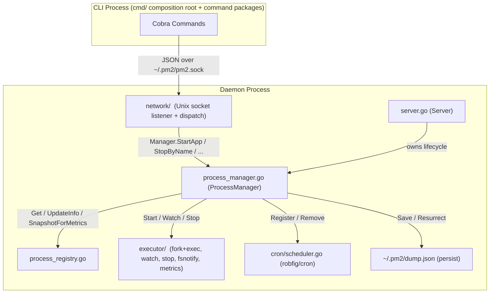

# pm2 — Project Context for Claude

## Module

`github.com/bizshuk/pm2` Go 1.26.3

## Architecture

Daemon + CLI over a Unix socket. The CLI is a thin RPC client; all process state lives in the daemon.


```mermaid
flowchart TD
    subgraph CLI ["CLI Process (cmd/ composition root + command packages)"]
        direction TB
        C["Cobra Commands"]
    end

    subgraph Daemon ["Daemon Process"]
        direction TB
        N["network/  (Unix socket listener + dispatch)"]
        S["server.go (Server)"]
        PM["process_manager.go (ProcessManager)"]
        R["process_registry.go"]
        E["executor/  (fork+exec, watch, stop, fsnotify, metrics)"]
        CR["cron/scheduler.go (robfig/cron)"]
        D["~/.pm2/dump.json (persist)"]

        N -->|"Manager.StartApp / StopByName / ..."| PM
        S -->|"owns lifecycle"| PM
        PM -->|"Get / UpdateInfo / SnapshotForMetrics"| R
        PM -->|"Start / Watch / Stop"| E
        PM -->|"Register / Remove"| CR
        PM -->|"Save / Resurrect"| D
    end

    C -- "JSON over ~/.pm2/pm2.sock" --> N
```

Import direction (no cycles):

- `network` -> (Manager interface in `network/manager.go`) — never imports `daemon`
- `daemon` -> `executor`, `network`, `model`, `process`, `cron`
- `executor` -> `model` only
- `main` -> `cmd` as the thin executable boundary
- `cmd` -> `cmd/daemon`, `cmd/task`, and `cmd/wizard` to compose the complete
  Cobra tree
- `cmd`, `cmd/task`, and `cmd/daemon` -> `cmd/runtime` for shared CLI paths and
  the daemon auto-start client
- `cmd/runtime` -> `model` for daemon RPC transport
- `cmd/daemon` -> `daemon` for the foreground server runtime
- `cmd/wizard` -> `cmd/wizard/prompt` for Cobra-free planner prompt templates
- `cmd/wizard` -> `config/wizard` for prompt, render, merge, and install logic

The lock and import invariants are spelled out in the Conventions section below.

## Package map

```tree
pm2/
├── main.go                   thin executable boundary — forwards os.Args[1:]
│                             to cmd.Execute and maps errors to exit 1
├── cmd/                      cobra commands (CLI layer)
│   ├── root.go               Cmd, config initialization, command registration,
│   │                         traverse hooks, and metrics hook
│   ├── execute.go            Execute(args) + version argument dispatch
│   ├── root_test.go          root tree, alias, config, and version tests
│   ├── runtime/              shared CLI runtime infrastructure
│   │   ├── state.go          pm2Home initialization + PM2Home/SocketPath/
│   │   │                     DaemonStopMarkerPath
│   │   ├── client.go         CLIClient socket RPC wrapper
│   │   └── client_autostart.go
│   │                         silent daemon auto-spawn + readiness wait
│   ├── daemon/               daemon command sub-package
│   │   ├── daemon.go         Cmd parent for daemon lifecycle commands
│   │   ├── start.go          daemon start command + foreground/background runtime
│   │   ├── start_alias.go    explicit root `pm2 start` short alias
│   │   ├── kill.go           daemon kill command node
│   │   ├── stop.go           daemon stop command + durable stop marker management
│   │   └── status.go         daemon status command node
│   ├── task/                 task command sub-package
│   │   ├── task.go           Cmd parent for task lifecycle commands
│   │   ├── start.go          task start command + AppStartReq RPC flow
│   │   ├── apply.go          explicit root short alias for task start
│   │   ├── select.go         maps AppConfig.Optional to Paused;
│   │   │                     selects one app by index/name for --single
│   │   ├── single.go         renders and reads the interactive single-app choice
│   │   ├── restart.go        task restart command node
│   │   ├── stop.go           task stop command node
│   │   ├── pause.go          task pause command node
│   │   ├── resume.go         task resume command node
│   │   └── delete.go         task delete command node
│   ├── wizard/               wizard command sub-package
│   │   ├── wizard.go         Cmd parent + interactive wizard Cobra shell
│   │   ├── install.go        install subcommand + AppConfig assembly
│   │   ├── install_flags.go  shared planner flag binding
│   │   ├── prompt/           planner prompt-template domain; no Cobra dependency
│   │   │   ├── template.go   Template model + user-prompt rendering
│   │   │   ├── system.go     system-planner template
│   │   │   └── business.go   business-planner template
│   │   └── wizard_test.go    Cobra-level wizard integration tests
│   ├── list.go               ListCmd — styled non-interactive process table;
│   │                         shares tui/views process-table renderer
│   ├── logs.go               pm2 logs  — reads log files directly
│   ├── monitor.go            MonitorCmd — two-pane detail/log dashboard; no -d flag
│   ├── save.go               SaveCmd
│   ├── resurrect.go          ResurrectCmd
│   └── startup.go            StartupCmd — launchd/systemd service generation
├── config/
│   ├── ecosystem.go          Load() — parses .json and .js (goja) ecosystem files
│   │                         Normalize() fills defaults; resolves relative script paths
│   │                         relative to config file dir (not CWD)
│   ├── ecosystem_test.go     Unit tests for script path resolution and configuration loading
│   └── wizard/               config/wizard sub-package — interactive wizard core
│       ├── doc.go            package boundary and ownership
│       ├── context.go        WizardContext struct (I/O streams + YesAll)
│       ├── defaults.go       wizard-only output, name, script, and count defaults
│       ├── format.go         format validation and default output selection
│       ├── options.go        shared output/merge options for all wizard entry points
│       ├── prompt.go         reusable line, choice, numeric, env, and cron prompts
│       ├── app_options.go    cron-restart, max-restart, and CWD prompt block
│       ├── app.go            AppConfig defaults and one-app prompt sequence
│       ├── collection.go     multi-app collection loop and summaries
│       ├── name.go           generated wizard name derivation
│       ├── interactive.go    RunInteractive entry point
│       ├── install.go        RunInstall entry point
│       ├── merge.go          existing-file loading, merge, and format detection
│       ├── render_app.go     shared JS/JSON ecosystem projection
│       ├── render_javascript.go  JavaScript renderer
│       ├── render_json.go    JSON renderer
│       ├── writer.go         preview, confirmation, and file persistence
│       └── wizard_test.go    Unit tests for prompts, rendering, merge, and public API
├── daemon/
│   ├── server.go             Server — thin daemon wrapper: owns Unix socket
│   │                         lifecycle + auto-save/auto-resurrect goroutines.
│   │                         Embeds *ProcessManager for all process logic.
│   ├── process_manager.go    ProcessManager — core process coordination:
│   │                         implements network.Manager; owns Registry +
│   │                         Executor + Scheduler; all lifecycle methods
│   │                         (StartApp, StopByName, RestartByName,
│   │                         PauseByName, ResumeByName, DeleteByName,
│   │                         ListAll, Save, Resurrect, KillAll, Ping,
│   │                         Status) plus internal helpers (launchProcess,
│   │                         onProcessExit, stopProcess, triggerCron).
│   │                         Also defines ManagedProcess.
│   ├── process_registry.go   ProcessRegistry — sole owner of the process map
│   │                         and its RWMutex (Add/Get/Remove/UpdateInfo/...)
│   ├── helpers.go            getAppVersion() — version probe from package.json
│   ├── server_test.go        daemon server unit tests
│   ├── process_registry_test.go  ProcessRegistry unit + concurrency tests
│   ├── executor/             daemon/executor sub-package — OS-level process ops
│   │   ├── executor.go       Executor struct + Start/Watch/Stop (lock-free)
│   │   ├── builder.go        BuildCommand — wraps script+args in `bash -c`,
│   │   │                     sets Setpgid, builds the env
│   │   ├── watcher.go        NewFileWatcher(path, onDetect) — fsnotify +
│   │   │                     500ms debounce
│   │   └── metrics.go        MetricsCollector (3-phase refresh) +
│   │                         MetricsBackend interface + GetProcessMetrics
│   └── network/              daemon/network sub-package — Unix socket listener
│       ├── listener.go       Listen(socketPath, m Manager) — bind + accept loop
│       ├── handler.go        Handle(conn, m Manager) — read Request, dispatch,
│       │                     write Response, post-CmdKill exit hook
│       └── manager.go        Manager interface — the only contract network
│                             needs from the daemon (StartApp, StopByName,
│                             RestartByName, PauseByName, ResumeByName,
│                             DeleteByName, ListAll, Save, Resurrect, KillAll,
│                             Ping). Import-cycle guard.
├── model/
│   ├── protocol.go           Request / Response types; WriteJSON / ReadJSON / SendRequest
│   └── protocol_test.go      Unit tests for protocol structures and serialization
├── process/
│   ├── app_config.go         shared static AppConfig and normalization
│   ├── defaults.go           shared AppConfig defaults and derived log paths
│   ├── status.go             process lifecycle states
│   ├── process_info.go       runtime process state
│   ├── daemon_info.go        daemon status model
│   ├── path.go               process-name and executable-path resolution
│   └── format.go             process display formatters
├── cron/
│   └── scheduler.go          Scheduler wraps robfig/cron; Register(name, expr, fn) / Remove(name)
└── tui/
    ├── model.go              Bubbletea Model — controller: Update event branches,
    │                         Cmd dispatch, View() delegates to tui/views
    ├── theme.go              Re-exports the palette from tui/theme as clXxx vars
    ├── theme/                tui/theme sub-package: single source of truth for
    │   └── palette.go        lipgloss.AdaptiveColor palette (Online/Stopped/...)
    ├── views/                Stateless renderers; pure functions of ViewContext
    │   ├── context.go        ViewContext struct (Width/Height/Procs/Logs/...)
    │   ├── header.go         RenderHeader — title bar (count, time, notice)
    │   ├── footer.go         RenderFooter (key hints) + RenderHostMetricsLines
    │   ├── detail.go         RenderDetail — right-panel param table
    │   ├── logs.go           RenderLogs — right-panel log tail
    │   ├── list.go           RenderProcessTable + RenderWideTable + RenderLeftPane
    │   ├── layout.go         RenderLayout — single entry point; orchestrates
    │   │                     header + body + footer, decides single vs two-pane
    │   └── format.go         Pure formatters: shortUptime, fullUptime, fmtTime,
    │                         cronExpr/Next/LastRunStyled, Crop/CropRight,
    │                         formatBytes, formatWatching, secHeader,
    │                         dotFor, statusLabel, getStatusColor
    ├── metrics.go            CPU and memory metrics background collector
    └── model_test.go         Unit tests for TUI layout and logic
```

## Key design decisions

### Process identity

Keyed by `namespace:name` in `ProcessManager.reg.processes` map.
Override rule in `StartApp()`: same name + same script → stop-and-replace.
Same name + different script → error (caller must `pm2 task delete` first).

### Auto-restart suppression

`ManagedProcess.stopping` bool is set to `true` by `stopProcess()` (via
`executor.Stop`'s `onStopping` callback) before SIGTERM.
`onProcessExit` (the executor.Watch callback) skips auto-restart when
`stopping == true`.
This prevents deliberate `pm2 task stop` from triggering the crash-restart loop.

### Cron restart lifecycle

1. `launchProcess()` calls `scheduler.Register(key, expr, fn)` after spawning.
2. Cron fires → `RestartByName(name)` → `stopProcess()` (removes cron entry) → `launchProcess()` (re-registers).
3. `stopProcess()` / `DeleteByName()` call `scheduler.Remove(key)` explicitly.
4. Net effect: cron entry is always tied to the currently running instance.

### Pause / resume (cron suspension)

`pm2 task pause <target>` suspends a process: `PauseByName()` reuses `stopProcess()`
(which removes the scheduler entry and stops any running instance) then sets
`ManagedProcess.paused = true` and `Status = StatusPaused`.

The `paused` status is what distinguishes a deliberately-suspended cron task
from one merely idle between fires — both a running-then-stopped process and an
idle cron task otherwise sit at `StatusStopped`. A paused task has NO scheduler
entry, so it will not fire until resumed.

`pm2 task resume <target>` re-launches via `launchProcess()` with `CronTriggered =
false`, which re-registers the cron schedule and returns a cron task to idle
`StatusStopped` (or a regular process to `StatusOnline`). Resume on a
non-paused process is a no-op. The `paused` flag round-trips through
`dump.json` via `process.AppConfig.Paused` — `SnapshotAppConfigs` copies it
from `ManagedProcess.paused` at save time, and `Resurrect` re-applies it via
`AppStartReq.Paused`. A paused cron task resurrects without its cron schedule
being re-registered, so a daemon restart does not silently undo `pm2 task pause`
(regression test: `TestPausedCronTaskSurvivesResurrect`).

Pause vs. an in-flight fire (race guard): `executor.Start` (fork/exec) runs
_before_ `launchProcess` takes the registry lock, so a cron fire already
in-flight when `PauseByName` runs could reach the map-write + `scheduler.Register`
and silently re-arm the schedule — the "paused cron still fires" bug.
`launchProcess` guards against this: under the registry write lock, if the
existing entry is `paused` and this launch is `CronTriggered` (a cron fire or
file-watch restart — never an explicit resume/start), it aborts before
replacing the entry or registering any schedule, and reaps the racing child in
the background. Because both the guard and `PauseByName`'s `paused=true` mutate
under the same lock, the decision is atomic (regression test:
`TestPauseDuringCronFireLeavesNoSchedule`). The stop callbacks also preserve
`StatusPaused` whenever the live entry is paused, so an in-flight cron stop
cannot overwrite the completed pause with `StatusStopped`.

### Install policy: required vs optional apps

`process.AppConfig.Optional` marks an app as inactive by default. The zero
value (`false`) means required, so an ecosystem file that says nothing about
`optional` behaves exactly as before the field existed — every app starts.
An optional app is still registered; the CLI sets `Paused = true` on its
`AppStartReq`, so the daemon creates the registry entry without spawning a
child or registering a cron schedule.

`pm2 task start` applies the policy through `task.selectApps()`
(`cmd/task/select.go`), a pure function over the loaded app list:

| Input                             | Result                                                        |
| --------------------------------- | ------------------------------------------------------------- |
| `optional: false` (default)       | always started                                                |
| `optional: true`, no flag         | registered with `StatusPaused`, PID 0, no scheduler entry     |
| `optional: true`, `--all`         | registered and started                                        |
| `optional: true`, `--with <name>` | named app starts; other optional apps register paused         |
| `--with` naming no app at all     | error — a typo must not silently leave an app paused          |
| `--single`                        | only the interactively selected app is sent; it starts active |

Two boundaries worth keeping:

- Policy mapping lives in the CLI: every app produces one `AppStartReq`, and
  unselected optional apps carry `Paused = true`. The daemon only implements
  the existing pause lifecycle; it preserves `Optional` as metadata but does
  not interpret it after registration.
- The policy is applied uniformly to local and remote ecosystem files.
  `optional` is a property of the app, not of how the config was fetched;
  making it remote-only would be a surprising special case.

`Optional` and the derived paused state ride along in `dump.json` via
`AppConfig`. `resurrect` restores the optional entry as paused, so a daemon
restart cannot silently activate it.

### Command namespaces

Daemon startup and task execution use separate namespaces:

| Canonical root command | Short alias |
| ---------------------- | ----------- |
| `pm2 wizard`           | `pm2 w`     |
| `pm2 save`             | `pm2 s`     |
| `pm2 resurrect`        | `pm2 r`     |
| `pm2 task`             | `pm2 t`     |
| `pm2 daemon`           | `pm2 d`     |
| `pm2 monitor`          | `pm2 m`     |
| `pm2 list`             | `pm2 l`     |

The namespace aliases retain their child command trees, so `pm2 t restart`
resolves to `pm2 task restart` and `pm2 d status` resolves to
`pm2 daemon status`.

| Canonical command           | Explicit root alias  |
| --------------------------- | -------------------- |
| `pm2 daemon start`          | `pm2 start`          |
| `pm2 task start <config>`   | `pm2 apply <config>` |
| `pm2 task restart <target>` | none                 |
| `pm2 task stop <target>`    | none                 |
| `pm2 task pause <target>`   | none                 |
| `pm2 task resume <target>`  | none                 |
| `pm2 task delete <target>`  | none                 |

Root commands are registered only when the product requirements explicitly
name an alias. The `cmd/task` sub-package owns the namespaced Cobra nodes,
handlers, and the explicit `ApplyCmd` alias; other task lifecycle commands are
not duplicated at the root.

With no target, both task-start entry points load `./ecosystem.config.js`.
`--single` lists the loaded apps and sends only the chosen app to the daemon;
the explicit choice clears its derived paused state, including for an
`optional: true` app. It is mutually exclusive with `--all` and `--with`.

### Relative path resolution

`config.Load()` resolves relative `script` paths relative to the config file's
directory at parse time (in the CLI process). The same directory becomes the
default `CWD`, so `ProcessInfo.CWD` is both the effective running folder and
the value shown in `pm2 m`. The daemon always receives absolute paths.

### RPC protocol

Newline-delimited JSON over a Unix socket (`~/.pm2/pm2.sock`).
`model.SendRequest()` dials, sends one `Request`, reads one `Response`, closes.
No persistent connection — each CLI invocation is a fresh dial.

### TUI refresh

Bubbletea tick every 2 s → `doRefresh()` → `daemon.SendRequest(CmdList)`.
Log tailing reads the log file directly (not via daemon) on process selection change.
`pm2 monitor` (short alias `pm2 m`) always starts in the two-pane detail/log
layout. `views.RenderDetail` shows the selected task's `cwd` directly below
its script. The former wide-table presentation is exposed as the one-shot
`pm2 list` (short alias `pm2 l`) output through `views.RenderProcessTable`;
`monitor` has no `-d` flag.
`doAction()` (r/p/d) calls RPC then immediately calls `doRefresh()()` inline so the
list updates without waiting for the next tick. The `p` key is a pause/resume
toggle (`pauseOrResume()` picks `CmdResume` when the selected row is `paused`,
else `CmdPause`), so the same key suspends and reactivates a cron task.

### Daemon lifecycle: `stop` vs `daemon kill`

Two verbs that look superficially similar but operate on different
layers of the system. Conflating them is a common source of bugs and
user confusion, so the distinction is encoded in the command tree,
the wire protocol, and the dispatcher.

| Aspect            | `pm2 task stop <name\|id\|all>`                       | `pm2 daemon kill`                                |
| ----------------- | ----------------------------------------------------- | ------------------------------------------------ |
| Operates on       | a managed process                                     | the daemon itself                                |
| Daemon afterwards | still running, accepting RPC                          | exited                                           |
| Wire code         | `model.CmdStop` (+ `Name`)                            | `model.CmdKill` (no payload)                     |
| Manager method    | `StopByName(name)` (returns error)                    | `KillAll()` (no return value)                    |
| Signal path       | `executor.Stop` → SIGTERM → 5 s → SIGKILL (same path) | same path applied to every mp, then `os.Exit(0)` |
| CLI verb location | nested `task stop` command                            | nested `daemon kill` command                     |

The `KillAll` RPC carries no payload and `KillAll()` has no return
value: it is an idempotent "please shut down" request, not a
query. The daemon's `Handle` function in
`daemon/network/handler.go:36-42` schedules a `go func() { sleep(150ms); os.Exit(0) }()`
after the response flushes. The 150 ms grace lets `WriteJSON`
complete on its own goroutine context so the CLI sees `ok=true` before
the socket vanishes. The actual process-stop work is identical to
`StopByName("all")` — `KillAll` loops `pm.findProcesses("all")` and
calls the same `stopProcess` per entry.

Because both verbs share `executor.Stop`, they share the SIGTERM →
SIGKILL escalation and the `stopping` flag that suppresses
auto-restart. The interface contract is **explicit** in
`daemon/network/manager.go` (`CmdKill — graceful stop of every
managed process (does NOT exit the daemon — handleConn's dispatcher
schedules os.Exit separately)`) so future contributors do not
move the `os.Exit` into `KillAll` itself.

**Removed alias:** the legacy top-level `pm2 kill` command has been
deleted; use `pm2 daemon kill`. Bare `pm2 daemon` errors out so the
caller always picks an explicit verb.

## Dependencies

| Package                              | Purpose                                           |
| ------------------------------------ | ------------------------------------------------- |
| `github.com/bizshuk/gosdk`           | App config, built-in config command, metrics hook |
| `github.com/spf13/cobra`             | CLI commands                                      |
| `github.com/robfig/cron/v3`          | Cron scheduler in daemon                          |
| `github.com/dop251/goja`             | JS runtime for `.js` ecosystem config             |
| `github.com/charmbracelet/bubbletea` | TUI event loop                                    |
| `github.com/charmbracelet/lipgloss`  | TUI and `pm2 list` table styling                  |

## State directory (`~/.pm2/`)

```tree
~/.pm2/
├── pm2.sock        Unix socket
├── dump.json       serialised []process.AppConfig (pm2 save / resurrect)
└── logs/
    ├── <name>-out.log
    └── <name>-err.log
```

## Conventions

- `cmd/root.go` is the only Cobra composition root; `main.go` is only the process
  entry/exit boundary. Commands under `cmd/`, `cmd/daemon/`, `cmd/task/`, and
  `cmd/wizard/` are package-level exported `*cobra.Command` vars; flags and
  child commands bind in `init()`. Do not reintroduce `NewXxxCmd()` /
  `newXxxCmd()` constructors.
- Shared CLI paths and daemon auto-start RPC infrastructure live in
  `cmd/runtime`; command sub-packages must depend on that package instead of
  importing their parent `cmd` package.
- All process state is owned by `daemon.ProcessRegistry` (defined in
  `daemon/process_registry.go`). `daemon.ProcessManager` holds a `*ProcessRegistry` and delegates
  lock primitives via `pm.Lock()`/`pm.Unlock()`/`pm.RLock()`/`pm.RUnlock()` for
  the rare callers that need to hold the registry's lock across multiple
  method calls.
- Always prefer the high-level `ProcessRegistry` methods (`Get`/`Add`/
  `Remove`/`UpdateInfo`/`UpdateMetrics`/`UpdateCronStatus`/`Snapshot`/
  `SnapshotOne`/`SnapshotForMetrics`/`SnapshotMap`/`SnapshotAppConfigs`/
  `FindByTarget`/`Len`) over the lock escape hatches. The escape hatches are reserved
  for code that genuinely needs cross-method atomicity (e.g. `launchProcess`
  doing lookup + ID increment + map write as one critical section).
- For atomic field mutations on a single `*ManagedProcess`, use
  `pm.reg.UpdateInfo(key, func(mp *ManagedProcess) { ... })` — never mutate
  `mp.Info` fields directly from outside the registry. Direct mutation
  races with `onProcessExit`'s own `UpdateInfo` calls and trips the race
  detector (this is what `TestSaveConcurrentWithMapMutation` was originally
  designed to catch).
- Reads follow the same rule as writes: never read `mp.Info.X` directly
  from outside the registry — a naked read races with `onProcessExit`'s
  `UpdateInfo` writes just as a naked write does (the race that
  `TestPauseResumeRunningProcess` exposed). Prefer
  `pm.reg.SnapshotOne(key)` to obtain a `process.ProcessInfo` value copy
  taken under the read lock, and read fields off the copy. Only the hot
  path that needs to _trigger_ stop / restart / `UpdateInfo` (and the rare
  case that needs the private `paused` flag alongside `Status`) uses
  `pm.reg.Get(key)` for a live `*ManagedProcess` or `UpdateInfo` to read
  atomically under the write lock.
- `onProcessExit` (the `executor.Watch` callback) is the only place that
  transitions a process from `online` → `errored` or `stopped` _for processes
  that exit on their own_. Deliberate stops update status from inside
  `stopProcess`'s `onStopping`/`onStopped` callbacks instead.
- The Status race: when a process is deliberately stopped, both
  `onProcessExit` and `stopProcess.onStopped` race to acquire the
  registry lock after `close(done)`. The losing writer would otherwise
  clobber the winning writer's Status. Guard the `onProcessExit` Status
  write with `!mp.stopping` so `stopProcess` owns the "stopped" Status
  and `onProcessExit` only writes Status when the process exited on its
  own.
- Log file paths are resolved once at launch time and stored in `ProcessInfo`.
  Do not re-derive them from name at read time.
- `config.AppConfig.Normalize()` is called on every loaded app. Do not skip it.
- **Executor lock direction (Phase 4 invariant)**: `daemon.ProcessManager` may
  call `executor.Executor` while holding the registry lock, because the
  Executor holds NO lock during its execution. The Executor NEVER calls
  back into the registry — every state update flows through the
  `onStopping` / `onStopped` / `onExit` / `onFileChanged` callbacks the
  ProcessManager passes in. The callback implementations take the registry lock
  internally via `UpdateInfo` and never hold it across a blocking call.
- **Network import direction (Phase 5 invariant)**: `daemon/network`
  depends ONLY on the `network.Manager` interface — never on the concrete
  `*daemon.ProcessManager` or `*daemon.Server` type. `daemon.ProcessManager`
  implements `Manager` via its public methods (`StartApp`, `StopByName`, …).
  `daemon.Server` embeds `*ProcessManager` and delegates `network.Listen` to it.
  The Executor and Registry packages MUST NOT import `daemon/network`; the
  import graph is strictly `network → (Manager contract only)` with no cycle.
  `network/manager.go` is the canonical interface declaration.
- All TUI view rendering lives in `tui/views/` as pure functions. Every
  exported renderer takes a `views.ViewContext` (or the specific primitive
  it needs) and returns a `string`. Views never mutate state, never reach
  into the controller, and never hold references to `tui.Model`. Add a new
  view by writing a new function in the relevant `views/*.go` file and
  wiring it into `RenderLayout`; do not reintroduce member methods on
  `Model`.
- Colour values come from `tui/theme/palette.go` only. The `clXxx`
  re-exports in `tui/theme.go` exist for backwards compatibility inside
  the tui package; new code outside the tui/views subtree should
  import `tui/theme` directly. Never declare new `lipgloss.AdaptiveColor`
  literals inside view code.
