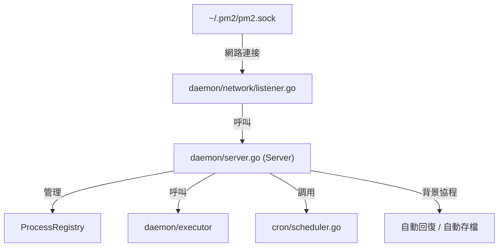
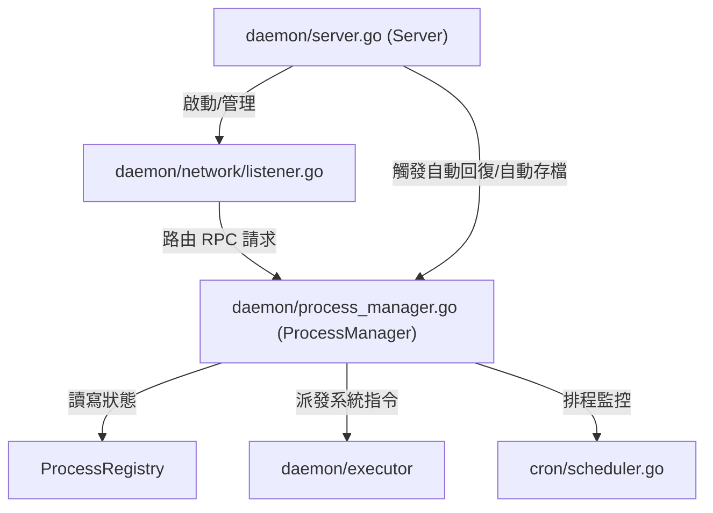

# 架構計畫 — manager-decoupling (Architecture Plan)

## 1. 目標與範圍 (Goal & Scope)

`開發者 (Developer)` 使用 `ProcessManager` 結構體來管理進程的 `生命週期 (lifecycle)`、`持久化 (persistence)` 與 `定時任務 (periodic task)`。本計畫旨在將進程管理的核心 `協調與控制邏輯 (coordination and control logic)`（包含 `進程註冊表 (process registry)`、`生命週期管理 (lifecycle management)`、`排程器管理 (scheduler management)` 與 `存檔機制 (persistence mechanism)`）從 `Server` 中解耦，抽離成獨立的 `ProcessManager` 結構體，使 `網路監聽 (network listening)` 與業務核心邏輯徹底分離，以提升 `單元測試 (unit testing)` 與 `進程狀態模擬 (process state simulation)` 的獨立性。

不做什麼 (out of scope)：
- 不修改命令列介面 `cmd/` 與用戶介面 `tui/` 的遠端調用邏輯與 `Bubbletea` 元件。
- 不變更與 `model/protocol.go` 定義的 `通訊協定 (transmission protocol)` 與 `JSON` 欄位標記。
- 不重構 `daemon/executor` 的進程生命週期與 `信號管理 (signal management)`，亦不調整其與 `ProcessRegistry` 的 `鎖方向 (lock direction)` 關係。

## 2. 現況架構 (Current Architecture)

根據對 `daemon/server.go` 的 `熱點掃描 (hotspot scan)`，該檔案是整個專案改動頻率最高的檔案。在現況下，`Server` 包含了 `Unix Socket 監聽 (Unix Socket listening)`、`自動回復 (auto-resurrect)` 背景協程、`自動存檔 (auto-save)` 背景協程，同時也實現了所有進程的 `生命週期調度 (lifecycle scheduling)`、`狀態回寫 (state writeback)` 與 `排程器管理 (scheduler management)`，並直接實現了 `network.Manager` 介面。這使得進程管理業務與 `套接字伺服器 (socket server)` 的生命週期強烈耦合，導致 `單元測試 (unit testing)` 難以在不啟動伺服器或背景協程的情況下，單獨測試進程管理的狀態轉移邏輯。

相關模組清單：
- `daemon/server.go` — `Server` 結構定義與監聽初始化。
- `daemon/manager.go` — 實現 `ListAll`、`DeleteByName` 與 `Ping` 方法。
- `daemon/process_registry.go` — 管理線程安全進程對照表。
- `daemon/executor/` — 作業系統層進程管理與指標採集。
- `cron/scheduler.go` — 進程定時任務排程器。

## 3. 架構位置與邊界 (Placement & Boundaries)

位置說明：
本變更主要位於 `daemon` 套件中。我們將建立 `daemon/process_manager.go` 檔案，宣告全新的 `ProcessManager` 結構體。我們將原本屬於 `Server` 的進程生命週期協調、定時任務觸發與持久化讀寫等核心業務方法移入 `ProcessManager`。`Server` 結構體則被簡化為僅負責網路層 `Socket` 的生命週期管理與背景定時協程的啟動，並持有此 `ProcessManager`。

邊界清單：
- `擁有` 職責：`ProcessManager` 擁有並協調 `ProcessRegistry`、`Executor` 與 `cron.Scheduler`；提供進程啟動、停止、刪除、列表與重啟的業務功能；實現 `network.Manager` 介面。
- `不碰` 範圍：`ProcessManager` 不直接管理 `Socket` 連接與背景 `Socket` 監聽循環；不管理 `Daemon` 進程的啟動引報細節（這些由 `Server` 或 `cmd/daemon.go` 負責）。

## 4. 介面與資料流 (Interfaces & Data Flow)

由於 `ProcessManager` 將完整實現既有的 `network.Manager` 介面，因此其外部介面與 `network.Manager` 保持一致，但新增 `ProcessManager` 的構造函式。

介面表 (Interfaces)：

| 介面/函數名稱 | 輸入 (Input) | 輸出 (Output) | 錯誤情況 (Error Conditions) |
| :--- | :--- | :--- | :--- |
| `NewProcessManager(homeDir string)` | `homeDir string` (家目錄路徑) | `*ProcessManager` | 無 |
| `ProcessManager.StartApp(req)` | `req *model.AppStartReq` (啟動請求) | `[]process.ProcessInfo, error` | 腳本啟動失敗、配置解析錯誤或已存在同名但不同腳本的進程 |
| `ProcessManager.StopByName(name)` | `name string` (進程標記) | `error` | 進程未找到或停止信號發送超時 |
| `ProcessManager.Save()` | 無 | `error` | 序列化 JSON 失敗或寫入 `dump.json` 失敗 |
| `ProcessManager.Resurrect()` | 無 | `error` | 讀取 `dump.json` 失敗或反序列化失敗 |

資料流圖 (Data Flow Graph)：

## 5. 清晰與可擴充性檢查 (Clarity & Scalability Check)

逐項回答：
1. 單一職責：`是`。`ProcessManager` 僅負責進程的邏輯協調與業務狀態轉移，儲存與定時任務分屬 `ProcessRegistry` 與 `cron.Scheduler`；`Server` 僅負責 `Daemon` 的啟動、背景定時協程與 `Socket` 監聽。
2. 依賴方向：`是`。無循環相依。`network` 層改為直接依賴並調用 `ProcessManager`（透過 `network.Manager` 介面），依賴方向為由外向內。
3. 可替換：`是`。在 `單元測試 (unit testing)` 中，可以直接構造 `ProcessManager` 而無需運行真實的 `Unix Socket` 或啟動監聽，大幅提升測試的效率與穩定度。
4. 水平擴充：`不適用`。本項目為單機進程管理器，無水平擴充多實例部署需求。
5. 擴充點：`是`。若未來需要提供 `HTTP/gRPC` 或其他傳輸層協議來管理進程，只需新增相應的傳輸協議監聽器並呼叫同一個 `ProcessManager` 實例即可，完全不需修改進程管理核心。

## 6. 漸進落地步驟 (Incremental Steps)

我們將重構拆分為 3 個可獨立編譯、測試與回滾的步驟：

| 步驟 (Step) | 做什麼 (What) | 驗證 (Verify) | 回滾 (Rollback) |
| :--- | :--- | :--- | :--- |
| 1 | 在 `daemon/` 目錄下新建 `process_manager.go`，定義 `ProcessManager` 結構體，並將原本 `Server` 的進程管理核心方法（如 `StartApp`, `StopByName`, `launchProcess`, `persistence` 等）搬移過來。 | 執行 `go build ./...` 確保編譯通過。 | 使用 `git restore` 刪除 `process_manager.go`。 |
| 2 | 修改 `daemon/server.go` 的 `Server` 定義，使其內嵌或持有 `ProcessManager`，並將其 `Listen` 方法中的 `network.Listen(socketPath, s)` 修改為傳入 `s.pm`。 | 執行 `go test -race ./daemon/...` 確保所有既有單元測試均順利通過。 | 使用 `git restore` 還原 `daemon/server.go` 的修改。 |
| 3 | 重構 `daemon/server_test.go` 與其他測試檔案，將原本直接構造 `Server` 進行進程管理功能驗證的測試案例，改為直接構造並呼叫 `ProcessManager`。 | 執行 `go test -race ./...` 確保全案測試綠燈；手動執行 `pm2 startup` 與 `pm2 monit` 確認功能無虞。 | 使用 `git restore` 還原測試代碼變更。 |

## 7. 風險與假設 (Risks & Assumptions)

- 資訊不足之最簡假設：由於啟動規劃時未指定特定特徵，我們採用最簡假設，選擇待辦清單 `README.todo` 中的第一項 Pending Option `architecture-manager-decoupling` 作為本次系統架構規劃的目標，且假定該規劃與既有的絞殺榕模組化模式完全相容。
- 進程狀態競爭假設：我們假設在重構過程中，原本 `Server` 特有的 `RLock`/`Lock`/`RUnlock`/`Unlock` 代理方法仍需在過渡期保留或轉移至 `ProcessManager`，以避免大量修改測試代碼。我們在 `ProcessManager` 中也實現這些 `RLock`/`Lock` 代理，確保與 `server_test.go` 中既有測試案例的相容性。
- `auto-save` 與 `auto-resurrect` 協程之生命週期：假設這兩個背景定時任務之生命週期由 `Server` 擁有，因為它們與守護進程伺服器 (daemon socket runtime) 的啟動與關閉密切相關，這樣能保持 `ProcessManager` 的定時任務潔淨度。
