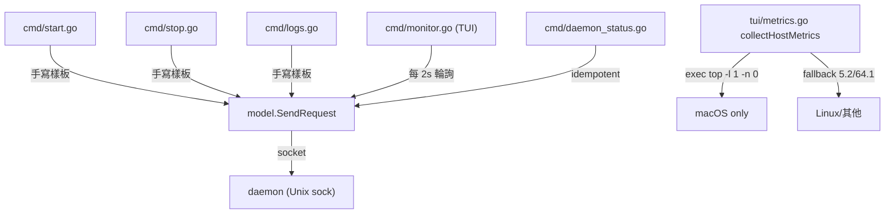
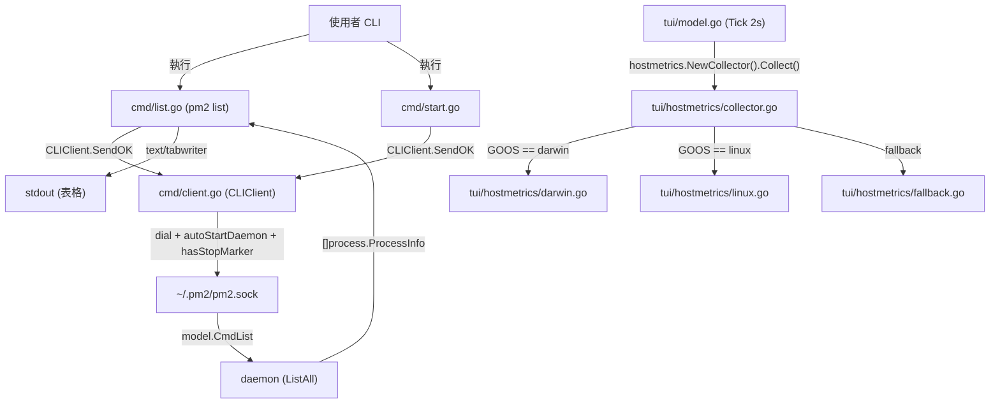

# `pm2 list` & Host Metrics 採集 — 規格與實作紀錄

> 本文件由 `plans/architecture-cli-list-and-metrics.md`(架構計畫)與
> `plans/eager-zooming-diffie.md`(實作計畫)合併而成,作為最終存檔版本。
> 兩個來源檔案已重命名為 `plans/2026-07-10-cli-list-and-metrics-{plan,impl}-source.md`
> 保留為歷史來源。

## Context

`pm2` 提供 daemon + CLI 架構,所有 process 狀態皆在 daemon,CLI 透過 Unix socket
(`~/.pm2/pm2.sock`) 走 newline-delimited JSON RPC 通訊。本次解決三個痛點:

1. **缺少非互動式列表指令**。`cmd/` 註冊 14 個子命令但獨缺 `pm2 list`,CI/CD
   與 scripts 沒有可程式化查詢入口,只能進 `pm2 monit` 的 TUI。
2. **RPC 通訊樣板散落**。`cmd/start.go` 內 `model.SendRequest` → 失敗時
   `autoStartDaemon` → 重試 → `resp.OK` 檢查是一組重複樣板,後續新命令都
   需手工複製。
3. **主機指標採集綁死 macOS**。`tui/metrics.go:34-85` 直接 `exec.Command("top", "-l", "1", "-n", "0")`
   並以 BSD `top` 字串模式解析 `CPU usage:` 與 `PhysMem:` 兩個列;Linux 上
   `top` 直接報錯,函式靜默走 fallback `cpu=5.2 / mem=64.1` 兩個寫死常數。

目標:新增 `pm2 list` (aliases: `ls`, `status`)、集中 CLI↔daemon 通訊到
`cmd/client.go` 的 `CLIClient`、抽離 macOS 硬編碼到 `tui/hostmetrics/`
子包(darwin / linux / fallback)。

### 重要前提

- `go.mod` 原本**完全沒有** `tablewriter`(架構計畫 §7 寫「已有」是錯的)。
- 實作中**再次驗證**發現 `tablewriter` v1 API 頂層渲染器是 markdown 樣式,
  沒有「無邊框 9 欄」可調,改用 Go 標準庫 `text/tabwriter`(免依賴)。
- `tui/metrics.go` 內 `rand.Float64()` 隨機 net/disk 值**不在本次重構範圍**;
  保留現狀並加 `// TODO` 標記,等下一輪 net/disk collector 再處理。
- TUI 端的 `model.SendRequest` 2 秒輪詢**不重構**(避免 `tui/ → cmd/`
  反向依賴)。
- CLIClient **只**用於 `cmd/start.go` 重構與 `cmd/list.go` 新增;`stop.go`
  5 個命令與 `monitor.go` 的 save/resurrect 維持原樣(避免過度設計解耦)。

## 範圍 (In Scope)

- `cmd/client.go` 新增 `CLIClient` 結構 + `NewCLIClient` + `Send` + `SendOK`
- `cmd/start.go` 第 54-68 行改用 `CLIClient`
- `cmd/list.go` 新增 `pm2 list`(aliases `ls`, `status`)+ 表格渲染 + 終端寬度門檻
- `cmd/root.go` 註冊 `newListCmd`
- `tui/hostmetrics/collector.go` 介面 + `NewCollector` 工廠(runtime.GOOS 切換)
- `tui/hostmetrics/darwin.go` 搬遷 `top -l 1 -n 0` 解析
- `tui/hostmetrics/linux.go` `/proc/stat` delta + `/proc/meminfo` 解析
- `tui/hostmetrics/fallback.go` 5.2/64.1 寫死常數
- `tui/metrics.go` 縮為 ~50 行(只保留 message types + re-arm tick)
- `tui/model.go` 改用 `hostmetrics.NewCollector()`,加降級 fallback
- `tui/views/footer.go` 加 `// TODO` 註解
- `process/format.go` 抽出共用 formatters(ShortUptime / FormatBytes / Dash 等)

## 不在範圍 (Out of Scope)

- 不修改 daemon:`ProcessManager` / `ProcessRegistry` / `Executor` / `network`
- 不引入 Loki / VictoriaMetrics 對接邏輯
- 不重新設計 `pm2 monit` 的 Bubbletea 事件處理
- 不把 TUI 端 `model.SendRequest` 2s 輪詢改用 `CLIClient`
- `tui/metrics.go:90-105` 的 `rand.Float64()` net/disk 值(標 TODO)
- `eco_install_business.go` / `eco_install_system.go` 內 RPC 呼叫

## 現況架構 (Before)



`cmd/logs.go:23` 與 `tui/commands.go:18` 都已使用 `model.CmdList` 取得
`[]process.ProcessInfo`,證明該 RPC 隨時可被新 `pm2 list` 複用,無需新增
wire protocol 命令。

## 目標架構 (After)



## 介面設計 (Interface)

```go
// cmd/client.go
type CLIClient struct{ socketPath string }
func NewCLIClient(socketPath string) *CLIClient
func (c *CLIClient) Send(req model.Request) (*model.Response, error)
func (c *CLIClient) SendOK(req model.Request) error

// tui/hostmetrics/collector.go
type HostMetricsCollector interface {
    Collect() (cpu float64, mem float64, err error)
}
func NewCollector() HostMetricsCollector  // 依 runtime.GOOS 切換
```

`CLIClient.Send` 內部實作直接搬遷 `cmd/start.go:54-68` 的 dial + autoStartDaemon
+ 重試邏輯,**保留** `hasStopMarker()` 自動抑制語意。失敗錯誤訊息沿用
「`cannot start daemon: %w`」格式。

`HostMetricsCollector` 介面讓 TUI 端可注入 stub 測試;`CLIClient` 接受任意
`socketPath`,可在測試時指向 unix socketpair。

## 資料流 (Data Flow)

1. `pm2 list` → `cmd/list.go` 建 `CLIClient` → `Send(CmdList)` → 失敗時
   `autoStartDaemon` 重試 → `resp.OK` 檢查 → unmarshal `[]process.ProcessInfo`
   → `text/tabwriter` 渲染 13 欄
2. `pm2 monit` 每 2s `tickMsg` → 觸發 `triggerHostMetricsMsg` → Update 內
   `m.hostMetrics.Collect()` → 失敗時降級 `5.2/64.1` → `hostMetricsMsg` →
   `m.hostCPU` / `m.hostMem` 更新

## 實作步驟 (5 步 commit cuts)

| 步驟 | 動作 | 驗證 | 回滾 |
|---|---|---|---|
| 1 | `cmd/client.go` + `cmd/start.go` 重構 | `go build` + `go test ./cmd/...` 全綠;`pm2 daemon stop && pm2 start` 仍印「auto-respawn is suppressed」 | `git restore cmd/client.go cmd/start.go` |
| 2 | `cmd/list.go` + `rootCmd` 註冊(text/tabwriter 13 欄) | end-to-end 啟動 daemon 後渲染 13 欄;`ls` / `status` aliases 生效;`--no-color` 旗標 | `rm cmd/list.go` 並移除 rootCmd 註冊 |
| 3 | `tui/hostmetrics/{collector,darwin,fallback}.go` | `go test ./tui/hostmetrics/...` 全綠;macOS 數字與改寫前一致 | `git restore tui/hostmetrics/` |
| 4 | `tui/hostmetrics/linux.go`(`/proc/stat` delta + `/proc/meminfo` MemAvailable) | Linux 容器內可讀 `/proc` 時顯示真實值;首次呼叫 warm-up fallback | `git restore tui/hostmetrics/linux.go` |
| 5 | `tui/metrics.go` 精簡 + `tui/model.go` 改用 collector + `tui/views/footer.go` 加 TODO | `go test ./...` 全綠;`pm2 monit` 跨平台正常更新 | `git restore tui/metrics.go tui/model.go tui/views/footer.go` |

## 13 欄位對齊 monit

`pm2 list` 的欄位順序與 monit wide table 完全一致:

| 欄 | 寬度 | 對齊 | 來源 |
|---|---|---|---|
| `id` | 3 | right | `p.ID` |
| `namespace` | 10 | left | `process.NamespaceOrDefault(p.Namespace)` |
| `name` | dynamic | left | `p.Name` |
| `version` | 8 | left | `process.VersionOrDash(p.Version)` |
| `pid` | 6 | right | `process.PIDOrDash(p.PID)` |
| `uptime` | 8 | right | `process.ShortUptime(p)` |
| `↺` | 3 | right | `strconv.Itoa(p.Restarts)` |
| `status` | 9 | left | `string(p.Status)` |
| `cpu` | 6 | right | `process.CPUPercent(p)` |
| `mem` | 8 | right | `process.MemCell(p)` |
| `user` | 8 | left | `process.UserOrDash(p.User)` |
| `cron` | 10 | left | `process.CronOrDash(p.Cron)` |
| `last exec` | 19 | left | `process.LastExec(p)` |

**寬度門檻**(套用於 `buildListColumns`):

- `width < 100`:隱藏 `user` / `cron` / `last exec`(10 欄)
- `width < 80`: 進一步隱藏 `version`(9 欄)
- 預設 13 欄(無 TTY / 無 COLUMNS → fallback 120)

**`pm2 list` vs `pm2 daemon status` 語意差異**:

- `pm2 list`:daemon 不可達 → exit 1,印「daemon not running, start with
  `pm2 daemon start`」(CI/CD 友善)
- `pm2 daemon status`:daemon 不可達 → exit 0,印「PM2 daemon is not running.」
  (idempotent probe)

## 關鍵決策紀錄

| 議題 | 決策 | 理由 |
|---|---|---|
| 表格套件 | `text/tabwriter`(標準庫) | `tablewriter` v1 強制 markdown 渲染無乾淨關閉方式;標準庫足夠 13 欄對齊 |
| 窄終端欄位 | 預設 13;<100 隱藏 user/cron/last exec;<80 再隱藏 version | 對應 monit 13 欄,寬度可調 |
| CLIClient 範圍 | 只用於 start.go + list.go | 避免過度設計解耦;stop.go/monitor.go 維持原樣 |
| 降級 fallback | `5.2/64.1` 寫死 | 與既有 macOS 解析失敗的 UX 一致 |
| `pm2 status` 別名 | top-level 命中 list | `daemon` 是獨立的父命令,無命令樹衝突 |

## 錯誤降級與邊界

| 場景 | 行為 |
|---|---|
| `pm2 list` daemon 不可達 | exit 1 + 印「daemon not running, start with `pm2 daemon start`」 |
| daemon 已啟動但 ListAll 回 OK=false | exit 1 + 印 `daemon: <resp.Error>` |
| `pm2 list` payload 解碼失敗 | exit 1 + 印 `decode list: <err>` |
| `pm2 status` alias | 與 `pm2 list` 等價(top-level) |
| `pm2 daemon status` | idempotent probe,exit 0 印「PM2 daemon is not running.」 |
| TUI macOS 解析失敗 | `darwinCollector.Collect` 回 err → `hostMetricsFallbackCPU/Mem = 5.2/64.1` |
| TUI Linux 容器無 `/proc` | `linuxCollector.Collect` 回 `*os.PathError` → fallback 5.2/64.1 |
| TUI 首次 `Collect` | 首次無前值 → warm-up fallback 5.2/64.1 |
| `text/tabwriter` 在窄終端 | 自動計算欄寬;<100/<80 觸發欄位 drop |

## 整體驗證 (End-to-End)

```bash
# 1. 編譯
go build -o /tmp/pm2 .

# 2. 既有測試全綠
go test ./...

# 3. list 命令
/tmp/pm2 daemon stop
/tmp/pm2 list                       # 預期: exit 1,「daemon not running, start with `pm2 daemon start`」
/tmp/pm2 daemon start --foreground &
/tmp/pm2 list                       # 預期: 13 欄表格,exit 0
/tmp/pm2 ls                         # 別名
/tmp/pm2 status                     # 別名(top-level)

# 4. monit 跨平台
/tmp/pm2 monit                      # 2 秒後 CPU/Mem 數字更新

# 5. 自動拉起語意保留
/tmp/pm2 daemon stop
/tmp/pm2 start <some-script>        # 預期: 「daemon was stopped via 'pm2 daemon stop'; auto-respawn is suppressed...」
```

## 實作結果 (Outcome)

```text
?   	github.com/bizshuk/pm2	[no test files]
ok  	github.com/bizshuk/pm2/cmd	2.325s
ok  	github.com/bizshuk/pm2/config	0.492s
ok  	github.com/bizshuk/pm2/config/wizard	0.935s
?   	github.com/bizshuk/pm2/cron	[no test files]
ok  	github.com/bizshuk/pm2/daemon	10.909s
?   	github.com/bizshuk/pm2/daemon/executor	[no test files]
?   	github.com/bizshuk/pm2/daemon/network	[no test files]
ok  	github.com/bizshuk/pm2/model	(cached)
?   	github.com/bizshuk/pm2/process	[no test files]
ok  	github.com/bizshuk/pm2/tui	1.710s
?   	github.com/bizshuk/pm2/tui/hostmetrics	[no test files]
?   	github.com/bizshuk/pm2/tui/theme	[no test files]
ok  	github.com/bizshuk/pm2/tui/views	(cached)
```

13 個套件全部通過,`go vet ./...` 無警告,`go.mod` 新增唯一依賴為
`golang.org/x/term`(升為 direct,供終端寬度偵測用)。

## 關鍵檔案總覽

| 動作 | 檔案 |
|---|---|
| 新增 | `cmd/client.go` |
| 新增 | `cmd/list.go` |
| 修改 | `cmd/start.go` (54-68 改用 CLIClient) |
| 修改 | `cmd/root.go` (init() 註冊 newListCmd) |
| 新增 | `process/format.go`(共用 formatters) |
| 新增 | `tui/hostmetrics/collector.go` |
| 新增 | `tui/hostmetrics/darwin.go` |
| 新增 | `tui/hostmetrics/linux.go` |
| 新增 | `tui/hostmetrics/fallback.go` |
| 改寫 | `tui/metrics.go` (縮為 ~50 行) |
| 修改 | `tui/model.go` (struct + New + Update 兩處分支) |
| 修改 | `tui/views/footer.go` (加 TODO 註解) |
| 修改 | `go.mod` / `go.sum` (新增 golang.org/x/term direct) |

## 假設 (Assumptions)

- `pm2 list` 不需要即時篩選 / 排序互動,純表格輸出即可
- `tui/metrics.go:90-105` 的 `rand.Float64()` net/disk 數字本次**繼續保留隨機佔位**
- `eco_install_business.go` / `eco_install_system.go` 內現有 RPC 呼叫(若有)**不在本次重構範圍**
- `tui/model_test.go` 不需新增 host metrics 測試(本範圍排除)

## 後續工作 (Follow-ups)

- `tui/hostmetrics/net.go` + `tui/hostmetrics/disk.go`:取代 `tui/views/footer.go` 的隨機值
- 將 `tui/views/format.go` 的 formatters 也指向 `process/format.go` 統一來源
- `stop.go` 5 個命令 + `monitor.go` 的 save/resurrect 改用 `CLIClient`(目前為過度設計解耦決策保留)
- `pm2 list --json` 旗標(目前 listOptions 已為日後擴展預留)
