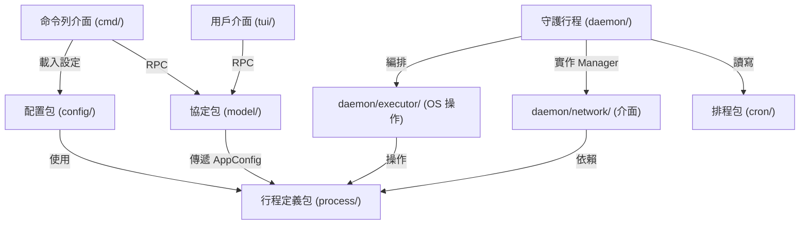

# pm2 — 守護行程解耦 (decouple-daemon) 整合記錄

> **本檔位置**：`docs/specs/2026-07-10-decouple-daemon.md`
> **對應原始計畫**：`plans/architecture-decouple-daemon.md`（已淘汰，見文末「淘汰理由」）
> **狀態**：已完成（2026-07-10）
> **範圍**：`pm2` 守護行程與 CLI/TUI 間的依賴方向、進程狀態封裝、RPC 協定獨立化

## 1. 原始計畫目標

`plans/architecture-decouple-daemon.md` 提出三個解耦目標：

1. **協定與守護行程實作解耦**：把 `daemon/protocol.go` 抽到獨立包，讓 `cmd/` 與 `tui/` 不必導入整個 `daemon/` 軟體包。
2. **進程配置結構統一**：消除 `config.AppConfig` / `daemon.AppStartReq` / `process.DumpEntry` 三重定義。
3. **進程狀態封裝**：把 `Server.processes` Map 與 `s.mu` 鎖封裝成執行緒安全的 `ProcessRegistry`。

## 2. 實作對照表

| 原始計畫目標 | 現況落實位置 | 狀態 | 對應子 spec |
| :--- | :--- | :--- | :--- |
| 1. 抽出 RPC 協定包 | `model/protocol.go`（含 `Request` / `Response` / `AppStartReq` / `SendRequest` / `Dial`） | ✅ 已完成 | `docs/specs/extract-protocol-package.md` |
| 2. 統一進程配置定義 | `process.AppConfig` 為單一真相；`model.AppStartReq` 匿名嵌入 `process.AppConfig`；`process.ProcessInfo` 匿名嵌入 `process.AppConfig`；`process.DumpEntry` 已刪除 | ✅ 已完成（與計畫有些微差異，見 §3） | `docs/specs/unified-config-refactor.md` |
| 3. 封裝 `ProcessRegistry` | `daemon/process_registry.go`（`Add` / `Get` / `Remove` / `UpdateInfo` / `UpdateMetrics` / `UpdateCronStatus` / `Snapshot` / `SnapshotAppConfigs` / `FindByTarget` / `Len`） | ✅ 已完成（位置與計畫不同，見 §3） | `docs/specs/extract-process-registry.md` |

附帶的「解耦副作用」亦已落地：

| 副目標 | 落實位置 | 對應子 spec |
| :--- | :--- | :--- |
| 抽離執行器子包 | `daemon/executor/`（`executor.go` / `builder.go` / `watcher.go` / `metrics.go`） | `docs/specs/extract-process-executor.md` |
| 抽離網路監聽子包 | `daemon/network/`（`listener.go` / `handler.go` / `manager.go`） | `docs/specs/extract-network-layer.md` |
| 排程命名空間衝突與幽靈任務修復 | `daemon/lifecycle.go` / `daemon/cron_key.go`（cron 鍵格式改為 `namespace:name:taskType`） | `docs/specs/daemon-decoupling-phase3.md` |

## 3. 與原計畫的差異 (Deviations)

原計畫是早期「快照式診斷」，實際落地時依賴更好的解法修正了幾個關鍵設計。

### 3.1 `ProcessRegistry` 位置：`process/` → `daemon/`

- **原計畫提議**：`process/registry.go`（與 `process.AppConfig` 同包）
- **實際落實**：`daemon/process_registry.go`
- **原因**：`ProcessRegistry` 持有 `*ManagedProcess`（定義於 `daemon`），若放 `process` 會形成 `process → daemon` 反向依賴，破壞既有 `process` 為底層資料型別包的純度。`daemon` 內聚反而更自然，且 import 方向仍維持 `cmd/tui → model → process`、`cmd/tui → daemon`（僅在需要 RPC 時）。

### 3.2 `Server` 拆分方向：「按檔案」 → 「按 import 邊界」

- **原計畫提議**：`daemon/manager.go` / `daemon/persistence.go` / `daemon/metrics.go` 三個頂層檔
- **實際落實**：`daemon/process_manager.go`（內聚編排）+ `daemon/network/`（介面邊界）+ `daemon/executor/`（OS 操作）+ `daemon/lifecycle.go`（cron / 暫停 / 重啟流程）+ `daemon/launch.go`（啟動編排）
- **原因**：原計畫的拆法只是「把 `server.go` 內容搬進三個檔」，並沒有擋下循環依賴。實際做法是按「能否被誰 import」分層：`executor` 不 import `daemon`、僅 import `model` + `process`；`network` 不 import `daemon`、僅依賴 `network.Manager` 介面；`process_manager` 編排三者。這個分層才能用 Go 編譯器擋下循環依賴。

### 3.3 `AppConfig` 三重定義：其實早就是單一真相

- **原計畫假設**：`config.AppConfig`、`daemon.AppStartReq`、`process.DumpEntry` 各自獨立定義
- **實際現況**：在 `extract-protocol-package` 與 `unified-config-refactor` 完成後，三者皆已收斂為
    - `process.AppConfig`（靜態欄位，single source of truth）
    - `model.AppStartReq` = `process.AppConfig`（匿名嵌入）+ `CronTriggered` 單一差量欄位
    - `process.ProcessInfo` = `process.AppConfig`（匿名嵌入）+ 9 個 runtime 欄位
- **`process.DumpEntry` 已刪除**：`daemon/process_registry.go:148 SnapshotAppConfigs` 直接 dump `[]process.AppConfig`。
- **沒有「`config.AppConfig`」這個型別了**：`config.EcosystemConfig.Apps` 從計畫提案時就是 `[]process.AppConfig`（見 `config/ecosystem.go:17`）。
- **結論**：Phase 1 的目標在源碼層比原計畫預期更早完成；只需在文件層記錄這點。

### 3.4 `StateStore` 介面：YAGNI，**未實作**

- **原計畫提議**：`Save(entries []process.AppConfig) error` / `Load() ([]process.AppConfig, error)` 介面，為將來 SQLite 等介質預留
- **實際決策**：**不引入**
- **原因**：dump.json 讀寫只有 `daemon.ProcessManager.save` 與 `resurrect` 兩個呼叫點，沒有第二個實作需求（沒人提過 SQLite）。等真正有需求時，直接在 `daemon/persistence.go`（或同位置檔案）內替換即可，介面只會增加無用的間接層。
- **未來若需要**：`Save / Load` 改為 `daemon.Persistence` 介面 + `JSONPersistence` 實作；呼叫點僅 `ProcessManager`。

## 4. 最終依賴方向



重點不變數：

- `model/` 絕不 import `daemon/` — 維持 CLI/TUI 對守護行程的輕量依賴
- `daemon/network/` 絕不 import `daemon/`（僅依賴 `network.Manager` 介面）— 擋下 import 循環
- `daemon/executor/` 絕不 import `daemon/`（僅 `model` + `process`）— 擋下「執行器呼叫註冊表」的循環
- `process/` 是純資料型別包，絕不 import 任何業務包

## 5. 驗證

```bash
go build ./...
go test -race -count=1 ./...
```

最近一次（2026-07-10）全綠：

```text
ok  	github.com/bizshuk/pm2/cmd	2.575s
ok  	github.com/bizshuk/pm2/config	1.542s
ok  	github.com/bizshuk/pm2/config/wizard	4.164s
ok  	github.com/bizshuk/pm2/daemon	12.525s
ok  	github.com/bizshuk/pm2/model	2.836s
ok  	github.com/bizshuk/pm2/tui	3.255s
ok  	github.com/bizshuk/pm2/tui/views	1.905s
```

## 6. 相關規格

| Spec | 主題 |
| :--- | :--- |
| `docs/specs/extract-protocol-package.md` | RPC 協定抽到 `model/` |
| `docs/specs/extract-process-registry.md` | 進程 Map 封裝為 `ProcessRegistry` |
| `docs/specs/extract-process-executor.md` | 抽離 OS 級執行器到 `daemon/executor/` |
| `docs/specs/extract-network-layer.md` | 抽離網路監聽到 `daemon/network/` |
| `docs/specs/daemon-decoupling-phase3.md` | Phase 3 收尾（cron 鍵修復 + 信號組發送 + 測試隔離） |
| `docs/specs/unified-config-refactor.md` | `AppConfig` / `AppStartReq` / `ProcessInfo` 三型別收斂 |
| `docs/specs/process-namespace-plan.md` | 進程命名空間的設計與邊界 |

## 7. 淘汰原始計畫

`plans/architecture-decouple-daemon.md`（本檔前身）已被本檔取代。

淘汰理由：

1. 三大目標在源碼層皆已完成（§2）。
2. 計畫中的「`StateStore` 介面」、「`daemon/manager.go` / `daemon/persistence.go` / `daemon/metrics.go` 三檔拆分」屬於過度設計或過時方案；實際落地採取了更好的做法（§3.2、§3.4）。
3. 計畫的「檔案行數」「改動頻率」等量化數據僅供診斷用途，現況下 `server.go` 已被拆分為 `process_manager.go` / `lifecycle.go` / `launch.go` / `helpers.go`，原始熱點不復存在。

如需追溯歷史脈絡，原始計畫可從 git 歷史 `plans/architecture-decouple-daemon.md` 取得（刪除前已 commit 為 archive）。
