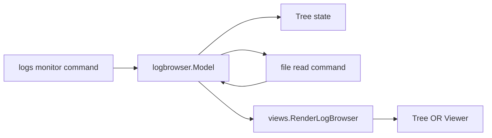
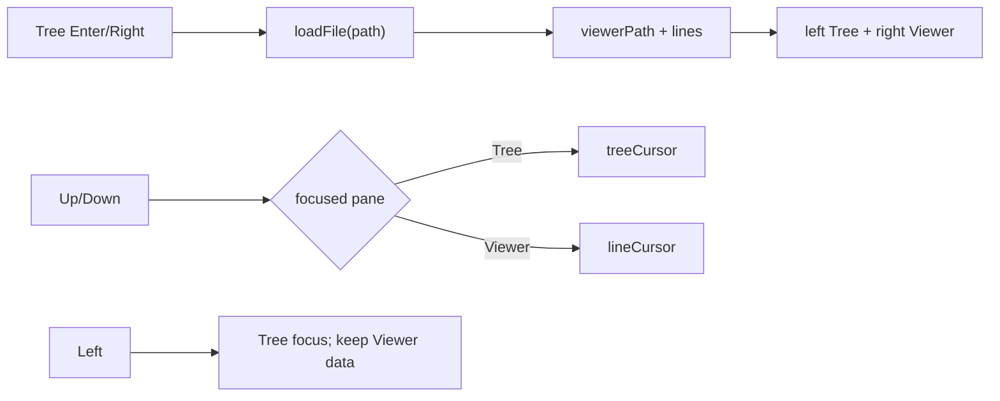

# Log Browser Split Pane Implementation Plan

> **For agentic workers:** REQUIRED SUB-SKILL: Use `executing-plans` to implement this plan task-by-task. Steps use checkbox (`- [ ]`) syntax for tracking.

**Goal:** Make `pm2 logs monitor` / `pm2 logs m` keep the application/log-file Tree on the left and the selected log Viewer on the right, focus the Viewer with Enter, and simplify Tree labels to `[<id>]` plus a `🔶` current-file marker.

**Architecture:** Keep `tui/logbrowser` as the sole interaction-state owner and `tui/views` as the pure rendering owner. `screenTree` and `screenViewer` become left-pane and right-pane focus states rather than mutually exclusive layouts; `viewerPath`, `lines`, and `lineCursor` persist when focus returns to the Tree. Existing file discovery, file reading, deletion, streaming mode, and root `monitor` / `m` dashboard behavior remain unchanged.

**Tech Stack:** Go 1.26.3, Bubble Tea, Lip Gloss, standard `testing`.

**Status:** Completed and verified on 2026-07-30.

## Global Constraints

- Use Traditional Chinese plus English Terminology in user-facing collaboration.
- Keep one file one responsibility and one package/folder one domain.
- Preserve all existing uncommitted log-streaming and Tree Explorer changes.
- Do not modify `go.mod`, `go.sum`, `cmd/monitor.go`, or the public `logfile.Follow` API.
- `pm2 logs [target]` remains continuous streaming mode.
- `pm2 monitor` and root alias `pm2 m` remain the existing process dashboard.
- `pm2 logs monitor [target]` and `pm2 logs m [target]` remain the Interactive Log Explorer paths.
- Keep Left/Right Tree in/out navigation and Tree-file-only confirmed deletion.
- Do not commit, push, or open a pull request unless explicitly requested.

## 1. Goal and Scope

The feature serves terminal users who need application/file navigation and log
inspection visible at the same time.

Out of scope:

- Live-following the selected file inside the Viewer.
- Changing daemon RPCs, managed-log rotation, or CLI streaming output.
- Changing the root process dashboard or non-interactive process table.

## 2. Current Architecture



The current `screen` value selects one full-width body. Opening a file clears
the Tree from the screen, and returning to the Tree clears the loaded log.

## 3. Placement and Boundaries

- `tui/logbrowser/keys.go`: focus transitions and key ownership.
- `tui/logbrowser/model.go`: persistent selected-log state passed to the view.
- `tui/logbrowser/tree.go`: application and file row labels only.
- `tui/views/log_browser.go`: split-pane geometry and visual focus only.
- Tests stay beside their owner: interaction in `model_test.go`, Tree labels in
  `tree_test.go`, and layout in `log_browser_test.go`.

## 4. Interfaces and Data Flow



The rendering contract adds `ViewerPath string`; the existing `Viewer bool`
means the right pane owns keyboard focus.

## 5. Clarity and Scalability Check

- State and rendering remain separated; no filesystem I/O enters `tui/views`.
- One file read command still produces one `fileMsg`.
- A future live-follow command can replace `loadFile` without changing pane
  rendering.
- No new interface or dependency is introduced.

## 6. Incremental Implementation

### Task 1: Viewer Focus State

**Files:**

- Modify: `tui/logbrowser/model_test.go`
- Modify: `tui/logbrowser/keys.go`
- Modify: `tui/logbrowser/model.go`

**Interfaces:**

- Enter on a selected Tree file produces `loadFile(path)` and focuses Viewer.
- Up/Down changes `treeCursor` while Tree is focused and `lineCursor` while
  Viewer is focused.
- Left from Viewer returns Tree focus without clearing `viewerPath` or `lines`.

- [x] **Step 1: Write failing Enter/focus persistence tests**

Add tests that assert Enter on a file changes `screen` to `screenViewer`,
returns a file-load command, and that Left restores `screenTree` while keeping
the loaded path and lines. Assert a pending file result can populate the right
pane after focus has returned left.

- [x] **Step 2: Run the state tests and verify RED**

```bash
go test ./tui/logbrowser -run 'TestTreeEnter|TestViewerLeft|TestViewerNavigation|TestViewerPage' -count=1
```

Expected: FAIL because Enter is ignored and Left clears Viewer state.

- [x] **Step 3: Implement the minimal focus transitions**

Route Enter on a Tree file through the same focused-file loader as Right.
Accept a matching `fileMsg` independent of current focus. Left from Viewer
changes focus only, and page size uses the visible right-pane body height.

- [x] **Step 4: Run focused state tests and verify GREEN**

Run the Task 1 command again. Expected: PASS.

### Task 2: Split Renderer and Tree Labels

**Files:**

- Create: `tui/logbrowser/tree_test.go`
- Modify: `tui/views/log_browser_test.go`
- Modify: `tui/views/log_browser.go`
- Modify: `tui/logbrowser/tree.go`
- Modify: `tui/logbrowser/model.go`

**Interfaces:**

```go
type LogBrowserContext struct {
	ViewerPath string
	Viewer     bool // true when the right pane has keyboard focus
}
```

- Application row format begins with `[<id>]` and never renders the literal
  label `id`.
- Current file rows render `🔶`; archive rows retain the `archive` label.

- [x] **Step 1: Write failing split-pane and label tests**

Assert one render contains both a Tree item and a log line, with distinct
`TREE` and `LOG` headings. Assert `applicationTreeItem(0)` starts with `[7]`
and contains no `id 7`; assert a current file row contains `🔶` and not
`current`.

- [x] **Step 2: Run renderer/label tests and verify RED**

```bash
go test ./tui/logbrowser ./tui/views -run 'TestApplicationTreeItem|TestCurrentFileTreeItem|TestRenderLogBrowser' -count=1
```

Expected: FAIL because the renderer still chooses Tree or Viewer, and labels
still contain `id 7` / `current`.

- [x] **Step 3: Implement split-pane rendering and labels**

Render a 40/60 left/right body separated by `│`, keep both panes visible in
Tree and Viewer focus, show `Select a log file and press Enter` before a file
is active, and expose focused-pane key hints. Format application/file Tree
items with `[<id>]` and `🔶`.

- [x] **Step 4: Run renderer/label tests and verify GREEN**

Run the Task 2 command again. Expected: PASS.

### Task 3: Canonical Documentation and Verification

**Files:**

- Modify: `README.md`
- Modify: `CLAUDE.md`
- Modify: `README.todo`
- Modify: `docs/usage.md`
- Modify: `skills/pm2/SKILL.md`
- Move after verification: `plans/2026-07-30-log-browser-split-pane.md` to
  `docs/specs/2026-07-30-log-browser-split-pane.md`

- [x] **Step 1: Establish the PM2 skill RED baseline**

```bash
rg -n 'split|Enter|🔶|\\[<id>\\]' skills/pm2/SKILL.md
```

Expected: no split-pane, Enter-focus, current-marker, or ID-prefix contract.

- [x] **Step 2: Update canonical documentation**

Document the persistent left Tree/right Viewer layout, Enter focus, focus-aware
Up/Down, Left return, `🔶` current marker, and `[<id>]` application prefix.

- [x] **Step 3: Run complete verification**

```bash
gofmt -w tui/logbrowser/model.go tui/logbrowser/keys.go tui/logbrowser/tree.go tui/logbrowser/model_test.go tui/logbrowser/tree_test.go tui/views/log_browser.go tui/views/log_browser_test.go
go test ./... -count=1
go test -race ./... -count=1
go build ./...
go vet ./...
uv run --with pyyaml python /Users/shuk/.codex/skills/.system/skill-creator/scripts/quick_validate.py skills/pm2
git diff --check
```

Expected: every command exits 0 and the skill validator prints
`Skill is valid!`.

- [x] **Step 4: Archive the plan and audit scope**

Mark every step complete, set status to completed, move this plan into
`docs/specs/`, then verify `cmd/monitor.go`, `go.mod`, and `go.sum` have no
diff.
