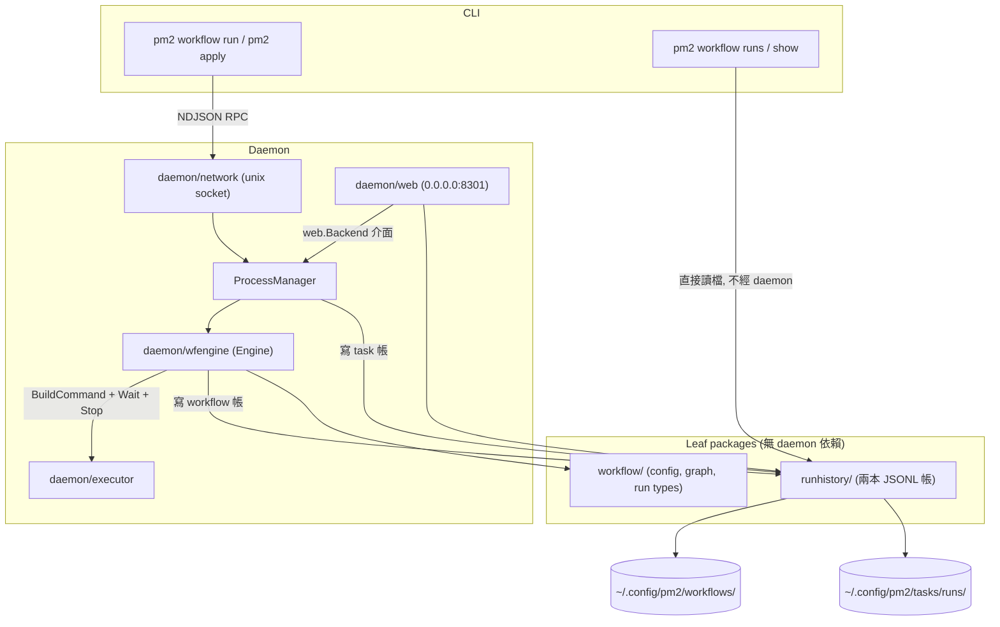

# 架構計畫 — pm2-workflow

- 日期：2026-08-28
- 狀態：`Completed`（2026-08-28 實作並驗證完畢）
- 功能名稱：`pm2-workflow`

> `實作偏離本計畫之處`（以實作為準）：
>
> 1. 引擎目錄採 `daemon/wfengine`（package `wfengine`）而非 `daemon/workflow`
>    ——後者會讓 package `workflow` import 同名套件，每個檔案都得取別名。
>    沿用 `sysmon/gpuagent` 的作法。
> 2. 兩本歷史帳本由單一頂層套件 `runhistory` 擁有，`workflow` 不再自帶 store。
>    計畫中的 append-through 折疊改為`一筆完成的 run 一行`：JSONL 無法更新，
>    在開始時就寫一行等於要求每次讀取都做折疊。代價已寫進文件——daemon 在
>    run 進行中掛掉，該 run 不會被索引（stage log 仍在）。
> 3. `Run` 的 context `在 claim 時`建立而非在 `execute` 內。實作時發現：run
>    一取得單飛名額就能被 `StopRun` 定址，而當時 cancel 還是 no-op，於是
>    `StopRun` 靜默無作用並空等到 stage 自然結束。回歸測試
>    `TestStopRunCancelsARunThatJustStarted`。
> 4. 曝光面經兩次修訂後定案為 `0.0.0.0:8502`：`號碼取 internal 段
>    （8500-8599）因為它是管理介面`，`綁定放 LAN-wide 因為要能從手機或
>    另一台機器打開`，且`不架 tunnel、不對外網曝光`。這同時偏離 port 規則的
>    兩條（「LAN 可達→public 段」與「internal→綁 127.0.0.1」），偏離本身
>    即是決策，已寫入 `daemon/web/doc.go` 與 CLAUDE.md。
>
>    連帶結論：`綁定位址不是安全邊界`。LAN 上任何人的瀏覽器開到惡意頁面，
>    該頁就能對這個埠發跨站 POST——攻擊者讀不到回應，但 workflow 真的會跑。
>    因此保留一道`同源檢查`：帶 `Origin` 且與 `Host` 不符者一律 403，覆蓋
>    `所有路由`而不只 webhook（唯讀端點會吐出 task 表與設定）。它對真實
>    client 完全透明——curl / CI / script 不送 `Origin`。原計畫的 `Host`
>    白名單與 loopback `RemoteAddr` 檢查`不適用`於 LAN 綁定，已捨棄。
>    `Content-Type` 與每 workflow 速率上限保留。
>
> 5. Port 由 `8301` 改為 `8502`；`8301` 從未實際上線，登記表中已撤回。

## Context

pm2 目前只管`單一任務 (task)`：一份 `AppConfig` 對應一個受監督的 process，彼此之間沒有
順序關係。實務上有一整類需求它答不出來——「先抓資料，成功了再轉檔，最後才載入」。今天只能
用三個 cron task 加上錯開的時間去逼近，但那是猜測不是保證：上游跑久一點，下游就吃到半份
資料，而且沒有任何地方看得出「昨晚那條線到底哪一段斷了」。

本計畫把 pm2 從 task management 擴充成 workflow management：新增一層`線性 (linear)`編排，
一個 workflow 由多個 stage 組成，前一段成功才跑下一段。同時補上 pm2 至今完全沒有的兩件事
——`執行歷史 (run history)`與`網頁介面 (web UI)`：

- process 退出目前只拿得到一個 `error`，`全 repo 沒有任何地方取過 exit code`
  （`ExitCode` / `ExitError` / `ProcessState` 三個字串零命中，已實測）。cron task 的
  `LastCronStatus = "ok"` 其實只代表「子行程成功 spawn」——這是
  `plans/2026-07-23-pm2-event-stream.md` §2.2 已記下的語意缺口。沒有 exit code 就沒有
  workflow，也沒有可信的歷史。
- 唯一的歷史是 log 檔本身；`LastCronAt` / `LastCronStatus` 只存在記憶體，daemon 一重啟
  就消失。

預期成果：`ecosystem.config.js` 多一個 `workflows:` 區塊；`pm2 daemon start` 同時開一個綁在
`0.0.0.0:8301` 的網頁介面，一頁看得到即時 task、workflow 執行歷史、以及`原本 task 的觸發
歷史`；外部系統可以 POST 一個 webhook 觸發 workflow；workflow 之間可以互相呼叫且不會無限迴圈。

## 決策前提 (Confirmed Decisions)

由使用者直接拍板，不再重新討論：

| 項目 | 決定 |
| --- | --- |
| 設定來源 | 同一份 `ecosystem.config.js`，新增 `workflows:` 頂層鍵 |
| Stage 種類 | `script`（inline）、`task`（引用已註冊 task）、`workflow`（巢狀）三選一 |
| 執行語意 | workflow 是 wrapper，每個 stage `只跑一次`到成功；不套用 auto-restart |
| 狀態 | stateless——引擎不保存可續跑的狀態機，daemon 重啟`不接續`中斷的 run |
| Web server | `內建於 daemon`，隨 daemon 啟動 |
| 曝光面 | `public`：綁 `0.0.0.0:8301`（public 段 `8300`–`8399` 最小未使用號碼） |
| 認證 | `無`。已於規劃階段提出風險並經使用者再次確認，見下節 |
| History | append-only `JSONL` 檔案，不引入 SQLite |

`Port 8301` 取號依據：public 段 `8300`–`8399`；登記表已佔 `8300` / `8310` / `8312`–`8316` /
`8319` / `8320`，實際監聽另有 `8317`，聯集後最小未使用號碼為 `8301`（已實測）。

## ⚠️ 兩件動工前必須知道的事

### 1. 這是一個刻意不設防的公開端點

`已提出、經使用者再次確認、依其決定執行`。記在這裡是為了讓未來讀這份文件的人知道它是選擇
而不是疏忽：

- `port-usage` Hard Rule 8 寫的是「沒有認證的介面`永遠` internal，沒有例外」。本功能`明知並
  刻意`覆寫這條規則。
- 具體後果：`任何連得到這台機器 8301 埠的人`都可以 `POST /api/webhooks/<name>` 觸發 workflow，
  而 workflow stage 執行的是 shell 指令——等同於在這台機器上執行程式碼；同時也讀得到完整的
  task 清單、設定與執行歷史。
- 因此`啟動時必須印一則 slog.Warn`，明白說出「web server 正在所有介面上監聽且未啟用認證」，
  並把位址一併印進 `pm2 daemon status`。不是勸阻，是讓運維看得見現況。
- 對應地，`--web-host` 保留為旗標（預設 `0.0.0.0`），讓需要收斂的機器可以改綁
  `127.0.0.1` 而不必改程式。

`本計畫已納入的兩道非認證防線`（對真實 client 完全透明，且與「不做認證」不衝突）：

| 檢查 | 不符時 | 理由 |
| --- | --- | --- |
| `Content-Type: application/json` | 415 | 解析正確性；順帶讓瀏覽器的跨站 `POST` 先走 CORS preflight，而我們不回 `Access-Control-Allow-Origin` |
| 同一 workflow 每分鐘 &gt; 10 次觸發 | 429 | 防的是`意外`不是攻擊：一個壞掉的重試迴圈會 fork bomb 這台機器 |

`HTTP 面沒有任何 task 變更端點`。不做 `POST /api/tasks/{name}/restart`——webhook 承擔已知的
風險是因為使用者要它，`不主動擴大`到未被要求的功能上。

### 2. 直接序列化 ProcessInfo 會外洩整個 shell 環境

`這一條不是政策問題, 是缺陷, 沒有選擇餘地`。

`process.ProcessInfo` 匿名嵌入 `process.AppConfig`，後者帶著 `Env map[string]string` 與
`BaseEnv []string`——`BaseEnv` 是 CLI 送進來的 `os.Environ()` 快照，也就是`使用者互動式 shell
的整份環境變數`（`cmd/task/start.go:131` 塞進去的）。`json.Marshal(info)` 等於把 `.bashrc` 裡
每一個 export 過的 token 公開出去。在 loopback 上這已經夠糟；`綁 0.0.0.0 之後是直接對 LAN 廣播`。

`對策`：`daemon/web` 一律投影成自己的 view struct，欄位`逐一列舉`，`永遠不含` `Env` 與
`BaseEnv`；用一個測試釘死（塞入 `SECRET` / `TOKEN=` 後斷言 response bytes 不含它們）。
event-stream 計畫 §1.4 已為事件面立過同一條規則。

### 與 event-stream 計畫的關係

`plans/2026-07-23-pm2-event-stream.md`（Draft，未實作）§1.4 把「PM2 內建 public HTTP、webhook
registry」列為 out of scope。`本計畫在 HTTP 這一項上明確推翻了那條宣告`，必須在該檔加註而不是
假裝相容。可保留的部分：`沒有 registry`——workflow 定義就是註冊本身，跟 cron 運算式一樣寫在
ecosystem 檔裡；`沒有 OAuth / TLS / credential store`；而該計畫 §1.2 要求的「lifecycle / cron
event 先寫入 durable JSONL journal」`正是本計畫實作的底層`。兩者仍是不同平面：event socket 是
給程式訂閱的`推送`面，`:8301` 是給人用瀏覽器看的`拉取`面。

## 設定模型 (Configuration Model)

```js
module.exports = {
    apps: [ /* 既有內容完全不變 */ ],

    workflows: [
        {
            name: "nightly",         // 必填, (category, name) 唯一
            category: "ci",          // 預設 "default"
            cron: "0 2 * * *",       // 選填
            cwd: "./repo",           // 預設為設定檔所在目錄
            env: { CI: "1" },        // workflow 層 env, 被 stage env 覆蓋
            timeout: "30m",          // 選填, 各 stage 的預設上限
            stages: [
                { name: "pull", script: "./scripts/pull.sh", args: ["--ff-only"] },
                { name: "test", task: "unit-tests" },
                { name: "ship", workflow: "deploy" },
            ],
        },
    ],
};
```

`載入路徑`：`config/ecosystem.go:16` 的 `EcosystemConfig` 加 `Workflows` 欄位，`.js`（goja）與
`.json` 兩條 loader 最終都走同一個 `json.Unmarshal`，`反序列化免費`。但 post-processing 不是
——那段迴圈目前在 `:46-50` 與 `:85-89` `重複了兩次`。抽成
`func (c *EcosystemConfig) postProcess(path string) error`，兩條 loader 各呼叫一次，內含
workflow 的 `Normalize` / `Validate` / 靜態環偵測。`Load` 因此多出一條錯誤路徑——這是對的：
壞掉的 `workflows:` 必須在 `pm2 apply` 解析時失敗，不是等到執行才爆。

`嚴格驗證`：`script` / `task` / `workflow` 恰好出現其一，否則報錯且`列出實際找到哪幾個鍵`；
`args` / `env` / `cwd` 出現在 `task` / `workflow` stage 上`一律報錯`而非靜默忽略——寫了 `env`
的人是預期它生效的。

## 架構位置與邊界 (Placement & Boundaries)



`Import 方向`（新增條目，寫進 CLAUDE.md）：

- `runhistory` → `stdlib only`。與 `logfile` 同層級的頂層套件，不是 `daemon/runhistory`
  ——它有三個互不相干的消費者（daemon 寫、`daemon/web` 讀、`cmd/workflow` 讀），放在
  `daemon/` 底下會逼 `cmd/` 去 import `daemon`。
- `workflow` → `process` + stdlib。leaf domain package，比照 `sysmon` / `logfile`。
- `config` → `workflow`（新邊，無環）。`model` → `workflow`（新邊，無環）。
- `daemon/wfengine` → `executor`、`logfile`、`workflow`、`runhistory`、`cron`、`process`。
  `絕不 import daemon`，只拿一個窄介面 `TaskLookup`。
- `daemon/web` → `process`、`runhistory` + stdlib。`絕不 import daemon`，`也不 import
  workflow`——它宣告自己的 `Backend` 介面與 view 型別，好讓它能在 workflow 套件還在寫的時候
  就獨立編譯與 `httptest` 測試。轉換由 daemon 側的 adapter 做。
- `daemon` → 以上全部。`daemon.Server` 同時實作 `network.Manager` 與 `web.Backend`。

`目錄命名`：引擎放 `daemon/wfengine`（package `wfengine`）而`不是` `daemon/workflow`——後者會
讓 package `workflow` import package `workflow`，每個檔案都得取別名。這是 `sysmon/gpuagent`
已用過的作法。

## 核心設計 (Key Design)

### 1. Stage 走一次性路徑, 不進 registry

Stage 執行`刻意繞開` `executor.Start` / `Watch` 這條受監督路徑，改用 `executor.BuildCommand`
（已匯出、無依賴）自行 `Start` + `Wait`，並用 `executor.Stop` 終止（它已經做了負 pid 的
process-group SIGTERM 加 5 秒 SIGKILL 升級，`不要重寫`）。

| | 走 `executor.Start` + registry | 自己的一次性路徑 |
| --- | --- | --- |
| exit code | 丟棄 | `*exec.ExitError` 取得 |
| 失敗處理 | auto-restart 最多 15 次, 每次隔 30 秒 | 終局, stage 失敗 |
| `pm2 list` 可見 | 是 | 否 |
| registry 鍵 | `衝突` | 不佔用 |

`決定性的理由是最後一項, 不是重啟策略`。`task:` stage 執行的 AppConfig，它的鍵就是
`namespace:name`——`那個已註冊 task 的鍵`。走 `StartApp` 會命中 `LookupExistingForLaunch`、
觸發 `stopProcess`，於是 workflow `殺掉並取代了使用者正在跑的常駐服務`，然後把 registry 指向
一個馬上會消失的短命子行程。stage 是一次`執行`，不是一次`註冊`；把它變成註冊會毀掉它本來要
呼叫的那個東西的身分。

`代價`：stage 執行中不出現在 `pm2 list`，也不能用 `pm2 logs <name>` 追。以
`pm2 workflow list`（顯示進行中的 run）與 `pm2 workflow show`（印出 run log 路徑，`tail -f`
直接讀得到）換回來。接受這個損失。

`task:` stage 的欄位抑制（寫測試釘住）：只取 `Script` / `Args` / `Env` / `CWD` / `BaseEnv`，
`忽略` `Instances` / `Cron` / `CronRestart` / `Watch` / `MaxRestarts` / `Paused` / `Optional`
——後面這些描述的是「如何被長期監督」，與一次性執行無關。

兩個必須寫進文件的後果：用的是`那個 task 自己的` `BaseEnv`（環境是 task 的屬性）；若該 task
此刻正以服務形式在跑，stage 會啟動`第二個` process 而`不拒絕`——拒絕會讓 workflow 在任何常駐
task 旁邊都變脆弱，而設定檔已表達了意圖。`optional: true` 搭配 `task:` stage 正是預期用法。

`task: "x"` 解析順序：含 `:` 走精確鍵比對；否則精確比對 `default:x`；否則跨 namespace 唯一
名稱比對；再否則報 `task "x" is ambiguous: default:x, prod:x`。`絕不靜默挑一個`。

### 2. Exit code 補齊 (硬切, 無相容層)

在 `daemon/executor/exit.go` 取值，`不是`在 `daemon/lifecycle.go`——`syscall.WaitStatus` 的知識
該留在 CLAUDE.md 指定為「OS-level process ops」擁有者的那個套件裡，而且資訊本來就在那裡
（`executor.go:210` 算出 `waitErr` 後把 `cmd.ProcessState` 整個丟掉）。

```go
type ExitInfo struct {
    Err      error  // 原封不動的 cmd.Wait() error
    Code     int    // 未知時 -1
    Signal   string // 非信號終止時為 ""
    Signaled bool
    Known    bool   // 根本沒有子行程可等時為 false
}
func ExitInfoFromWait(err error) ExitInfo
```

對照表（每一列都要有 table test）：`nil` → `{0, Known}`；`*exec.ExitError` 且
`Sys()` 以 comma-ok 斷言成 `syscall.WaitStatus` 且 `Signaled()` → `{128+signal, 名稱, Signaled}`
——`這個分支必須排在前面`，因為被信號終止時 `ExitError.ExitCode()` 回 -1；其他 `*exec.ExitError`
→ `{ee.ExitCode()}`；其餘 → `{Code: -1, Known: false}`。

`Watch` 的 callback 改為 `onExit func(ExitInfo)`。全 repo 只有 `daemon/launch.go:64`、`:123`
與 executor 測試三個呼叫點。`onProcessExit` 的 `waitErr != nil` 判斷變成 `exit.Err != nil`，
`行為完全相同`。`這一步自己一個 commit`，方便未來 bisect。

`成功只有 Code == 0`。被信號終止是失敗且記下 signal，好讓 timeout 殺掉與腳本自己
`exit 143` 區分得開。落檔時 `ExitCode` 是 `*int`：把「未知」寫成 `0` 會讓 UI 把每個被 SIGKILL
的工作報成成功。

`觸發來源歸因`：`onProcessExit` 不知道這次為什麼啟動。在 launch 時就蓋章——`ManagedProcess`
加兩個非匯出欄位 `runID` / `trigger`，在 `launch.go:117` 安裝 `mp` 的那把寫鎖底下設定，在
`onProcessExit` 的 `UpdateInfo` 閉包裡讀回（`不做裸讀`，遵守 CLAUDE.md 的「讀取亦同」規則）。
`不要`在 `model.AppStartReq` 加 `Trigger` 欄位——觸發原因是 daemon 內部知識，CLI 不該偽造得了。
改法是 `launchProcessWith(name, req, trigger)` 加一個 `"manual"` 薄包裝，`restartTargets` 多收一個
`trigger` 參數，三個呼叫端分別傳 `"restart"` / `"watch"` / `"cron_restart"`。五處小改，不動 wire。

`連帶修正 cron 語意`：`triggerCron` 在 fire 時改寫 `"running"`（已啟動、結果未知）而非 `"ok"`；
結果由退出路徑寫入，且`只在` `mp.trigger` 是 `cron` / `cron_restart` 時才寫，免得一般 process
退出去覆蓋一個不屬於它的欄位。新增 `ProcessRegistry.UpdateCronOutcome(key, status)`——`只寫
LastCronStatus`，因為既有的 `UpdateCronStatus` 會一併覆蓋 `LastCronAt`，那會把 fire 時間蓋掉。
`tui/views/format.go` 的 cron 狀態渲染器補一個 `running` case。

### 3. 無限迴圈防護 (三層, 其中一層才是真的防線)

1. `靜態`：`workflow.CheckAcyclic` 對 `stage.workflow` 邊做迭代式 DFS（white/grey/black 著色），
   發現環就整批拒絕並印出路徑 `workflow cycle: ci:a -> ci:b -> ci:a`。走訪`依鍵排序`，讓錯誤
   訊息在多次執行間穩定——map 順序決定的錯誤訊息等於一個隨時會飄的測試。
   `兩個呼叫點`：載入時（單一檔案，快速回饋）與 daemon 註冊時（`existing ∪ incoming`，
   `這個才有約束力`）。CLI 只看得到一個檔案，`stage.workflow` 可能指向另一份 ecosystem 檔註冊
   的 workflow。
2. `執行期祖先 + 深度上限`：每個 run 帶著祖先鏈，巢狀呼叫到鏈上已有的鍵就以
   `workflow cycle: a -> b -> a` 失敗。`MaxNestingDepth = 8`——靜態檢查已擋掉`宣告的`環，
   超過 8 表示一條病態但合法的鏈；8 比任何真實組合都深，且界定了單次觸發能產生的 goroutine、
   log 檔與 fd 數量。
3. `單飛 (single-flight)`：同一個 workflow 同時只允許一個 run。`這一層才是真正的防線`——
   stage 裡的 shell script 若自己跑 `pm2 workflow run A` 或 `curl` webhook，那是一條全新的請求、
   祖先鏈是空的，第 2 層看不見它。`這件事必須寫進 doc comment`，否則未來有人會把單飛當成
   「只是重疊保護」而順手簡化掉。`在一個公開且無認證的 webhook 之後, 這一層同時也是唯一擋住
   遠端無限觸發的東西`。

單飛的回應`依觸發來源分流`，刻意不一致：

- `cron 觸發`：視為正常，記一筆 `skipped` 後返回。與 `triggerCron` 的重疊守衛
  （`daemon/lifecycle.go:112`）同一規則同一理由——跑得比週期久的 workflow 應該`跑晚`，
  而不是被砍掉從第一段重來。
- `手動 / webhook / 巢狀`：回錯誤並附上進行中的 run ID（HTTP `409`）。有人在等回應，靜默丟棄
  是說謊；回 202 帶著別人的 run ID 更是說謊。
- `不做佇列`。佇列需要持久化（daemon 會死）、深度上限、以及「十個疊起來的 nightly-ETL 是什麼
  意思」的政策。記憶體佇列會在重啟時靜默丟工作，比誠實的 409 更糟。那是另一個功能。
- 逃生口：workflow 定義上一個 `concurrency` 欄位（預設 `deny`）。引擎匯出
  `ErrRunInProgress`，`這是 daemon adapter 唯一需要的 workflow 套件符號`。

另加全域上限 `MaxConcurrentRuns = 32`，防的是單飛擋不住的扇出。

### 4. History: 一筆完成的 run 一行

`不記錄 start / cron_fire / restart 的獨立事件`。帳本只放`已完成的 run`，外加不會產生 run 的
落空觸發（`cron_skip`、`launch_fail`）。不變量是：`帳本記完成的, daemon 報進行中的`。這讓每
分鐘 cron 的量減半、讓讀取端不必做 join，也讓兩本帳的 schema 對稱。

代價（要寫進文件）：daemon 在 run 進行中掛掉，那個 run`不會`被索引到。stage log 檔還在磁碟上，
丟的只是索引那一行。這也正是 stateless 的落實：不接續，也不在磁碟上留一個永遠停在 `running`
的謊。

`兩本帳, 同一個套件 runhistory`：

```
~/.config/pm2/tasks/runs/YYYY-MM-DD.jsonl        task 觸發歷史
~/.config/pm2/workflows/runs/YYYY-MM-DD.jsonl    workflow run 紀錄
~/.config/pm2/workflows/logs/<wf>.<runID>.<stage>.log
```

檔名規則比照 `logfile` 的紀律：日檔`只認` `^\d{4}-\d{2}-\d{2}\.jsonl$`，`runs/` 底下別的東西
一律不讀。

`寫入`：`O_CREATE|O_WRONLY|O_APPEND`，`檔案 0600 目錄 0700`（`不是 dump.json 的 0644`——沒有
別的 process 需要讀，而 workflow 帳存著呼叫端送來的 webhook `params`，機密最可能出現在那裡）。
一把 mutex 包住 marshal+write，每本帳快取一個 `*os.File`、跨日時關掉重開。跨行程並行由既有的
socket singleton 守衛（`daemon/network/listener.go:41`）阻止，`不加 flock`。
`一筆紀錄一次 Write 且必須小於 4 KiB`；超過就丟掉 `Params` 與逐段細節並設 `Truncated: true`
——搭配讀取端「跳過壞掉的行」的規則，讓並行讀取對撕裂的尾巴免疫。

`不 fsync`。每分鐘 cron 就等於永遠每分鐘刷一次磁碟；這是可觀測性產物不是交易。`O_APPEND` +
`write(2)` 已經扛得住`行程`崩潰，那才是常見情況。這是 `autoSave` 的同一筆交易套在更便宜的東西上。

`錯誤永不上拋`。每個呼叫端記 log 後丟掉，就是 `autoSave` 的合約；log 那行加每分鐘一次的速率
上限，免得磁碟滿的時候 `daemon.log` 變成帳本的副本。

`保留`：一天一檔本身就是輪替，依`紀錄的`時間戳而非開檔時間，所以跨午夜的 daemon 會在下一筆
紀錄時滾檔。`Prune(keepDays)` 刪掉超過 30 天的日檔，只在兩個地方觸發——`Server.Listen` 一次，
以及 `Append` 開出新日檔時——`一天一次, 不需要 ticker 也不需要自己的 goroutine`。
一分鐘一次的 cron task 約 1440 筆/日、200 KB/日、30 天上限 6 MB。

`Run ID` 格式 `20260828T030012-a1b2c3`：`日期前綴是有作用的`，`WorkflowRun(runID)` 解析它後
`只開一個日檔`而不是掃整棵樹。這件事要寫進 doc comment，免得被人「整理」成 UUID。

`查詢`：日檔按字典序即時間序，由新到舊走訪，整檔讀入（上限 32 MiB，超過只讀尾巴），倒著掃、
過濾、湊滿 `Limit` 就停。壞掉的行跳過並計數，`永不致命`——截斷的最後一行就是斷電的正常長相。

### 5. 引擎持有自己的 cron.Scheduler

`不共用 ProcessManager 的 scheduler`。`stopProcess`（`daemon/lifecycle.go:65`）無條件呼叫
`scheduler.Remove(key)`，而鍵是扁平字串——namespace 叫 `wf` 的 task 會遮蔽 workflow 的 entry，
一次 `pm2 task stop` 就靜默解除了 workflow 的排程。`cron.New()` 幾乎免費，給引擎自己一份。

### 6. Web server: 對外監聽, 綁定失敗不致命

- `web.New(b Backend, h HistoryReader, host string, port int)`，預設 `0.0.0.0` / `8301`。
  `--web-host` / `--web-port` 可覆寫；`--web-port 0` 關閉整個 server。
- `啟動時印 slog.Warn`：位址、埠、以及「未啟用認證」。位址同時寫進
  `process.DaemonInfo.WebAddr`，讓 `pm2 daemon status` 印得出來。
- `綁定失敗只記 Error 並降級, 絕不讓 daemon 啟動失敗`。三個理由都出自本 repo：socket 才是
  daemon 的身分而它已經拿到了；launchd 的 `KeepAlive={SuccessfulExit:false}` 會對一個它永遠
  拿不到的埠無限重試（CLAUDE.md 為 singleton exit code 記載過的同一個失敗模式）；先例是
  `NewFileWatcher` 失敗不讓 launch 失敗、`installLog` 失敗不讓 daemon 停。
- `但拒絕是一則訊息, 不是沉默`（taskmanager `d` 鍵的規則）：`slog.Error` 加上
  `DaemonInfo.WebError`，讓 `pm2 daemon status` 印 `web: unavailable (port 8301 in use)`。
- `不做 graceful shutdown`。`CmdKill` 的 `os.Exit(0)` 讓 listener 隨行程消滅。這是安全的：
  webhook 在 run 結束`之前`就回 202，斷掉的連線不會弄丟帳本本來會記的東西（run 本來就跟著
  daemon 一起死）；其他請求由 UI 的輪詢重試。`不要`把 shutdown 搬進 `KillAll()`——
  `network/manager.go:56` 明文警告過未來的貢獻者。`順帶記下一個既有缺口（本計畫不處理）`：
  今天根本沒有 SIGTERM handler，launchd / systemd 的停止路徑早已跳過所有清理。
- HTTP server 參數全部 stdlib、全部零成本：`ReadHeaderTimeout 5s`、`ReadTimeout 15s`、
  `WriteTimeout 30s`、`IdleTimeout 60s`、`MaxHeaderBytes 1<<16`。`對外監聽讓這些逾時從
  「衛生習慣」升級成「必要」`——沒有它們，一個半開連線就能一直佔著記憶體。

`用 stdlib net/http + ServeMux + //go:embed, 不引入任何新依賴`。`gosdk/server` 會拖進 gin 與
viper nested key（正是那個靜默忽略的陷阱）；`net/http` 早已被連結進 binary，體積增量約為零；
整個介面只有 10 條路由，Go 1.22 的 method + wildcard pattern（`GET /{$}` 精確根路徑）就夠了。

## 檔案佈局 (File Layout)

### 新增套件

```tree
runhistory/                    頂層 leaf, 只 import stdlib
├── doc.go            套件邊界 + 「帳本只記已完成的 run」不變量
├── record.go         TaskRecord / WorkflowRecord / StageRecord + 事件與狀態常數
├── runid.go          NewRunID — 日期前綴是查詢索引, 不是裝飾
├── store.go          Store / AppendTask / AppendWorkflow / 跨日滾檔
├── query.go          Query / RecentTasks / RecentWorkflows / WorkflowRun
├── retention.go      Prune(keepDays)
├── files.go          日檔探索 + 反向掃描
└── *_test.go

workflow/                      leaf domain package
├── doc.go            套件邊界 + 兩條不變量 (stage 只跑一次; 引擎無可續跑狀態)
├── config.go         Config / Stage / StageKind + Normalize + Validate + Key/ParseKey
├── graph.go          CheckAcyclic (排序走訪) + DanglingRefs + MaxNestingDepth
├── run.go            Run / StageRun / Status 執行期型別 (落檔型別在 runhistory)
├── paths.go          Dir / DumpPath / LogsDir / RunLogPath — 全部經 NormalizeName
└── *_test.go

daemon/wfengine/               package wfengine, 絕不 import daemon
├── doc.go            邊界; 明寫「單飛是環防護的真正防線, 不可簡化」
├── engine.go         Engine + TaskLookup + Load/Register/Delete/List/Run/StopRun/Close
│                     + ErrRunInProgress
├── execute.go        run 迴圈 + 祖先/深度守衛 + panic 收容 + inflight 生命週期
├── stage.go          一次性 spawn + Wait + ExitInfo + timeout/cancel (走 executor.Stop)
├── cron.go           以自有 scheduler 布署 workflow 排程
└── *_test.go

daemon/web/                    絕不 import daemon, 也不 import workflow
├── doc.go            邊界 + 公開曝光面的明文決策 + 與 event-stream 計畫的分工
├── backend.go        Backend / HistoryReader 介面 + 自有 view 型別 + DefaultHost/DefaultPort
├── server.go         Server / New / Bind / Serve / Addr / Close
├── routes.go         唯一的 Handler() http.Handler — 完整路由表
├── guard.go          content-type 檢查 + 每 workflow 速率上限
├── view.go           taskView 投影 — 剝除機密的邊界
├── api_tasks.go      /api/status, /api/tasks, /api/tasks/runs
├── api_workflows.go  workflow 清單 / run 清單 / 單一 run / stage log
├── webhook.go        唯一的變更端點
├── render.go         writeJSON / writeErr / ETag
├── ui.go             //go:embed ui/index.html
├── ui/index.html     整個 UI, 目標 600 行以內
└── server_test.go

model/workflow.go     WorkflowReq
daemon/history.go     recordRun / recordCronSkip / recordLaunchFailure (autoSave 合約)
daemon/workflow.go    5 個薄方法 + LookupTask (走 Snapshot 值副本)
daemon/webbackend.go  *daemon.Server 實作 web.Backend, workflow.* → web.* 轉換
daemon/web_listen.go  startWeb + 啟動時的未認證警示
cmd/workflow.go       WorkflowCmd 母命令 (無短別名)
cmd/workflow/         package workflow, 由 cmd/workflow.go 以 workflowcmd 別名 import
├── list.go           pm2 workflow list          (RPC, 不 auto-start)
├── run.go            pm2 workflow run <ref> [--wait]  (RPC, auto-start)
├── runs.go           pm2 workflow runs [ref]    (直接讀 runhistory, 不需 daemon)
└── show.go           pm2 workflow show <run-id> (直接讀 runhistory, 不需 daemon)
cmd/web.go            WebCmd — 印出並開啟 web URL (--no-open), 不 auto-start daemon
```

`CLI 讀寫分家`沿用文件裡已寫明的 `pm2 logs` vs `pm2 logs monitor` 對照：`要讓事情發生`需要
daemon，`發生過什麼`是一個檔案。所以 `runs` / `show` 在 daemon 關著時也能用、workflow 被刪掉後
也還查得到，且`絕不會為了讀歷史而拉起一個 daemon`。

### 既有檔案的修改

| 檔案 | 變更 |
| --- | --- |
| `config/ecosystem.go` | 加 `Workflows`；抽出 `postProcess` 給兩條 loader 共用；新增驗證錯誤路徑 |
| `model/protocol.go` | 5 個 `Cmd*` 常數 + `Request.Workflow *WorkflowReq` |
| `daemon/network/manager.go` | `Manager` 加 5 個方法（編譯期強制點） |
| `daemon/network/handler.go` | `dispatch` 加 5 個 case；`--wait` 會長時間持有連線，註記勿加 read deadline |
| `daemon/executor/executor.go` | `Watch` 的 `onExit` 改收 `ExitInfo` |
| `daemon/launch.go` | 兩個 `Watch` 呼叫點接新簽章；`launchProcessWith(trigger)`；cron 狀態改寫 `running` |
| `daemon/lifecycle.go` | `onProcessExit` 接新簽章 + 記帳；`restartTargets` 多收 trigger；cron 結果由退出路徑判定 |
| `daemon/process_manager.go` | `ManagedProcess` 加 `runID`/`trigger`；持有 `*wfengine.Engine` 與 `*runhistory.Store` |
| `daemon/process_registry.go` | 新增 `UpdateCronOutcome`（只寫狀態, 不動 `LastCronAt`） |
| `daemon/server.go` | `Listen` 內 `startWeb()` 與 `startWorkflows()`；`WebHost string` / `WebPort int` 欄位（比照 `RestartDelay`） |
| `process/daemon_info.go` | 加 `WebAddr` / `WebError` |
| `tui/views/format.go` | cron 狀態渲染補 `running` |
| `cmd/task/start.go` | apps 之後送出 `cfg.Workflows`；`--single` 跳過；`--delete` 一併移除 |
| `cmd/daemon/start.go` | 加 `--web-host` / `--web-port`；由此處（`唯一處`）讀 viper `web_host` / `web_port` |
| `cmd/runtime/state.go` | 加 `WorkflowsDir()` / `RunHistoryRoot()`，沿用既有 `sync.OnceValue` |
| `cmd/root.go` | 註冊 `WorkflowCmd`、`WebCmd` |
| `main_test.go` / `cmd/root_test.go` | 命令樹回歸測試補上新節點 |

`workflow 定義另存 ~/.config/pm2/workflows/dump.json`，`不動既有 dump.json` 的
`[]process.AppConfig` 形狀。理由不只是相容：`Resurrect`（`process_manager.go:313`）在上次格式
變更後就帶著一句「dump.json 格式不相容，請執行 `pm2 delete all`」的使用者訊息，再改一次形狀會
讓`每一台既有安裝在升級當下看到那句話`。更根本的是，workflow 定義不是 process 狀態，開機時不
需要 `replay`，只需要 `load` 好讓 cron 布署——生命週期不同，就該是不同的檔案。

`workflow 定義不進 autosave`：只透過 `RegisterWorkflows` / `DeleteWorkflow` 變動，而這兩者同步
落檔，沒有 `daemon/autosave.go` 當初要關的那個時間窗。

Workflow log 放在 `tasks/logs` `之外`，所以 `logfile.ListTasks` 與 `pm2 logs monitor` 看不到
它們——它們的 stem 分組規則本來也會把 `<runID>` 檔名切碎。

## HTTP 介面

| Method + pattern | 說明 |
| --- | --- |
| `GET /{$}` | 內嵌 SPA（精確根路徑，其餘自然 404） |
| `GET /healthz` | `{"service":"pm2","ok":true}` — port 登記表要的健康端點 |
| `GET /api/status` | DaemonInfo（含 `web_addr`） |
| `GET /api/tasks` | `taskView` 投影 + ETag |
| `GET /api/tasks/runs` | `?name=&limit=&since=&status=` |
| `GET /api/workflows` | 已宣告的 workflow + 最近一次狀態 |
| `GET /api/workflows/runs` | 進行中的（Backend）接在帳本（HistoryReader）前面 |
| `GET /api/workflows/runs/{runID}` | 單一 run + stage 列表 |
| `GET /api/workflows/runs/{runID}/logs/{stage}` | `?tail=500`，`text/plain` |
| `POST /api/webhooks/{workflow}` | `唯一的變更端點` |

成功回傳裸 payload；錯誤一律 `{"error":"..."}` 配正確狀態碼：400 / 404 / 405 / 409 / 415 /
429 / 503。webhook 成功回 `202 Accepted` + `Location: /api/workflows/runs/<id>` +
`{"run_id":..., "workflow":..., "status":"queued"}`，`不回顯 params`。

`UI`：單一 `ui/index.html`，vanilla JS，`無 npm、無建置步驟、無 CDN`——CDN 的 `<script>` 等於
告訴第三方你什麼時候打開了自己的 process dashboard，而且離線環境會整頁壞掉。
`CSP: default-src 'self'; connect-src 'self'` 加 `nosniff` / `no-referrer`。

四個區塊：頂部列（daemon PID / uptime / version / 存活點）；`Tasks` 分頁（即時表格，點一列
就地展開`該 task 的觸發歷史`含 exit code）；`Workflows` 分頁（每個 workflow 一列 → run 清單 →
stage 表格 → 逐段 log）；`History` 分頁（workflow run 與 task run 依時間交錯的合併時間軸，
`這就是使用者要的「一個地方」`，附 All / Workflows / Tasks / Failed 篩選）。

`輪詢, 不用 SSE`。SSE 等於每個開著的分頁在 daemon 上掛一條長連線加一份 fan-out 登記表，而且
每一條都會被上面那個 `os.Exit(0)` 砍斷；更重要的是 event-stream 計畫已經把推送面畫成自己的
設計，在 web server 裡蓋一個更弱的推送機制等於預先佔用它、之後還要刪掉。TUI 本來就是 2 秒
一跳，對齊它表示網頁與 TUI 描述的是同一個瞬間。兩條規則讓它真的便宜：`document.hidden 時
暫停輪詢`，以及連續三次失敗後退避到 30 秒。`/api/tasks` 帶弱 ETag，沒變化時每 2 秒只花一個
約 100 bytes 的 304。`對外監聽讓這兩條從最佳化變成必要`——多台機器上多個開著的分頁會直接
乘上去。

顏色取自 `tui/theme/palette.go`，以 CSS custom property 硬寫在 HTML 裡（頁面必須是靜態資產），
另加一個約 20 行的測試比對 hex 與 `theme.Online.Dark` 等值——`tui/views/width_test.go` 是釘住
「兩個引擎必須同意」的先例。

## Port 與 `pm2 web`

優先序：`--web-host` / `--web-port`（綁在 `cmd/daemon/start.go` 的 flag binder 上，root
`pm2 start` 別名自動繼承；`--web-port 0` 關閉）→ 扁平 viper key `web_host` / `web_port`
（環境變數 `APP_WEB_HOST` / `APP_WEB_PORT`）→ 預設 `0.0.0.0` / `8301`。

`環境變數前綴是 APP 不是 PM2`：gosdk 的 `sdkconfig.Default(WithAppName("pm2"))` 設的是
`viper.SetEnvPrefix("APP")`。而且`一定要用扁平 key`——gosdk 自己的測試就記載 nested key 會被
`AutomaticEnv` 靜默忽略，寫 `web.port` 會什麼都讀不到。`viper.GetString/GetInt` `只在
cmd/daemon/start.go 出現`；daemon 套件收 `string` 與 `int`，永遠不碰 viper。本 repo 已經有兩種
設定慣例（`PM2_AUTO_SAVE_INTERVAL` 走 `os.Getenv`、其餘走 gosdk viper），`本功能只挑一種`，
不要製造第三種。

`pm2 web`：一個唯讀的 client 便利指令。讀同樣的來源、`GET /healthz`、印出 URL 並開啟
（darwin `open` / linux `xdg-open`），`--no-open` 只印。daemon 沒起來就直說並建議
`pm2 daemon start`——`不 auto-spawn`，遵守 CLAUDE.md 給 taskmanager 與 emitter 立的規則：
「問『現在在跑什麼』的觀察者不該改變答案」。一個 verb 不開 `cmd/web/` 子套件，`無短別名`。

`外部登記`：在 `~/projects/tools/port/config/default_settings.json` 補一列
`{ "port": 8301, "name": "pm2-web", "health": "http://localhost:8301/healthz" }`；若之後要掛
Cloudflare Tunnel，ingress 也指向同一個號碼。

## 交付順序 (Delivery Steps)

每一步結束時 `go build ./... && go vet ./... && go test -race ./...` 必須全綠，且產品維持可用。

| # | 內容 | 可獨立出貨 |
| --- | --- | --- |
| A | `runhistory/` + 測試 | 是 — 完全不動 daemon |
| B | `executor.ExitInfo` + `Watch` 簽章 + `onProcessExit` 適配 | 是 — 機械式改動，`自己一個 commit` |
| C | `workflow/` 領域套件 + 測試 | 是 — 完全自足 |
| D | `config` 的 `postProcess` + loader 測試 | 是 — `pm2 apply` 開始驗證 workflow |
| E | `daemon/history.go` + trigger 歸因 + cron `ok` 語意修正 + tui `running` | 是 — 沒有 web 也能有 task 歷史 |
| F | `model` 常數 + `WorkflowReq` | 是 |
| G | `daemon/wfengine` + 測試（對假的 `TaskLookup`） | 是 — 最大一步，刻意與 `Manager` 隔離 |
| H | `Manager` + `handler` + `daemon/workflow.go` + 接線 | `同一個 commit`（加方法會直接斷 build） |
| I | `cmd/workflow.go` + `cmd/workflow/*` + `cmd/root.go` | 是 — `到這裡 workflow 已完整可用, 只是沒網頁` |
| J | `cmd/task/start.go` 註冊與 teardown | 是 — `放最後`，唯一改到重度測試既有路徑之處 |
| K | `daemon/web` 的 task 半邊 + UI + webhook + 綁定與警示 + `--web-host/--web-port` | 是 — 剝除機密的測試落在這裡 |
| L | `daemon/web` 的 workflow 半邊 + UI 面板 + `cmd/web.go` | 需要 G |
| M | 文件、技能、port 登記 | 是 |

完成後：本檔改名為 `plans/2026-08-28-pm2-workflow.md` 並歸檔至
`docs/specs/2026-08-28-pm2-workflow.md`，`README.todo` 的條目改記結果。

## 文件與技能更新 (Docs & Skill)

`skills/pm2/` 是使用者明確點名要更新的部分（webhook）：

- `skills/pm2/SKILL.md`：新增 `Webhook 觸發`一節——URL、body、狀態碼、`必須帶
  Content-Type: application/json`、409 的意義，以及`明白寫出這個端點對外開放且無認證`。
  再加 `pm2 workflow` 命令表、`workflows:` 欄位表、workflow 使用模式範例。
- `skills/pm2/references/ecosystem.config.js`：補上 workflow 範例。`順手修正該檔既有的過時
  內容`——它仍在文件化 `config_dir` / `log_file` / `out_file` / `error_file` 四個欄位
  （CLAUDE.md 記載已移除），並宣稱 `.js` 設定可用 `__dirname`（`docs/terminology.md` 明確指出
  goja 沒有 `__dirname`，Pattern 4 照抄會直接失敗）。這是使用者會照抄的檔案，留著等於持續
  產生壞設定。
- `CLAUDE.md`：package map 新條目；`五條新 import 方向`；狀態目錄樹；命令別名表加一列
  `pm2 workflow`（註明無短別名）；三個新的 Key design decisions 節——`web 面對外且未認證`
  （含決策紀錄）、`帳本只記已完成的 run`、`ok 代表 exit 0`；Conventions 補兩條——
  `任何 handler 不得直接序列化 process.ProcessInfo`、`帳本寫入遵守 autoSave 合約`。
  `Dependencies 表不變, 那正是重點`。
- `README.md` / `docs/usage.md`：`workflows:` 設定區塊、四個 workflow 命令、`pm2 web`，
  並在 web 章節開頭就寫明曝光面與無認證。
- `docs/terminology.md`：Workflow / Stage / Run / Category / Trigger / Webhook 正名。
- `README.todo`：登記本計畫。
- `plans/2026-07-23-pm2-event-stream.md`：加註本計畫`推翻了該檔 §1.4 的「不內建 public HTTP」`，
  並記下一個差異——該計畫用 CloudEvents 包封，`runhistory` 用扁平領域紀錄，因為 CloudEvents
  envelope 會讓每分鐘 cron 的歷史體積約三倍，換來本機讀者用不到的欄位。事件面若真的開建，
  在 socket 邊界做投影即可。

## 驗證 (Verification)

### 自動測試 (每條不變量一個)

`runhistory`
- `TestTaskRecordSchema` / `TestWorkflowRecordSchema` —— 對 golden JSON 逐欄比對。`這是 schema
  的釘子`：帳本是別的工具會讀的磁碟格式。
- `TestExitCodeUnknownIsNotZero` —— 序列化成 `"exit_code": null`
- append→query round-trip（跨兩個日檔、由新到舊）、依名稱查詢、`WorkflowRun` 只開一個檔
- 跨日滾檔、`Prune` 邊界日保留且不碰非 `.jsonl`、截斷末行被跳過、8×100 並行 `-race`、檔案 0600

`daemon/executor`
- `TestExitInfoFromWait` 表格：nil / exit 3 / SIGTERM / 非 ExitError
- `TestWatchReportsExitCode`：`sh -c 'exit 7'` → `Code: 7`

`workflow`
- 一選一：0 / 2 / 3 個鍵皆報錯且列出實際找到什麼；`args`/`env`/`cwd` 放錯 stage 報錯
- 相對 `script` 對設定檔目錄解析；`task`/`workflow` ref 不被 `Normalize` 碰
- 無名 workflow 報錯（對比：無名 app 由 script 檔名推導）；stage 名重複報錯
- 自環 / 二元環 / 三元環擋下；菱形通過；`錯誤訊息裡的環路徑跑 100 次都相同`（map 順序守衛）

`config`
- `同一份 fixture 的 .js 與 .json 版本, postProcess 後深度相等` —— 讓兩條 loader 不分岔的回歸測試
- 壞 stage 讓 `Load` 失敗（不是執行時）；含環的檔案 `Load` 失敗且訊息含路徑
- 只有 `apps` 沒有 `workflows` 的檔案行為完全不變

`daemon/wfengine`
- `線性成功`；`失敗即止`（第二段 exit 3 → 第三段記為 `skipped`，`存在不是省略`）
- `只跑一次`：永遠 exit 1 的 stage，在超過 `MaxRestarts` 份的時間後副作用計數器仍為 1。
  `這是最可能被未來重構弄壞的一條`
- `不動 registry`：跑完後 `reg.Len()`、該 task 的鍵、PID、`Restarts` 全不變
- `task 欄位抑制`：`instances: 3` + `cron` + `max_restarts: 15` 只生一個子行程、引擎
  scheduler 的 `EntryCount()` 不變、不重啟
- `單飛`：手動觸發回 `ErrRunInProgress`；同狀態下 cron 觸發記 `skipped` 且不執行第二次
- `執行期環守衛`（直接構造 defs map 繞過靜態驗證）；`深度上限` 9 節鏈在第 8 層失敗
- `巢狀連結`：父的 `ChildRunID` 等於子的 `RunID`
- `取消`與`逾時`：`sleep 60` 在 5 秒窗內終止、run 為 `cancelled`、離開 `inflight` 且後續能再觸發；
  `timeout: "200ms"` 跑 `sleep 5` 被殺、記下 signal，且`整個 process group 都死了`
  （另外 spawn 一個背景孫行程並斷言它也死了——這是 `Setpgid` + `executor.Stop` 換來的東西）
- `BaseEnv` 傳遞；`panic 收容`（run `failed` 且離開 `inflight`）
- `cron 重疊`：一秒排程、三秒執行 → 一筆 `succeeded` 加至少一筆 `skipped`，`絕不出現被截斷的 run`

`daemon/web`
- `TestTaskViewOmitsEnv` —— 帶 `Env{"SECRET":"x"}` 與 `BaseEnv{"TOKEN=y"}` 的 `ProcessInfo`
  走完整 handler，斷言 response bytes `兩個 key 與兩個 value 都不出現`。`本套件最重要的測試,
  在對外監聽之後更是`
- `TestDefaultBindIsAllInterfaces`：預設 `Addr()` 為 `0.0.0.0:8301`
- `TestWebHostOverride`：`--web-host 127.0.0.1` 時 `ln.Addr()` 確實是 loopback
- webhook：缺 `Content-Type` → 415；未知名稱 404；進行中 409 帶 run ID；body 過大 400；
  第 11 次 429；`202 回應不回顯 params`
- `TestRoutingTable`：每個 (method, path) 組合，含 `POST /api/tasks` → 405
- `TestTasksETagNotModified`、`TestIndexServedWithCSP`、`TestUIPaletteMatchesTheme`

`daemon`
- `TestCronOkMeansExitedZero`：一次性 cron task 跑 `exit 3` → `LastCronStatus` 為 `failed`，
  帳本紀錄帶 `"exit_code": 3`。`這個測試今天根本寫不出來, 能寫出來就是第 2 節的意義`
- `TestRunRecordCarriesTrigger`（watch → `"watch"`、cron → `"cron"`）
- `TestHistoryFailureDoesNotBlockLaunch`（唯讀帳本目錄；task 照樣啟動，錯誤只記一次）
- `TestWebBindFailureDoesNotKillDaemon`（先佔住埠；`Listen` 仍供 RPC，`Status().WebError != ""`）
- `RegisterWorkflows` 寫出 `workflows/dump.json` 且既有 `dump.json` `位元組完全相同`；
  重啟後定義重新載入且 cron 重新布署；含環的批次註冊`磁碟上什麼都沒變, 也沒布署任何排程`
- 既有 daemon 與 executor 測試在 `ExitInfo` 硬切後`原封不動通過`（行為不變的證明）

`cmd`
- `pm2 workflow` 已註冊、`無別名`、無 verb 時報錯；四個子命令都掛上；`pm2 web` 存在

### 端對端手動驗收

```bash
go build ./... && go vet ./... && go test -race -count=1 ./...

# 1. 起 daemon 並套用含 workflow 的設定
pm2 daemon start                      # stderr 須出現「未啟用認證」的 WARN
pm2 apply ./tmp/workflow-e2e/ecosystem.config.js
pm2 workflow list
pm2 daemon status                     # 應印出 web: http://0.0.0.0:8301

# 2. 手動跑一次, 看 stage 逐段推進
pm2 workflow run ci:nightly --wait
pm2 workflow runs ci:nightly --limit 5
pm2 workflow show <run-id>            # 第二段 exit 1 時, 第三段須為 skipped 而非消失

# 3. 歷史查詢不需要 daemon
pm2 daemon stop && pm2 workflow runs && pm2 workflow show <run-id>
pm2 daemon start

# 4. webhook (對外, 無 token, 但必須帶 Content-Type)
curl -sS -X POST http://$(hostname):8301/api/webhooks/nightly \
     -H 'Content-Type: application/json' -d '{"params":{"DATE":"2026-08-28"}}'
# → 202 + Location; 立刻再送一次應得 409
curl -sS -X POST http://$(hostname):8301/api/webhooks/nightly -d '{}'   # → 415

# 5. 曝光面與機密
lsof -nP -iTCP:8301 -sTCP:LISTEN                    # 位址須是 *:8301
curl -s http://127.0.0.1:8301/api/tasks | grep -ci 'base_env\|"env"'   # 須為 0
# 從 LAN 上另一台機器確認真的連得到
curl -sS http://<這台機器的 LAN IP>:8301/healthz

# 6. 網頁: 四個區塊都有資料, task 觸發歷史看得到 exit code
open http://127.0.0.1:8301

# 7. 帳本可直接驗
jq -c '.' ~/.config/pm2/workflows/runs/$(date +%F).jsonl | tail -5
jq -c 'select(.event=="run")' ~/.config/pm2/tasks/runs/$(date +%F).jsonl | tail -5
stat -f '%Lp' ~/.config/pm2/tasks/runs/$(date +%F).jsonl                # 須為 600

# 8. 環防護
pm2 apply ./tmp/workflow-e2e/cyclic.config.js       # 須失敗且印出 ci:a -> ci:b -> ci:a

# 9. 重啟後定義還在, 中斷的 run 沒有被重跑
pm2 daemon kill && pm2 daemon start
pm2 workflow list && pm2 workflow runs

# 10. 收斂逃生口確實可用
pm2 daemon kill && pm2 daemon start --web-host 127.0.0.1
lsof -nP -iTCP:8301 -sTCP:LISTEN                    # 須變成 127.0.0.1:8301
```
