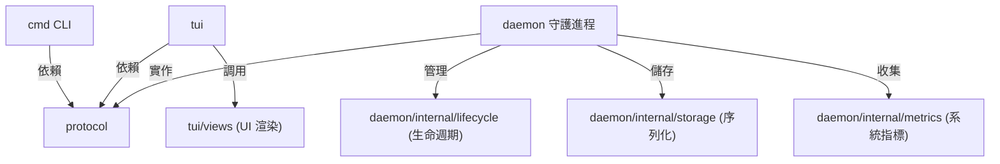

# 架構演進與優化計畫 — pm2 (Architecture Evolution & Optimization Plan)

## 1. 現有架構診斷與技術債 (Architecture Diagnosis & Technical Debt)

* 診斷一：`daemon` 封裝職責過多 (Daemon Over-Responsibility)
  [server.go](file:///Users/bytedance/projects/pm2/daemon/server.go) 達 930 行，包含 UNIX 套接字 (UNIX Socket) 監聽、生命週期控制、自動儲存與載入、定時重啟調度、進程資源監控等多重職責，屬於典型神級對象 (God Object)。
* 診斷二：RPC 協議與服務端邏輯耦合 (RPC Protocol Coupling)
  [protocol.go](file:///Users/bytedance/projects/pm2/daemon/protocol.go) 存在於 `daemon` 包下，將 Request/Response 結構與 Dial/Send 等客戶端邏輯與服務端代碼混在一起。使得 CLI 客戶端 [cmd](file:///Users/bytedance/projects/pm2/cmd) 與 [tui](file:///Users/bytedance/projects/pm2/tui) 必須引入整個 `daemon` 模組，破壞了模組邊界。
* 診斷三：TUI 視圖渲染與狀態管理膨脹 (TUI Bloat)
  [model.go](file:///Users/bytedance/projects/pm2/tui/model.go) 規模達 1169 行。該文件集成了 Bubble Tea 的 Update 狀態流轉、鍵盤事件處理，以及大量的 Lipgloss 佈局和字串切割邏輯，造成測試難度增加，結構難以複用。
* 診斷四：配置標準化邏輯分散 (Scattered Configuration Normalization)
  配置的加載與標準化本由 [ecosystem.go](file:///Users/bytedance/projects/pm2/config/ecosystem.go#L41-L85) 的 `Normalize` 函數負責。但在 [server.go](file:///Users/bytedance/projects/pm2/daemon/server.go#L264-L289) 中，`launchProcess` 依然自行推導及解析預設的 log_file 與 error_file 路徑，使得系統配置行為碎片化，易生不一致。

## 2. 複雜度量測 (Complexity Metrics)

* 代碼行數 (Lines of Code) 分佈：
  * [model.go](file:///Users/bytedance/projects/pm2/tui/model.go)：1169 行 (第 1 高)
  * [server.go](file:///Users/bytedance/projects/pm2/daemon/server.go)：930 行 (第 2 高)
  * [eco_test.go](file:///Users/bytedance/projects/pm2/cmd/eco_test.go)：964 行 (第 3 高)
* Git 改動頻率分析 (過去 12 個月)：
  * [model.go](file:///Users/bytedance/projects/pm2/tui/model.go)：改動 13 次 (最高改動熱點)
  * [types.go](file:///Users/bytedance/projects/pm2/process/types.go)：改動 9 次 (次高)
* 依賴關係分析 (Fan-in/out)：
  * [types.go](file:///Users/bytedance/projects/pm2/process/types.go) 具有最高扇入值 (Fan-in)，被 `cmd`, `tui`, `daemon`, `config` 引用。
  * `daemon` 被 `cmd` 與 `tui` 引用，形成較重的高層向底層依賴。

## 3. 架構簡化與解耦設計 (Simplification & Decoupling Design)

核心策略是將系統拆分為輕量協定、後端守護與前端交互三個層面，以介面進行隔離：

* 建立獨立的協定包 (Protocol Package)：
  將協定結構體與 Dial、SendRequest 等輔助方法抽離出 `daemon` 模組，放入獨立的 `protocol` 模組。
* 拆分 Daemon 模組內部職責 (Daemon Module Decomposition)：
  將 `daemon` 包重構為模組化子包，包含 `lifecycle`、`storage`、`metrics` 等。
* 拆分 TUI 佈局渲染 (TUI Layout Separation)：
  將 TUI 核心狀態流轉與不同面板（Left、Right、Logs）的字串構造邏輯拆入不同源文件。



## 4. 目錄與模組重整方案 (Reorganization Map)

```tree
pm2/
├── protocol/                     // 獨立的 RPC 通信協定
│   └── protocol.go
├── daemon/
│   ├── internal/
│   │   ├── lifecycle/            // 進程執行與監控核心
│   │   │   └── manager.go
│   │   ├── storage/              // JSON dump 持久化
│   │   │   └── store.go
│   │   └── metrics/              // 背景資源監測收集器
│   │       └── collector.go
│   └── server.go                 // 僅處理網絡監聽與 RPC 路由
├── tui/
│   ├── model.go                  // Bubble Tea 核心模型狀態
│   └── views/                    // UI 區塊構造與 Lipgloss 樣式
│       ├── view_left.go
│       ├── view_right.go
│       └── view_logs.go
```

遷移映射表 (Migration Map)：
* `daemon/protocol.go` -> `protocol/protocol.go`
* `daemon/server.go` (進程控制部分) -> `daemon/internal/lifecycle/manager.go`
* `daemon/server.go` (Save/Resurrect) -> `daemon/internal/storage/store.go`
* `daemon/server.go` (StartMetricsCollector) -> `daemon/internal/metrics/collector.go`
* `tui/model.go` (UI 渲染邏輯) -> `tui/views/` 目錄下多個文件

## 5. 插件化與可擴充性機制 (Plugin & Extensibility Mechanism)

* 必要性評估：
  本系統屬於輕量級單機進程管理器，目前其主要的擴展需求（如擴充日誌格式輸出、對接第三方 APM 等）少於 3 個。此時引入複雜的動態加載機制 (Go Plugin) 或進程外 RPC 插件系統 (gRPC) 為過度設計。
* 簡可行擴充設計：
  如果未來需要擴充（例如日誌輸出類型），僅需在 `daemon` 中定義 Go 接口 (Interface) 並通過靜態註冊表 (Static Registry) 註冊即可：
  ```go
  // LoggerExporter 接口定義了日誌導出合約
  type LoggerExporter interface {
      Export(name string, data []byte) error
  }
  ```

## 6. 漸進式重構路徑與驗證 (Refactoring Roadmap & Verification)

本重構遵循絞殺榕模式 (Strangler-Fig Pattern)，將任務細分為小步，保證每步均可獨立編譯、測試與隨時回滾。

### 第一階段：測試安全網確認 (Test Safety Net)
* 執行現有完整測試，確保 100% 通過率。
* 驗證命令：`go test -v ./...`

### 第二階段：分離 RPC 協定 (Isolate RPC Protocol)
* 步驟 1：建立 `protocol/` 包，將 `daemon/protocol.go` 內容移入其中。
* 步驟 2：更新 `cmd` 與 `tui` 中對協定對象的引用路徑。
* 步驟 3：驗證：執行 `go test -v ./cmd` 與 `go test -v ./tui`，保證網絡通信協定語意未受破壞。

### 第三階段：Daemon 模組職責拆分 (Decompose Daemon Duties)
* 步驟 1：提取指標收集器 (Metrics Collector)。將進程性能採集移至 `daemon/internal/metrics`，以協定驅動形式與 Server 交互。驗證：TUI 進程資源數據更新依然正常。
* 步驟 2：提取數據存儲 (Storage Store)。將 DumpEntry 的 JSON 寫入寫出封裝至 `daemon/internal/storage`。驗證：`pm2 save` 和 `pm2 resurrect` 運作正常。
* 步驟 3：提取生命週期管理 (Lifecycle Manager)。將 watchProcess、stopProcess 等代碼重構至 `daemon/internal/lifecycle`，保持與 `cron.Scheduler` 的引用。驗證：`pm2 start` 的生命週期事件（拉起、重試上限、cron 重啟）皆通過單元測試。

### 第四階段：TUI 面板渲染解耦 (Decouple TUI Views)
* 步驟 1：將 `buildLeft`, `buildRight`, `buildDetail`, `buildLogs` 渲染子模組抽離到 `tui/views/` 目錄。
* 步驟 2：驗證：運行 `pm2 monit`，確保控制面板的佈局、高亮、狀態點顏色和事件行為無偏差。

## 7. 風險與回滾策略 (Risks & Rollback)

* 協定破壞 (Protocol Break)：
  * 風險：重構協定時，欄位名稱或類型變更會導致 CLI 無法與 Daemon 連接。
  * 對策：重構時嚴格遵循 JSON 標籤結構不變原則，以兼容舊版本接口。
* 循環相依 (Circular Import)：
  * 風險：拆分子包時引發 Go 套件循環引用。
  * 對策：依賴關係必須單向從外向內。`lifecycle`, `storage`, `metrics` 子包不可依賴 `daemon` 主包，所有配置型結構均應通過 `process` 或 `protocol` 包傳遞。
* 回滾策略：
  * 重構過程中每個步驟皆在獨立的 Git 分支 (Git Branch) 上開發。
  * 若驗證未通過或出現崩潰，立即使用 `git reset --hard` 回滾到前一個確認穩定的 Commit 節點。
