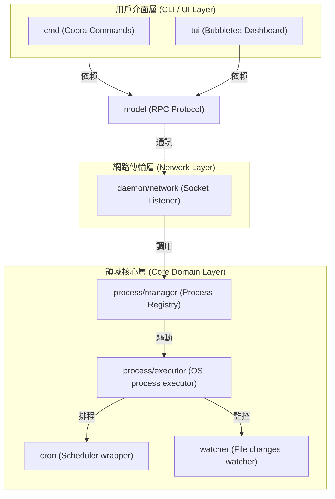

# 架構演進與優化計畫 — 守護進程解耦與模組化 (Architecture Evolution & Optimization Plan)

## 1. 現有架構診斷與技術債 (Architecture Diagnosis & Technical Debt)

目前系統的設計採用了單一的守護進程 (daemon) 作為核心，但在實現細節上存在以下技術債：

- `守護進程 (daemon) 職責過載`：
  在 `daemon/server.go` 中，`Server` 結構體同時負責了網路監聽 (Socket Listen)、連接處理、進程生命週期管理 (Process Lifecycle Management)、排程器管理 (Cron Scheduler) 以及檔案變更監聽 (File Watcher)。這種設計違反了 `單一職責原則 (Single Responsibility Principle)`，增加了代碼的維護成本。

- `狀態管理與鎖的範圍模糊`：
  進程的狀態變更直接在 `Server` 的 `processes` map 上進行，鎖的獲取與釋放散落在多個不同的業務函數中。這容易在未來的並發功能開發中，造成潛在的 `死鎖 (Deadlock)` 或 `資料競爭 (Data Race)`。

- `傳輸協定與進程控制高度耦合`：
  連接的讀寫邏輯 (`ReadJSON`/`WriteJSON`) 與具體的進程生命週期操作 (如 `startApp`/`stopProcess`) 一起塞在 `handleConn` 的 `switch` 分支中。這使得若要抽換或新增通訊介面 (例如引進 gRPC 或 HTTP API) 時，無法在不變動進程核心邏輯的前提下進行擴充。

- `代碼重疊與資料結構重複`：
  配置結構 `config.AppConfig` 與 RPC 請求結構 `model.AppStartReq`、持久化結構 `process.DumpEntry` 大量欄位重複，增加了資料轉換代碼 (Data Mapping Boilerplate) 的負擔。

## 2. 複雜度量測 (Complexity Metrics)

根據對當前工作區代碼的客觀量測，結果如下：

- `熱點與頻繁修改的檔案`：
  近 12 個月內改動最頻繁的前三名分別為：
  - `daemon/server.go`：改動 16 次
  - `tui/model.go`：改動 14 次
  - `cmd/start.go`：改動 12 次
  這顯示 `daemon/server.go` 與 `tui/model.go` 是系統中最重要的邏輯核心，也是重構效益 (ROI) 最高的位置。

- `程式碼長度分析 (LOC)`：
  - `daemon/server_test.go`：1431 行，包含大量的測試模擬。
  - `daemon/server.go`：700 行，承載過多業務職責。
  - `tui/model.go`：359 行，混雜視圖渲染與 IO 調度。

## 3. 架構簡化與解耦設計 (Simplification & Decoupling Design)

為了簡化守護進程，設計了三層解耦架構，實現 `依賴反轉 (Dependency Inversion)`。外部只依賴內部，內部對外提供抽象介面 (Interface Contract)。



- `領域核心隔離`：將 `processes` 映射表封裝到 `process/manager`，只對外提供並發安全的 CRUD 方法。
- `執行器與信號分流`：將具體進程的啟動 (`os/exec`)、信號傳播 (`syscall.Kill`) 與 Done channel 的監控抽離到 `process/executor`。

## 4. 目錄與模組重整方案 (Reorganization Map)

為確保職責單一與清晰的依賴方向，建議重整後之目錄結構如下：

```text
pm2/
├── cmd/                  # 終端指令層 (CLI Commands)
├── config/               # 配置加載與語法解析
├── cron/                 # 輕量排程包
├── model/                # RPC 資料契約與網路傳輸工具
├── process/              # 領域進程包 (Domain Process Package)
│   ├── types.go          # 進程結構定義 (ProcessInfo, Status)
│   ├── config.go         # 統一的進程配置結構 (Unified AppConfig)
│   ├── manager.go        # 執行緒安全的進程狀態管理器
│   ├── executor.go       # 進程啟動與終止執行器 (exec.Cmd / Signals)
│   └── persistence.go    # 進程狀態持久化 (dump.json)
├── watcher/              # 文件變更監控包
├── daemon/               # 守護進程包
│   ├── server.go         # Socket 監聽與 RPC 路由
│   └── metrics.go        # 背景指標收集器
└── tui/                  # 終端儀表板 (TUI Layer)
    ├── views/            # UI 視圖組件 (List / Detail / Logs)
    └── model.go          # Bubbletea 狀態控制
```

### 遷移映射表 (Migration Map)

| 舊代碼位置 | 新架構位置 | 依賴規則與變更說明 |
| :--- | :--- | :--- |
| `daemon/persistence.go` | `process/persistence.go` | 移入 `process` 包，與 `manager` 搭配，只負責存檔與讀取。 |
| `daemon/builder.go` | `process/executor.go` | 封裝成 `Executor` 的私有方法，減少全局導出。 |
| `daemon/helpers.go` | `process/helpers.go` | 改為進程輔助工具。 |
| `daemon/watcher.go` | `watcher/watcher.go` | 封裝成獨立模組，避免與 daemon 伺服器主體直接綁定。 |
| `daemon/manager.go` | `process/manager.go` | 作為 `process.Manager` 結構體的方法。 |

## 5. 插件化與可擴充性機制 (Plugin & Extensibility Mechanism)

- `必要性論證`：
  當前 `pm2` 系統僅需要加載 `.js` 和 `.json` 配置，並無動態加載第三方二進制插件的需求。因此，**不建議**引進 Go 語言的 `plugin` 機制，以保持代碼單純性。

- `可擴充介面設計`：
  採用 `介面組合 (Interface & Registry)` 模式來保留擴充空間：
  1. `Parser 介面`：用於配置文件解析，使未來擴充 `.yaml` 等配置格式更為容易。
  2. `Exporter 介面`：將 `daemon/metrics.go` 中取得系統資源指標的行為抽象化，以便未來可輕鬆對接 Prometheus 指標導出。

## 6. 漸進式重構路徑與驗證 (Refactoring Roadmap & Verification)

本重構遵循 `絞殺榕模式 (Strangler-Fig)`，分步實施，確保每一步均可單獨編譯與回滾。

### 第一階段：補強特徵測試 (已完成)
- 新增 `TestHighConcurrencyStartup` 與多個進程生命週期測試以建立重構安全網。
- 驗證方式：`go test -race ./daemon/...` 綠燈。

### 第二階段：統一配置結構 (Unified Config)
- 將 `config.AppConfig` 與 `model.AppStartReq` 中的欄位對齊，並在 `process/config.go` 建立統一的 `AppConfig`。
- 驗證方式：編譯通過，並跑通既有單元測試。

### 第三階段：抽離進程註冊表 (Extract Registry)
- 建立 `process.Manager` 結構體，封裝 `processes` 映射表與 `sync.RWMutex`。
- 修改 `daemon/server.go` 使其持有 `process.Manager`，並以其提供的安全方法代替直接操作 map。
- 驗證方式：`go test -race ./daemon/...` 測試通過。

### 第四階段：抽離進程執行器 (Extract Executor)
- 建立 `process.Executor` 接口與實現，將 `launchProcess`、`stopProcess`、`watchProcess` 邏輯遷移至 `process/executor.go`。
- 驗證方式：測試並發啟動與終止，驗證並發安全，確認無孤兒進程殘留。

### 第五階段：抽離網路傳輸層 (Extract Network Layer)
- 將 `Listen` 和 `handleConn` 移至 `daemon/network`，使 `daemon/server.go` 只做伺服器初始化。
- 驗證方式：以 `pm2 start` 等指令進行 E2E 功能驗證。

### 第六階段：解耦 TUI 視圖與狀態 (Decouple TUI Views)
- 將 `tui/model.go` 中的佈局和視圖代碼抽離到 `tui/views/`。

## 7. 風險與回滾策略 (Risks & Rollback)

- `並發死鎖 (Concurrency Deadlock)`：
  - 風險：在 `Registry` 持有寫鎖時，調用 `Executor` 的阻塞 IO 操作 (如 `cmd.Wait()` 或 `syscall.Kill`)，若 `Executor` 同時想回寫狀態並獲取鎖，即造成死鎖。
  - 預防措施：定義清晰的調用關係。`Executor` 所有涉及 IO 阻塞的方法一律在無鎖的環境下執行，狀態變更以 `Channel` 方式異步送回 `Registry` 處理。

- `數據不一致`：
  - 風險：在抽取 `persistence.go` 的過程中，`resurrect()` 出來的數據與內存中運行的進程狀態產生偏差。
  - 預防措施：每一次狀態變更均透過 `Registry` 進行，並由其觸發 `save()` 行為，不允許其他協程私自調用寫檔。

- `回滾策略`：
  每次重構的子步驟均提交獨立 the `git commit`。一旦驗證失敗 (例如 `go test -race ./...` 報錯或有並發競爭)，立即執行 `git reset --hard HEAD~1` 回滾。
