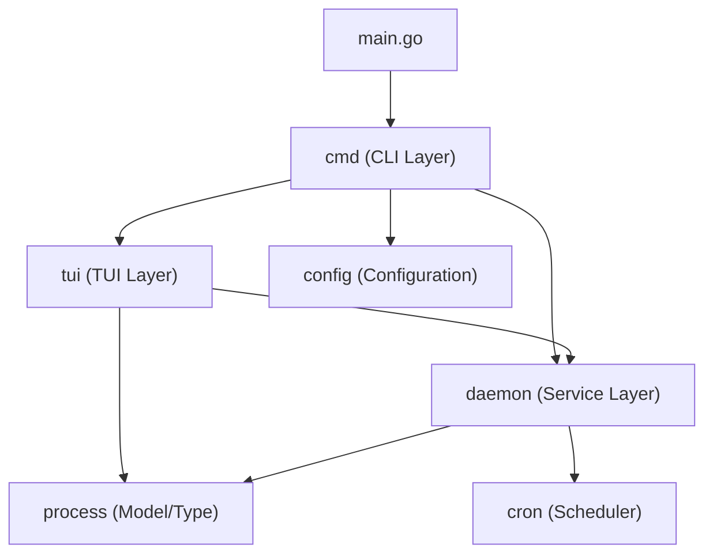
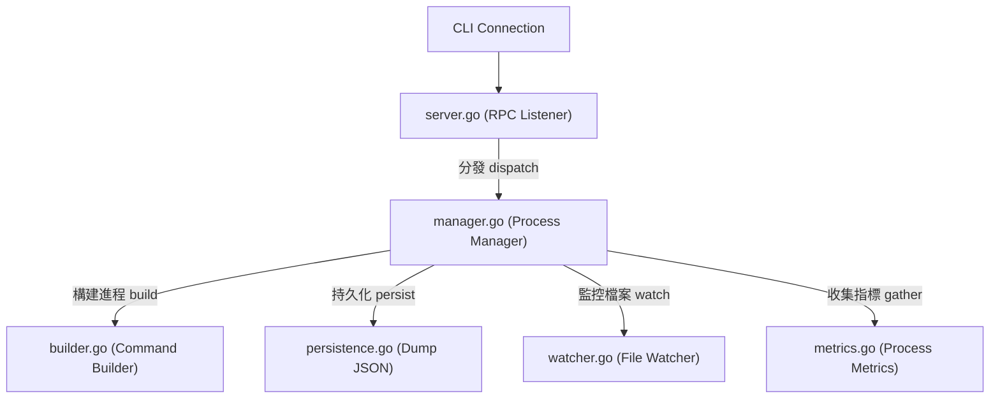

# 架構演進與優化計畫 — pm2 (Architecture Evolution & Optimization Plan)

## 1. 現有架構診斷與技術債 (Architecture Diagnosis & Technical Debt)

經過對專案代碼與執行現況的分析，`pm2` 專案目前存在以下幾個架構痛點與技術債：

- `單一職責原則 (Single Responsibility Principle)` 的違反：
  `daemon/server.go` 是一個典型的 `上帝對象 (God Object)`。它同時處理了 Unix socket 監聽、RPC 請求解析、應用程式生命週期管理 (進程生成與停止)、檔案變更監聽 (`fsnotify`)、資料持久化 (儲存/復活)、主機與進程指標收集、以及定時任務 (`cron`) 整合。這使得該檔案極度臃腫，且模組間高度耦合，增加了維護與測試的難度。
- `使用者介面與資料獲取混雜`：
  `tui/model.go` 包含了 `Bubbletea` 的主事件循環，但同時也內嵌了大量的 ANSI 畫面渲染邏輯、字串截斷與 uptime 格式化計算、透過 RPC 向 daemon 獲取資料、以及透過系統讀取 CPU/Memory 等指標的代碼。這導致 UI 組件無法進行獨立的單元測試，且難以局部調整佈局。
- `命令列指令與互動式精靈耦合`：
  `cmd/eco.go` 同時負責了 Cobra 系統指令的參數綁定、控制台互動式問答 (`promptLine`、`askOneApp`)、以及設定檔 (JS/JSON) 的渲染輸出與合併。這使得核心的設定載入/寫入邏輯無法在其他模組中被重用。
- `測試環境對沙盒的相容性不良`：
  `daemon/server_test.go` 中的單元測試寫死了使用 `/tmp` 目錄作為測試運行環境。當在受限的 `沙盒環境 (Sandbox)` 中執行時，會因為權限不足拋出 `operation not permitted` 錯誤，導致持續整合流程中斷。

---

## 2. 複雜度量測 (Complexity Metrics)

本節基於客觀數據評估系統的重構優先級。

### 檔案行數統計 (File Line Count)

使用 `wc -l` 統計專案中主要的 `Go` 原始碼檔案行數：

| 檔案路徑 | 行數 (Lines) | 職責 |
| :--- | :--- | :--- |
| `tui/model.go` | 1169 | TUI 狀態、視圖渲染與系統監控 |
| `daemon/server.go` | 964 | 守護進程的核心伺服器與生命週期管理 |
| `cmd/eco.go` | 615 | 生態系設定檔產生精靈與命令定義 |
| `daemon/server_test.go` | 470 | 守護進程的測試案例 |

### 改動頻率統計 (Change Frequency)

統計過去 12 個月內各檔案在 `git` 提交中的變動次數 (排名前 5)：

| 檔案路徑 | 變動次數 (Commits) | 複雜度象限 |
| :--- | :--- | :--- |
| `daemon/server.go` | 14 | 高改動 × 高耦合 (核心重構目標) |
| `tui/model.go` | 13 | 高改動 × 高耦合 (UI 重構目標) |
| `cmd/start.go` | 12 | 中改動 × 中耦合 |
| `process/types.go` | 9 | 低改動 × 共享定義 |
| `config/ecosystem.go` | 9 | 低改動 × 設定載入 |

### 模組依賴關係分析 (Dependency Analysis)

專案目前的模組依賴方向呈現單向的分層結構，沒有發現 `循環相依 (Circular Dependency)`：



---

## 3. 架構簡化與解耦設計 (Simplification & Decoupling Design)

為解決上述技術債，本計畫提出以下解耦方案。

### 守護進程伺服器解耦 (Daemon Server Decoupling)

將 `daemon/server.go` 拆分為多個職責單一的模組：

- `server.go`：僅保留 Socket 監聽、連線接受與 RPC 協議封包分發。
- `manager.go`：負責管理記憶體中的進程狀態對照表 (`processes` map)，並協調啟動、停止、重新啟動與刪除進程。
- `builder.go`：負責進程執行實體 (`exec.Cmd`) 的構建，包含 Shell 指令拼接、環境變數處理與工作目錄解析。
- `watcher.go`：負責處理 `fsnotify` 監聽器的生命週期與防抖動重啟邏輯。
- `metrics.go`：負責收集進程與主機 CPU/Memory 使用量指標。
- `persistence.go`：負責 `dump.json` 的讀取與寫入。



### 終端機介面解耦 (TUI Decoupling)

將 `tui/model.go` 拆分為三個子檔案：

- `model.go`：保留 `Bubbletea` 的 `Model` 結構體與核心的 `Init`/`Update`/`View` 狀態分發。
- `formatter.go`：存放無狀態的字串格式化函數，例如運行時間、內存大小、Cron 下次執行時間格式化。
- `metrics.go`：管理系統 CPU 與內存使用率的非同步收集指令。
- `renderer.go`：負責左側表格、右側詳細資料、日誌視圖與底部快捷鍵的佈局繪製。

---

## 4. 目錄與模組重整方案 (Reorganization Map)

本重構計畫不改變現有的 package 層級結構，而是透過 package 內部的模組拆分，在保持對外 API 不變的前提下完成簡化。

### 檔案拆分映射表 (Migration Map)

| 原始檔案 | 目標路徑 | 拆分後職責 |
| :--- | :--- | :--- |
| `daemon/server.go` | `daemon/server.go` | Unix socket 監聽與 RPC 處理 |
| | `daemon/manager.go` | 進程生命週期管理與 `Server` 狀態鎖維護 |
| | `daemon/builder.go` | 負責封裝 `exec.Cmd` 與變數注入 |
| | `daemon/watcher.go` | `fsnotify` 防抖動監聽器 |
| | `daemon/persistence.go` | 記憶體狀態儲存與復活 (dump 讀寫) |
| | `daemon/metrics.go` | 單一進程與系統指標收集器 |
| `tui/model.go` | `tui/model.go` | TUI 主控制器與事件循環 |
| | `tui/formatter.go` | 字串、記憶體與時間格式化工具 |
| | `tui/metrics.go` | 收集 TUI 所需的主機指標 |
| | `tui/renderer.go` | Bubbletea 視圖與表格排版繪製 |
| `cmd/eco.go` | `cmd/eco.go` | `pm2 eco` 指令參數定義 |
| | `cmd/eco_wizard.go` | 終端互動式問答精靈 |
| | `cmd/eco_renderer.go` | 生態系設定檔渲染與合併邏輯 |

---

## 5. 插件化與可擴充性機制 (Plugin & Extensibility Mechanism)

### 擴充性需求論證 (Extensibility Analysis)

經過評估，`pm2` 目前的應用場景專注於輕量級進程管理，功能界定清晰。
- 核心擴充點少於 3 個，此時引入動態載入的插件系統 (例如使用 Go `plugin` 套件) 會顯著增加系統複雜度與平台相容性風險 (Windows 不支援 Go `plugin`)。
- 因此，本計畫「不建議」設計複雜的動態插件系統，而是改用「介面與組合 (Interface & Composition)」的方式保留擴充點。

### 核心契約設計 (Interface Contracts)

為便於未來擴充日誌輸出目標 (例如將日誌同步輸出至外部收集器) 與指標儲存，定義以下介面契約：

```go
package daemon

// Logger 契約允許未來替換日誌寫入目標
type Logger interface {
	WriteStdout(name string, data []byte) error
	WriteStderr(name string, data []byte) error
	Close() error
}

// MetricsCollector 契約允許未來替換指標收集實作 (如支援不同的 OS)
type MetricsCollector interface {
	GetProcessMetrics(pid int) (cpu float64, memory uint64)
	GetHostMetrics() (cpu float64, memory float64)
}
```

---

## 6. 漸進式重構路徑與驗證 (Refactoring Roadmap & Verification)

重構將採用 `絞殺榕模式 (Strangler-Fig)`，分步進行，確保每一步皆能獨立編譯、測試並隨時回滾。

### 階段一：安全網建設與沙盒相容修正 (Time: 0.5 Day)

- 修正目標：
  修改 `daemon/server_test.go` 中寫死的 `/tmp` 目錄，將其改為相對於專案目錄的 `tmp/test-*`，避免在沙盒環境中發生權限錯誤。
- 驗證方式：
  執行 `go test ./...` 確保所有測試在沙盒模式下均為綠燈 (Pass)。

### 階段二：TUI 層解耦 (Time: 1 Day)

- 重構步驟：
  1. 將字串格式化邏輯抽取至 `tui/formatter.go`，並為其編寫單元測試。
  2. 將主機指標收集抽取至 `tui/metrics.go`。
  3. 將畫面渲染抽取至 `tui/renderer.go`。
- 驗證方式：
  執行 `go test ./tui/...`，並手動運行 `pm2 monit`，確保介面顯示正常、排序與操作無誤。

### 階段三：Ecosystem 指令與 Wizard 拆分 (Time: 0.5 Day)

- 重構步驟：
  1. 抽取 `cmd/eco_renderer.go` 與 `cmd/eco_wizard.go`。
- 驗證方式：
  執行 `go test ./cmd/...`，確保 `cmd/eco_test.go` 中對合併、產生格式的測試全部通過。

### 階段四：Daemon 核心模組化 (Time: 2 Days)

- 重構步驟：
  1. 抽取 `daemon/builder.go` 並封裝進程啟動參數。
  2. 抽取 `daemon/persistence.go` 與 `daemon/metrics.go`。
  3. 抽取 `daemon/watcher.go` 處理 fsnotify。
  4. 抽取 `daemon/manager.go` 移轉進程控制狀態。
- 驗證方式：
  每抽取一個模組，即時執行 `go test ./daemon/...` 進行回歸測試，確保狀態鎖在拆分後沒有發生死鎖 (Deadlock)。

---

## 7. Risks & Rollback (風險與回滾策略)

### 技術風險與應對措施

- `併發狀態競爭與死鎖 (Race Conditions & Deadlocks)`：
  - 風險：在 `daemon/server.go` 中，諸多操作依賴 `sync.RWMutex` 來保護進程狀態。拆分模組時若沒有妥善傳遞或隔離鎖，可能導致死鎖。
  - 對策：重構時 `manager.go` 應作為唯一的狀態持有者。其他抽取出來的輔助模組 (如 `builder.go` 或 `persistence.go`) 應設計為「無狀態」的純函數或獨立對象，不直接持有狀態鎖。
- `進程資源洩漏`：
  - PM2 核心的退出邏輯極易出錯。例如，若 Channel 未被正確關閉，會導致 goroutine 洩漏。
  - 對策：利用 `go test -race` 進行動態競爭檢測，並在測試中加入 goroutine 洩漏檢查。

### 回滾步驟 (Rollback Plan)

1. 重構必須在專屬的 Git 分支 (`refactor/decouple-server`) 上進行。
2. 採用小步提交的策略，每一個模組拆分獨立成一個 `commit`。
3. 若在重構過程中遇到無法定位的行為偏差，立即使用以下指令回滾至上一個穩定提交：
   ```bash
   git reset --hard HEAD~1
   ```
