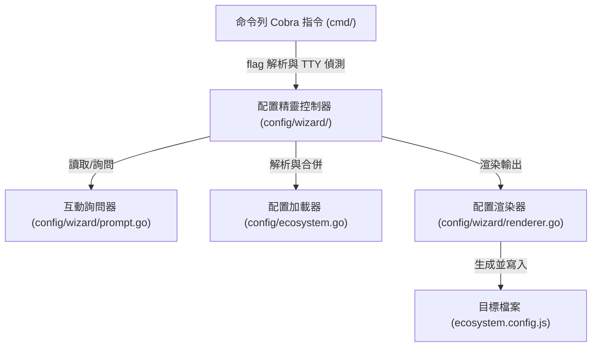

# 架構演進與優化計畫 — wizard-decoupling (Architecture Evolution & Optimization Plan)

> **狀態:已完成 (Completed)**
> 三階段絞殺榕重構於 2026-07-08 完成。`cmd/eco_wizard.go` 與 `cmd/eco_renderer.go` 已刪除，核心邏輯遷移至 `config/wizard/`。
> `cmd/eco.go` 與 `cmd/eco_install.go` 為 thin Cobra wrapper，僅做 flag 解析與 I/O 注入。
> 本檔保留作為設計參考與遷移映射記錄。

## 1. 現有架構診斷與技術債 (Architecture Diagnosis & Technical Debt)

我們對現有 `pm2` 專案中有關生態配置精靈 (Ecosystem Wizard) 的程式碼進行了審查，發現了以下關鍵的結構耦合與技術債問題：

* `診斷一`：互動式引導與檔案渲染邏輯同命令列界面強耦合 (Interactive Wizard and Renderer Coupled with CLI Presentation Layer)
  在 [eco_wizard.go](../cmd/eco_wizard.go#L30) 和 [eco_renderer.go](../cmd/eco_renderer.go#L21) 中，諸如 `collectAnswers`、`promptLine`、`writeEcosystemFile` 以及 `renderEcosystemJS` 等底層核心邏輯，直接以 package-level 函數形式實作在 `cmd/` 套件下。這使得 `cmd`（命令列界面 Cobra 命令定義）不僅僅充當 CLI 的參數解析器，還直接承擔了互動提示、檔案讀寫、配置合併以及 JS/JSON 代碼生成等多重職責，違反了 `單一職責原則 (Single Responsibility Principle, SRP)`。

* `診斷二`：巨型測試檔案導致維護困難 (Monolithic Test File leading to Maintenance Difficulties)
  在 [eco_test.go](../cmd/eco_test.go) 中，測試代碼高達 `988` 行。這些測試既包含了對 interactive prompt 互動回訊的模擬，也包含了對 JS/JSON 輸出的 assertion。由於它直接存放在 `cmd` 包中，導致測試代碼非常臃腫且難以維護，並且無法在不拉起整個 Cobra 命令的情況下單獨對 `wizard` 進行輕量化的單元測試。

* `診斷三`：缺乏可重用性 (Lack of Reusability for Non-CLI Components)
  當前設計中，如果未來要在 `pm2 monit` 終端界面 (TUI) 中新增一個 `interactive config creator`（互動式配置建立器），或者如果守護行程 (Daemon) 需要自動導出或合併配置，我們將被迫導入整個 `cmd` 套件。然而，`cmd` 套件包含大量的 Cobra 命令和 CLI 全局 flag 註冊，這會帶來極為嚴重的依賴污染，甚至在 Go 中引發循環引用問題。

## 2. 複雜度量測 (Complexity Metrics)

我們對 CLI 套件中涉及的檔案進行了結構量化分析：

* 檔案行數 (Code Size)：
  - `cmd/eco_test.go`：`988` 行
  - `cmd/eco_renderer.go`：`250` 行
  - `cmd/eco_wizard.go`：`238` 行
  - `cmd/eco.go`：`136` 行
  - `cmd/eco_install.go`：`139` 行
  專案中有關生態配置精靈 (Ecosystem Wizard) 的邏輯總行數已超過 `1,700` 行，且全部擁擠在 `cmd/` 目錄中，與普通的 CLI 指令（如 `stop.go` 75 行、`start.go` 93 行）相比，複雜度超出了數倍。

* 改動頻率 (Change Hotspots)：
  在提交記錄中，與 `cmd/eco*` 相關的改動非常頻繁，主要由於 prompt 提示語調整、新增 default flags，以及修復 path merging 邏輯等。這說明該部分是活躍的業務區，極需進行解耦以隔離變更影響。

## 3. 架構簡化與解耦設計 (Simplification & Decoupling Design)

為了徹底解耦，我們提出將互動式精靈與渲染器抽離至獨立套件 `config/wizard` 的架構，明訂單向依賴方向（只能由外層指向內層，底層不可相依高層）：

* `命令列視圖層 (CLI View Layer)`：
  `cmd/eco.go` 和 `cmd/eco_install.go` 只負責 Cobra Command 的 flag 解析、決定輸入/輸出串流 (Stdin/Stdout)，然後調用 `wizard` 的核心方法，不再涉及任何具體詢問與寫檔邏輯。
* `配置精靈與渲染核心層 (Wizard & Render Core Layer)`：
  在 `config/wizard/` 中定義 `Wizard` 控制器，接受自訂的 `io.Reader` (Stdin) 和 `io.Writer` (Stdout/Stderr) 作為輸入輸出，實現完全的 `輸入輸出重導向 (I/O Redirection)`。這讓測試時可以透過模擬 (mocking) 緩衝器輕鬆進行輸入與輸出斷言，而不需要真正的終端 TTY 或者是手動輸入。



## 4. 目錄與模組重整方案 (Reorganization Map)

我們規劃將 `cmd` 中與問答流程及渲染相關的邏輯重整至 `config/wizard/` 套件下：

```tree
pm2/
├── config/
│   ├── ecosystem.go          # 保留：既有解析器
│   └── wizard/               # 新增套件：配置精靈核心
│       ├── prompt.go         # 新建：互動式 prompt 收集 (原 eco_wizard.go 相關 prompt 函數)
│       ├── wizard.go         # 新建：App 收集與問答流程主控制器 (原 collectAnswers)
│       ├── renderer.go       # 新建：JS/JSON 格式化、合併與寫入 (原 eco_renderer.go)
│       └── wizard_test.go    # 新建：搬移自 eco_test.go 的核心問答與渲染測試
└── cmd/
    ├── eco.go                # 簡化：僅作為 Cobra command 包裝與 Flag 綁定
    ├── eco_install.go        # 簡化：僅調用 config/wizard 執行 App 安裝
    └── eco_test.go           # 簡化：僅保留 CLI 命令層級整合測試
```

舊新遷移映射表 (Migration Map)：
* `cmd/eco_wizard.go` 的 `promptLine`, `promptYesNo`, `promptInstances`, `promptEnvVars` -> `config/wizard/prompt.go`
* `cmd/eco_wizard.go` 的 `collectAnswers`, `askOneApp` -> `config/wizard/wizard.go`
* `cmd/eco_renderer.go` 的 `writeEcosystemFile`, `renderEcosystemJS`, `renderEcosystemJSON`, `mergeAppsByName` -> `config/wizard/renderer.go`
* `cmd/eco_test.go` 中針對 wizard 流程、JS 渲染、app 合併等單元測試 -> `config/wizard/wizard_test.go`

## 5. 插件化與可擴充性機制 (Plugin & Extensibility Mechanism)

* 必要性評估 (Necessity Assessment)：
  互動式精靈主要用於幫助用戶本地快速建立配置，不涉及 Daemon 執行期的動態插件加載。在現階段引入額外的 Go plugin 機制屬於嚴重的過度設計 (Over-engineering)。

* 介面化問答與輸出流擴充 (Interface-driven Prompting & Output Stream)：
  雖然不需要動態插件，但我們可以透過定義無狀態的輸入/輸出流來支持測試和擴充。例如在 `config/wizard` 中封裝 `Context`：
  ```go
  type WizardContext struct {
      In     io.Reader
      Out    io.Writer
      ErrOut io.Writer
      YesAll bool
  }
  ```
  這讓未來如果想要擴充在 Web UI 或其他 GUI 上收集用戶參數，或者是自動拉起 headless 生成時，只需要實作對應的輸入與輸出流即可，極大地提高了代碼的擴充性。

## 6. 漸進式重構路徑與驗證 (Refactoring Roadmap & Verification)

本重構將完全遵循 `絞殺榕模式 (Strangler-Fig Pattern)` 的演進方向，每一小步均可獨立編譯、測試並可隨時回滾：

### 第一階段：搬移並重構配置渲染器 (Move and Refactor Renderer)
* 步驟 1：建立 `config/wizard` 目錄。
* 步驟 2：將 `cmd/eco_renderer.go` 的渲染和合併邏輯遷移至 `config/wizard/renderer.go`，並使之與 `config.AppConfig` 解耦。
* 步驟 3：在 `config/wizard/wizard_test.go` 中還原 renderer 相關測試，確保 JS/JSON 渲染與合併行為完全一致。
* 驗證命令：`go test -v ./config/wizard/...`

### 第二階段：解耦互動式精靈 (Decouple Interactive Wizard)
* 步驟 1：將 `cmd/eco_wizard.go` 中的 `collectAnswers`、`askOneApp` 以及 prompt 函數遷移至 `config/wizard/wizard.go` 和 `config/wizard/prompt.go`。
* 步驟 2：在 `config/wizard/wizard.go` 中導出 `RunWizard` 或 `RunInstall` 等進入點。
* 步驟 3：將 `cmd/eco_test.go` 中相關的問答流模擬測試遷移至 `config/wizard/wizard_test.go`。
* 驗證命令：`go test -v ./config/wizard/...`

### 第三階段：簡化命令列界面 (Simplify CLI Commands)
* 步驟 1：修改 `cmd/eco.go` 和 `cmd/eco_install.go`，將其內部邏輯替換為對 `config/wizard` 套件的調用。
* 步驟 2：清理 `cmd/` 套件下被廢棄的 wizard 輔助函數。
* 步驟 3：執行整個專案的單元測試與整合測試。
* 驗證命令：`go test -race -v ./...` 且 `go build -o /dev/null ./...` 正常。

## 7. 風險與回滾策略 (Risks & Rollback)

* 互動詢問時 Stdin 阻塞風險 (Stdin Blocking Risks)：
  - 邏輯：如果解耦後 interactive prompt 沒有正確接收 CLI 指定的 `cmd.InOrStdin()`，可能會在沒有 TTY 時嘗試裸讀真實控制台 input，導致測試或自動化腳本永久掛起。
  - 對策：嚴格要求所有與 Stdin 交互的 prompt 方法必須使用傳入的 `WizardContext.In`，絕不能直接調用 `os.Stdin`。

* 回滾路徑與分支策略 (Rollback Pathway & Branching Strategy)：
  - 所有重構步驟均建立於 `refactor-wizard-decoupling` 特徵分支上。
  - 每一小步重構後必須運行 `go test ./...`。若發生佈局編譯錯誤，可透過 `git checkout --` 快速還原。
