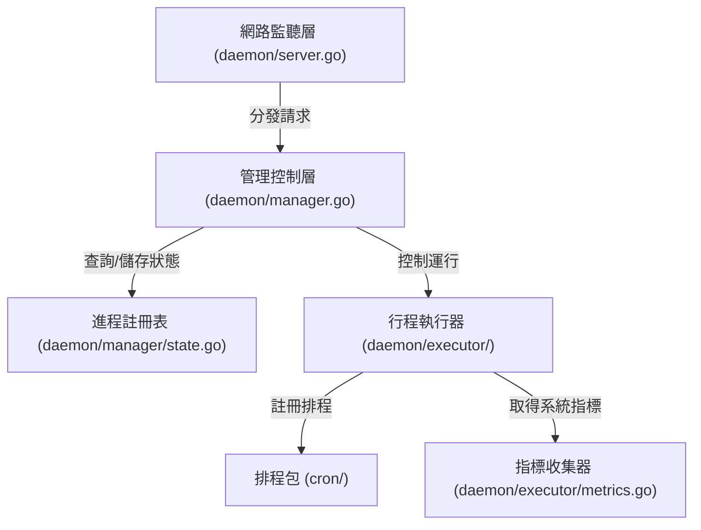

# 架構演進與優化計畫 — daemon-decoupling-phase2 (Architecture Evolution & Optimization Plan)

## 1. 現有架構診斷與技術債 (Architecture Diagnosis & Technical Debt)

我們對當前 `pm2` 的 `daemon` 模組進行了架構審查與技術債診斷，發現了以下關鍵的結構耦合與核心缺陷：

### 1.1 執行器與網路監聽器的混合耦合 (Coupling of Executor and Network Listener)
在當前 [server.go](file:///Users/shuk/projects/tmp/pm2/daemon/server.go) 中，`Server` 結構體同時扮演著雙重角色：它既是 `Unix Socket` 網路連線接收者（負責 `Listen` 與 `handleConn` 的連線讀寫與協定路由分發），又是 `進程生命週期執行者`（負責 `launchProcess`, `watchProcess`, `stopProcess` 等與作業系統交互的底層調用）。這違反了 `單一職責原則 (Single Responsibility Principle)`，使得核心網路監聽代碼與進程控制邏輯高度盤根錯節，難以單獨進行單元測試。

### 1.2 排程命名空間衝突與幽靈排程任務 (Cron Namespace Collision and Ghost Tasks)
現有的排程機制存在嚴重的併發與覆蓋漏洞：
- `命名空間衝突`：在 [scheduler.go](file:///Users/shuk/projects/tmp/pm2/cron/scheduler.go#L28) 中，`Scheduler.Register` 使用進程名稱 `name` 作為追蹤 Map 的鍵值。若在不同的 `namespace`（如 `default:api` 與 `production:api`）中啟動同名進程，後註冊的排程會直接覆蓋前者的 map 記錄。
- `幽靈排程任務 (Ghost Tasks)`：若同一個進程同時配置了定期運行 `Cron` 與崩潰重啟 `CronRestart`（雖然不常見，但為配置合法組合），它們會先後調用 `Register`。由於它們共享同一個進程名稱作為 map 鍵值，後註冊的排程會覆蓋前者在 `Scheduler.entries` 中的 `EntryID`。這導致調用 `Remove` 釋放資源時，只能移除其中一個任務，另一個任務將在背景永久運行，形成無法釋放的資源洩漏。

### 1.3 孤兒進程組信號未傳播問題 (Orphan Process Group Signal Propagation)
在 [server.go](file:///Users/shuk/projects/tmp/pm2/daemon/server.go#L580) 的 `stopProcess` 函數中，系統僅調用了 `mp.Cmd.Process.Signal(syscall.SIGTERM)`。雖然在 [builder.go](file:///Users/shuk/projects/tmp/pm2/daemon/builder.go#L20) 中，進程啟動時設置了 `Setpgid: true` 以建立獨立的 `進程組 (Process Group)`，但向父進程 PID 單獨發送信號並不會自動將信號傳播到整個子進程組。若被管理的進程啟動了多個子行程（例如 `bash` 腳本拉起其他二進制文件），在停止時這些子行程將不會收到 `SIGTERM`，從而殘留在系統中成為孤兒進程。

### 1.4 單元測試污染真實家目錄與沙箱 socket 限制 (Home Directory Pollution and Sandbox Socket Restrictions)
在 [server_test.go](file:///Users/shuk/projects/tmp/pm2/daemon/server_test.go#L480) 的 `TestStartAppOutFileHomeExpansion` 測試案例中，其配置的輸出日誌路徑為 `~/test-home-expand-out.log`。在調用 `startApp` 進行路徑展開時，系統會調用真實的 `homedir.Expand` 並建立檔案。這導致運行測試時會直接在運行主機的真實 `家目錄 (Home Directory)` 下寫入測試日誌。在沙箱 (Sandbox) 安全限制環境下執行 `go test` 會引發以下錯誤：
`server_test.go:496: startApp failed: launch homeexpandcheck: open /Users/shuk/test-home-expand-out.log: operation not permitted`
另外，在 [protocol_test.go](file:///Users/shuk/projects/tmp/pm2/model/protocol_test.go#L185) 的 `TestSendRequestRoundTrip` 中，由於沙箱環境限制了對工作區外部 `/var/folders/` 底下臨時 Unix Socket 的讀寫，導致單元測試連線被阻擋而失敗：
`protocol_test.go:185: SendRequest: daemon not running... connect: operation not permitted`
這兩處錯誤深刻證實了測試對主機環境環境缺乏隔離的設計缺陷，必須在 Phase 1 優先解決。

---

## 2. 複雜度量測 (Complexity Metrics)

我們透過客觀量測得出了專案的結構量化數據：

### 2.1 模組改動頻率分析 (Git Hotspots)
根據 Git 提交歷史統計，過去 12 個月改動最頻繁的 Go 檔案依序為：
- `daemon/server.go`：改動 `16` 次 (核心控制邏輯，也是目前最龐大的檔案)。
- `tui/model.go`：改動 `14` 次 (TUI 狀態維護與用戶互動)。
- `cmd/start.go`：改動 `12` 次 (CLI 啟動參數解析與 RPC 發送)。

### 2.2 檔案行數分析 (Code Size & Complexity Hotspots)
核心模組代碼行數分佈如下：
- `daemon/server_test.go`：`1261` 行。
- `daemon/server.go`：`679` 行。
- `tui/renderer.go`：`512` 行。
- `tui/model.go`：`359` 行。

`server.go` 在排除測試後仍佔了 `679` 行，是整個守護行程中最顯著的複雜度熱點，必須進行職責拆分。

---

## 3. 架構簡化與解耦設計 (Simplification & Decoupling Design)

為了解除核心模組的混合耦合，並修復現有的技術債與 Bug，我們設計了以下架構簡化與解耦方案：

### 3.1 職責拆分設計
- `進程註冊表 (ProcessRegistry)`：負責進程的增刪查改及 `sync.RWMutex` 併發安全控制，不涉及進程的作業系統級 IO 操作與網路傳輸。
- `執行器 (ProcessExecutor)`：負責進程組的生命週期控制（包括進程組信號發送、Goroutine 等待監聽、指標收集以及日誌流導向）。
- `網路層 (Network Listener)`：僅負責 Unix socket 的連線處理、請求解析與協定路由分發，內部直接調用 `ProcessRegistry` 與 `ProcessExecutor` 的介面。

### 3.2 依賴方向圖 (Dependency Direction Diagram)



---

## 4. 目錄與模組重整方案 (Reorganization Map)

我們規劃將原有的 `daemon/` 內部代碼進行模組化重整，並確立嚴格的單向依賴：

```tree
pm2/
└── daemon/
    ├── server.go             # 僅負責 Unix socket 連線監聽與請求協定分發
    ├── manager.go            # 負責請求的調度邏輯，作為 Registry 與 Executor 的中介者
    ├── manager/
    │   └── state.go          # 新建：線程安全的 ProcessRegistry 封裝 (含 processes map 與 mu)
    ├── executor/
    │   ├── executor.go       # 新建：負責進程組啟動、等待 (watchProcess) 與停止
    │   ├── builder.go        # 遷移：負責組裝 exec.Cmd 參數 (原 daemon/builder.go)
    │   ├── watcher.go        # 遷移：負責 fsnotify 檔案變更監聽 (原 daemon/watcher.go)
    │   └── metrics.go        # 遷移：負責進程 CPU/Memory 指標異步採集 (原 daemon/metrics.go)
    └── persistence/
        └── file.go           # 遷移：負責 dump.json 檔案持久化與回復 (原 daemon/persistence.go)
```

### 舊代碼遷移映射表 (Migration Map)

| 舊檔案路徑 | 新模組路徑 | 調整要點 |
| :--- | :--- | :--- |
| `daemon/server.go` (processes map) | `daemon/manager/state.go` | 將 `s.processes` 與 `sync.RWMutex` 封裝為 `ProcessRegistry` |
| `daemon/server.go` (launch/watch/stop) | `daemon/executor/executor.go` | 封裝進程組生命週期操作，收斂作業系統調用 |
| `daemon/builder.go` | `daemon/executor/builder.go` | 保持既有邏輯，僅變更 package 名稱 |
| `daemon/watcher.go` | `daemon/executor/watcher.go` | 保持既有邏輯，僅變更 package 名稱 |
| `daemon/metrics.go` | `daemon/executor/metrics.go` | 保持既有邏輯，僅變更 package 名稱 |
| `daemon/persistence.go` | `daemon/persistence/file.go` | 保持既有邏輯，僅變更 package 名稱 |

---

## 5. 插件化與可擴充性機制 (Plugin & Extensibility Mechanism)

基於簡潔性原則，本系統暫不需要複雜的動態插件載入機制。我們設計了基於 `Interface` 的靜態擴充方案，供日後將排程器、持久化媒介進行替換：

### 5.1 排程器契約 (Scheduler Interface)
為了讓排程功能不強綁定在特定的 `cron` 實作上，且能解決命名空間衝突，我們將 `cron.Scheduler` 提取為介面：
```go
type TaskScheduler interface {
    Register(key, schedule string, fn func()) error
    Remove(key string)
    Stop()
}
```
註冊時改為傳入 `key`（格式為 `namespace:name:taskType`），使不同 `namespace` 的同名進程、或同進程的多個排程任務（如 `cron` 與 `cron_restart`）能互不干涉地註冊。

---

## 6. 漸進式重構路徑與驗證 (Refactoring Roadmap & Verification)

我們採用 `絞殺榕模式 (Strangler-Fig)` 分步實施，確保每一步都可獨立編譯、測試並支持快速回滾：

### Phase 1：缺陷修復與測試安全隔離 (Bug Fixes & Isolation)
- `步驟 1`：修改 [scheduler.go](file:///Users/shuk/projects/tmp/pm2/cron/scheduler.go) 以支援複合鍵，並在 [server.go](file:///Users/shuk/projects/tmp/pm2/daemon/server.go) 中改以 `ns + ":" + name + ":restart"` 與 `ns + ":" + name + ":cron"` 進行註冊，修復排程任務覆蓋漏洞。
- `步驟 2`：在 [server.go](file:///Users/shuk/projects/tmp/pm2/daemon/server.go#L580) 的 `stopProcess` 中，改用 `syscall.Kill(-pid, syscall.SIGTERM)` 替代 `mp.Cmd.Process.Signal`，確保進程組內的子行程被同步釋放。
- `步驟 3`：修改 [server_test.go](file:///Users/shuk/projects/tmp/pm2/daemon/server_test.go#L480)，在測試開始時使用 `t.Setenv("HOME", testDir)` 隔離測試環境的家目錄，避免污染真實主機。
- `驗證命令`：`go test -race -v ./cron/... ./daemon/...`

### Phase 2：封裝狀態註冊表 (Encapsulate Registry)
- `步驟 1`：建立 `daemon/manager/state.go`，實作執行期線程安全的 `ProcessRegistry`，提供 `Add`, `Get`, `Remove`, `List` 操作。
- `步驟 2`：修改 `Server`，將內部的裸露 map 變數替換為 `ProcessRegistry`。
- `驗證命令`：`go test -race -v ./daemon/...`

### Phase 3：抽離執行器模組 (Extract Executor)
- `步驟 1`：建立 `daemon/executor/`，將 `builder.go`、`watcher.go`、`metrics.go` 搬移至此。
- `步驟 2`：在 `executor.go` 中實作進程的 `Start`, `Wait`, `Stop` 生命週期邏輯，將 `server.go` 中的 `launchProcess`、`watchProcess`、`stopProcess` 遷移至此。
- `驗證命令`：`go test -race -v ./daemon/...`

### Phase 4：網路傳輸與業務邏輯解耦 (Decouple Network Layer)
- `步驟 1`：重構 `daemon/server.go` 中的 `Listen` 與 `handleConn`，使其僅負責 Socket 的生命週期管理與 `model.Request` 的解包分發，所有的業務操作皆路由至 `daemon/manager.go`。
- `驗證命令`：`go test -race -v ./...`，確保 CLI/TUI 的 E2E 行為與重構前一致。

---

## 7. 風險與回滾策略 (Risks & Rollback)

### 7.1 進程組信號發送相容性風險 (Process Group Signal Compatibility)
- `問題`：在非類 Unix 系統上（如 Windows），`syscall.Kill(-pid, ...)` 與 `SysProcAttr.Setpgid` 將無法工作，會導致編譯或執行期錯誤。
- `策略`：在導入 `syscall.Kill` 時，必須在 `builder.go` 與 `executor.go` 中使用 `//go:build !windows` 條件編譯，並針對 Windows 系統提供相容性的單一進程關閉 fallback 實作。

### 7.2 記憶體快照與持久化狀態不一致風險 (State Inconsistency)
- `問題`：重構 `ProcessRegistry` 時若鎖的細粒度控制不當，可能會導致 `save()` 持續化與記憶體狀態在極端併發下不一致。
- `策略`：持久化 `save()` 必須繼續採用 `RLock` 的快照機制，在持鎖期間完成對照表的拷貝後立即釋放鎖，並在鎖外進行磁碟寫入 IO 操作。
