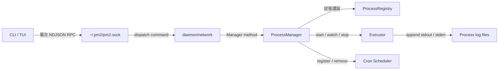
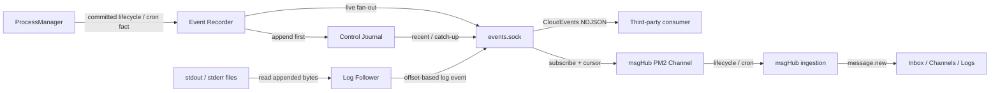

# 架構計畫 — pm2-event-stream

- 日期：2026-07-23
- 狀態：Draft
- 功能名稱：`pm2-event-stream`
- 主要 producer：PM2 daemon
- 首個 consumer：msgHub

> `2026-08-28 註記 (Amendment)`
>
> `plans/2026-08-28-pm2-workflow.md` 已實作並`推翻本檔 §1.4 的「不在 PM2 內建
> public HTTP」一條`，且`只推翻那一條`：pm2 現在內建一個綁 `0.0.0.0:8502` 的
> 唯讀為主 dashboard 與一個 workflow webhook。仍然成立的部分是——沒有 OAuth、
> 沒有 TLS、沒有 credential store，也`沒有 webhook registry`（workflow 定義本身
> 就是註冊，寫在 ecosystem 檔裡，與 cron 運算式同層）。
>
> 兩個平面`仍是不同種類`：event socket 是給程式訂閱的`推送`面（cursor、
> at-least-once），`:8502` 是給人用瀏覽器看的`拉取`面。本檔若日後動工，推送面
> 的設計不受影響。
>
> `已實作的底層`：本檔 §1.2 要求的「lifecycle / cron event 先寫入 durable JSONL
> journal」已由 `runhistory` 落地，並順帶修好 §2.2 的第 1 與第 3 項——
> `LastCronStatus` 的 `ok` 現在真的代表 exit code 為 0，而 `executor.ExitInfo`
> 補上了 exit code、signal 與 duration。差異在包裝：本檔用 CloudEvents envelope，
> `runhistory` 用扁平領域紀錄，因為 envelope 會讓每分鐘一次的 cron 歷史體積約三倍，
> 換來本機讀者用不到的欄位。事件面真的開建時，在 socket 邊界做投影即可。
>
> `§2.2 第 6 項（CmdKill 的 os.Exit 應收回 Server coordinator）尚未處理`。

## 1. 目標與範圍 (Goal & Scope)

### 1.1 目標

PM2 已掌握受管程序的生命週期、cron、最新 CPU / memory 快照，以及 stdout /
stderr 檔案位置。本功能把這些資訊整理成穩定、跨語言的共同事件 (common event)，
供 msgHub 與其他第三方以唯讀方式取得：

1. `snapshot`：現在有哪些 daemon、process、cron 與 log stream。
2. `recent`：取得保留期內的近期事件。
3. `subscribe`：從 cursor 之後補齊事件，再持續接收增量事件 (incremental events)。
4. `logs.recent`：取得指定 process / stream 的近期 log。
5. `logs.subscribe`：從 log offset 之後補齊，再持續接收新增 log。

事件 envelope 採
[CloudEvents 1.0.2](https://github.com/cloudevents/spec/blob/v1.0.2/cloudevents/spec.md)
與其
[JSON Event Format](https://github.com/cloudevents/spec/blob/v1.0.2/cloudevents/formats/json-format.md)
的 structured format。CloudEvents 已定義 `id`、`source`、`specversion`、`type`
等跨系統欄位，也允許 producer-defined extension；PM2 只需定義自己的 event type
與 `data` schema，不再發明另一套通用 envelope。

### 1.2 核心決策

- `pm2.sock` 保持既有一次 request / response 的控制面 (control plane)。
- 新增 `~/.pm2/events.sock` 作為唯讀事件面 (event plane)。
- lifecycle / cron event 先寫入 durable JSONL journal，再 fan-out 給 subscriber。
- stdout / stderr 不複製進 lifecycle journal；recent log 直接由既有 log file replay。
- lifecycle / cron 與 log 都輸出 CloudEvents JSON，但使用不同 cursor 語意。
- delivery 採 `at-least-once`；consumer 以 `source + id` 去重。
- PM2 process control 優先於 event delivery；journal 故障不得阻止 start / stop。
- MVP 只接受本機同一使用者的 Unix socket client，不開 TCP、不保存 webhook secret。

### 1.3 使用者與 consumer

- `pm2 events ...` CLI：人工檢查、shell pipeline、contract smoke test。
- msgHub：把 lifecycle / cron 事件放入 Inbox，把完整 log stream 放入 Logs UI。
- 其他本機工具：dashboard、automation、health watcher、incident collector。
- 未來 remote gateway：讀取本機 socket，再以有認證的 CloudEvents HTTP 傳送。

### 1.4 Out of scope

- 不提供第三方透過 event socket start / stop / restart process。
- 不在 PM2 內建 public HTTP、webhook registry、OAuth、TLS 或 remote credential。
- 不引入 Kafka、NATS、Redis 等外部 broker。
- 不承諾 exactly-once；consumer 必須接受重送。
- 不把每 2 秒 CPU / memory sample 當成事件；metrics 繼續由 `inf` /
  VictoriaMetrics 保存，snapshot 只回目前值。
- 不取代 `inf` / Loki 的長期 log 搜尋與保存。
- 不在事件中輸出 `Env`、`BaseEnv`、完整 command args 或其他可能含 secret 的欄位。

## 2. 現況架構 (Current Architecture)



### 2.1 現況能力

- [`model/protocol.go`](../model/protocol.go) 定義 request / response 與 `CmdList` 等命令。
- [`daemon/network/handler.go`](../daemon/network/handler.go) 每個 connection 只處理一個
  request，寫完 response 即關閉。
- [`daemon/process_manager.go`](../daemon/process_manager.go) 是 start / stop / restart /
  pause / resume / delete 的協調入口。
- [`daemon/launch.go`](../daemon/launch.go) 建立 process runtime state 並註冊 cron。
- [`daemon/lifecycle.go`](../daemon/lifecycle.go) 處理 exit、auto-restart、stop 與 cron fire。
- [`cmd/logs.go`](../cmd/logs.go) 先用 `CmdList` 取得 log path，再直接讀檔；daemon
  沒有 log publish stream。

### 2.2 必須先修正的語意缺口

1. `cronStatus = ok` 現在只代表 child 成功 spawn，不代表 cron job 最終 exit code 為 0。
   `cron.completed` / `cron.failed` 必須等 `cmd.Wait()` 後才發布並更新 `LastCronStatus`。
2. `CronTriggered` 同時被 cron、manual restart 等流程使用，不能準確表達事件原因。
   需要獨立的 `OperationContext` 與 `trigger`。
3. `onProcessExit` 只拿到 `error`，需要標準化 `exit_code`、`signal`、`duration_ms`。
4. PM2 知道 log path，但不持續讀取 log content；新增 log follower 時不得把 subscriber
   backpressure 傳回受管 child。
5. msgHub 尚無 `pm2` ChannelKind 或 adapter；所有 event 目前都來自 channel-host。
6. `CmdKill` 的 transport handler 目前直接排程 `os.Exit(0)`；要可靠發布
   `daemon.stopping`、flush journal 並移除兩個 socket，shutdown 必須回到 Server
   coordinator，不能由 network package 直接結束 process。

## 3. 架構位置與邊界 (Placement & Boundaries)

### 3.1 PM2 目錄配置

```tree
pm2/
├── model/
│   └── event.go                    # CloudEvent、query、cursor 與 wire frame
├── daemon/
│   ├── eventstore/
│   │   ├── store.go                # append、recent、atomic catch-up + subscribe
│   │   ├── journal.go              # segmented JSONL、rotation、recovery
│   │   └── store_test.go
│   ├── logstream/
│   │   ├── follower.go             # 依 process/stream/path/offset 讀新增 bytes
│   │   └── follower_test.go
│   ├── network/
│   │   ├── events_listener.go      # events.sock accept loop
│   │   └── events_handler.go       # 唯讀 request / streaming response
│   ├── process_manager.go          # operation context + outcome event
│   ├── launch.go                   # process.started / start_failed
│   ├── lifecycle.go                # stopped / failed / restart / cron outcome
│   └── server.go                   # 擁有並啟停 EventStore / event listener
├── cmd/
│   └── events.go                   # snapshot / recent / follow / logs
└── docs/
    └── events/
        ├── README.md                # 第三方協定與範例
        └── schemas/                 # versioned event data JSON Schema
```

### 3.2 msgHub 目錄配置

```tree
msgHub/
├── packages/channels/pm2/
│   ├── package.json
│   └── src/index.ts                # Unix socket client + cursor + normalization
├── packages/core/src/types/channel.ts
├── apps/channel-host/
│   ├── src/factory.ts
│   ├── src/kinds.ts
│   └── scripts/doctor.ts
└── apps/web/src/components/ChannelIcon.tsx
```

### 3.3 單向依賴

```text
cmd -> model
daemon -> eventstore -> model
daemon -> logstream -> model
daemon/network -> model + locally-defined reader interfaces
msgHub channel-pm2 -> PM2 wire JSON only
```

限制：

- `eventstore`、`logstream` 不 import `daemon`，避免 import cycle。
- `network` 只依賴 reader interface，不直接操作 registry 或 executor。
- event journal I/O 與 subscriber write 不得發生在 `ProcessRegistry` lock 內。
- msgHub 不 import PM2 Go package；JSON wire 是跨語言邊界。
- PM2 只發布事實 (facts)，不依賴 msgHub 是否在線。

### 3.4 儲存位置

沿用 PM2 既有 `homeDir`，不增加自訂 path：

```tree
~/.pm2/
├── pm2.sock
├── events.sock
└── events/
    ├── node-state.json
    ├── control-2026-07-23.jsonl
    └── control-2026-07-24.jsonl
```

- `node-state.json` 保存第一次啟動以 `crypto/rand` 產生的固定 `node-id` 與 journal epoch。
- control journal 以日期或 16 MiB segment rotation。
- 預設保留 30 天且最多 256 MiB，先到者清除最舊完整 segment。
- log content 仍只保存在各 process 原本的 stdout / stderr file。

## 4. 介面與資料流 (Interfaces & Data Flow)

### 4.1 目標資料流



### 4.2 對外操作契約

| 操作             | 回應模式                   | 用途                                                     |
| ---------------- | -------------------------- | -------------------------------------------------------- |
| `snapshot`       | 單次 response              | daemon、process、cron、log stream 與當前 metrics 快照    |
| `events.recent`  | 單次 paged response        | durable lifecycle / cron event replay                    |
| `events.subscribe` | catch-up 後持續 NDJSON   | 從 control cursor 開始的無缺口增量訂閱                   |
| `logs.recent`    | 單次 chunked response      | 從 stdout / stderr file 尾端或指定 offset 讀取           |
| `logs.subscribe` | catch-up 後持續 NDJSON     | 依 file identity + byte offset 追蹤新增 log              |

event socket 不接受其他 operation；未知 operation 回 `unsupported_operation` 並關閉連線。

CLI 對應保持單一 `events` vocabulary：

```bash
pm2 events snapshot --json
pm2 events recent --after <cursor> --limit 100 --json
pm2 events follow --after <cursor> --jsonl
pm2 events logs recent <target> --stream stderr --lines 100 --json
pm2 events logs follow <target> --stream all --after <cursor> --jsonl
```

### 4.3 Request / response frame

每個 connection 先送一行 request。單次操作回完即關閉；subscribe 操作保持連線。

```json
{"op":"events.subscribe","request_id":"req-01","after":"opaque-control-cursor","filters":{"types":["dev.bizshuk.pm2.process.failed.v1"],"subject_prefixes":["process/Service/"]}}
```

```ndjson
{"kind":"ready","request_id":"req-01","cursor":"opaque-control-cursor","watermark":"opaque-control-cursor"}
{"kind":"event","cursor":"next-opaque-control-cursor","event":{"specversion":"1.0"}}
{"kind":"heartbeat","cursor":"latest-opaque-control-cursor","time":"2026-07-23T15:00:00Z"}
```

錯誤 frame：

```json
{"kind":"error","code":"cursor_expired","message":"requested event is outside retention","oldest_cursor":"...","latest_cursor":"...","reset":"snapshot"}
```

Filter 只支援 exact `types` 與 prefix `subject_prefixes`；同欄位內為 OR、欄位之間為 AND，
不在 MVP 加入 glob、regex 或自訂 query language。`events.recent` 未提供 `after` 時取最新
`limit` 筆，但 response 固定由舊到新排列，讓結果可以直接銜接 `next_cursor`。

### 4.4 Common event envelope

使用 CloudEvents JSON structured format。穩定版規格要求 producer 以 `source + id`
保證事件唯一，`type` 建議使用 reverse-DNS prefix；JSON event 完整表示為單一 object。

```json
{
  "specversion": "1.0",
  "type": "dev.bizshuk.pm2.process.failed.v1",
  "source": "pm2://node/7c74732b-3131-4c76-a477-55dd595cfa17",
  "id": "4e79e3e2-b47f-4df5-a23c-966e3069fd8b",
  "subject": "process/Service/LLM%20Proxy",
  "time": "2026-07-23T14:41:08.123Z",
  "datacontenttype": "application/json",
  "pm2seq": "1842",
  "correlationid": "op-01k0w...",
  "data": {
    "process": {
      "id": 0,
      "namespace": "Service",
      "name": "LLM Proxy",
      "version": "-"
    },
    "transition": {
      "from": "online",
      "to": "errored",
      "trigger": "runtime_exit",
      "reason": "non_zero_exit"
    },
    "runtime": {
      "pid": 1978,
      "exit_code": 1,
      "signal": "",
      "restarts": 0,
      "duration_ms": 18242
    }
  }
}
```

規則：

- `type` 格式固定為 `dev.bizshuk.pm2.<domain>.<fact>.v<schema-major>`。
- `id` 由 `crypto/rand` 產生，不把 sequence 當唯一 ID。
- `pm2seq` 使用 string，避免 JavaScript 對大於 53-bit integer 的精度問題。
- `correlationid` 串起同一 restart 的 stop / start，或同一 cron run 的 trigger / exit。
- `subject` 使用穩定的 `namespace:name` identity，不依賴 daemon restart 後可能重排的 numeric ID。
- incompatible `data` 變更建立 `.v2`；只能新增 optional 欄位的相容變更留在 `.v1`。
- 單一 event 最大 64 KiB；log chunk 目標最大 32 KiB，超出以多個 event 傳送。
- envelope 不含 env、base env、完整 args；log 內容本身仍視為敏感資料。

### 4.5 Event taxonomy

| Event type                                      | 發布時機                                      | Replay source    |
| ----------------------------------------------- | --------------------------------------------- | ---------------- |
| `dev.bizshuk.pm2.daemon.started.v1`             | listener 與 journal ready                     | control journal  |
| `dev.bizshuk.pm2.daemon.stopping.v1`            | graceful shutdown 開始                        | control journal  |
| `dev.bizshuk.pm2.process.started.v1`             | registry 已 commit online / idle cron state   | control journal  |
| `dev.bizshuk.pm2.process.start_failed.v1`        | spawn 或 registry registration 失敗           | control journal  |
| `dev.bizshuk.pm2.process.stopped.v1`             | deliberate stop 或 exit 0 完成                | control journal  |
| `dev.bizshuk.pm2.process.failed.v1`              | process 非預期 exit / signal                  | control journal  |
| `dev.bizshuk.pm2.process.restart_scheduled.v1`   | auto-restart 已排定                           | control journal  |
| `dev.bizshuk.pm2.process.paused.v1`              | paused state 已 commit                        | control journal  |
| `dev.bizshuk.pm2.process.resumed.v1`             | resume launch / schedule 已 commit            | control journal  |
| `dev.bizshuk.pm2.process.deleted.v1`             | registry remove 完成                          | control journal  |
| `dev.bizshuk.pm2.cron.triggered.v1`              | schedule 實際 fire，建立 `run_id`             | control journal  |
| `dev.bizshuk.pm2.cron.completed.v1`              | cron child exit code 0                        | control journal  |
| `dev.bizshuk.pm2.cron.failed.v1`                 | spawn 失敗或 cron child 非零 exit             | control journal  |
| `dev.bizshuk.pm2.watch.triggered.v1`             | fsnotify debounce 後要求 restart              | control journal  |
| `dev.bizshuk.pm2.log.chunk.v1`                   | stdout / stderr 有新增 bytes                  | original log file |
| `dev.bizshuk.pm2.log.reset.v1`                   | inode 更換、truncate 或 offset 無效            | live + log state |

不發布每次 metrics refresh。未來 threshold alert 應新增明確事件，例如
`resource.memory_threshold_exceeded.v1`，而不是把 sample stream 偽裝成事件。

### 4.6 Snapshot

Snapshot 是「現在的狀態」，不是 occurrence，因此不包成 CloudEvent：

```json
{
  "kind": "snapshot",
  "captured_at": "2026-07-23T14:45:00Z",
  "control_cursor": "...",
  "daemon": {
    "node_id": "...",
    "pid": 997,
    "started_at": "...",
    "version": "1.0.0"
  },
  "processes": [],
  "schedules": [],
  "log_streams": []
}
```

`schedules` 必須包含 expression、next run、last run、last outcome。現有 Scheduler 只保存
`EntryID`，實作時需要增加唯讀 snapshot，不能由 consumer 猜測。

### 4.7 Cursor 與 delivery semantics

#### Control event cursor

- EventStore 在單一 mutex 下分配 monotonic sequence、append JSONL、更新 watermark。
- cursor 是包含 journal epoch + sequence 的 opaque string；wire consumer 不依賴實際編碼。
- daemon restart 從最後一筆 valid journal event 恢復 sequence；journal 被重建時先增加 epoch，
  使舊 cursor 明確回 `cursor_expired`，不會錯接到重複 sequence。
- journal append 成功後才 fan-out。
- subscriber 註冊時先取得 atomic watermark，再 replay `(after, watermark]`，最後接續
  `> watermark` 的 live queue，避免 query / subscribe 交界遺漏。
- consumer 處理成功後才保存 cursor；crash 後可能重送，使用 `source + id` 去重。

#### Log cursor

- cursor 內部由 `process key + stream + file identity + byte offset` 組成，但對 client opaque。
- `logs.recent` 可從檔尾讀指定 bytes；`logs.subscribe` 從回傳 cursor 接續。
- file truncate / replace 時送 `log.reset`，並附新的 cursor。
- log replay 直接讀原始檔，不與 control sequence 混用。

#### Backpressure

- 每個 subscriber 使用 bounded queue；預設 256 frames。
- queue 滿時先送 `slow_consumer` error，關閉該 subscriber；consumer 以最後成功 cursor 重連。
- event fan-out 永不等待 subscriber。
- heartbeat 預設 15 秒，讓 consumer 偵測 half-open connection。
- event socket 預設最多 32 個同時 client；超過回 `too_many_clients`。

### 4.8 Log capture

不要把 child stdout / stderr 改成同步 `io.MultiWriter` 直連 broker；慢 consumer 或 event
serialization 會反向阻塞 child。採獨立 follower：

1. Executor 繼續直接 append 原本 log file。
2. LogFollower 根據 registry snapshot 建立 `process + stream + path` descriptor。
3. follower 從 byte offset 讀新增內容，切成最大 32 KiB chunk。
4. chunk 轉成 CloudEvent，只送 event socket，不寫 control journal。
5. 斷線 consumer 以 offset cursor 從原 log file catch up。

長期搜尋仍由 Loki 負責；PM2 只提供 local recent / follow。

### 4.9 msgHub mapping

msgHub adapter 使用 `channelId = pm2:local`、`channelKind = pm2`；實際 `node-id` 保留在
event metadata，避免 channel registration 必須先同步連線才能決定 ID。

```text
lifecycle / cron event
-> NormalizedMessage
-> SQLite / memory / decision
-> message.new
-> Inbox

log.chunk
-> PM2 channel scoped pino log
-> 既有 channel-host log frame
-> server LogStore
-> log.new
-> Logs UI
```

不可把所有 stdout / stderr 都送進 LLM ingestion；這會造成成本與噪音。只有 process failure、
cron failure 等 control event 進 Inbox。完整 log 走 Logs UI；未來若要升級某些 log 為 Inbox
signal，應在 PM2 channel 端明確 batch + severity filter。

adapter 的 `healthCheck()` 以 snapshot 回傳 PM2 socket 狀態、process count、errored count 與
next cron time，Channels UI 可在 PM2 card 顯示 service summary；完整 process table 留給後續
專用 operational view。為此在 `ChannelHealth` 與對應 wire type 增加向後相容的 optional
`details?: Record<string, unknown>`，既有 channel 不需修改。

adapter cursor 存在 `MSGHUB_DB_PATH` 同層的 `channel-cursors/pm2-local.json`，內容同時記錄
`node-id`，並使用 temporary file + atomic rename。若 node-id 改變則丟棄舊 cursor、重新
snapshot。收到 duplicate event 時，msgHub 既有 `externalId` dedup 仍是第二道防線。
第一版 `.env.example` 使用 `CHANNEL_PM2_ENABLED=false`，由本機部署確認新版 PM2 event
socket 已存在後明確開啟；socket path 固定由 PM2 home convention 推導，不增加另一個 path
設定。

## 5. 清晰與可擴充性檢查 (Clarity & Scalability Check)

### 5.1 架構檢查

| 檢查項目         | 結果 | 說明                                                               |
| ---------------- | ---- | ------------------------------------------------------------------ |
| 單一職責         | 通過 | Manager 產生 facts；EventStore 保存；network 傳送；adapter 轉換    |
| 依賴方向         | 通過 | subpackage 不反向 import daemon；msgHub 只依賴 wire                |
| 控制面隔離       | 通過 | event / log subscriber 不佔用既有 `pm2.sock`                       |
| 可替換 transport | 通過 | 未來 HTTP gateway 讀 EventReader，不修改 process lifecycle         |
| 多 consumer      | 通過 | 每個 subscriber 有獨立 cursor 與 bounded queue                     |
| 跨語言           | 通過 | CloudEvents JSON + NDJSON，不要求 Go SDK                            |
| 向後相容         | 通過 | 既有 command、request / response 與 `pm2.sock` 不變                 |
| 高頻安全         | 通過 | log follower 與 child write path、control journal 分離             |

### 5.2 不變量 (Invariants)

1. Registry state commit 在 event 建立之前完成。
2. control event append 在 live fan-out 之前完成。
3. EventStore / socket / disk I/O 不在 registry lock 內執行。
4. slow subscriber 不得影響 daemon、scheduler 或 child。
5. event socket 永遠唯讀。
6. `source + id` 對 distinct event 唯一；重送沿用相同值。
7. restart / cron 的多個 facts 共用 `correlationid` / `run_id`。
8. event data 不含 env、BaseEnv 與完整 args。
9. cron outcome 以 child 最終 exit result 為準，不以 spawn success 為準。
10. graceful daemon shutdown 先停止接受新 subscriber、發布 `daemon.stopping`、flush
    journal，再移除 `events.sock` / `pm2.sock` 並退出。

### 5.3 Failure modes

| Failure                         | 系統行為                                                        |
| ------------------------------- | --------------------------------------------------------------- |
| consumer 暫時離線              | 以 cursor replay，再切 live                                     |
| consumer crash after processing | 重送同一 `source + id`，consumer 去重                            |
| cursor 已超過 retention         | `cursor_expired` + oldest/latest cursor；consumer 先 snapshot    |
| subscriber 太慢                | disconnect，不阻塞 producer；從最後 cursor 重連                  |
| event journal 尾端半行          | daemon restart 時忽略／截斷最後 invalid line，保留前面完整 event |
| journal disk full / permission  | process control 繼續；寫 daemon error log + metric，回報 degraded |
| daemon restart                  | node-id / epoch 從 state、sequence 從 journal 恢復；client reconnect |
| process start 失敗              | 即使 registry 沒有 entry，仍發布 `process.start_failed`          |
| log file rotate / truncate      | 送 `log.reset`，產生新 file identity / offset cursor             |
| log burst                       | chunk + bounded queue；不得阻塞 child                            |
| msgHub 不在線                   | control event journal 保留；log 由原檔 offset replay             |

`journal disk failure` 是唯一會降低 durable delivery 的情境；PM2 必須選擇 process management
可用性優先，不能因觀測層故障拒絕 stop / restart。

### 5.4 Acceptance scenarios

1. `pm2 start` 成功後 recent 與 live subscriber 都看到同一 `process.started`。
2. script 不存在時收到 `process.start_failed`，且 PM2 command 回原本的 error。
3. process 非零 exit 後依序收到 `process.failed`、`process.restart_scheduled`、下一次
   `process.started`，三者 correlation 一致。
4. cron child spawn 成功但 exit 1 時，最終是 `cron.failed`，不是 `cron.completed`。
5. subscriber 離線期間產生 100 個 event，重連後無缺口且可能重送可去重。
6. subscriber queue 塞滿時只斷該 subscriber，PM2 start / stop latency 不受影響。
7. 連續高量 stdout 不阻塞 child；log cursor 能從中斷 offset 接續。
8. daemon restart 後 node-id 不變、event ID 不重複。
9. msgHub Inbox 顯示 process / cron failure，Logs UI 顯示 full log，LLM 不處理全部 log。
10. Unix socket 權限為 `0600`，其他使用者無法連線。

## 6. 漸進落地步驟 (Incremental Steps)

| Step | 可獨立交付內容 | 驗證 | 回滾 |
| ---- | -------------- | ---- | ---- |
| 1 | 在 `model/event.go` 與 `docs/events/` 固定 CloudEvent envelope、event taxonomy、JSON Schema、opaque cursor 規則 | JSON round-trip、schema fixtures、未知 optional field 相容測試 | 尚未接 daemon，刪除新增檔即可 |
| 2 | 實作 control EventStore、segmented journal、`events.sock` 的 snapshot/recent/subscribe、`pm2 events` CLI | corrupt-tail recovery、retention、cursor expiry、catch-up/live 無缺口、socket `0600` | Server 不啟 event listener 即回到原行為 |
| 3 | 在 Manager / launch / lifecycle / cron 接上 control events，引入 `OperationContext`、exit result、實際 cron outcome，並把 `CmdKill` 改由 Server graceful shutdown coordinator 收尾 | start/stop/fail/auto-restart/pause/cron/daemon-stop 的 unit + race + isolated daemon E2E | EventPublisher 使用 no-op implementation |
| 4 | 實作 log follower、logs.recent / logs.subscribe、offset reset 與 burst backpressure | 大量 stdout/stderr load test、truncate/replace、slow consumer、child throughput 比較 | 停用 log operations，control event 不受影響 |
| 5 | 新增 `@msgHub/channel-pm2`、ChannelKind/config/factory/doctor、cursor、既有 pino log wire mapping、PM2 health summary 與 UI icon | fake PM2 socket contract test、channel-host/server/web tests、真 daemon → Inbox/Logs E2E | `CHANNEL_PM2_ENABLED=false`；其他 channel 不變 |
| 6 | Hardening 與文件同步：README、CLAUDE、README.todo、msgHub README/CLAUDE/.env.example、metrics、limits、upgrade notes | `go test -race ./...`、`pnpm -r typecheck`、`pnpm -r test`、daemon restart/replay smoke | 保留舊 socket 與 CLI，event plane 可獨立停用 |

落地前先修正目前不穩定的
`TestPauseDuringCronFireLeavesNoSchedule`；本次盤點中 6 次執行有 2 次失敗。否則新增 event
concurrency 後無法可靠判斷 race regression 是否由本功能造成。

完成 Step 3 後，PM2 event plane 已可供任何本機第三方使用；msgHub integration 是 Step 5，
不應反向成為 PM2 event system 的相依。
