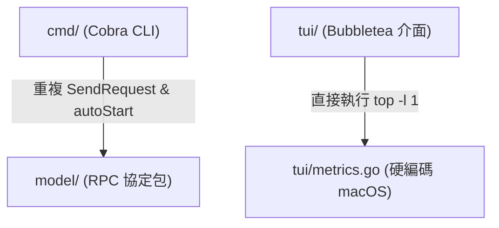
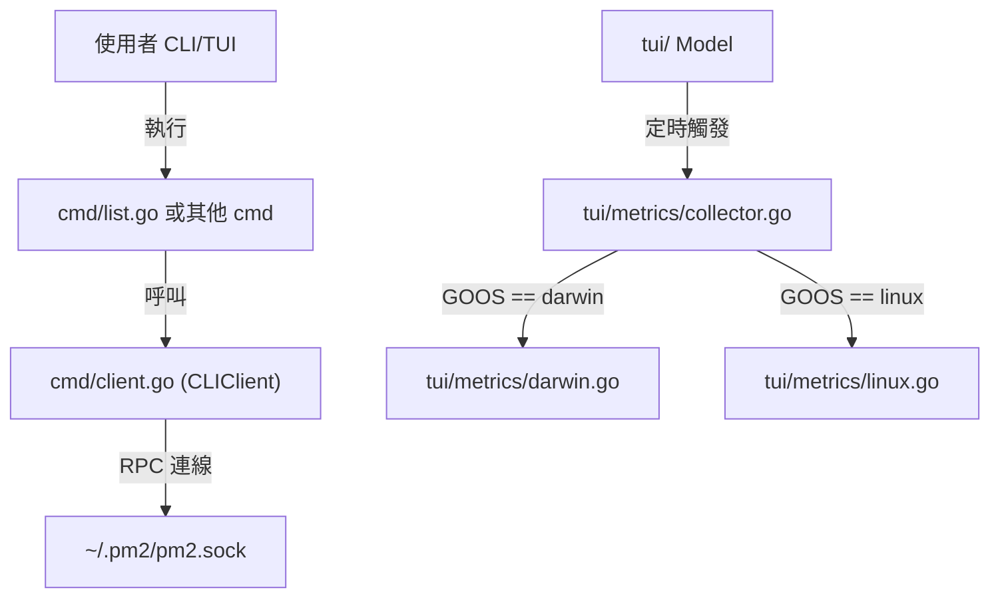

# 架構計畫 — cli-list-and-metrics (Architecture Plan)

## 1. 目標與範圍 (Goal & Scope)
讓使用者透過 `pm2 list` 非互動式列表指令與跨平台效能指標收集模組，能在不同作業系統上快速查詢行程狀態並穩定展示系統資源指標。

不做什麼 (out of scope)：
- 不修改守護行程 (`daemon`) 本身的程序註冊表 (`ProcessRegistry`) 鎖邏輯。
- 不設計任何與 `Loki` 或 `VictoriaMetrics` 等外部觀測後端對接的 `Go` 行程級推送邏輯。
- 不重新設計 `pm2 monit` 互動式畫面的佈局與 `Bubbletea` 事件處理架構。

## 2. 現況架構 (Current Architecture)
當前專案在 `cmd/root.go` 中註冊了多個命令，卻缺少最核心的 `pm2 list` 命令。目前用戶若想查看進程狀態，必須啟動互動式終端使用者介面 (`TUI`) 儀表板 `cmd/monitor.go`。這使得在腳本、自動化管線或簡單終端查詢時無法直接獲取狀態。

此外，命令列介面命令中遠端程序呼叫與自動啟動邏輯重複。在 `cmd/start.go`、`cmd/stop.go`、`cmd/logs.go` 以及 `cmd/monitor.go` 中，每個命令都手動重複編寫了呼叫 `model.SendRequest`、錯誤捕獲、嘗試以 `autoStartDaemon` 自動啟動守護進程，以及響應狀態檢查的代碼。

最後，指標收集為平台特定的 macOS 主機指標採集。在 `tui/metrics.go` 中，`collectHostMetrics` 函數直接執行了 `top` 命令行指令，並以 macOS 特有的字串模式解析 CPU 和記憶體佔用率。在 Linux 環境下執行該命令會直接報錯，進而使系統狀態展示回落至硬編碼的靜態值，缺乏跨平台的適應能力。

## 3. 架構位置與邊界 (Placement & Boundaries)
位置說明：
本變更主要位於 `cmd` 套件與 `tui` 套件中。
- 在 `cmd/client.go` 中新增 `CLIClient` 結構體，封裝 RPC 連線與守護進程自動啟動邏輯。
- 新增 `cmd/list.go` 模組，向 `rootCmd` 註冊 `list`、`ls`、`status` 命令。
- 在 `tui/` 下新增 `tui/metrics/` 子目錄，定義 `HostMetricsCollector` 介面，並實作跨平台採集。

邊界清單：
- `擁有` 職責：管理 CLI 與守護進程 socket 的通訊連線與自動拉起；提供非互動式進程狀態表格渲染；支援多平台（macOS、Linux 與預設 fallback）的主機效能採集。
- `不碰` 範圍：不修改進程生命週期管理器 `daemon/executor`，亦不改動傳輸層 `daemon/network` 與 `model/protocol.go` 的 JSON 協定格式。

## 4. 介面與資料流 (Interfaces & Data Flow)
介面表 (Interfaces)：

| 介面/函數名稱 | 輸入 (Input) | 輸出 (Output) | 錯誤情況 (Error Conditions) |
| :--- | :--- | :--- | :--- |
| `CLIClient.SendRequest(req model.Request)` | `req model.Request` (RPC 請求封裝) | `*model.Response, error` | 套接字連線失敗、自動拉起守護進程逾時或 daemon 回應異常 |
| `HostMetricsCollector.Collect()` | `無` | `cpu float64, mem float64, err error` | 系統工具執行失敗、特定系統檔案如 `/proc` 讀取拒絕 |
| `NewHostMetricsCollector()` | `無` | `HostMetricsCollector` | 無 (若平台不支援，則自動返回 fallback 靜態實例) |

資料流圖 (Data Flow Graph)：

## 5. 清晰與可擴充性檢查 (Clarity & Scalability Check)
1. 單一職責：是。`CLIClient` 專門負責 CLI 與守護進程之間的 RPC 連線與重試機制，不包含具體命令的業務細節；`HostMetricsCollector` 僅負責宿主機的性能指標獲取。
2. 依賴方向：是。無內層指向外層，且無循環相依。`tui/metrics/` 包完全獨立於 `tui/` 的渲染邏輯。
3. 可替換：是。平台特定的採集實作全部隔在 `HostMetricsCollector` 介面之後，可利用 Mock 物件進行測試注入。
4. 水平擴充：不適用。PM2 為單機守護工具，無水平擴充多個節點之需求。
5. 擴充點：是。若未來需要支援其他平台如 Windows，只需在 `tui/metrics/` 下新增 `windows.go` 並實作介面即可，不需變更 `tui/model.go` 等核心流程。

## 6. 漸進落地步驟 (Incremental Steps)
落地步驟表 (Incremental Steps Table)：

| 步驟 (Step) | 做什麼 (What) | 驗證 (Verify) | 回滾 (Rollback) |
| :--- | :--- | :--- | :--- |
| 1 | 實作 `cmd/client.go` 的 `CLIClient` 結構，重構 `cmd/start.go` 等重複 RPC 連線與自動啟動的代碼。 | 執行 `go test ./cmd/...` 確保測試通過。 | 使用 `git restore` 還原 `cmd/` 下已修改的檔案。 |
| 2 | 新增 `cmd/list.go` 模組，呼叫 `CLIClient` 取得進程清單，並用 `text/tabwriter` 輸出直觀的進程狀態表格。 | 執行 `go build -o pm2 .` 並執行 `./pm2 list` 確認表格格線筆直且無折行。 | 刪除 `cmd/list.go` 並在 `cmd/root.go` 移除對應的命令註冊。 |
| 3 | 在 `tui/metrics/` 中定義 `HostMetricsCollector` 介面與工廠方法，將 `darwin.go` 與 `linux.go` 的 top/proc 採集邏輯拆分，替換原 `tui/metrics.go`。 | 執行 `go test ./tui/...` 全綠，並在 macOS 與 Linux 平台分別執行 `pm2 monit` 驗證資源指標更新正常。 | 使用 `git restore` 回滾 `tui/` 目錄。 |

## 7. 風險與假設 (Risks & Assumptions)
- Linux 容器限制假設：在 Docker 容器或極嚴格的沙箱環境下，讀取 `/proc/stat` 與 `/proc/meminfo` 可能遭遇權限問題。我們假設該情況會發生，並在 `linux.go` 實作中加入強健的錯誤防護，一旦出錯即降級返回 `fallback.go` 的靜態安全預設值，避免程式崩潰。
- 窄終端下折行風險：在寬度低於 80 個字元的窄終端中，進程列表表格可能發生折行損壞。對策是當檢測到終端寬度過窄時，自動隱藏 CWD 或設定檔路徑等次要欄位。
