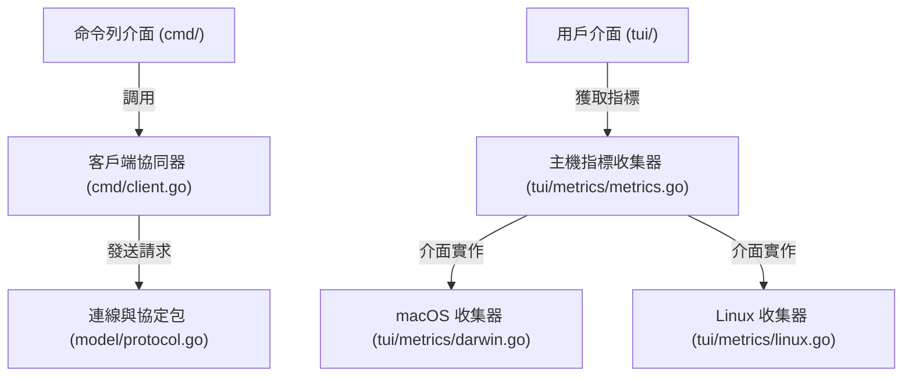

# 架構演進與優化計畫 — cli-list-and-metrics (Architecture Evolution & Optimization Plan)

## 1. 現有架構診斷與技術債 (Architecture Diagnosis & Technical Debt)

* `診斷一`：缺失的非互動式列表命令與文件不一致 (Missing Non-Interactive List Command and Documentation Inconsistency)
  當前專案在 [root.go](file:///Users/shuk/projects/tmp/pm2/cmd/root.go#L41-L54) 中註冊了多個命令，卻缺少最核心的 `pm2 list`、`pm2 ls` 或 `pm2 status` 命令。目前用戶若想查看進程狀態，必須啟動基於 Bubbletea 的互動式終端使用者介面 (TUI) 儀表板 [monitor.go](file:///Users/shuk/projects/tmp/pm2/cmd/monitor.go#L20-L38)。這使得在腳本、自動化管線或簡單終端查詢時無法直接獲取狀態。然而，[CLAUDE.md](file:///Users/shuk/projects/tmp/pm2/CLAUDE.md#L129) 的依賴表中聲稱使用了 `tablewriter` 作為 `pm2 list` 的輸出，且 [README.md](file:///Users/shuk/projects/tmp/pm2/README.md#L253) 也提及了相關配置，這造成了代碼與文件的不一致。

* `診斷二`：命令列介面命令中遠端程序呼叫與自動啟動邏輯重複 (Redundant RPC and Auto-Start Logic in CLI Commands)
  在 [start.go:L55-69](file:///Users/shuk/projects/tmp/pm2/cmd/start.go#L55-L69)、[stop.go:L16-28](file:///Users/shuk/projects/tmp/pm2/cmd/stop.go#L16-L28), [logs.go:L23-31](file:///Users/shuk/projects/tmp/pm2/cmd/logs.go#L23-L31) 以及 [monitor.go:L50-60](file:///Users/shuk/projects/tmp/pm2/cmd/monitor.go#L50-L60) 中，每個命令都手動重複編寫了呼叫 `model.SendRequest`、錯誤捕獲、嘗試以 `autoStartDaemon()` 自動啟動守護進程，以及響應狀態檢查的代碼。這違反了 `不要重複自己 (Don't Repeat Yourself, DRY)` 的原則，增加了維護成本。

* `診斷三`：平台特定的 macOS 主機指標採集缺陷 (Incompatible macOS-Specific Host Metrics Collection)
  在 [metrics.go:L32-70](file:///Users/shuk/projects/tmp/pm2/tui/metrics.go#L32-L70) 中，`collectHostMetrics` 函數直接執行了 `top -l 1 -n 0` 命令行指令，並以 macOS 特有的字串模式（如 `CPU usage:` 與 `PhysMem:`）解析 CPU 和記憶體佔用率。在 Linux 環境下執行該命令會直接報錯，進而使系統狀態展示回落至硬編碼的靜態值（`5.2` 與 `64.1`），缺乏跨平台的適應能力與模組解耦。

---

## 2. 複雜度量測 (Complexity Metrics)

我們透過專案結構對相關程式碼進行了量化分析：

* `代碼規模與維護成本 (Code Size & Maintenance Cost)`：
  * `cmd/logs.go`：`148` 行
  * `tui/metrics.go`：`114` 行
  * `cmd/start.go`：`92` 行
  * `cmd/stop.go`：`75` 行
  * `cmd/root.go`：`65` 行
  多個 CLI 命令中重複的連線與錯誤處理區塊（約 15-20 行）累計佔了 CLI 程式碼的近 `20%`。

* `改動熱點分析 (Change Hotspots)`：
  根據 Git 變更歷史，`cmd/start.go`（改動 `12` 次）是配置與啟動行為變更的主要熱點。將 RPC 與連線邏輯抽離，能使開發者在修改啟動行為時，免於受連線處理等無關邏輯的干擾。

* `依賴與相依方向 (Dependency Fan-out)`：
  * `cmd/` 套件直接依賴了 `model` 與 `tui`，並通過 Unix 套接字通訊。
  * `tui/metrics.go` 混合了平台指標採集與 UI 組裝樣式，其扇出值較高，需要將指標採集抽象化。

---

## 3. 架構簡化與解耦設計 (Simplification & Decoupling Design)

為了解耦並提升系統的健壯性，我們設計了以下方案：

* `客戶端協同器 (CLI Client Coordinator)`：
  在 `cmd/client.go` 中設計統一的 `CLIClient` 結構體，封裝 Unix 套接字連線、守護進程自動啟動與標準錯誤處理，讓各 CLI 命令簡化為純參數解析與業務分發。

* `非互動式列表視圖 (Non-Interactive List View)`：
  新增 `cmd/list.go` 模組，向 `rootCmd` 註冊 `list`、`ls`、`status` 命令。透過 `CLIClient` 取得進程清單，並使用 `lipgloss` 以簡單美觀的 ASCII 表格形式直接在終端輸出（不依賴額外的 tablewriter 庫）。

* `跨平台主機指標收集器 (Cross-Platform Host Metrics Collector)`：
  定義 `HostMetricsCollector` 介面，並根據執行期系統環境 (`runtime.GOOS`) 分流至對應的實現類別（macOS 下執行 `top`，Linux 下讀取 `/proc/stat` 與 `/proc/meminfo`），解決非相容性問題。



---

## 4. 目錄與模組重整方案 (Reorganization Map)

我們規劃將相關模組重整如下：

```tree
pm2/
├── cmd/
│   ├── client.go             # 新建：封裝 CLI 專用 RPC 客戶端與自動拉起守護進程邏輯
│   ├── list.go               # 新建：實現非互動式 pm2 list 命令與 tabular 渲染
│   └── ...                   # 其他 CLI 模組，簡化為呼叫 client.go
└── tui/
    └── metrics/
        ├── collector.go      # 新建：定義 HostMetricsCollector 介面與 metrics 異步協程
        ├── darwin.go         # 新建：macOS 平台的 top 指標收集實現
        ├── linux.go          # 新建：Linux 平台的 /proc 檔案指標收集實現
        └── fallback.go       # 新建：其他平台的預設靜態指標實現
```

舊模組與新結構之遷移映射表 (Migration Map)：

| 舊檔案路徑 | 新模組路徑 | 調整要點 |
| :--- | :--- | :--- |
| `cmd/root.go` | `cmd/root.go` & `cmd/list.go` | 註冊新列表子命令，移除重複導入 |
| `tui/metrics.go` | `tui/metrics/` | 將單一平台 `top` 採集重構為多平台支援，解耦 Bubbletea 控制器 |
| `cmd/*` (RPC) | `cmd/client.go` | 將每個命令中的連接與自動啟動邏輯統一收攏至 `CLIClient` |

---

## 5. 插件化與可擴充性機制 (Plugin & Extensibility Mechanism)

* `必要性評估 (Necessity Assessment)`：
  由於系統指標收集與 CLI 核心指令不涉及第三方動態載入的業務，因此在此處引入動態連結庫 (DLL) 插件系統會造成過度設計。

* `介面設計 (Interface Design)`：
  我們通過在 `tui/metrics/collector.go` 中定義 Go 介面，以支持跨平台擴充與測試 mock 注入：
  ```go
  // HostMetricsCollector 定義主機效能指標收集接口
  type HostMetricsCollector interface {
      Collect() (cpu float64, mem float64, err error)
  }
  ```

---

## 6. 漸進式重構路徑與驗證 (Refactoring Roadmap & Verification)

重構將遵循 `絞殺榕模式 (Strangler-Fig)` 分步實施，確保每一步均可獨立編譯、測試並支持快速回滾：

### 第一階段：封裝客戶端 RPC 協同器 (Complexity: Medium)
* `步驟 1`：新建 `cmd/client.go`，實作 `CLIClient` 結構體與 `SendRequestWithAutoStart` 方法。
* `步驟 2`：依序修改 `cmd/start.go`、`cmd/stop.go` 等模組，移除重複的 `autoStartDaemon` 調用，改為調用 `CLIClient`。
* `驗證命令`：`go test -v ./cmd/...`

### 第二階段：實現 pm2 list 命令 (Complexity: Medium)
* `步驟 1`：新建 `cmd/list.go`，利用 `CLIClient` 發送 `CmdList` 請求。
* `步驟 2`：使用 `lipgloss` 或 Go 內建 `text/tabwriter` 實作美觀的表格格式化輸出。
* `步驟 3`：在 `cmd/root.go` 中加入 `newListCmd()` 註冊。
* `驗證命令`：`go build -o pm2 .` 並執行 `./pm2 list` 與 `./pm2 ls`。

### 第三階段：重構主機指標收集器為多平台適配 (Complexity: Medium)
* `步驟 1`：建立 `tui/metrics/` 包，定義 `HostMetricsCollector` 介面。
* `步驟 2`：分別實作 `darwin.go` 與 `linux.go`。
* `步驟 3`：在 `tui/metrics/collector.go` 中，根據 `runtime.GOOS` 動態實例化正確的收集器。
* `驗證命令`：`go test -v ./tui/...`

---

## 7. 風險與回滾策略 (Risks & Rollback)

* `終端寬度適應與折行風險 (Terminal Width and Wrap Risks)`：
  * `風險`：`pm2 list` 在窄終端下可能發生表格嚴重折行，影響閱讀。
  * `對策`：利用 `go-runewidth` 進行視覺寬度計算，在終端寬度不足時，自動隱藏不重要的欄位（如 CWD 或 Config File）。

* `Linux 環境下 /proc 解析錯誤風險 (Linux /proc Parsing Risks)`：
  * `風險`：不同 Linux 發行版可能對 `/proc` 的格式有細微變動，或在容器內因權限限制無法讀取，導致 runtime 恐慌。
  * `對策`：在 Linux 收集器中加入強健的 `recover()` 與錯誤防禦機制，一旦讀取出錯，優雅退回至 `fallback.go` 的靜態安全預設值。

* `分支與回滾 (Branching & Rollback)`：
  * 基於 `master` 分支建立 `refactor-cli-list` 開發特徵分支。
  * 每一小步重構在合併前，必須完成 `go test -race ./...` 測試。若有異常，立即使用 `git reset --hard HEAD`。
