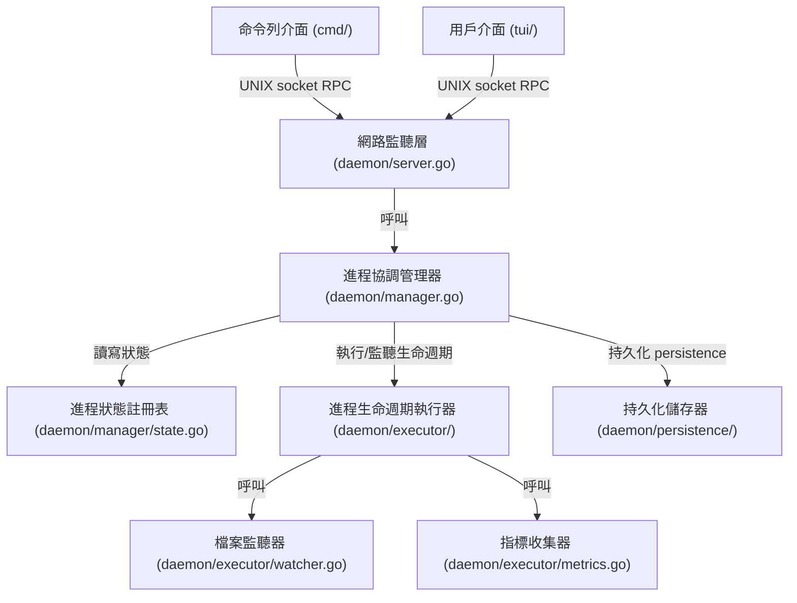

# 架構演進與優化計畫 — daemon-decoupling-phase3 (Architecture Evolution & Optimization Plan)

## 1. 現有架構診斷與技術債 (Architecture Diagnosis & Technical Debt)

* `診斷一`：守護進程伺服器 (Server) 職責過多 (Monolithic Server Struct Responsibility)
  在 [server.go](../daemon/server.go) 中，`Server` 結構體同時維護了網路監聽 (`Listen` 與 `handleConn` 的連線讀寫與協定路由分發)、進程啟動 (`launchProcess`/`startApp`)、生命週期監控 (`watchProcess`) 與停止邏輯 (`stopProcess`)。這不符合單一職責原則 (Single Responsibility Principle)，導致任何一處的修改都可能影響到不相干的邏輯。

* `診斷二`：裸露的進程 map 與鎖機制 (Unencapsulated Process Map and Manual Locking)
  在 [server.go](../daemon/server.go#L30) 中，進程狀態儲存為裸露的 `processes map[string]*ManagedProcess`。所有的讀寫操作（例如在 [manager.go](../daemon/manager.go) 中的 `listAll`/`findProcesses`/`deleteByName`）均需顯式調用 `s.mu.RLock()` / `s.mu.RUnlock()`。這種手動鎖機制容易在後續修改中引發漏加鎖或死鎖，且狀態讀寫並未對外封裝。

* `診斷三`：檔案監聽器與伺服器邏輯強耦合 (Coupled File Watcher and Server Logic)
  在 [watcher.go](../daemon/watcher.go#L19) 中，`startFileWatcher` 作為 `Server` 的成員方法，並在檔案觸發變更後直接呼叫 `s.restartByName(pName)`。這使得檔案監聽與 `Server` 的其他機制強耦合，難以獨立進行單元測試。

* `診斷四`：進程生命週期執行邏輯未隔離 (Process Lifecycle Execution Logic Not Isolated)
  在 [server.go](../daemon/server.go#L514) 中，`watchProcess` 負責監聽進程退出事件、控制崩潰重啟與次數累加。它是一個運行在背景的 Goroutine，直接讀寫 `Server` 的共享狀態且與 `Server` 強綁定，應當抽離至專屬的執行器 (Executor) 以實現作業系統 IO 與進程管理的隔離。

## 2. 複雜度量測 (Complexity Metrics)

我們透過程式碼與 Git 歷史進行了結構量化分析：

* 代碼規模與高複雜度熱點 (Code Size and High-Complexity Hotspots)
  當前專案總代碼量約為 `7,241` 行。主要 Go 原始碼檔案為：
  * [server_test.go](../daemon/server_test.go)：`1431` 行
  * [server.go](../daemon/server.go)：`700` 行
  * [metrics.go](../daemon/metrics.go)：`154` 行
  * [manager.go](../daemon/manager.go)：`87` 行
  * [watcher.go](../daemon/watcher.go)：`58` 行
  * [builder.go](../daemon/builder.go)：`48` 行

* 改動熱點分析 (Change Hotspots)
  在過去 12 個月的提交歷史中，改動頻率最高的檔案為：
  * [server.go](../daemon/server.go)：改動 `16` 次
  * [model.go](../tui/model.go)：改動 `14` 次
  * [start.go](../cmd/start.go)：改動 `12` 次

* 依賴與扇入扇出分析 (Dependency and Fan-in/out)
  `daemon/server.go` 引入了 `model/`、`cron/`、`process/`、`fsnotify/` 等，其扇出 (Fan-out) 值最高，為整個守護進程包的核心上帝對象 (God Object)。

## 3. 架構簡化與解耦設計 (Simplification & Decoupling Design)

為了徹底消除上帝對象，我們提出以下解耦架構，將其劃分為四個專門模組，並明訂單向依賴方向（只能由外層指向內層，或引入抽象介面以實現依賴反轉）：

* 網路傳輸層 (Network & Transport Layer)：
  僅負責監聽 UNIX 套接字並反序列化請求，將其路由至核心管理器。
* 進程協調管理器 (Management & Coordinating Layer)：
  負責業務層級的操作（如 start, stop, restart, delete, list, save, resurrect），協調註冊表與執行器。
* 進程狀態註冊表 (Registry & State Layer)：
  封裝執行期線程安全的進程狀態，管理命名空間，不涉及作業系統 IO 運作。
* 進程執行與基礎設施層 (Execution & Infrastructure Layer)：
  處理單一進程的生命週期（啟動、重啟、停止、環境變數處理）以及進程組信號發送，以及獲取指標數據與檔案監聽。



## 4. 目錄與模組重整方案 (Reorganization Map)

我們規劃將原有的 `daemon/` 目錄拆分重整，確保職責單一與層級依賴方向合規：

```tree
pm2/
└── daemon/
    ├── server.go             # 僅負責 Unix socket 連線監聽與請求協定分發
    ├── manager.go            # 負責請求的調度邏輯，作為 Registry 與 Executor 的中介者
    ├── manager/
    │   └── state.go          # 新建：線程安全的 ProcessRegistry 封裝 (含 processes map 與 mu)
    ├── executor/
    │   ├── executor.go       # 新建：負責進程組啟動、等待 (watchProcess) 與停止
    │   ├── builder.go        # 遷移：負責組裝 exec.Cmd 參數 (原 daemon/builder.go)
    │   ├── watcher.go        # 遷移：負責 fsnotify 檔案變更監聽 (原 daemon/watcher.go)
    │   └── metrics.go        # 遷移：負責進程 CPU/Memory 指標異步採集 (原 daemon/metrics.go)
    └── persistence/
        └── file.go           # 遷移：負責 dump.json 檔案持久化與回復 (原 daemon/persistence.go)
```

舊模組與新結構之遷移映射表 (Migration Map)：
* `processes map` -> `daemon/manager/state.go` 的 `ProcessRegistry`
* `daemon/builder.go` -> `daemon/executor/builder.go`
* `daemon/watcher.go` -> `daemon/executor/watcher.go`
* `daemon/metrics.go` -> `daemon/executor/metrics.go`
* `daemon/persistence.go` -> `daemon/persistence/file.go`
* `daemon/server.go` 的連線與 RPC 分發 -> `daemon/server.go`
* `daemon/server.go` 的 launchProcess, watchProcess, stopProcess -> `daemon/executor/executor.go`

## 5. 插件化與可擴充性機制 (Plugin & Extensibility Mechanism)

* 必要性評估 (Necessity Assessment)
  作為輕量化單機進程管理器，本專案的潛在擴充需求（例如替換日誌輸出目標至 Loki、支持容器化進程執行）少於 3 個。在現階段引入基於 `plugin` 包的動態加載機制或基於 gRPC 的進程外插件框架，會引入不必要的動態鏈結與運行期調度負擔，屬於明顯的過度設計 (Over-engineering)。

* 最簡可行擴充設計 (MVE Design)
  我們將通過在重構後的 `daemon/executor` 中定義 Go 介面，以利於單元測試的 mock 注入：
  ```go
  // ProcessExecutor 定義單一進程生命週期接口
  type ProcessExecutor interface {
      Start(name string, req *model.AppStartReq) (process.ProcessInfo, error)
      Stop(mp *ManagedProcess) error
  }
  ```

## 6. 漸進式重構路徑與驗證 (Refactoring Roadmap & Verification)

本重構完全遵循絞殺榕模式 (Strangler-Fig Pattern)，將重構拆分為小步。每一步皆可獨立編譯、測試並支持快速回滾。

### 第一階段：建立並封裝狀態註冊表 (Encapsulate Registry)
* 步驟 1：建立 `daemon/manager/state.go`，實作執行期線程安全的 `ProcessRegistry`，提供 `Add`, `Get`, `Remove`, `List` 操作。
* 步驟 2：修改 `Server`，將內部的裸露 map 變數與 lock 替換為 `ProcessRegistry`。
* 驗證命令：`go test -race -v ./daemon/...`

### 第二階段：抽離執行器模組 (Extract Executor)
* 步驟 1：建立 `daemon/executor/`，將 `builder.go`、`watcher.go`、`metrics.go` 搬移至此。
* 步驟 2：在 `executor.go` 中實作進程的 `Start`, `Wait`, `Stop` 生命週期邏輯，將 `server.go` 中的 `launchProcess`、`watchProcess`、`stopProcess` 遷移至此。
* 驗證命令：`go test -race -v ./daemon/...`

### 第三階段：持久化模組解耦 (Decouple Persistence)
* 步驟 1：建立 `daemon/persistence/`，將 `persistence.go` 內容遷移至 `daemon/persistence/file.go`。
* 步驟 2：使其僅依賴於 `ProcessRegistry` 的 `List()` 方法或配置快照來保存與讀取狀態，不直接與 `Server` 耦合。
* 驗證命令：`go test -race -v ./daemon/...`

### 第四階段：網路傳輸層解耦 (Decouple Network Layer)
* 步驟 1：重構 `daemon/server.go` 中的 `Listen` 與 `handleConn`，使其僅負責 Socket 的生命週期管理與 `model.Request` 的解包分發，所有的業務操作皆路由至 `daemon/manager.go`。
* 驗證命令：`go test -race -v ./...`

## 7. 風險與回滾策略 (Risks & Rollback)

* 循環引用編譯失敗風險 (Circular Dependency Risks)：
  * 風險：由於 `daemon` 下多個包互相依賴，可能導致 Go 編譯器報 `import cycle not allowed` 錯誤。
  * 对策：嚴格實施從外向內、從高層向底層的單向依賴方針。`executor` 與 `manager` 不得引用 `network` 包；如果需要反向傳遞狀態，應利用回呼函數 (Callback) 或通道 (Channel) 傳輸數據。

* 記憶體快照與持久化狀態不一致風險 (State Inconsistency Risks)：
  * 風險：重構 `ProcessRegistry` 時若鎖的細粒度控制不當，可能會導致 `save()` 持續化與記憶體狀態在極端併發下不一致。
  * 對策：持久化 `save()` 必須繼續採用 `RLock` 的快照機制，在持鎖期間完成對照表的拷貝後立即釋放鎖，並在鎖外進行磁碟寫入 IO 操作。

* 回滾路徑與分支策略 (Rollback Pathway & Branching Strategy)：
  * 每次重構步驟均基於當前穩定的 `master` 分支建立獨立的重構特徵分支（例如 `refactor-registry`、`refactor-executor`）。
  * 每一小步重構在合併前，必須完成 `go test -race ./...` 測試。若發現未預期的運行崩潰或死鎖，立即執行 `git reset --hard HEAD`，確保不影響工作區開發。
