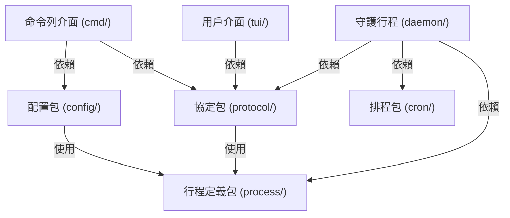

# 架構演進與優化計畫 — decouple-daemon (Architecture Evolution & Optimization Plan)

## 1. 現有架構診斷與技術債 (Architecture Diagnosis & Technical Debt)

我們對現有 `pm2` 專案進行了架構審查與技術債診斷，發現了以下關鍵的結構耦合與技術債問題：

### 1.1 傳輸協定與守護行程實作強耦合 (Protocol and Daemon Implementation Coupling)
在當前設計中，RPC 傳輸協定定義 [protocol.go](../daemon/protocol.go) 放置於 `daemon/` 目錄下。這導致命令列介面 CLI [cmd/](../cmd/) 與用戶介面 TUI [tui/](../tui/) 在調用 RPC 傳輸方法時，被迫導入整個 `daemon` 軟體包。這違反了 `單向依賴原則 (Single Dependency Principle)`，高層的展示層與命令控制層直接依賴了底層守護行程的核心實作（包含進程生命周期管理、文件監聽等）。

### 1.2 進程配置結構定義多重重複 (Redundant Application Configuration Structs)
系統中存在三個結構高度相似的進程配置定義：
- [ecosystem.go](../config/ecosystem.go#L15) 中的 `config.AppConfig`：用於解析生態文件。
- [protocol.go](../daemon/protocol.go#L36) 中的 `daemon.AppStartReq`：用於網路傳輸。
- [types.go](../process/types.go#L47) 中的 `process.DumpEntry`：用於持久化存檔。
這三個結構體包含完全相同的屬性欄位，造成了維護上的冗餘。若未來要新增配置項目，必須同步在三處修改，極易遺漏。

### 1.3 進程狀態與鎖機制未封裝 (Unencapsulated Process State and Mutex Locks)
在 [server.go](../daemon/server.go) 中，`Server` 結構體直接暴露了其成員 `processes` Map 變數。在核心的進程管理邏輯中，開發人員必須手動透過 `s.mu.Lock()` 與 `s.mu.Unlock()` 來維護併發安全。這種裸露的 Map 讀寫與手動鎖定極易因忘記釋放鎖而導致死鎖，或是因忘記加鎖而導致併發衝突。

---

## 2. 複雜度量測 (Complexity Metrics)

我們透過客觀量測得出了專案的結構量化數據：

### 2.1 模組改動頻率分析 (Git Hotspots)
根據 Git 提交紀錄分析，過去 12 個月改動最頻繁的 Go 檔案依序為：
- [server.go](../daemon/server.go)：改動 `16` 次 (核心控制邏輯，也是目前最龐大的檔案)。
- [model.go](../tui/model.go)：改動 `14` 次 (TUI 行為邏輯)。
- [start.go](../cmd/start.go)：改動 `12` 次 (CLI 啟動流程)。
- [types.go](../process/types.go)：改動 `9` 次 (資料模型與結構定義)。

### 2.2 檔案行數分析 (Code Size & Complexity Hotspots)
主要模組代碼行數分佈如下：
- `daemon/server.go`：`679` 行 (包含連線監聽、RPC 路由分發與進程管理)。
- `tui/renderer.go`：`512` 行 (視圖渲染)。
- `tui/model.go`：`359` 行 (Bubbletea 行為處理)。
- `config/ecosystem.go`：`181` 行 (生態配置加載)。

為了降低複雜度，必須對 [server.go](../daemon/server.go) 與其通訊協定進行解耦，將其職責分散到各自的專用模組中。

---

## 3. 架構簡化與解耦設計 (Simplification & Decoupling Design)

為了解耦 RPC 傳輸並消除重複的進程配置定義，我們設計了以下架構簡化方案：

### 3.1 職責拆分
- `協定包 (protocol)`：僅負責網路連線、請求序列化/反序列化與基礎傳輸模型，不涉及任何守護行程邏輯。CLI 與 TUI 只依賴此輕量包。
- `進程註冊表 (registry)`：將進程 Map 及相關的讀寫鎖封裝成執行期線程安全進程註冊表，避免在業務代碼中手動解鎖。
- `配置統一 (unified config)`：在 `process` 包中定義一個通用的進程配置結構體，供生態配置解析、網路傳輸與持久化存檔共同使用。

### 3.2 依賴方向圖 (Dependency Direction Diagram)



---

## 4. 目錄與模組重整方案 (Reorganization Map)

我們規劃將原有的 `daemon/protocol.go` 與 `daemon/` 內部代碼進行重整，並確立嚴格的單向依賴：

```tree
pm2/
├── cmd/                      # 命令行 Cobra 模組
├── config/                   # 生態配置文件解析器
├── cron/                     # 排程管理器
├── process/                  # 進程與配置結構定義
│   ├── types.go              # ProcessInfo 與統一的 AppConfig
│   └── registry.go           # 新建：線程安全的 ProcessRegistry 封裝
├── protocol/                 # 新建：獨立的 RPC 協定與客戶端連接工具
│   └── protocol.go           # Request/Response 與 SendRequest
└── daemon/                   # 守護進程核心
    ├── server.go             # 僅負責 Socket 監聽與 RPC 路由
    ├── manager.go            # 進程控制操作 (start, stop, delete, list)
    ├── persistence.go        # 進程存檔與讀取
    └── metrics.go            # 異步效能監控指標收集
```

### 舊代碼遷移映射表 (Migration Map)

| 舊檔案路徑 | 新模組路徑 | 調整要點 |
| :--- | :--- | :--- |
| `daemon/protocol.go` | `protocol/protocol.go` | 獨立出 RPC 協定，避免 `tui` 與 `cmd` 引用 `daemon` 核心包 |
| `daemon/server.go` (processes Map) | `process/registry.go` | 將 `s.processes` 對照表與 `sync.RWMutex` 封裝為 `ProcessRegistry` |
| `daemon.AppStartReq` / `process.DumpEntry` | `process.AppConfig` (統一) | 消除重複結構，全面在 `config`, `protocol`, `daemon` 中複用同一個進程配置定義 |

---

## 5. 插件化與可擴充性機制 (Plugin & Extensibility Mechanism)

基於簡潔性原則，本系統不需要引進複雜的動態插件加載機制 (如 Go plugin)。我們設計了基於 `Interface` 的靜態擴充方案，便於後續將存檔媒介由 JSON 轉換至 SQLite 等其他介質：

### 5.1 持久化存檔介面 (StateStore Interface)
```go
type StateStore interface {
    Save(entries []process.AppConfig) error
    Load() ([]process.AppConfig, error)
}
```

---

## 6. 漸進式重構路徑與驗證 (Refactoring Roadmap & Verification)

我們採用 `絞殺榕模式 (Strangler-Fig)` 分布實施，確保每一步都可獨立編譯、測試並支持快速回滾：

### Phase 1：統一進程配置定義 (Unified Process Configuration)
1. 在 [types.go](../process/types.go) 中建立統一的 `AppConfig` 結構。
2. 重構 `config.AppConfig` 與 `daemon.AppStartReq`，使其直接複用或替換為 `process.AppConfig`。
3. 驗證命令：`go test -v ./config/...`

### Phase 2：抽出 RPC 協定包 (Extract RPC Protocol Package)
1. 新增 `protocol/` 目錄並將原 `daemon/protocol.go` 內容遷移過去。
2. 更新 `cmd` 與 `tui` 對協定的導入路徑，改為導入 `github.com/bizshuk/pm2/protocol`。
3. 驗證命令：`go test -v ./cmd/... ./tui/...`

### Phase 3：封裝進程註冊表 (Encapsulate Process Registry)
1. 實作 `process.ProcessRegistry`，提供執行期線程安全的 `Add`, `Get`, `Remove`, `List` 操作。
2. 修改 `daemon` 的 `Server` 成員變數，以 `ProcessRegistry` 替換原有的裸露 Map 變數。
3. 驗證命令：`go test -race -v ./daemon/...`

---

## 7. 風險與回滾策略 (Risks & Rollback)

### 7.1 RPC 傳輸協議兼容性風險 (Protocol Compatibility Risk)
- `問題`：重構協定時如果變更了 JSON tag 名稱，會導致 CLI/TUI 無法與舊版守護行程通訊。
- `策略`：在重構前後必須維持結構體的 JSON tag 完全一致。

### 7.2 循環依賴導致編譯失敗風險 (Circular Dependency Risk)
- `問題`：`daemon` 與 `protocol` 之間若產生雙向相依，會導致 Go 編譯失敗。
- `策略`：嚴格遵守 `protocol` 包絕不導入 `daemon` 包的原則。
