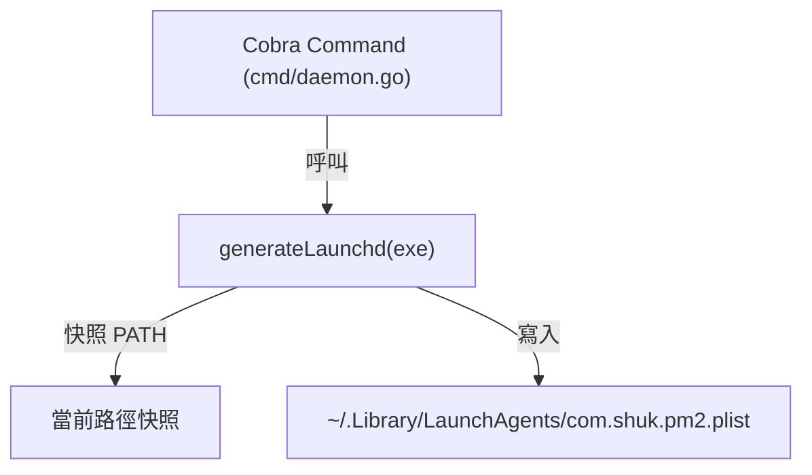
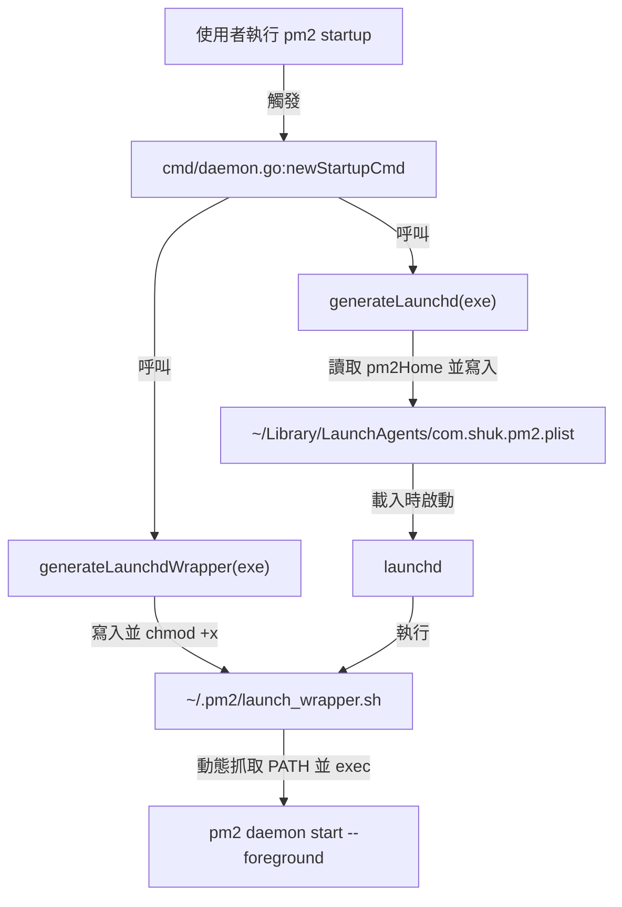

# 架構計畫 — dynamic-path-wrapper (Architecture Plan)

## 1. 目標與範圍 (Goal & Scope)
讓 `launchd` 拉起 `pm2` daemon 時能動態取得 macOS 最新的 `PATH`，避免硬編碼環境變數。

不做什麼 (out of scope)：
- 不修改 `pm2` daemon 本身載入環境變數的 Go 程式碼。
- 不修改 `pm2 start` 時將 CLI `os.Environ()` 複製到 `AppStartReq.BaseEnv` 的邏輯。
- 不支援 Windows 或 Linux (systemd) 的動態路徑包裝（本功能僅針對 macOS launchd 限制）。

## 2. 現況架構 (Current Architecture)
頂層結構中，開機啟動設定生成位於 `cmd/daemon.go` 中。
現況下，`pm2 startup` 指令呼叫 `generateLaunchd(exe)`，該函數會將當前 CLI 進程的 `os.Getenv("PATH")` 快照並寫入 plist 檔的 `EnvironmentVariables`。

## 3. 架構位置與邊界 (Placement & Boundaries)
位置說明：
本變更主要位於 `cmd` 套件，透過新增一個輔助函數 `generateLaunchdWrapper(exe string) error` 來處理包裝腳本的產生。plist 的產生邏輯 `generateLaunchd(exe)` 將進行微調，移除硬編碼的 `PATH` 並指向此腳本。

邊界清單：
- `擁有` 職責：產生 `~/.pm2/launch_wrapper.sh` 腳本檔案，並設定其權限為可執行 (`0755`)；產生不含 `EnvironmentVariables` 的 plist 檔案，其啟動路徑指向該腳本。
- `不碰` 範圍：不修改進程管理核心 `daemon` 套件，亦不修改 CLI 與 daemon 之間的通訊協定 `model/protocol.go`。

## 4. 介面與資料流 (Interfaces & Data Flow)
介面表 (Interfaces)：

| 介面/函數名稱 | 輸入 (Input) | 輸出 (Output) | 錯誤情況 (Error Conditions) |
| :--- | :--- | :--- | :--- |
| `generateLaunchdWrapper(exe string)` | `exe string` (pm2 執行檔絕對路徑) | `error` | 建立/寫入腳本失敗，或修改權限 (`os.Chmod`) 失敗 |
| `generateLaunchd(exe string)` | `exe string` (pm2 執行檔絕對路徑) | `error` | 建立或寫入 `.plist` 檔案失敗 |

資料流圖 (Data Flow Graph)：

## 5. 清晰與可擴充性檢查 (Clarity & Scalability Check)
1. 單一職責：是。新生成的 `launch_wrapper.sh` 僅負責 macOS 環境下的 `PATH` 獲取與轉發，`generateLaunchdWrapper` 也僅負責包裝腳本的生成。
2. 依賴方向：是。無內層指向外層，且無循環相依。
3. 可替換：不適用。
4. 水平擴充：不適用。
5. 擴充點：是。若未來需要支援其他 macOS 環境特有的動態變數（如 `NVM_DIR` 等），只需在包裝腳本的生成模版中新增偵測邏輯，不需修改 Go 核心代碼。

## 6. 漸進落地步驟 (Incremental Steps)
落地步驟表 (Incremental Steps Table)：

| 步驟 (Step) | 做什麼 (What) | 驗證 (Verify) | 回滾 (Rollback) |
| :--- | :--- | :--- | :--- |
| 1 | 實作 `generateLaunchdWrapper` 並修改 `generateLaunchd` 以寫入包裝腳本並更新 plist 設定。 | `go test ./...` 通過。 | 使用 `git checkout` 還原 `cmd/daemon.go`。 |
| 2 | 在 macOS 測試環境執行 `pm2 startup` 產生新版腳本與 plist。 | 檢查 `~/.pm2/launch_wrapper.sh` 是否存在且為 `0755` 權限；確認 `~/Library/LaunchAgents/com.shuk.pm2.plist` 指向該腳本。 | 手動刪除產生的檔案。 |
| 3 | 使用 `launchctl load` 測試啟動。 | 確認 daemon 成功拉起且能正確解析動態 `PATH` 下的指令（如 brew 安裝的指令）。 | 使用 `launchctl unload` 卸載設定。 |

## 7. 風險與假設 (Risks & Assumptions)
- `launch_wrapper.sh` 被手動刪除的風險：若使用者手動刪除 `~/.pm2/launch_wrapper.sh`，`launchd` 將無法拉起服務。假設使用者透過正常的 `pm2 startup` 與 `pm2 uninstall/setup` 管理啟動。
- 多用戶權限假設：假設執行 `pm2 startup` 的使用者對其 `~/.pm2` 和 `~/Library/LaunchAgents` 目錄具有讀寫權限。
