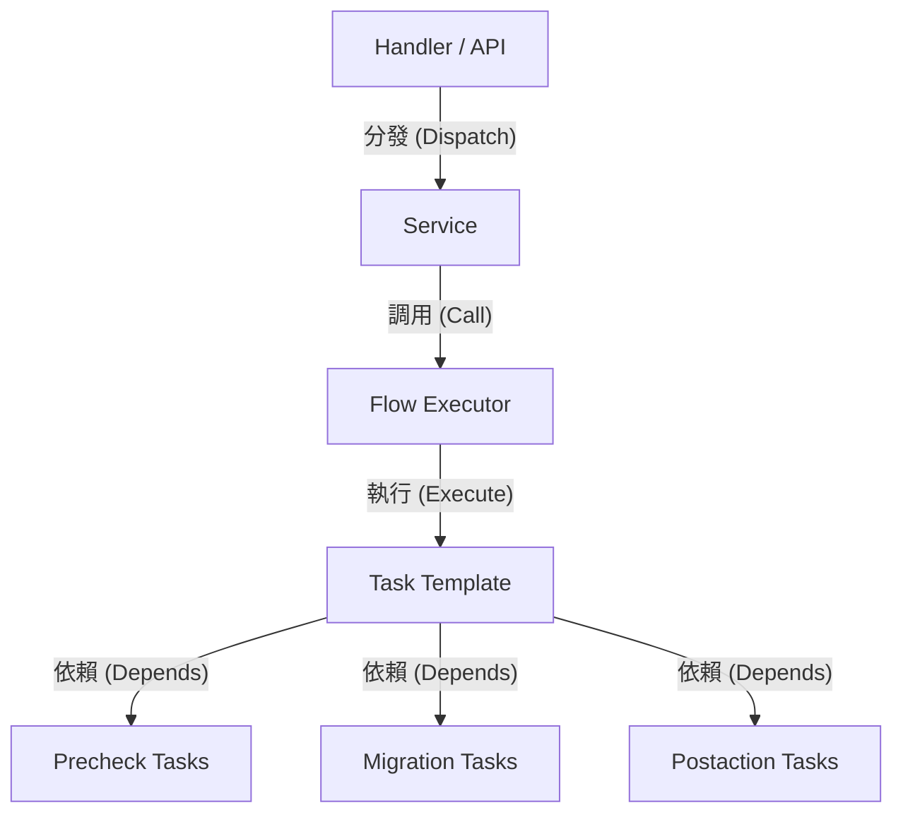

# 架構演進與優化計畫 — wallet-migrate-core (Architecture Evolution & Optimization Plan)

## 1. 現有架構診斷與技術債 (Architecture Diagnosis & Technical Debt)

* `平坦化的任務套件 (Flat Task Package)`：`internal/migratetask` 目錄下堆積了 82 個平坦的手寫 Go 原始碼檔案 (Go source code files)，將前置檢查 (Pre-check)、核心同步 (Sync)、後置解鎖 (Post-action)、重試邏輯 (Retry) 以及單元測試 (Unit Test) 全數混雜在單一套件 (Single Package) 中，違反了單一職責原則 (Single Responsibility Principle, SRP)。
* `基於睡眠的順序控制技術債 (Sleep-based Ordering Smell)`：在 `TaskTemplate.Execute` 中透過硬編碼 (Hardcode) `time.Sleep` 延遲 `1` 秒或 `200` 毫秒，來強行拉開資料庫中 `create_time` 或 `update_time` 的時間戳 (Timestamp) 差距，以確保排序一致。這對大規模使用者遷移 (Mass User Migration) 是災難性的效能瓶頸 (Performance Bottleneck)，嚴重限制了併發吞吐量 (Throughput)。
* `膨脹的單體狀態機 (Bloated Monolithic State Machine)`：`StoreRegionMigrationFlow` 定義了包含 39 個狀態的巨大列舉 (Huge Enum) `StoreRegionChangeMigrationStatus` (定義區間跨越原始碼第 37 行至第 75 行)，並依賴複雜的硬編碼 (Hardcode) `switch` 分支，狀態之間以 `iota` 自動遞增。一旦因功能變更 (Feature Change) 在列舉中間插入或刪除狀態，將導致資料庫舊字串與程式狀態映射 (Mapping) 不一致，具有極高的線上資料狀態損壞 (Data State Corruption) 風險。
* `過時的注釋與死程式碼 (Commented-out & Dead Code)`：`vregion_switch.go` 流程控制 (Flow Control) 中包含大量被注釋掉的狀態定義與過時的邏輯映射 (Logic Mapping)，阻礙新進開發人員理解現行架構。

## 2. 複雜度量測 (Complexity Metrics)

* `檔案分佈 (File Distribution)`：手寫 Go 原始碼檔案 (Go source code files) 共 255 個，其中 `internal/migratetask` 下有 82 個 (32.2%)，高度集中。
* `頻繁改動熱點 (Frequently Modified Hotspots)`：過去 12 個月改動次數最多的檔案包括：`service/flow/vregion_switch.go` (12次)、`config/feature_toggle.go` (11次)、`internal/migratetask/post_action_remove_global_lock.go` (6次)。這顯示流程控制與鎖釋放任務是最不穩定的核心熱點 (Core Hotspots)。

## 3. 架構簡化與解耦設計 (Simplification & Decoupling Design)

* `時間戳睡眠解耦 (Timestamp Sleep Decoupling)`：移除 `time.Sleep` 邏輯，改在資料表結構 (Database Schema) 中引入遞增的序號欄位 (Sequence ID)，或者以資料庫自動遞增的主鍵 (Primary Key) `ID`（例如雪花 ID (Snowflake ID)）作為任務排序與歷史紀錄的絕對依據。
* `任務職責隔離 (Task Responsibility Isolation)`：將 `internal/migratetask` 拆解為三大子模組：前置驗證與清理 (Pre-check & Cleanup) `precheck`、資料遷移 (Data Migration) `migration`、後置切換與解鎖 (Post-action & Unlock) `postaction`。



## 4. 目錄與模組重整方案 (Reorganization Map)

* 目錄調整映射表：

| 舊檔案路徑 (Old File Path) | 新路徑 (New Path) | 依賴原則 (Dependency Principle) |
| --- | --- | --- |
| `internal/migratetask/precheck_*.go` | `internal/migratetask/precheck/*.go` | 僅相依模型 (Model)，不可相依遷移 (Migration) 或後置動作 (Post-action) |
| `internal/migratetask/syncdata.go` / `asyncdatareq.go` | `internal/migratetask/migration/*.go` | 可相依前置檢查 (Pre-check) 的結果 |
| `internal/migratetask/post_*.go` | `internal/migratetask/postaction/*.go` | 僅相依底層，不可被其他任務倒相依 |

## 5. 插件化與可擴充性機制 (Plugin & Extensibility Mechanism)

* `必要性評估 (Necessity Assessment)`：由於資料遷移的業務流程基本穩定，核心遷移任務不需要高度動態的插件載入 (Dynamic Plugin Loading)，因此無須引入複雜的 Go 插件機制 (Go Plugin System) 或動態載入動態連結庫 (Dynamic Link Library, DLL)。取而代之的是使用策略模式 (Strategy Pattern) 與階段組合器 (Stage Compositor)，如 `vregionswitch/block_stage.go` 中將多個子任務包裝為一個階段 (Stage)。
* `介面契約定義 (Interface Contract Definition)`：

```go
type MigrationTask interface {
    TaskName() string
    Execute(ctx context.Context, data model.UserMigration) (TaskStatus, werror.Error)
}
```

## 6. 漸進式重構路徑與驗證 (Refactoring Roadmap & Verification)

* `階段一：關鍵路徑特徵測試補齊 (Characterization Testing)`
  * 針對 `StoreRegionMigrationFlow` 中 39 個任務狀態以及 `VRegionSwitch` 的階段 (Stage) 組合，撰寫針對性的單元測試 (Unit Test)，確保行為在重構前後完全一致。
* `階段二：時間戳排序重構 (Decoupling Sleep)`
  * 修改 `TaskTemplate.Execute` 中對 `ticket.Create(ctx)` 的呼叫，移除 `time.Sleep`。改為在建立票據 (Ticket) 時寫入確定的順序值。
* `階段三：套件結構拆解 (Package Split)`
  * 將 82 個平坦檔案 (Flat Files) 逐步移動到各自對應的子資料夾，並透過 Go 語言伺服器 (Go Language Server, gopls) 自動更新引用路徑。

## 7. 風險與回滾策略 (Risks & Rollback)

* `風險一：狀態碼不一致或順序錯亂 (Status Code Inconsistency or Out-of-Order)`：在重構排序邏輯時，如果資料庫舊票據的查詢順序發生改变，可能導致執行中的遷移卡在特定步驟。
  * `回滾策略 (Rollback Strategy)`：使用功能開關 (Feature Toggle) 控制是否跳過睡眠 (Sleep)，若發現大量異常，關閉開關立即切回睡眠 (Sleep) 機制。
* `風險二：多分支程式碼衝突 (Multi-branch Code Conflicts)`：由於 `wallet-migrate-core` 經常被修改，重構目錄結構會造成嚴重的 Git 衝突 (Git Conflict)。
  * `降低風險策略 (Mitigation Strategy)`：採取增量遷移 (Incremental Migration)，不一次性移動所有檔案，而是將頻繁修改的熱點檔案（例如後置解鎖相關任務）優先重整。
