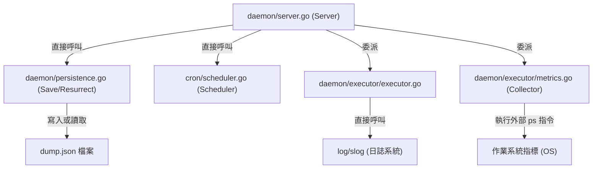
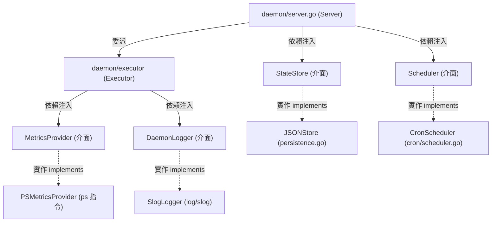

# 架構計畫 — extensibility-interfaces (Architecture Plan)

## 1. 目標與範圍 (Goal & Scope)
為 `pm2` 核心模組定義標準的擴充介面，包含狀態儲存、排程管理、指標收集與系統日誌，以隔離外部系統與作業系統底層依賴，提升模組的可測試性與未來擴展能力。

不做什麼 (out of scope)：
- 不實現動態載入插件（Go Plugin）或進程外 RPC（gRPC）等複雜的動態插件加載架構。
- 不修改命令列介面（CLI）與守護進程（Daemon）之間的傳輸協定封裝（`model/protocol.go`）。
- 不調整既有 `ProcessRegistry` 之進程狀態記憶體儲存與鎖機制。

## 2. 現況架構 (Current Architecture)
當前專案中，核心控制與執行模組直接依賴於具體的外部實作。
`daemon/persistence.go` 直接讀寫 `dump.json` 檔案；`daemon/server.go` 直接引入並調用 `cron` 實體；`daemon/executor/metrics.go` 以套件變數函數調用 `ps` 命令行工具；整個專案直接使用 `log/slog` 進行日誌記錄。這限制了模組的單元測試隔離性，也使得未來變更儲存媒介（如使用 SQLite）或指標獲取來源時，必須修改核心程式碼。

## 3. 架構位置與邊界 (Placement & Boundaries)
位置說明：
本變更主要位於 `daemon` 套件與 `cron` 套件中，新增介面宣告，並調整對應模組的初始化邏輯以支援依賴注入。

邊界清單：
- `擁有` 職責：定義 `StateStore`、`Scheduler`、`MetricsProvider` 與 `DaemonLogger` 介面；提供其實作類別（如 `JSONFileStore`、`CronScheduler`、`PSMetricsProvider` 與 `SlogLogger`）；於進入點進行實例化與注入。
- `不碰` 範圍：不修改 `model/` 協定封裝，亦不改動 `cmd/` 中的 CLI 邏輯。

## 4. 介面與資料流 (Interfaces & Data Flow)
介面表 (Interfaces)：

| 介面/函數名稱 | 輸入 (Input) | 輸出 (Output) | 錯誤情況 (Error Conditions) |
| :--- | :--- | :--- | :--- |
| `StateStore.Save(configs []process.AppConfig)` | `configs []process.AppConfig` | `error` | 檔案寫入失敗或序列化失敗 |
| `StateStore.Load()` | `無` | `[]process.AppConfig, error` | 檔案讀取失敗或反序列化失敗 |
| `Scheduler.Register(key, expr, fn)` | `key string, expr string, fn func()` | `error` | cron 表達式解析錯誤 |
| `Scheduler.Remove(key)` | `key string` | `無` | 無 |
| `MetricsProvider.GetProcessMetrics(pid)` | `pid int` | `cpu float64, mem uint64, err error` | 執行 `ps` 失敗或解析輸出失敗 |
| `DaemonLogger.Info(msg, args)` | `msg string, args ...any` | `無` | 無 |
| `DaemonLogger.Error(msg, err, args)` | `msg string, err error, args ...any` | `無` | 無 |

資料流圖 (Data Flow Graph)：

## 5. 清晰與可擴充性檢查 (Clarity & Scalability Check)
逐項回答：
1. 單一職責：是。新定義的各個介面僅負責抽象單一外部系統依賴（儲存、排程、指標、日誌），實現職責解耦。
2. 依賴方向：是。無內層指向外層，核心業務模組僅依賴介面，符合依賴反轉原則。
3. 可替換：是。外部依賴均被隔離在介面之後，測試時可輕易替換為 Mock 實作。
4. 水平擴充：不適用。本項目為單機進程管理器，無水平擴充多實例部署之需求。
5. 擴充點：是。若未來需要對接其他儲存系統（如 SQLite）或指標收集方式（如 cgroups），只需實作相應介面並注入即可，不需修改核心流程。

## 6. 漸進落地步驟 (Incremental Steps)
落地步驟表 (Incremental Steps Table)：

| 步驟 (Step) | 做什麼 (What) | 驗證 (Verify) | 回滾 (Rollback) |
| :--- | :--- | :--- | :--- |
| 1 | 定義 `StateStore` 介面，並重構 `daemon/persistence.go` 實作該介面，在 `Server` 引入並使用此介面。 | `go test ./daemon/...` 全綠。 | 使用 `git restore` 還原 `daemon/` 下的檔案。 |
| 2 | 定義 `Scheduler` 介面，並重構 `cron/scheduler.go` 實作該介面，在 `Server` 引入並使用此介面。 | `go test ./cron/...` 與 `go test ./daemon/...` 全綠。 | 還原對應的變更。 |
| 3 | 定義 `MetricsProvider` 介面，重構 `daemon/executor/metrics.go` 以實作該介面，並將其注入 `MetricsCollector` 與 `Executor` | `go test ./daemon/executor/...` 全綠。 | 使用 `git restore` 還原 `daemon/executor/metrics.go`。 |
| 4 | 定義 `DaemonLogger` 介面，並在 `Server` 與 `Executor` 中使用該介面進行日誌記錄，實作預設的 `SlogLogger` 並注入。 | `go build ./...` 與全體測試通過。 | 還原日誌變更。 |

## 7. 風險與假設 (Risks & Assumptions)
- 資訊不足之最簡假設：假設使用者 skipped 的原因為同意依據待辦清單 `README.todo` 中的 `擴充性介面契約` 進行架構規劃，且期望此規劃符合專案既有的依賴注入與絞殺榕模組化模式。
- `slog` 套件相容性：假設預設的 `SlogLogger` 包裝實作僅需轉發至 Go 標準庫之 `log/slog`，以最小化效能開銷與型態轉換。
