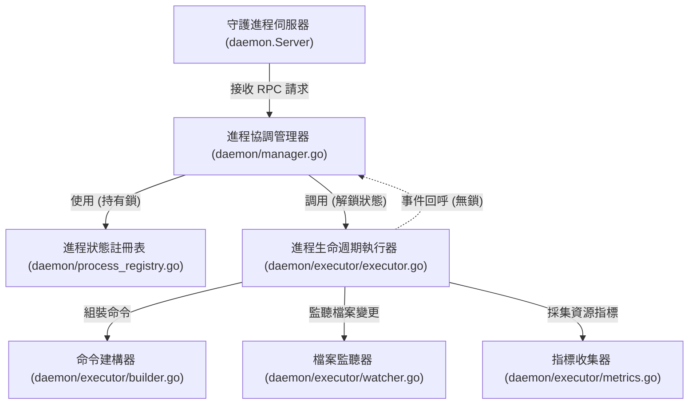

# 架構演進與優化計畫 — extract-executor (Architecture Evolution & Optimization Plan)

## 1. 現有架構診斷與技術債 (Architecture Diagnosis & Technical Debt)

我們對現有 `pm2` 專案的進程執行與生命週期管理邏輯進行了架構審查，診斷出以下關鍵的結構耦合與技術債問題：

* `診斷一：進程生命週期執行邏輯與伺服器主體高度耦合 (Process Lifecycle Logic and Server Coupling)`
  在 [server.go](../daemon/server.go) 中，`Server` 結構體內部直接實現了 `launchProcess`、`watchProcess` 與 `stopProcess` 等方法。這使得伺服器不僅負責 UNIX 套接字網路監聽 (UNIX socket server listener) 與請求協議分發，還需要直接處理與作業系統交互的進程衍生 (fork/exec), 信號發送 (signal transmission) 以及進程生命週期狀態監聽。這違反了 `單一職責原則 (Single Responsibility Principle, SRP)`，導致伺服器邏輯龐大且無法進行獨立的進程控制單元測試。

* `診斷二：檔案監聽器與伺服器機制緊密耦合且隱式相依 (File Watcher and Server Hard Coupling)`
  在 [watcher.go](../daemon/watcher.go#L19) 中，`startFileWatcher` 作為 `Server` 的成員方法，且在背景協程中檔案發生變更時，直接呼叫了 `s.restartByName(pName)`。這種設計使得檔案變更監聽與伺服器的狀態鎖 `s.mu` 及重啟邏輯強烈依賴。若要在非網路伺服器環境下進行檔案監聽測試，會被迫實例化整個 `Server`。

* `診斷三：效能指標採集與伺服器內部對照表強綁定 (Metrics Collection Tied to Server Map)`
  在 [metrics.go](../daemon/metrics.go#L80) 中的 `refreshMetrics` 方法直接讀寫了 `s.processes` 並操作 `s.mu` 讀寫鎖。雖然該方法已被重構為三階段以減少鎖佔用，但它依然需要遍歷伺服器內部的進程對照表並寫回屬性。這阻礙了我們在不依賴網路伺服器的情況下，單獨調用或測試效能指標採集器 (Metrics Collector)。

* `診斷四：沒有統一的執行器接口導致測試與擴充困難 (Lack of Executor Abstraction)`
  當前代碼直接呼叫作業系統的 `os/exec` 以及 `syscall`。如果未來需要支持容器化執行器 (e.g. Docker executor) 或進行模擬/單元測試 (mock testing)，由於沒有抽象出 `Executor` 接口，我們必須修改守護進程的核心邏輯，這增加了系統的脆弱性。

---

## 2. 複雜度量測 (Complexity Metrics)

我們透過程式碼與 Git 歷史進行了結構量化分析：

* `程式碼規模與高複雜度熱點 (Code Size and High-Complexity Hotspots)`
  當前守護行程相關代碼總量約 `7,241` 行，其中生命週期執行與作業系統交互的代碼主要分佈在：
  - `daemon/server.go`：`701` 行，包含 `launchProcess` (114 行)、`watchProcess` (47 行)、`stopProcess` (51 行) 等長函數。
  - `daemon/builder.go`：`49` 行，組裝進程命令行。
  - `daemon/watcher.go`：`59` 行，檔案變更重啟。
  - `daemon/metrics.go`：`155` 行，指標異步採集。

* `改動熱點分析 (Change Hotspots)`
  過去 12 個月中，`daemon/server.go` 改動次數達 `17` 次，高居專案首位。其中大量的改動與 `launchProcess` 的參數處理、日誌路徑展開、進程退出重啟等執行面邏輯相關，這表明將執行器邏輯抽離至獨立包能有效減少核心伺服器的修改頻率。

* `依賴與扇入扇出分析 (Dependency and Fan-in/out)`
  `launchProcess`、`watchProcess` 與 `stopProcess` 引用了 `os`、`os/exec`、`path/filepath`、`syscall`、`os/user`、`github.com/mitchellh/go-homedir` 等底層模組。這使得 `Server` 的扇出 (Fan-out) 非常高，包含了作業系統底層呼叫的各種副作用。

---

## 3. 架構簡化與解耦設計 (Simplification & Decoupling Design)

我們提出將進程生命週期執行邏輯從 `Server` 中徹底抽離，封裝至獨立的 `Executor` 結構體與 `daemon/executor` 子包中：

* `職責拆分 (Responsibility Segregation)`：
  - `伺服器 (Server)` 與 `進程協調管理器 (Manager)`：僅負責網路 RPC 監聽、協議分發與進程狀態的管理協調。
  - `執行器 (Executor)`：封裝單一進程的衍生 (spawning)、生命週期監聽 (exiting wait)、信號發送 (signal sending) 與暫停/停止邏輯，不持有伺服器的全域鎖，也不直接管理全域進程對照表。

* `鎖方向約束與防死鎖設計 (Lock Direction Constraint)`：
  - 嚴格遵守單向調用原則。`Manager` 在持有註冊表狀態鎖時呼叫 `Executor` 執行啟動或停止，但 `Executor` 內部在執行 `Wait()` 或 `Kill()` 等阻塞 IO 操作時，絕對不能持有狀態鎖。
  - `Executor` 內部的背景監聽協程 (background watch goroutine) 在檢測到進程退出時，不應直接操作伺服器鎖，而是透過事件回呼 (event callback) 或通道 (channel) 通知 `Manager`/`Registry` 進行狀態更新，防止循環等待死鎖 (Circular Wait Deadlock)。

* `依賴方向圖 (Dependency Direction Diagram)`：



---

## 4. 目錄與模組重整方案 (Reorganization Map)

我們規劃將相關執行邏輯遷移至 `daemon/executor` 子目錄下，確保依賴關係清晰：

```tree
pm2/
└── daemon/
    ├── server.go             # 僅負責 UNIX Socket 連線監聽與請求協定分發
    ├── manager.go            # 負責請求的調度邏輯，作為 Registry 與 Executor 的中介者，處理事件回呼
    └── executor/
        ├── executor.go       # 新建：負責進程組啟動、等待 (watchProcess) 與停止
        ├── builder.go        # 遷移：負責組裝 exec.Cmd 參數 (原 daemon/builder.go)
        ├── watcher.go        # 遷移：負責 fsnotify 檔案變更監聽 (原 daemon/watcher.go)
        └── metrics.go        # 遷移：負責進程 CPU/Memory 指標異步採集 (原 daemon/metrics.go)
```

### 舊模組與新結構之遷移映射表 (Migration Map)

| 舊檔案路徑 | 新模組路徑 | 調整要點 |
| :--- | :--- | :--- |
| `daemon/builder.go` | `daemon/executor/builder.go` | 搬移並修改 package 名稱為 `executor`，暴露 `BuildCommand` |
| `daemon/watcher.go` | `daemon/executor/watcher.go` | 改為獨立函數，移除 `Server` 依賴，引入 `onDetect` 回呼機制 |
| `daemon/metrics.go` | `daemon/executor/metrics.go` | 移入 `executor`，僅負責取得 `ps` 指標，移除對 `s.processes` 的直接操作 |
| `Server.launchProcess` | `Executor.Start` | 負責作業系統層面的進程啟動、日誌檔案初始化與 cmd 綁定 |
| `Server.stopProcess` | `Executor.Stop` | 負責向進程組發送 `SIGTERM`/`SIGKILL` 信號，移除對 scheduler 與 watcher 的直接鎖操作 |
| `Server.watchProcess` | `Executor.Watch` | 負責等待進程結束，並通過事件回呼通知狀態變更 |

---

## 5. 插件化與可擴充性機制 (Plugin & Extensibility Mechanism)

* `必要性評估 (Necessity Assessment)`
  作為輕量化單機進程管理器，本專案的進程執行主要是與作業系統核心 API 交互，並不需要在執行期動態加載外部 `.so` 插件。因此，本計畫採用基於 Go `interface` 的靜態擴充方案，以滿足測試替換 (Mocking) 與未來容器化執行 (e.g. Docker / Kubernetes pods) 的潛在擴充需求。

* `最簡可行解耦設計 (MVE Design)`
  在 `daemon/executor/executor.go` 中定義 `ProcessExecutor` 介面：
  ```go
  type ProcessExecutor interface {
      Start(name string, req *model.AppStartReq) (process.ProcessInfo, error)
      Stop(pid int) error
      Watch(pid int, onExit func(err error))
  }
  ```
  這使得核心管理邏輯與具體的 OS 進程操作完全解耦。

---

## 6. 漸進式重構路徑與驗證 (Refactoring Roadmap & Verification)

本重構將完全遵循 `絞殺榕模式 (Strangler-Fig Pattern)` 的演進方向，每一小步均可獨立編譯、測試並可隨時回滾：

### Phase 1：遷移命令建構器與指標採集器 (Move Builder and Metrics)
* 步驟 1：建立 `daemon/executor/` 目錄。
* 步驟 2：將 `daemon/builder.go` 搬移至 `daemon/executor/builder.go`，修改其 package 名稱為 `executor`，並將內部私有函數暴露為導出函數。
* 步驟 3：將 `daemon/metrics.go` 搬移至 `daemon/executor/metrics.go`，使其成為獨立的效能指標採集模組。
* 驗證命令：`go build ./daemon/executor/...` 正常編譯，`go test -v ./daemon/...` 通過。

### Phase 2：設計無狀態的檔案監聽器 (Decouple File Watcher)
* 步驟 1：將 `daemon/watcher.go` 搬移至 `daemon/executor/watcher.go`。
* 步驟 2：重構 `startFileWatcher`，將其從 `Server` 的成員方法改為獨立函數，接受一個 `onDetect func()` 回呼。當檔案發生 write/rename 事件並完成 debounce 後，直接觸發該回呼，不再直接調用 `s.restartByName`。
* 驗證命令：`go test -v ./daemon/...` 正常。

### Phase 3：實作 ProcessExecutor 執行器主體 (Implement Executor)
* 步驟 1：在 `daemon/executor/executor.go` 中，定義 `Executor` 結構體，並實現 `Start` 與 `Stop` 方法。
* 步驟 2：將 `launchProcess`、`watchProcess` 與 `stopProcess` 中的作業系統操作部分抽離至 `Executor` 中。
* 步驟 3：`Executor` 內部在進程退出時，呼叫一個傳入的事件監聽器或回呼函數 `onExit func(ns, name string, err error)`，由呼叫端決定是否重啟或更新註冊表狀態。
* 驗證命令：`go build ./daemon/executor/...` 通過。

### Phase 4：修改 Server / Manager 接入執行器 (Wire Executor to Server/Manager)
* 步驟 1：在 `Server` 中引入 `executor.Executor` 實例。
* 步驟 2：將 `server.go` 中剩餘的 `launchProcess`、`watchProcess`、`stopProcess` 替換為對 `executor` 的呼叫，並傳入合適的 callback 函數。
* 步驟 3：確保在呼叫 `Executor` 時，不持有 `Server` 內部的狀態鎖。
* 驗證命令：執行 `go test -race -v ./...` 確保所有特徵測試全綠，無競態與死鎖。

---

## 7. 風險與回滾策略 (Risks & Rollback)

* `狀態更新競態與重啟風暴風險 (State Race & Restart Storms)`
  - `問題`：當 `Executor` 的監聽協程與 `Server` 的重啟機制並發操作時，若鎖的範圍不夠精密，可能會導致重複衍生進程。
  - `對策`：確保所有狀態更新（包括 restart count、status 變更）皆在 `Manager`/`Registry` 的寫鎖保護內完成，且 `Executor` 的 `Start` 與 `Stop` 本身不處理狀態判定，只負責單純的 IO 執行。

* `孤兒進程殘留風險 (Orphan Process Leak)`
  - `問題`：重構 `Stop` 邏輯時，若 process group 信號發送不正確，會導致 descendants 殘留為孤兒。
  - `對策`：`Executor.Stop` 必須精確複用 `syscall.Kill(-pid, syscall.SIGTERM)` 發送至整個進程組的邏輯，且必須在測試中加入孤兒進程檢測，確保行為不變。

* `回滾策略 (Rollback Strategy)`
  - 每次重構步驟均建立於 `refactor-executor` 特徵分支。
  - 在進行 Phase 4 大範圍接入前，使用 `git diff` 進行嚴格審查。若測試出現紅燈且難以在 30 分鐘內定位，立即執行 `git reset --hard HEAD` 回滾至上一 Phase。
