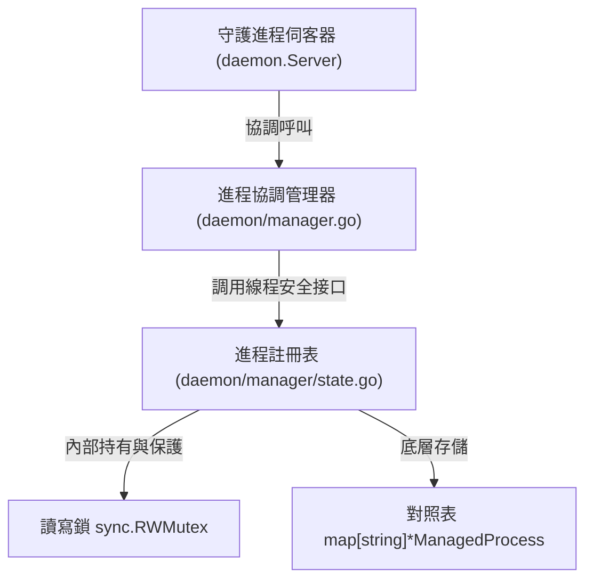

# 架構演進與優化計畫 — extract-registry (Architecture Evolution & Optimization Plan)

## 1. 現有架構診斷與技術債 (Architecture Diagnosis & Technical Debt)

* `診斷一：進程狀態與伺服器邏輯高度耦合 (Coupling of Process State and Server Logic)`
  在 [server.go:L28-35](file:///Users/shuk/projects/tmp/pm2/daemon/server.go#L28-L35) 中，`Server` 結構體同時持有了 `processes map[string]*ManagedProcess`。這代表狀態存儲和網絡監聽（如 `Listen` 與 `handleConn`）以及進程生命週期（如 `launchProcess`、`stopProcess`）是混在一起的，違反了 `單一職責原則 (Single Responsibility Principle, SRP)`。

* `診斷二：裸露的 map 與分散的手動讀寫鎖操作 (Exposed Map and Distributed Manual Locking)`
  對 `processes` map 的讀寫和鎖的獲取分散在整個 `daemon` 目錄下的多個文件中。
  - 在 [manager.go:L14-18](file:///Users/shuk/projects/tmp/pm2/daemon/manager.go#L14-L18) 中 `listAll` 獲取 `s.mu.RLock()`；在 [manager.go:L25-34](file:///Users/shuk/projects/tmp/pm2/daemon/manager.go#L25-L34) 中 `findProcesses` 獲取 `s.mu.RLock()`；在 [manager.go:L83-85](file:///Users/shuk/projects/tmp/pm2/daemon/manager.go#L83-L85) 中 `deleteByName` 獲取 `s.mu.Lock()`。
  - 在 [metrics.go:L82-91](file:///Users/shuk/projects/tmp/pm2/daemon/metrics.go#L82-L91) 中 `refreshMetrics` 獲取 `s.mu.RLock()` 進行 snapshot，之後在 [metrics.go:L128-142](file:///Users/shuk/projects/tmp/pm2/daemon/metrics.go#L128-L142) 獲取 `s.mu.Lock()` 進行寫回。
  - 在 [persistence.go:L23-48](file:///Users/shuk/projects/tmp/pm2/daemon/persistence.go#L23-L48) 中 `save` 獲取 `s.mu.RLock()`。
  - 在 [server.go:L219](file:///Users/shuk/projects/tmp/pm2/daemon/server.go#L219) `startApp` 獲取 `s.mu.Lock()`；在 [server.go:L389](file:///Users/shuk/projects/tmp/pm2/daemon/server.go#L389) `launchProcess` 獲取 `s.mu.Lock()`；在 [server.go:L520](file:///Users/shuk/projects/tmp/pm2/daemon/server.go#L520) `watchProcess` 獲取 `s.mu.Lock()`；在 [server.go:L568](file:///Users/shuk/projects/tmp/pm2/daemon/server.go#L568) `stopProcess` 獲取 `s.mu.Lock()`；在 [server.go:L674](file:///Users/shuk/projects/tmp/pm2/daemon/server.go#L674) `triggerCron` 獲取 `s.mu.Lock()`。
  這種手動、分散的鎖獲取非常容易在未來修改代碼時遺漏 Lock/Unlock 或引入 `死鎖 (Deadlock)`。

* `診斷三：缺少統一的狀態變更介面 (Lack of Unified State Mutation Interface)`
  目前任何地方都可以直接讀寫 `processes[key]` 或是修改其屬性（例如在 [metrics.go:L135-136](file:///Users/shuk/projects/tmp/pm2/daemon/metrics.go#L135-L136) 中直接修改 `mp.Info.CPU` 與 `mp.Info.Memory`，在 [server.go:L692](file:///Users/shuk/projects/tmp/pm2/daemon/server.go#L692) 中直接修改 `p.Info.LastCronAt` / `LastCronStatus` 等）。這使得狀態的生命週期極難維護、追蹤和調試，也不容易進行單元測試的 mock。

## 2. 複雜度量測 (Complexity Metrics)

我們透過程式碼與 Git 歷史進行了結構量化分析：

* `代碼規模與高複雜度熱點 (Code Size and High-Complexity Hotspots)`
  當前專案總代碼量約為 `7,241` 行。涉及 `processes` map 讀寫與 `s.mu` 鎖操作的檔案主要為：
  - [server.go](file:///Users/shuk/projects/tmp/pm2/daemon/server.go)：`701` 行，鎖操作處多達 15 處以上。
  - [manager.go](file:///Users/shuk/projects/tmp/pm2/daemon/manager.go)：`88` 行。
  - [metrics.go](file:///Users/shuk/projects/tmp/pm2/daemon/metrics.go)：`155` 行。
  - [persistence.go](file:///Users/shuk/projects/tmp/pm2/daemon/persistence.go)：`95` 行。

* `改動熱點分析 (Change Hotspots)`
  在過去 12 個月的提交歷史中，改動頻率最高的檔案為：
  - [server.go](file:///Users/shuk/projects/tmp/pm2/daemon/server.go)：改動 `16` 次。
  - [model.go](file:///Users/shuk/projects/tmp/pm2/tui/model.go)：改動 `14` 次。

* `依賴與扇入扇出分析 (Dependency and Fan-in/out)`
  `processes` 對照表在 `daemon` 套件中被讀寫/引用了至少 26 處，形成了高扇出 (Fan-out)，所有 daemon 內的文件都在操作這個裸露的對照表與其讀寫鎖。

## 3. 架構簡化與解耦設計 (Simplification & Decoupling Design)

我們提出將 `processes` map 與 `s.mu` 鎖徹底封裝至獨立的 `ProcessRegistry` 結構體中：

- `唯一鎖持有者`：`ProcessRegistry` 為唯一擁有鎖與對照表的對象。
- `線程安全業務方法`：對外提供線程安全 (Thread-Safe) 的高階業務方法：`Add` (註冊進程)、`Get` (獲取單一進程)、`Remove` (移除進程)、`List` (列出所有進程)、`Find` (搜索進程) 與 `UpdateInfo` (原子更新進程狀態屬性，以防在鎖外讀寫內部欄位)。
- `鎖收斂原則 (Lock Convergence)`：`Server` 不再持有 `processes` map 與 `s.mu`。所有進程狀態的管理皆透過 `ProcessRegistry` 物件，大幅收斂手動 Lock/Unlock 的分散痛點。



## 4. 目錄與模組重整方案 (Reorganization Map)

我們規劃在 `daemon/` 下建立 `manager` 子包以存放狀態定義：

```tree
pm2/
└── daemon/
    ├── server.go             # 僅負責 UNIX Socket 連線監聽與請求協定分發，調度 registry
    ├── manager.go            # 負責請求的調度邏輯，作為 Registry 與其他模組的中介者
    └── manager/
        └── state.go          # 新建：線程安全的 ProcessRegistry 封裝 (含 processes map 與 mu)
```

舊模組與新結構之遷移映射表 (Migration Map)：

- `s.processes[key] = mp` -> `s.registry.Add(key, mp)`
- `delete(s.processes, key)` -> `s.registry.Remove(key)`
- `mp, ok := s.processes[key]` -> `mp, ok := s.registry.Get(key)`
- `for _, mp := range s.processes` -> `s.registry.List()` 或 `s.registry.Find()`
- `mp.Info.CPU = cpu` -> `s.registry.UpdateMetrics(key, cpu, memory)` (提供專用方法更新資源指標，避免外部在鎖外直接寫入)
- `p.Info.LastCronAt = firedAt` -> `s.registry.UpdateCronStatus(key, lastCronAt, lastCronStatus)`

## 5. 插件化與可擴充性機制 (Plugin & Extensibility Mechanism)

* `必要性評估 (Necessity Assessment)`
  本重構旨在進行系統內部狀態管理的解耦與安全封裝，解決並發競爭缺陷，不涉及動態外部載入或第三方組件生命週期。故完全不需要引進動態插件 (Plugin) 機制，應保持靜態編譯的單純性。

* `最簡可行解耦設計 (MVE Design)`
  在 `daemon/manager/state.go` 中定義 `ProcessRegistry`，我們可以使用 Go 介面定義以便於單元測試的 mock 注入：
  ```go
  type Registry interface {
      Add(key string, mp *ManagedProcess) error
      Get(key string) (*ManagedProcess, bool)
      Remove(key string) error
      List() []*ManagedProcess
      UpdateMetrics(key string, cpu float64, memory uint64) error
  }
  ```

## 6. 漸進式重構路徑與驗證 (Refactoring Roadmap & Verification)

本重構完全遵循絞殺榕模式 (Strangler-Fig Pattern)，將重構拆分為小步。每一步皆可獨立編譯、測試並支持快速回滾。

### 第一階段：定義 Registry 結構與方法 (Complexity: Low)
- `步驟 1`：建立 `daemon/manager/state.go`。
- `步驟 2`：定義 `ProcessRegistry` 與其方法，並提供 `NewProcessRegistry()` 建構子。
- `驗證命令`：`go build ./daemon/...` 能正常編譯。

### 第二階段：遷移 manager.go 中的 processes 讀寫 (Complexity: Medium)
- `步驟 1`：將 `listAll`、`findProcesses` 改為調用 `s.registry` 的方法。
- `步驟 2`：修改 `deleteByName` 以使用 `s.registry.Remove`。
- `驗證命令`：`go test -v ./daemon/...` 驗證既有列表與刪除測試通過。

### 第三階段：遷移 server.go 中的狀態讀寫 (Complexity: High)
- `步驟 1`：將 `startApp`、`launchProcess`、`watchProcess`、`stopProcess`、`triggerCron` 內部的 `s.processes` 改為 `s.registry` 操作。
- `步驟 2`：收斂大鎖，移除 `Server` 上的 `s.mu`，替換為 `ProcessRegistry` 內部的讀寫鎖。
- `驗證命令`：運行 `go test -race -v ./daemon/...` 確保測試綠燈，且無並行競爭缺陷。

### 第四階段：遷移 metrics.go 與 persistence.go (Complexity: Medium)
- `步驟 1`：將指標更新 Phase 1 與 Phase 3、`save()` 及 `resurrect()` 中的 `s.processes` 換成 `s.registry`。
- `驗證命令`：`go test -race -v ./...` 且 `go build -o /dev/null ./...` 正常。

## 7. 風險與回滾策略 (Risks & Rollback)

* `死鎖與鎖巢套風險 (Nested Lock Deadlock Risk)`
  - `問題`：如果外部方法持有其它鎖 (如 `scheduler` 的鎖) 同時又呼叫 `registry` 的寫鎖，或在 `registry` 方法回呼時又加了鎖，可能引發 `循環等待 (Circular Wait)` 死鎖。
  - `對策`：`ProcessRegistry` 的方法應只做純粹的 map 讀寫與狀態拷貝，不包含阻塞型作業系統 IO，亦不在鎖保護內呼叫 any 外部回呼。

* `測試相容性破壞風險 (Test Compatibility Risk)`
  - `問題`：`server_test.go` 中有許多直接訪問 `s.processes` 的斷言。
  - `對策`：保持相容性，可以在 `Server` 提供一個輔助測試的導出方法 `ProcessesForTest() map[string]*ManagedProcess`（或直接在測試中調用 `s.registry`），確保測試代碼仍能正常工作，且不會破壞原本的特徵測試。

* `回滾策略 (Rollback Strategy)`
  - 建立專門的分支 `refactor-registry` 進行代碼變更。
  - 每次合併或推進 Phase 時，運行整合測試 `go test -count=1 ./...`。一旦出現測試紅燈或編譯鏈崩潰，立即使用 `git reset --hard HEAD` 回滾，確保開發分支健康。
