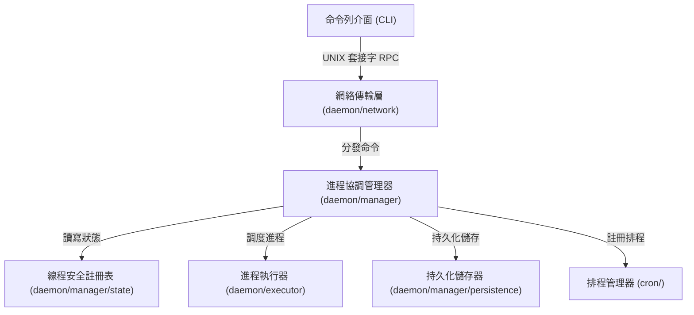

# 架構演進與優化計畫 — pm2-decoupling (Architecture Evolution & Optimization Plan)

## 1. 現有架構診斷與技術債 (Architecture Diagnosis & Technical Debt)

在現有設計中，系統面臨以下主要的架構痛點：

* `上帝對象 (God Object)`：在現有設計中，`daemon/server.go` 中的 `Server` 結構體同時承擔了 `網絡監聽 (Network Listening)`、`遠端程序呼叫命令分發 (RPC Command Dispatching)`、`多處理程序管理 (Multi-Process Management)`、`單一進程生命週期執行 (Process Lifecycle Execution)`、`定時排程 (Cron Scheduling)` 以及 `檔案監聽 (File Watching)` 等多重職責。這嚴重違反了 `單一職責原則 (Single Responsibility Principle, SRP)`。
* `並行鎖定競爭與死鎖風險 (Concurrency Lock Contention & Deadlock Risk)`：`Server` 的所有進程操作都共用同一個讀寫鎖 `s.mu`。在執行諸如 `stopProcess`、`launchProcess` 等包含阻塞型作業系統呼叫 (如 `os.OpenFile`、`cmd.Wait()`、等待 `done` 管道) 的函數時，必須在進入阻塞前手動釋放鎖，並在結束後重新獲取鎖。這種細粒度的手動鎖釋放模式極易因為未來的程式碼修改而遺漏，從而引入死鎖，或者造成並行效能瓶頸。
* `環境變數與工作目錄解析耦合 (Environment and CWD Parsing Coupling)`：在 `launchProcess` 中直接嵌入了環境變數合併 (`BaseEnv` 與 `Env` 整合) 以及工作目錄 (`CWD`) 解析的複雜邏輯，這應屬於配置預處理或獨立執行器的範疇，而非核心協調器的職責。

## 2. 複雜度量測 (Complexity Metrics)

根據程式碼的量測結果，系統複雜度的核心指標如下：

* `代碼行數 (Lines of Code, LOC) 統計`：
  * `daemon/server.go`: `670` 行，是整個守護行程中最龐大的程式檔案。
  - `tui/renderer.go`: `512` 行，處理使用者介面渲染。
  - `daemon/server_test.go`: `510` 行，測試伺服器邏輯。
  - `tui/model.go`: `359` 行，與處理程序狀態及日誌緊密耦合。
* `變更熱點統計 (Change Hotspots)`：
  * `daemon/server.go`: 於近期提交歷史中被修改了 `16` 次，為系統最頻繁變更的檔案。
  - `tui/model.go`: 修改了 `14` 次，為終端介面的主要變更點.
  - `cmd/start.go`: 修改了 `12` 次，主要處理 CLI 端對啟動請求的封裝。
* `依賴關係與耦合度 (Dependencies and Coupling)`：
  * `daemon/server.go` 具有極高的 `扇出 (Fan-Out)`，它直接依賴了 `cron`、`process`、`fsnotify` 等包，同時又被 `cmd/` 下的多個指令 (如 `start`、`stop` , `restart`, `monitor`) 呼叫，造成任何底層邏輯的修改都會被迫變更 `server.go`。

## 3. 架構簡化與解耦設計 (Simplification & Decoupling Design)

為了簡化系統，我們將現有混雜的守護行程拆分為清晰的三層架構：

* `網絡與傳輸層 (Network & Transport Layer)`：僅負責 UNIX 套接字的監聽、RPC 請求的反序列化與響應序列化，不介入任何業務邏輯。
* `協調與管理層 (Orchestration & Management Layer)`：作為核心控制器，維護處理程序列表與狀態，並協調執行器與排程器。
* `執行與持久化層 (Execution & Persistence Layer)`：專注於作業系統層級的進程創建、監控與 I/O 重新導向，以及狀態的硬碟備份。

解耦後的架構關係如下：



## 4. 目錄與模組重整方案 (Reorganization Map)

我們規劃將原有的 `daemon/` 目錄重整，並遵循 `由外向內` 依賴原則。底層執行器不得依賴上層網絡與管理模組。

```tree
pm2/
├── cmd/
├── config/
├── cron/
├── tui/
├── process/
│   └── types.go
├── daemon/
│   ├── network/
│   │   ├── listener.go      (UNIX 套接字監聽)
│   │   ├── handler.go       (RPC 指令路由)
│   │   └── protocol.go      (RPC 協定定義，原 daemon/protocol.go)
│   ├── manager/
│   │   ├── manager.go       (進程管理器核心)
│   │   ├── state.go         (進程註冊表與讀寫鎖)
│   │   └── persistence.go   (自動儲存與恢復，原 daemon/persistence.go)
│   └── executor/
│       ├── executor.go      (單一進程生命週期與重啟邏輯)
│       ├── watcher.go       (檔案熱重載監聽，原 daemon/watcher.go)
│       ├── metrics.go       (系統資源監控，原 daemon/metrics.go)
│       └── builder.go       (指令建構器，原 daemon/builder.go)
```

舊模組與新結構之遷移映射表 (Migration Map)：

* 原 `daemon/server.go`：
  * `Listen`, `handleConn` 遷移至 `daemon/network/listener.go` 與 `handler.go`。
  - `startApp`, `listAll`, `deleteByName` 遷移至 `daemon/manager/manager.go`。
  - `processes` Map 及對其進行的鎖操作遷移至 `daemon/process_registry.go`。
  - `launchProcess`, `watchProcess`, `stopProcess` 遷移至 `daemon/executor/executor.go`。
* 原 `daemon/persistence.go`：
  * 遷移至 `daemon/manager/persistence.go`。
* 原 `daemon/watcher.go`：
  * 遷移至 `daemon/executor/watcher.go`。
* 原 `daemon/metrics.go`：
  * 遷移至 `daemon/executor/metrics.go`。
* 原 `daemon/builder.go`：
  * 遷移至 `daemon/executor/builder.go`。

## 5. 插件化與可擴充性機制 (Plugin & Extensibility Mechanism)

* `擴充點評估 (Evaluation)`：
  目前 PM2 的擴充需求僅限於進程執行方式 (例如未來可能支持容器化進程) 以及持久化介面 (例如未來可能從 JSON 備份切換至 SQLite 等資料庫)。因為擴充點少於 3 個，引入動態動態鏈結庫 (DLL) 或 RPC 插件框架將造成過度設計。
* `介面化設計 (Interface Design)`：
  我們將藉由 Go 的介面 (Interface) 實現解耦，便於測試與後續擴充。
  - `進程執行器介面 (Executor Interface)`：
    ```go
    type Executor interface {
        Start(req *process.AppStartReq) (process.ProcessInfo, error)
        Stop(name string) error
        Wait(name string) error
    }
    ```
  - `狀態儲存介面 (Store Interface)`：
    ```go
    type Store interface {
        Save(entries []process.DumpEntry) error
        Load() ([]process.DumpEntry, error)
    }
    ```

## 6. 漸進式重構路徑與驗證 (Refactoring Roadmap & Verification)

為了確保重構期間系統能正常運作且不引入破壞性變更，我們採用 `絞殺榕模式 (Strangler-Fig)` 分步實施：

* `第一階段：補強特徵測試 (Enhance Characterization Tests)`
  * 目標：建立強大的安全網。
  - 行動：在 `daemon/server_test.go` 中，增加針對高並行啟動、進程異常終止、環境變數繼承與 `Cron` 重啟的測試案例。
* `第二階段：分離進程註冊表 (Extract Process Registry)`
  * 目標：收斂鎖的範圍，消除手動解鎖的潛在風險。
  - 行動：將 `processes` Map 移至 `daemon/process_registry.go`，並封裝為 `ProcessRegistry`，提供如 `Add()`, `Get()`, `Remove()`, `List()` 等線程安全方法，內部統一管理 `sync.RWMutex`。
* `第三階段：抽離進程執行器 (Extract Process Executor)`
  * 目標：解耦作業系統層級的進程控制。
  - 行動：將 `launchProcess` 與 `watchProcess` 的邏輯轉移至 `daemon/executor`，實現單一進程的完整封裝。
* `第四階段：抽離網絡傳輸層 (Extract Network Layer)`
  * 目標：使業務與網絡通訊完全隔離。
  - 行動：將 `Listen` 與 `handleConn` 移至 `daemon/network`，僅依賴 `Manager` 提供的主動介面進行路由。

* `驗證方式 (Verification Methods)`：
  - 每個階段重構完成後，執行 `go test -v ./...` 確保測試綠燈。
  - 執行 `go test -race ./...` 確保沒有並行競爭 (Data Race) 問題。
  - 使用 `pm2-test` 工具進行端到端 (End-to-End, E2E) 功能檢驗，確保命令行響應與以前完全一致。

## 7. 風險與回滾策略 (Risks & Rollback)

* `風險一：重構大鎖引起死鎖`
  * 診斷：若在協調器與執行器解耦時，兩者內部各自加鎖並相互呼叫，可能引起 `循環等待 (Circular Wait)` 死鎖。
  - 策略：明訂鎖的方向。僅允許 `Manager` 呼叫 `Registry` 時加鎖；`Executor` 本身不持有狀態鎖，僅負責進程底層的 `Cmd` 互斥。
* `風險二：檔案監聽或 Cron 在重構時失效`
  * 診斷：因為 fsnotify 與 cron.Scheduler 均依賴特定的生命週期事件，若事件通知機制在重構中遺漏，將導致自動重載或定時任務失效。
  - 策略：實施 E2E 自動化測試。在每次提交時，觸發檔案修改測試與定時觸發測試，確保功能無遺漏。
