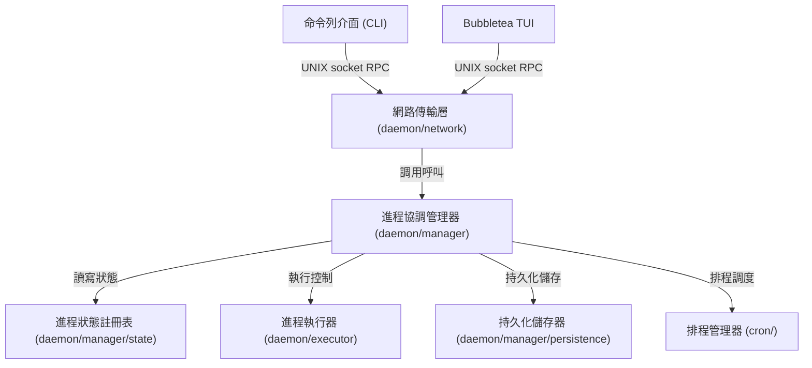

# 架構演進與優化計畫 — pm2-modularization (Architecture Evolution & Optimization Plan)

## 1. 現有架構診斷與技術債 (Architecture Diagnosis & Technical Debt)

* `診斷一`：並發安全性缺陷與競態條件風險 (Concurrency Safety and Race Condition Risks)
  在 [persistence.go](../daemon/persistence.go#L15) 中，`save` 函數會遍歷 `s.processes` 的 `map`。然而，此函數內並未進行任何互斥鎖 (Mutex) 的取得與保護。在 [server.go](../daemon/server.go#L82) 中的自動儲存協程 `startAutoSave` 與 [server.go](../daemon/server.go#L168) 中的遠端程序呼叫 (RPC) 命令處理器 `CmdSave` 呼叫 `save` 時，皆無鎖保護。這會在並發新增、停止或刪除進程時直接導致 Go 執行期的並發讀寫崩潰致命錯誤：`fatal error: concurrent map iteration and map write`。

* `診斷二`：鎖競爭與阻塞式外部監控指標收集效能瓶頸 (Lock Contention and Blocking Performance Bottleneck in Metrics Collection)
  在 [metrics.go](../daemon/metrics.go#L39) 的 `StartMetricsCollector` 中，更新指標的背景協程在整個遍歷對照表的過程中，全程持有寫鎖 `s.mu.Lock()`。在此寫鎖保護的迴圈內部，同步調用了 [metrics.go](../daemon/metrics.go#L14) 的 `getProcessMetrics`，該函數又透過 `exec.Command("ps", ...)` 拉起外部系統進程來獲取數據。當受控進程數量較多時，同步拉起多個外部進程所累積的延遲，將導致整個伺服器長時間處於鎖定狀態，進而阻塞所有網路 RPC 連線，造成 CLI 與 TUI 回應卡頓。

* `診斷三`：信號傳遞機制缺陷與背景孤兒進程問題 (Signal Propagation Defect and Background Orphan Processes)
  在 [builder.go](../daemon/builder.go#L19) 中，執行腳本被包裝在 `/bin/bash -c` 中，並設置了 `Setpgid: true` 來開啟新的進程組。但在 [server.go](../daemon/server.go#L571) 的 `stopProcess` 中，終止進程只調用了 `mp.Cmd.Process.Signal(syscall.SIGTERM)`，這只會將信號發送給作為父進程的 `bash`，而不會自動傳播給實際執行的用戶進程。這會導致 `bash` 終止後，其實際子進程淪為孤兒進程 (Orphan Process) 並在系統背景繼續運作，脫離 `pm2` 的管控。

* `診斷四`：排程器命名空間衝突與排程覆蓋 (Scheduler Namespace Collision and Job Overwriting)
  在 [scheduler.go](../cron/scheduler.go#L28) 中，定時排程器 `cron.Scheduler` 註冊任務時以進程名稱 `name` 作為鍵值 (Key)。由於系統支援命名空間 (Namespace)，如果用戶在不同命名空間（例如 `default:api` 與 `production:api`）中啟動了同名進程，它們的排程任務將在排程器內部發生衝突並互相覆蓋，破壞多命名空間的業務隔離性。

* `診斷五`：RPC 協議傳輸層與守護進程邏輯雙向耦合 (RPC Protocol and Daemon Coupling)
  在 [protocol.go](../daemon/protocol.go) 中，RPC 傳輸協議結構定義（如 `Request`, `Response`）以及客戶端發送函數 `SendRequest` 與伺服器邏輯位於同一個 `daemon` 包下。這導致 CLI 客戶端 [cmd](../cmd) 與用戶介面 [tui](../tui) 必須導入整個 `daemon` 模組，破壞了系統分層原則，並增加了模組間的雙向耦合度。

* `診斷六`：TUI 視圖與狀態控制邏輯重疊 (TUI View and State Control Coupling)
  在 [model.go](../tui/model.go) 中，Bubbletea 的 `Update` 事件控制與佈局視圖渲染相互交織。雖然 [renderer.go](../tui/renderer.go) 承擔了部分渲染，但狀態流轉與 UI 展示的組裝仍高度依賴於單一的狀態變數，限制了面板代碼的模組化與可測試性。

## 2. 複雜度量測 (Complexity Metrics)

我們透過程式碼與 Git 歷史進行了結構量化分析：

* 代碼規模與高複雜度熱點 (Code Size and High-Complexity Hotspots)
  當前專案總代碼量約為 `5,961` 行。其中規模前五大的 Go 原始碼檔案為：
  * [eco_test.go](../cmd/eco_test.go)：`988` 行
  * [server.go](../daemon/server.go)：`670` 行 (包含了龐大的 RPC 路由、複雜的進程啟動與管理邏輯)
  * [renderer.go](../tui/renderer.go)：`512` 行 (處理所有的 UI 渲染邏輯)
  * [server_test.go](../daemon/server_test.go)：`510` 行 (單元測試代碼)
  * [model.go](../tui/model.go)：`359` 行 (Bubbletea 狀態維護與異步事件)

* 改動熱點分析 (Change Hotspots)
  在過去 12 個月的提交歷史中，改動頻率最高的檔案為：
  * [server.go](../daemon/server.go)：改動 `16` 次
  * [model.go](../tui/model.go)：改動 `14` 次
  * [start.go](../cmd/start.go)：改動 `12` 次
  * [types.go](../process/types.go)：改動 `9` 次

* 依賴與扇入扇出分析 (Dependency and Fan-in/out)
  * [types.go](../process/types.go) 擁有最高的扇入值 (Fan-in)，作為核心數據模型，被 `cmd`, `tui`, `daemon`, `config` 共同引入。
  * `daemon` 被 `cmd` 與 `tui` 直接引用，形成了高層對底層的多重雙向相依。

根據量測結果，複雜度重構應首要聚焦於「高頻改動 × 巨型檔案」的交集：[server.go](../daemon/server.go) 的拆分與解耦。

## 3. 架構簡化與解耦設計 (Simplification & Decoupling Design)

為了徹底消除上帝對象，我們提出以下三層解耦架構，明訂單向依賴方向（只能由外層指向內層，或引入抽象介面以實現依賴反轉）：

* 網路傳輸層 (Network & Transport Layer)：
  僅負責監聽 UNIX 套接字並反序列化請求，將其路由至核心管理器。
* 進程管理與狀態協調層 (Management & Orchestration Layer)：
  維護線程安全的進程狀態，管理命名空間，對接排程器與持久化組件。
* 進程執行與基礎設施層 (Execution & Infrastructure Layer)：
  處理單一進程的生命週期（啟動、重啟、停止、環境變數處理）以及進程組信號發送，以及獲取指標數據。



## 4. 目錄與模組重整方案 (Reorganization Map)

我們規劃將原有的 `daemon/` 目錄拆分重整，確保職責單一與層級依賴方向合規：

```tree
pm2/
├── cmd/                      # 命令行 Cobra 指令
├── config/                   # 生態文件解析器 (.js/.json)
├── cron/                     # 定時任務排程器 (引入 Namespace 辨識)
├── process/                  # 核心進程定義
│   └── types.go
├── protocol/                 # 獨立的傳輸協定包 (原 daemon/protocol.go)
│   └── protocol.go           # 定義 Request/Response 與 SendRequest 客戶端
├── tui/                      # TUI 主控台
│   ├── model.go
│   ├── renderer.go
│   └── views/                # 拆分介面視圖
│       ├── view_list.go      # 進程列表渲染
│       └── view_detail.go    # 詳細與日誌渲染
└── daemon/                   # 守護進程核心
    ├── network/
    │   ├── listener.go       # UNIX Socket 監聽
    │   └── handler.go        # RPC 路由器
    ├── manager/
    │   ├── manager.go        # 核心管理器 (startApp, stopByName, listAll 等)
    │   ├── state.go          # 進程記憶體狀態 (封裝鎖與對照表)
    │   └── persistence.go    # 自動儲存與恢復 (對照表持久化)
    └── executor/
        ├── executor.go       # 執行與生命週期 (launchProcess, watchProcess)
        ├── builder.go        # 命令行構建 (buildCommand)
        ├── metrics.go        # 指標採集器 (異步獲取，避免鎖阻塞)
        └── watcher.go        # 檔案重載監聽
```

舊模組與新結構之遷移映射表 (Migration Map)：
* `daemon/protocol.go` -> `protocol/protocol.go`
* `daemon/server.go` 的連線與 RPC 分發 -> `daemon/network/listener.go` 與 `handler.go`
* `daemon/server.go` 的進程管理與狀態變更 -> `daemon/manager/manager.go`
* `daemon/server.go` 的 processes 地圖及鎖操作 -> `daemon/manager/state.go`
* `daemon/server.go` 的 launchProcess, watchProcess -> `daemon/executor/executor.go`
* `daemon/persistence.go` -> `daemon/manager/persistence.go`
* `daemon/metrics.go` -> `daemon/executor/metrics.go` (重新設計為非阻塞式，透過異步 Channel 將指標送回，更新進程狀態)
* `daemon/builder.go` -> `daemon/executor/builder.go`
* `daemon/watcher.go` -> `daemon/executor/watcher.go`

## 5. 插件化與可擴充性機制 (Plugin & Extensibility Mechanism)

* 必要性評估 (Necessity Assessment)
  作為輕量化單機進程管理器，本專案的潛在擴充需求（例如替換日誌輸出目標至 Loki、支持容器化進程執行）少於 3 個。在現階段引入基於 `plugin` 包的動態加載機制或基於 gRPC 的進程外插件框架，會引入不必要的動態鏈結、複雜的二進制分發與運行期調度負擔，屬於明顯的過度設計 (Over-engineering)。

* 最簡可行擴充設計 (MVE Design)
  我們將通過在重構後的 `daemon/executor` 中定義 Go 介面，並採用靜態註表 (Static Registry) 模式，在編譯期進行擴充。這既保持了代碼的解耦，又維持了零額外執行期開銷的簡潔性：
  ```go
  // ProcessExecutor 定義單一進程拉起與控制接口
  type ProcessExecutor interface {
      Start(name string, req *process.AppStartReq) (process.ProcessInfo, error)
      Stop(pid int) error
  }
  ```

## 6. 漸進式重構路徑與驗證 (Refactoring Roadmap & Verification)

本重構完全遵循絞殺榕模式 (Strangler-Fig Pattern)，將重構拆分為小步。每一步皆可獨立編譯、測試並支持快速回滾。

### 第一階段：補全並確認測試安全網 (Test Safety Net)
* 步驟 1：修復現有測試中直接依賴真實家目錄 `~/` 的安全沙箱問題，將其修改為使用臨時測試目錄，確保測試在安全沙箱環境中順暢執行。
* 步驟 2：執行完整測試，確認當前功能完全通過。
* 驗證命令：`go test -v ./...`

### 第二階段：解耦並獨立 RPC 傳輸協定 (Extract RPC Protocol)
* 步驟 1：創建 `protocol/` 目錄，將 `daemon/protocol.go` 遷移。
* 步驟 2：修改 `cmd` 與 `tui` 對通訊協定的引用，將 `daemon.SendRequest` 等修改為對 `protocol.SendRequest` 的調用。
* 驗證：執行 `go test -v ./cmd/...` 與 `go test -v ./tui/...`，確保通訊協定與連接行為未發生改變。

### 第三階段：解決併發安全性缺陷與鎖競爭 (Concurrency & Lock Fixes)
* 步驟 1：將 processes 封裝進 `daemon/manager/state.go`，提供線程安全的增刪改查介面。
* 步驟 2：在 `save` 執行時，先調用 state 獲取安全的進程列表快照，避免在 iterating map 時被其他寫操作干擾。
* 步驟 3：重構指標收集模組，將指標採集 `getProcessMetrics` 移到鎖外部執行（例如在獨立協程中同步採集後，再通過通道更新狀態），避免長時間鎖定 `s.mu` 造成 RPC 響應阻塞。
* 驗證：運行 `go test -v ./daemon/...` 且通過並發競態測試 `go test -race -v ./daemon/...`。

### 第四階段：分離守護進程核心模組 (Decouple Daemon Components)
* 步驟 1：實現 `daemon/executor` 包，將 `launchProcess`、`watchProcess`、信號處理移植過去。
* 步驟 2：在執行器停止進程時，修改為對整個進程組發送信號（向 `-pgid` 發送 `syscall.SIGTERM`），解決孤兒進程問題。
* 步驟 3：實現 `daemon/manager`，協調生命週期與持久化儲存。
* 步驟 4：實現 `daemon/network`，僅保留網絡層監聽。
* 驗證：拉起多個具有 cron 重啟、日誌輸出與 watch 機制的進程，確保在停止時無孤兒進程遺留，且 `pm2 list` 能正常顯示狀態。

### 第五階段：解耦 TUI 狀態與渲染 (Decouple TUI Components)
* 步驟 1：創建 `tui/views` 目錄，將列表視圖與細節日誌渲染邏輯從 `model.go` 拆分出來。
* 驗證：啟動 `pm2 monit`，對照終端介面渲染是否與重構前一致。

## 7. 風險與回滾策略 (Risks & Rollback)

* 協定不兼容與通訊中斷風險 (Protocol Incompatibility Risks)：
  * 風險：協定在重構中若修改了 JSON 標籤名稱或欄位，將導致舊版 CLI/TUI 無法與新版守護進程通訊。
  * 對策：保持 `protocol.Request` 和 `protocol.Response` 的結構體標籤完全一致，並在測試中增加對傳輸 Payload 的 JSON 兼容性斷言。

* 循環引用編譯失敗風險 (Circular Dependency Risks)：
  * 風險：由於 `daemon` 下多個包互相依賴，可能導致 Go 編譯器報 `import cycle not allowed` 錯誤。
  * 對策：嚴格實施從外向內、從高層向底層的單向依賴方針。`executor` 與 `manager` 不得引用 `network` 包；如果需要反向傳遞狀態，應利用回呼函數 (Callback) 或通道 (Channel) 傳輸數據。

* 回滾路徑與分支策略 (Rollback Pathway & Branching Strategy)：
  * 每次重構步驟均基於當前穩定的 `master` 分支建立獨立的重構特徵分支（例如 `refactor-protocol`、`refactor-concurrency`）。
  * 每一小步重構在合併前，必須同時在本地環境與沙箱環境完成 `go test -race ./...` 測試。若發現未預期的運行崩潰或死鎖，立即執行 `git reset --hard HEAD` 或切換回 `master` 分支，確保不影響工作區開發。
