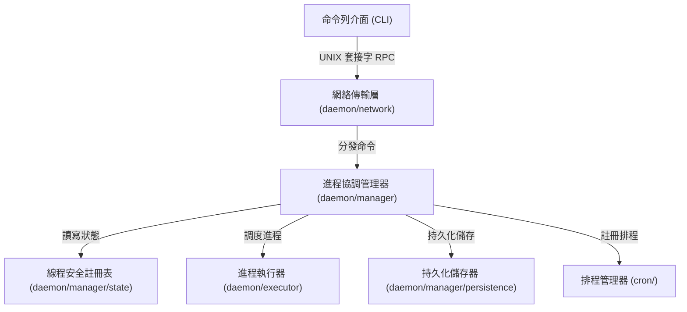
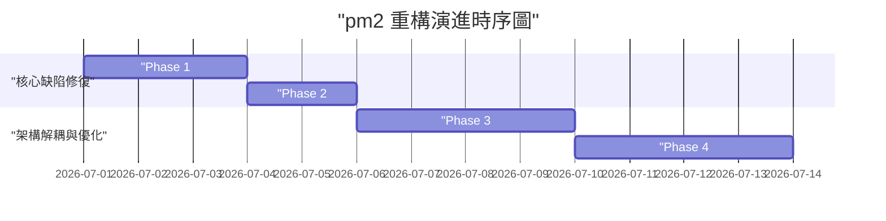

# 架構演進與優化計畫 — pm2-reorganization (Architecture Evolution & Optimization Plan)

## 1. 現有架構診斷與技術債 (Architecture Diagnosis & Technical Debt)

我們對現有 `pm2` 專案進行了架構審查與技術債診斷，發現了以下關鍵痛點：

### 1.1 核心併發缺陷與競態條件 (Critical Concurrency & Race Conditions)
在 [persistence.go](file:///Users/shuk/projects/tmp/pm2/daemon/persistence.go#L15) 中，`save` 函數會遍歷整個 `s.processes` 對照表 (Map)。然而，此函數內部並未取得任何互斥鎖 (Mutex)。
當命令列介面 (CLI) 發送 `save` 指令（由 `handleConn` 觸發，參見 [server.go](file:///Users/shuk/projects/tmp/pm2/daemon/server.go#L168)）或 `startAutoSave` 背景任務執行時，如果此時有其他協程 (Goroutine) 修改了對照表（例如 `startApp`、`stopProcess` 或 `watchProcess`），將會直接引發 Go 執行期的致命崩潰：`fatal error: concurrent map iteration and map write`。

### 1.2 監控指標收集時的阻塞效能瓶頸 (Lock Contention & Blocking in Metrics Collection)
在 [metrics.go](file:///Users/shuk/projects/tmp/pm2/daemon/metrics.go#L39) 的 `StartMetricsCollector` 中，更新指標的背景協程在整個對照表遍歷期間都持有 `s.mu.Lock` 寫鎖 (Write Lock)。
在此寫鎖範圍內，它在迴圈中同步調用 `getProcessMetrics`，該函數會針對每個執行中的行程執行一次外部指令 `exec.Command("ps", ...)`。
當受控行程增多時，多個 `ps` 行程的啟動與執行時間會累積。此期間由於整個伺服器 `Server` 寫鎖被鎖定，所有來自命令列介面網路連線的遠端程序呼叫 (RPC) 請求都會被完全阻塞，造成嚴重的效能瓶頸與延遲。

### 1.3 信號傳播失效與孤兒行程問題 (Signal Propagation & Orphan Processes)
在 [builder.go](file:///Users/shuk/projects/tmp/pm2/daemon/builder.go#L18) 中，程式將啟動指令包裝在 `bash -c` 中，並設置了 `Setpgid: true` 來建立行程組 (Process Group)。
但在 [server.go](file:///Users/shuk/projects/tmp/pm2/daemon/server.go#L571) 的 `stopProcess` 中，終止行程是調用 `mp.Cmd.Process.Signal(syscall.SIGTERM)`。
這只會將信號發送給作為父行程的 `bash`，而不會傳播給其實際執行的子行程（即用戶真正要啟動的服務）。這會導致父行程終止後，子行程變成孤兒行程 (Orphan Process) 並繼續在系統背景運行，脫離 `pm2` 的管理。

### 1.4 排程器名稱空間衝突 (Namespace Collision in Cron Scheduler)
在 [scheduler.go](file:///Users/shuk/projects/tmp/pm2/cron/scheduler.go#L28) 中，`Register` 註冊排程任務時，使用行程名稱 `name` 作為對應對照表的鍵 (Key)。
這意謂著如果用戶在不同的名稱空間（例如 `default:api` 和 `production:api`）中啟動了同名的行程，它們在定時任務 (Cron) 排程器內部的註冊將會互相覆蓋，造成排程邏輯混亂。

### 1.5 測試環境依賴與沙箱限制 (Test Dependencies & Sandbox Limitations)
在 [server_test.go](file:///Users/shuk/projects/tmp/pm2/daemon/server_test.go#L477) 中，`TestStartAppOutFileHomeExpansion` 測試使用了真實的家目錄路徑 `~/` 作為輸出日誌檔案。
這在隔離的安全沙箱環境（例如 Antigravity 標準執行環境）中會因為寫入家目錄的權限不足而直接報錯崩潰，且會污染用戶的主機環境。

---

## 2. 複雜度量測 (Complexity Metrics)

我們透過客觀量測得出了專案的結構量化數據：

### 2.1 改動頻率分析 (Git Hotspots)
過去 12 個月改動最頻繁的代碼檔案依序為：
- [server.go](file:///Users/shuk/projects/tmp/pm2/daemon/server.go)：16 次 (核心守護行程控制邏輯)
- [model.go](file:///Users/shuk/projects/tmp/pm2/tui/model.go)：14 次 (Bubbletea 儀表板模型與行為處理)
- [start.go](file:///Users/shuk/projects/tmp/pm2/cmd/start.go)：12 次 (CLI 啟動流程)
- [types.go](file:///Users/shuk/projects/tmp/pm2/process/types.go)：9 次 (資料模型與結構定義)
- [server_test.go](file:///Users/shuk/projects/tmp/pm2/daemon/server_test.go)：9 次 (單元測試)

### 2.2 代碼行數與高複雜度熱點 (Code Size & Complexity Hotspots)
專案總代碼行數約為 `5,961` 行。其中規模最大的檔案包括：
- [eco_test.go](file:///Users/shuk/projects/tmp/pm2/cmd/eco_test.go)：988 行 (測試文件)
- [server.go](file:///Users/shuk/projects/tmp/pm2/daemon/server.go)：670 行 (包含高複雜度的 `launchProcess` 與龐大的 RPC 路由判斷區塊)
- [renderer.go](file:///Users/shuk/projects/tmp/pm2/tui/renderer.go)：512 行 (Bubbletea UI 渲染)
- [server_test.go](file:///Users/shuk/projects/tmp/pm2/daemon/server_test.go)：510 行 (單元測試)
- [model.go](file:///Users/shuk/projects/tmp/pm2/tui/model.go)：359 行 (Bubbletea 行為處理)

核心重構目標應鎖定 `高改動頻率 × 高複雜度` 的交集：[server.go](file:///Users/shuk/projects/tmp/pm2/daemon/server.go) 與 [model.go](file:///Users/shuk/projects/tmp/pm2/tui/model.go)。

---

## 3. 架構簡化與解耦設計 (Simplification & Decoupling Design)

為了解決上述上帝對象與高耦合問題，我們將對 `daemon` 層進行解耦。
透過引進介面分離職責，限制核心 `Server` 持有的互斥鎖時間。

### 3.1 職責拆分
- `網絡與傳輸層 (Network & Transport Layer)`：僅負責 Unix 套接字的監聽、RPC 請求的反序列化與響應序列化，不介入任何業務邏輯。
- `協調與管理層 (Orchestration & Management Layer)`：作為核心控制器，維護處理程序列表與狀態，並協調執行器與排程器。
- `執行與持久化層 (Execution & Persistence Layer)`：專注於作業系統層級的進程創建、監控與 I/O 重新導向，以及狀態的備份。

### 3.2 目標架構關係圖 (Target Architecture Diagram)



---

## 4. 目錄與模組重整方案 (Reorganization Map)

我們規劃將原有的 `daemon/` 目錄重整，並遵循 `由外向內` 依賴原則。底層執行器不得依賴上層網絡與管理模組。

```tree
pm2/
├── cmd/                      # 僅包含 Cobra 命令，不處理邏輯
├── config/                   # 生態配置解析 (.js/.json)
├── cron/                     # 排程邏輯 (引進 NAMESPACE 辨識)
├── process/                  # 核心行程管理器
│   ├── types.go              # 行程模型定義
│   ├── manager.go            # 包含線程安全 (Thread-Safe) 的狀態 Map 操作
│   └── executor.go           # 控制實際行程啟動與行程組信號
├── daemon/                   # 僅負責 UNIX 套接字網路通訊與 RPC 路由
│   ├── network/
│   │   ├── listener.go       # UNIX 套接字監聽
│   │   ├── handler.go        # RPC 指令路由
│   │   └── protocol.go       # RPC 協定定義 (原 daemon/protocol.go)
│   ├── manager/
│   │   ├── manager.go        # 進程管理器協調器
│   │   ├── state.go          # 進程註冊表與讀寫鎖
│   │   └── persistence.go    # 自動儲存與恢復 (原 daemon/persistence.go)
│   └── executor/
│       ├── executor.go       # 單一進程生命週期與重啟邏輯
│       ├── watcher.go        # 檔案熱重載監聽 (原 daemon/watcher.go)
│       ├── metrics.go        # 系統資源監控 (原 daemon/metrics.go)
│       └── builder.go        # 指令建構器 (原 daemon/builder.go)
├── store/                    # 行程持久化模組
│   ├── store.go              # 定義 StateStore 介面
│   └── json.go               # 實作 JSON 存檔 (原 persistence.go)
└── tui/                      # 儀表板 UI
```

### 舊代碼遷移映射表 (Migration Map)

| 舊檔案路徑 | 新模組路徑 | 調整要點 |
| :--- | :--- | :--- |
| [server.go](file:///Users/shuk/projects/tmp/pm2/daemon/server.go) (`launchProcess` 等) | `process/manager.go`, `process/executor.go` | 將行程啟動邏輯與 Server 分離，並修正信號發送為行程組 |
| [persistence.go](file:///Users/shuk/projects/tmp/pm2/daemon/persistence.go) | `store/json.go` | 實作 `StateStore` 介面，並在其方法內部正確加鎖 |
| [metrics.go](file:///Users/shuk/projects/tmp/pm2/daemon/metrics.go) | `metrics/collector.go` | 將指標刷新改為非阻塞模式，避免長時間持有 `Server` 的大寫鎖 |
| [scheduler.go](file:///Users/shuk/projects/tmp/pm2/cron/scheduler.go) | [scheduler.go](file:///Users/shuk/projects/tmp/pm2/cron/scheduler.go) | 升級 `Register` 鍵格式為 `namespace:name` |
| [metrics.go](file:///Users/shuk/projects/tmp/pm2/tui/metrics.go) | `metrics/host.go` | 抽出主機指標收集，最佳化 macOS `top` 解析的效率 |

---

## 5. 插件化與可擴充性機制 (Plugin & Extensibility Mechanism)

為了滿足簡潔性原則，我們不需要引入龐大的外部動態插件系統，僅需在代碼層面引入 Go 介面，即可極大地提高可測試性並解耦外部依賴：

### 5.1 狀態儲存介面 (StateStore)
定義行程重啟後的持久化層，使後續容易升級為 SQLite 或其他的儲存媒介。
```go
type StateStore interface {
    Save(entries []process.DumpEntry) error
    Load() ([]process.DumpEntry, error)
}
```

### 5.2 排程管理介面 (Scheduler)
```go
type Scheduler interface {
    Register(key string, expr string, fn func()) error
    Remove(key string)
}
```

### 5.3 指標收集介面 (MetricsCollector)
```go
type MetricsCollector interface {
    GetProcessMetrics(pid int) (float64, uint64, error)
}
```

---

## 6. 漸進式重構路徑與驗證 (Refactoring Roadmap & Verification)

為保證每次改動不破壞核心功能，我們將分四個階段進行漸進式演進：



### Phase 1：併發安全鎖與信號傳遞修復 (3 天)
- 步驟 1：在 `s.save()` 開始與結束處加入 `s.mu.RLock()` 與 `s.mu.RUnlock()`，並同步調整調用方。
- 步驟 2：在 `s.stopProcess` 中，透過 `syscall.Kill(-pid, syscall.SIGTERM)` 取代原有的 `Process.Signal`，確保向整個行程組發送信號。
- 驗證方法：
  - 運行併發啟動與持續存檔壓測，檢查是否會再次發生 `concurrent map iteration` 的 Go 執行期恐慌 (Panic)。
  - 啟動含有子行程的 Shell 指令，隨後停止，運行 `ps -ef` 驗證子行程是否已確實消失，無孤兒行程殘留。

### Phase 2：測試沙箱隔離優化 (2 天)
- 步驟 1：修改 [server_test.go](file:///Users/shuk/projects/tmp/pm2/daemon/server_test.go#L477) 中的 `TestStartAppOutFileHomeExpansion` 測試。
- 步驟 2：使用 `t.TempDir()` 或利用 Go 特性重新設定測試環境的 `HOME` 環境變數，使其日誌輸出路徑指向測試專用的暫存目錄。
- 驗證方法：
  - 在標準沙箱環境中運行 `go test -v ./daemon`，驗證測試綠燈通過，無權限錯誤。

### Phase 3：介面化與非阻塞指標收集 (4 天)
- 步驟 1：定義 `StateStore`、`Scheduler`、`MetricsCollector` 介面。
- 步驟 2：重構 `StartMetricsCollector`。每次收集時先透過讀鎖快照行程列表的 PID。
- 步驟 3：在鎖範圍之外，並行或依序執行 `ps` 計算，最後再獲取鎖更新指標資訊。
- 驗證方法：
  - 運行 30 個虛擬行程，同時使用 CLI 重複請求 `pm2 list`。
  - 量測 CLI 回覆時間，確保不會因為 `ps` 的耗時而導致 RPC 請求阻塞超過 50 毫秒。

### Phase 4：目錄重整與模組化遷移 (4 天)
- 步驟 1：建立 `process/`、`store/` 與 `metrics/` 目錄。
- 步驟 2：依照遷移映射表，安全地將相應的 Go 檔案拆分至對應新目錄下。
- 步驟 3：修改 `main.go` 與 `cmd/` 的載入路徑，修復編譯鏈。
- 驗證方法：
  - 執行整個專案的單元測試與整合測試 `go test ./...`，驗證功能表現一致。

---

## 7. 風險與回滾策略 (Risks & Rollback)

### 7.1 重構大鎖引起死鎖 (Deadlock Risk)
- 診斷：若在協調器與執行器解耦時，兩者內部各自加鎖並相互呼叫，可能引起 `循環等待` 死鎖。
- 策略：明訂鎖的方向。僅允許 `Manager` 呼叫 `Registry` 時加鎖；`Executor` 本身不持有狀態鎖，僅負責進程底層的 `Cmd` 互斥。

### 7.2 檔案監聽或 Cron 在重構時失效 (Feature Regression Risk)
- 診斷：因為 fsnotify 與 cron.Scheduler 均依賴特定的生命週期事件，若事件通知機制在重構中遺漏，將導致自動重載或定時任務失效.
- 策略：實施 E2E 自動化測試。在每次提交時，觸發檔案修改測試與定時觸發測試，確保功能無遺漏。
