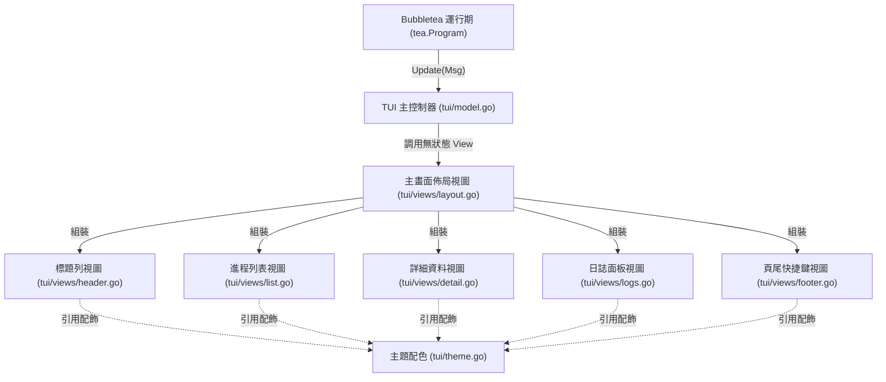

# 架構演進與優化計畫 — tui-decoupling (Architecture Evolution & Optimization Plan)

## 1. 現有架構診斷與技術債 (Architecture Diagnosis & Technical Debt)

* `診斷一`：TUI 視圖與狀態控制邏輯高度耦合 (TUI View and State Control Coupling)
  在 [renderer.go](../tui/renderer.go) 中，諸如 `buildLeft`、`buildRight`、`buildDetail`、`buildLogs` 以及 `buildListTUI` 等排版渲染函數，皆以 `Model` 結構體的成員方法 (Method) 形式實作。這使得展示邏輯 (Presentation Logic) 與 Bubbletea 的 `Model` 狀態 (State) 產生直接的雙向綁定。當我們想要調整版面樣式或擴充特定欄位時，必須在 `Model` 身上擴充狀態；而在撰寫單元測試（如 [model_test.go](../tui/model_test.go#L23)）時，也必須強行實例化一個包含無效 UNIX 套接字路徑的整個 `Model` 來測試 `buildDetail`，造成展示邏輯無法進行獨立的無副作用單元測試。

* `診斷二`：全局主題配置與狀態變數交織 (Theme Palette Intertwined with Model State)
  目前所有 TUI 組件所使用的配色樣式（例如 [model.go](../tui/model.go#L28-L41) 中定義的 `clOnline`、`clStopped`、`clErrored` 等 `lipgloss.AdaptiveColor`）直接定義在 `model.go` 檔案的全局變數中。這導致展示視圖 [renderer.go](../tui/renderer.go#L49) 與格式化器 [formatter.go](../tui/formatter.go#L83) 必須強行引用 `model.go` 內部的變數，破壞了「視圖獨立於數據流與狀態控制器」的架構分界線。

* `診斷三`：視圖佈局與控制器職責混亂 (Layout Calculation and Controller Responsibility Overlap)
  目前 `Model` 不僅負責處理系統按鍵事件的響應路由（如在 [model.go](../tui/model.go#L164-L205) 中的 `handleKey`），還承擔了排版計算的職責（例如在 [renderer.go](../tui/renderer.go#L310) 中的 `getLeftColW` 計算雙欄佈局中左側進程列表的動態寬度）。這種將業務控制與精確佈局計算混合的做法，增加了程式碼的維護成本。

## 2. 複雜度量測 (Complexity Metrics)

* 代碼規模與高複雜度熱點 (Code Size and High-Complexity Hotspots)
  `tui` 套件總代碼量約為 `1,490` 行（排除自動生成的測試程式碼）：
  * [renderer.go](../tui/renderer.go)：`513` 行 (包含大量的排版渲染邏輯，是 TUI 的上帝渲染對象)
  * [model.go](../tui/model.go)：`360` 行 (包含狀態管理、網路 RPC 調度及鍵盤事件分發)
  * [model_test.go](../tui/model_test.go)：`282` 行 (主要為單元測試)
  * [formatter.go](../tui/formatter.go)：`225` 行 (處理所有的數值與時間視覺化格式裁剪)
  * [metrics.go](../tui/metrics.go)：`114` 行 (處理主機 CPU/記憶體 指標的背景命令採集)

* 改動熱點分析 (Change Hotspots)
  根據過去 12 個月的提交歷史，改動頻率最高的檔案為：
  * [model.go](../tui/model.go)：改動 `14` 次
  * [renderer.go](../tui/renderer.go)：改動 `1` 次 (近期新增 UTF-8 視覺寬度修正)

可以看出，[model.go](../tui/model.go) 因為承載了狀態流轉與視圖輔使渲染，是日常維護的修改熱點，需要進行職責解耦。

## 3. 架構簡化與解耦設計 (Simplification & Decoupling Design)

為了徹底解耦 TUI 視圖與狀態，我們設計了以下視圖拆分模型，以單向數據流 (Unidirectional Data Flow) 為核心，讓 `Model` 作為控制器 (Controller) 與狀態容器 (State Container)，而將展示層完全委託給獨立的視圖函數與子組件：

* 狀態與控制器 (Model & Controller)：
  `Model` 維護 TUI 的核心狀態（進程清單、已選索引、日誌內容、寬高大小），並透過 Bubbletea 事件循環 (Event Loop) 接收輸入，觸發 RPC 行動。
* 展示層視圖 (Views Layer)：
  拆分為獨立的無狀態視圖 (Stateless Views)。這些視圖僅接收當前排版所需的最小化資料，不持有任何狀態，也不直接與 `Model` 結構體耦合。
* 主題樣式 (Theme Layer)：
  將所有的配色與 `lipgloss.Style` 提取至獨立的 `theme.go` 中，消除視圖與控制器的隱式變數依賴。



## 4. 目錄與模組重整方案 (Reorganization Map)

我們規劃將 `tui` 目錄下的視圖排版邏輯抽離至獨立的子目錄中：

```tree
pm2/
└── tui/
    ├── model.go              # 僅保留 Bubbletea Model 核心定義、Update 事件分支及 Cmd 調度
    ├── formatter.go          # 保留數值與時間的視覺化裁剪函數
    ├── metrics.go            # 保留主機系統指標異步採集協程
    ├── theme.go              # 新建：lipgloss.AdaptiveColor 與基礎樣式定義
    └── views/
        ├── layout.go         # 新建：統合 Model 數據並分配寬高，決定雙欄或單欄渲染
        ├── header.go         # 新建：進程數量、時間與 daemon 連線狀態標題列渲染
        ├── list.go           # 新建：表格模式與左側簡易清單模式的渲染
        ├── detail.go         # 新建：右側進程詳情參數表格渲染
        ├── logs.go           # 新建：右側進程日誌文本裁剪渲染
        └── footer.go         # 新建：底部按鍵指示器與主機 CPU/記憶體 渲染
```

舊模組與新結構之遷移映射表 (Migration Map)：
* [model.go](../tui/model.go#L27-L41) 的 colors 變數 -> `tui/theme.go`
* [renderer.go](../tui/renderer.go#L112-L123) 的 `buildTitle` -> `tui/views/header.go`
* [renderer.go](../tui/renderer.go#L126-L176) 的 `buildLeft` 與 [renderer.go](../tui/renderer.go#L353-L513) 的 `buildListTUI` -> `tui/views/list.go`
* [renderer.go](../tui/renderer.go#L195-L260) 的 `buildDetail` -> `tui/views/detail.go`
* [renderer.go](../tui/renderer.go#L263-L286) 的 `buildLogs` -> `tui/views/logs.go`
* [renderer.go](../tui/renderer.go#L289-L306) 的 `buildFooter` 與 [metrics.go](../tui/metrics.go#L90-L114) 的 `buildHostMetricsLines` -> `tui/views/footer.go`
* [renderer.go](../tui/renderer.go#L179-L192) 的 `buildRight` 與 `View()` 佈局 -> `tui/views/layout.go`

## 5. 插件化與可擴充性機制 (Plugin & Extensibility Mechanism)

* 必要性評估 (Necessity Assessment)
  由於 TUI 僅作為單機進程控制器的純終端視覺展示界面，不存在動態加載協力廠商視圖或跨進程渲染插件的需求。因此，在此處引進基於 Go `plugin` 的動態組件載入，或是基於 RPC 的視圖外掛，屬於極度嚴重的過度設計 (Over-engineering)。

* 最簡可行擴充設計 (MVE Design)
  我們將在 `tui/views` 中，透過定義無狀態的渲染函數 signature，或是純粹以 `無狀態組件結構體` (Stateless Component Struct) 形式來封裝。若未來需要擴充新的視圖（例如 `ConfigView` 生態設定檔檢視畫面），僅需在 `tui/views/` 下新增對應的渲染源，並在 `layout.go` 的分流邏輯中加入對應的分支即可：
  ```go
  // ViewContext 封裝渲染所需要的所有上下文資料
  type ViewContext struct {
      Width     int
      Height    int
      Selected  int
      Procs     []process.ProcessInfo
      Logs      []string
      Updated   time.Time
      HostCPU   float64
      HostMem   float64
      SortBy    SortField
      Err       error
  }
  ```

## 6. 漸進式重構路徑與驗證 (Refactoring Roadmap & Verification)

本重構將完全遵循絞殺榕模式 (Strangler-Fig Pattern) 的演進方向，每一小步均可獨立編譯、測試並可隨時回滾：

### 第一階段：抽離主題配色 (Extract Theme Colors)
* 步驟 1：建立 `tui/theme.go`，將所有 `cl*` 的 `lipgloss.AdaptiveColor` 與常用的風格樣式移入。
* 步驟 2：修改 `tui/model.go`、`tui/renderer.go` 與 `tui/formatter.go`，使其引用 `theme.go` 內的樣式變數。
* 驗證命令：`go test -v ./tui/...`

### 第二階段：實作無狀態視圖模組 (Extract Stateless Views)
* 步驟 1：建立 `tui/views/` 目錄。
* 步驟 2：建立 `views/header.go`、`views/footer.go`、`views/logs.go`、`views/detail.go`，將原本 `renderer.go` 中的對應 `build*` 成員方法重構為純函數，傳入參數僅為 `ViewContext` 或其渲染所需之具體參數。
* 步驟 3：在 `tui/model_test.go` 中，將對 `m.buildDetail` 的測試改為直接對 `views.RenderDetail` 進行測試，不再依賴 `Model` 實例。
* 驗證命令：`go test -v ./tui/...`

### 第三階段：重構列表與佈局管理器 (Reconstruct List and Layout)
* 步驟 1：建立 `views/list.go`，遷移並統合 `buildLeft` 與 `buildListTUI`，將其重構為無狀態函數。
* 步驟 2：建立 `views/layout.go`，將雙欄與單欄的佈局拼裝邏輯寫入。
* 步驟 3：修改 `tui/model.go` 中的 `View()` 方法，使其直接調用 `views.RenderLayout(ctx)`。
* 步驟 4：刪除原本龐大的 `tui/renderer.go` 檔案。
* 驗證命令：`go test -v ./tui/...` 且 `go build -o /dev/null ./...` 正常。

## 7. 風險與回滾策略 (Risks & Rollback)

* Bubbletea 渲染狀態不同步與閃爍風險 (Rendering Out-of-sync or Flicker Risks)：
  * 風險：當將渲染邏輯拆出到子包或多個無狀態組件時，若計算寬高的時機不對，可能導致 Bubbletea 接收到 `tea.WindowSizeMsg` 時無法第一時間重繪，或是雙欄比例失調導致渲染超出邊界被折行。
  * 對策：在 `layout.go` 的組裝邏輯中，必須確保分配給左側與右側的寬度之和精確等於 `m.width`（減去 1 欄位分隔線），且高度精確匹配 `m.height`。所有長度裁剪邏輯一律維持基於 `runewidth.StringWidth` 的安全裁剪。

* 單元測試不相容風險 (Unit Test Compatibility Risks)：
  * 風險：[model_test.go](../tui/model_test.go) 中的既有測試強烈依賴於 `Model` 實例的成員方法（例如 `buildDetail`）。
  * 對策：保持漸進式改造，在視圖抽離完成前，保留原本成員方法的 signature 並作為調用新視圖函數的 shim；待單元測試修改為直連新視圖函數並通過後，再將 shim 刪除。

* 回滾路徑與分支策略 (Rollback Pathway & Branching Strategy)：
  * 所有重構步驟均建立於 `refactor-tui-view` 特徵分支上。
  * 每一小步重構後必須運行 `go test ./tui/...`。若發生佈局紊亂，可透過 `git checkout -- tui/` 快速回滾至前一正常狀態。
