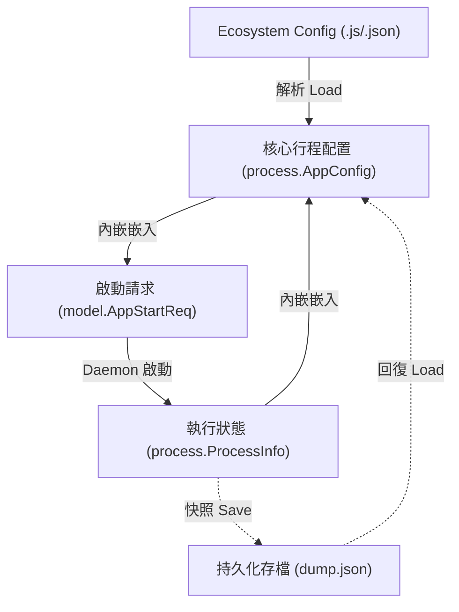

# 架構演進與優化計畫 — unified-config (Architecture Evolution & Optimization Plan)

## 1. 現有架構診斷與技術債 (Architecture Diagnosis & Technical Debt)

我們對現有 `pm2` 專案的配置定義與資料流轉進行了審查，發現了以下與行程配置相關的關鍵架構缺陷：

### 1.1 行程配置結構體的多重定義與重複程式碼 (Multiple Definitions and Redundant Code in Configuration Structs)
在整個專案中，與行程配置（如 `namespace`、`name`、`script`、`args`、`env`、`cron_restart`、`watch`、`max_restarts` 等）相關的欄位被重複定義了四次。分別位於：
- [ecosystem.go:L15-33](../config/ecosystem.go#L15-L33) 中的 `config.AppConfig`（用於解析生態設定檔）
- [protocol.go:L46-70](../model/protocol.go#L46-L70) 中的 `model.AppStartReq`（用於 CLI 與 daemon 間的 RPC 傳輸）
- [types.go:L47-66](../process/types.go#L47-L66) 中的 `process.DumpEntry`（用於持久化儲存 `dump.json`）
- [types.go:L17-44](../process/types.go#L17-L44) 中的 `process.ProcessInfo`（用於維護守護行程與 TUI 顯示的核心狀態）

這違反了 `不要重複自己 (Don't Repeat Yourself, DRY)` 原則，使得欄位新增與修改的維護開銷非常高。

### 1.2 手動欄位映射開銷與維護漏洞 (Manual Field Mapping Overhead and Maintenance Vulnerabilities)
當行程配置在不同模組間流動時，存在大量的硬編碼複製與手動映射。具體表現於：
- [start.go:L33-52](../cmd/start.go#L33-L52)：CLI 啟動時手動將 `config.AppConfig` 轉換為 `model.AppStartReq`
- [persistence.go:L26-45](../daemon/persistence.go#L26-L45)：自動儲存與手動存檔時將 `ProcessInfo` 的各欄位逐一複製至 `process.DumpEntry`
- [persistence.go:L70-89](../daemon/persistence.go#L70-L89)：回復存檔時將 `process.DumpEntry` 反向映射回 `model.AppStartReq`

這種高度耦合的手動映射非常脆弱。一旦未來為了支撐新業務而引入新配置（例如健康檢查探針或 CPU 親和性限制），必須同步修改以上 3 處手動映射邏輯，極易因遺漏而引發靜態欄位丟失或運行期異常。

### 1.3 配置預設值填充邏輯不一致 (Inconsistent Configuration Normalization)
目前行程配置的標準化與預設值填充邏輯（如 `Instances` 與 `MaxRestarts` 的預設邊界處理）實作在 [ecosystem.go:L41-85](../config/ecosystem.go#L41-L85) 的 `Normalize` 方法中。
然而，當守護進程從 `dump.json` 讀取並回復行程時（參見 [persistence.go:L59-94](../daemon/persistence.go#L59-L94)），卻是直接將 `DumpEntry` 反序列化並傳遞給 `s.startApp`，完全跳過了 `Normalize` 步驟。這將導致從 `dump.json` 被拉起的行程其預設行為可能與直接從生態設定檔啟動的行程不一致。

---

## 2. 複雜度量測 (Complexity Metrics)

我們對涉及到的相關檔案進行了度量分析：

### 2.1 改動頻率與技術債熱點 (Change Frequency & Debt Hotspots)
過去 12 個月內，主要修改頻率分布如下：
- [start.go](../cmd/start.go)：改動 `12` 次
- [types.go](../process/types.go)：改動 `9` 次
- [ecosystem.go](../config/ecosystem.go)：改動 `9` 次
- [persistence.go](../daemon/persistence.go)：改動 `2` 次

[start.go](../cmd/start.go) 與 [ecosystem.go](../config/ecosystem.go) 的高頻改動，說明了配置修改的常態性；而 [persistence.go](../daemon/persistence.go) 雖改動少，卻包含了大量的長映射代碼塊，增加了重構時的出錯機率。

### 2.2 依賴與扇入分析 (Dependency and Fan-in Analysis)
- `process` 套件目前是一個葉子套件 (Leaf Package)，其唯一依賴是 Go 的標準庫 `time`。
- `model` 套件亦為低層依賴套件，主要負責連線與協定定義。
- 將統一的配置結構體放在 `process` 套件，能讓 `config`、`model`、`daemon` 與 `cmd` 共同引用它，且絕不會引入 any `import cycle not allowed` 循環引用編譯錯誤。

---

## 3. 架構簡化與解耦設計 (Simplification & Decoupling Design)

為了解決配置重定義的問題，我們設計了以下以 `process.AppConfig` 為唯一真理來源 (Single Source of Truth) 的簡化方案：

### 3.1 職責重整
- `共享配置模型 (Shared Config Model)`：在 `process` 套件定義統一的 `AppConfig`，代表用戶配置的核心靜態規格。
- `啟動協定封裝 (Start Protocol)`：`model.AppStartReq` 內嵌 `process.AppConfig`，並僅攜帶額外的傳輸控制屬性（如是否為 cron 觸發的 `CronTriggered`）。
- `持久化快照 (Persistence Snapshot)`：完全廢除 `process.DumpEntry` 結構體。`dump.json` 的保存與讀取直接使用 `[]process.AppConfig`，徹底消除轉換代碼。
- `運行期狀態 (Runtime State)`：`process.ProcessInfo` 內嵌 `process.AppConfig`，並保留額外的執行期動態指標（如 `ID`、`PID`、`Status`、`CPU`、`Memory` 等）。

### 3.2 資料流向關係圖 (Data Flow Relationship Diagram)



---

## 4. 目錄與模組重整方案 (Reorganization Map)

本優化主要涉及結構體的重定義與方法的搬移，不涉及建立新目錄。

```tree
pm2/
├── config/
│   └── ecosystem.go          # 簡化：移除 AppConfig，改為引用 process.AppConfig，保留 Loader
├── process/
│   └── types.go              # 新增：AppConfig 定義；移除 DumpEntry；重構 ProcessInfo
├── model/
│   └── protocol.go           # 重構：AppStartReq 內嵌 process.AppConfig
└── daemon/
    └── persistence.go        # 簡化：save 與 resurrect 直接對 process.AppConfig 操作，移除映射代碼
```

### 舊配置遷移映射表 (Migration Map)

| 舊結構體 | 新結構體形式 | 調整要點 |
| :--- | :--- | :--- |
| `config.AppConfig` | `process.AppConfig` | 移動至 `process` 包，將 `Normalize` 方法同步移動 |
| `model.AppStartReq` | `model.AppStartReq` | 移除重複欄位，改為內嵌 `process.AppConfig` |
| `process.DumpEntry` | `process.AppConfig` | 直接廢除該類型，將 `dump.json` 直接綁定至 `process.AppConfig` |
| `process.ProcessInfo` | `process.ProcessInfo` | 移除重複欄位，改為內嵌 `process.AppConfig` |

---

## 5. 插件化與可擴充性機制 (Plugin & Extensibility Mechanism)

### 5.1 必要性評估 (Necessity Assessment)
此重構屬於專案內部基礎資料結構的重整與簡化，旨在消除程式碼冗餘，不涉及動態外部載入或第三方組件生命週期。故完全不需要引進動態插件 (Plugin) 機制，應保持靜態編譯的單純性。

### 5.2 靜態擴充性支援 (Static Extensibility Support)
雖然結構體被統一，但藉由 Go 結構體的 anonymous embedding，其他包仍然可以非常靈活地對外圍結構體進行特定擴充。
例如 `model.AppStartReq` 擴充了 `CronTriggered` 控制標記，而 `process.ProcessInfo` 擴充了主機監控 CPU 與 Memory 的指標，這在保持核心配置定義單一的同時，完美兼容了各個生命週期的特定需求。

---

## 6. 漸進式重構路徑與驗證 (Refactoring Roadmap & Verification)

我們規劃了 4 個漸進式階段，以絞殺榕模式前進，每一步均需執行編譯與單元測試。

### Phase 1：建立 AppConfig 與遷移配置標準化 (Complexity: Medium)
- `步驟 1`：在 [types.go](../process/types.go) 中定義 `process.AppConfig` 結構體，完整拷貝原有 `config.AppConfig` 的欄位與 JSON tag。
- `步驟 2`：將 `config.AppConfig` 的 `Normalize` 方法遷移到 `process.AppConfig`。
- `步驟 3`：修改 `config/ecosystem.go` 讓載入器返回 `process.EcosystemConfig`（由 `[]process.AppConfig` 組成），並修復 [ecosystem_test.go](../config/ecosystem_test.go)。
- `驗證命令`：`go test -v ./config/...`

### Phase 2：內嵌配置至啟動請求 AppStartReq (Complexity: Low)
- `步驟 1`：修改 `model.AppStartReq` 結構體，改為匿名內嵌 `process.AppConfig`，僅保留 `CronTriggered` 與傳輸層特定的變數。
- `步驟 2`：修改 `cmd/start.go` 拼裝 `model.Request` 的部分，直接填充內嵌的 `AppConfig` 欄位。
- `步驟 3`：修改 `daemon/server_test.go` 與 `cmd/` 中訪問 `AppStartReq` 屬性的編譯報錯。
- `驗證命令`：`go test -v ./cmd/... ./model/...`

### Phase 3：內嵌配置至運行期狀態 ProcessInfo (Complexity: High)
- `步驟 1`：重構 `process.ProcessInfo`，將重複的配置欄位移除，並匿名內嵌 `process.AppConfig`。
- `步驟 2`：由於 Go 支持 promoted 欄位，大部訪問 `info.Script` 的程式碼無需修改，但必須確保 JSON 序列化不受影響。需要在此處注意對 `tui` 等包的編譯相容性。
- `驗證命令`：`go test -v ./daemon/... ./tui/...`

### Phase 4：廢除 DumpEntry 實現存檔無損轉換 (Complexity: Medium)
- `步驟 1`：刪除 `process.DumpEntry` 結構體。
- `步驟 2`：修改 `daemon/persistence.go` 中的 `save()` 與 `resurrect()` 方法，直接序列化與反序列化 `[]process.AppConfig`。
- `步驟 3`：在 `resurrect()` 中調用 `AppConfig.Normalize()`，確保回復的進程與手動啟動的進程行為一致。
- `驗證命令`：`go test -race -v ./daemon/...` 且 `go build -o /dev/null ./...` 正常。

---

## 7. 風險與回滾策略 (Risks & Rollback)

### 7.1 JSON 序列化扁平性破壞風險 (JSON Flattening Risk)
- `問題`：在 Go 中，匿名內嵌結構體在序列化時會將欄位「扁平化」展開在父級 JSON 物件中。但若命名發生衝突，或 `json:",inline"` tag 未配置正確（雖然 Go 標準庫 json 不需要，但有些第三方 json 庫需要），將可能導致生成的 JSON 格式發生變化，破壞 CLI/TUI 與 daemon 的相容性。
- `對策`：在 Phase 3 重構時，於 `model/protocol_test.go` 中建立一個 E2E JSON 相容性測試，快照一個 `ProcessInfo` 結構體，將其序列化後，斷言其 JSON 鍵值集合與舊版完全相同，防止欄位在傳輸中丟失。

### 7.2 回滾策略 (Rollback Strategy)
- 建立專門的分支 `refactor-unified-config` 進行代碼變更。
- 每次合併或推進 Phase 時，運行整合測試 `go test -count=1 ./...`。一旦出現測試紅燈或編譯鏈崩潰，立即使用 `git reset --hard HEAD` 回滾，確保開發分支健康。
